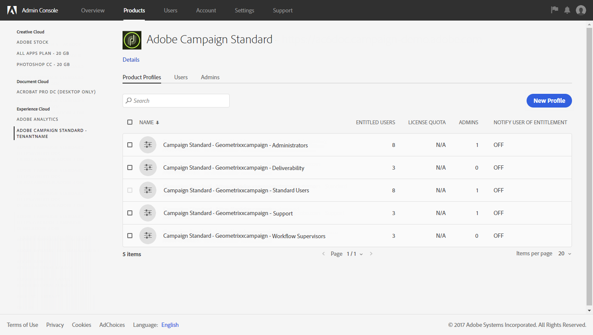

# 关于访问管理{#about-access-management}

Adobe Campaign允许您定义和管理分配给不同用户的权限。权限是授权或拒绝访问界面中某些功能或对象的权限和限制。这些权限基于以下两个概念：

* **组织单位**：这些允许您为平台的不同对象(电子邮件、工作流、模板、用户、配置文件等)定义权限层次结构。请参阅 [组织部门](../../administration/using/organizational-units.md) 部分。
* **角色**：一组统一权限，允许您定义分配给用户和用户组的授权。请参阅 [角色](../../administration/using/list-of-roles.md) 列表部分。

   与组织单位相结合，角色为用户提供了界面的筛选视图，并定义了对不同功能的访问。有关此操作的详细信息，请参阅 [“授权”表](https://docs.campaign.adobe.com/doc/standard/en/Technotes/AdobeCampaign-ACSRights.pdf)。

>[!CAUTION]
>
>注意，已经弃用地理单位功能。有关此操作的详细信息，请参阅此 [页面](https://helpx.adobe.com/campaign/kb/acs-deprecated-and-removed-features.html)。

角色、组和组织单位可以由平台的功能管理员在 **[!UICONTROL Administration > Users & Security]** 菜单下管理。

用户在Admin Console中进行管理(请参阅 [管理用户组和用户](../../administration/using/managing-groups-and-users.md) 部分或 [管理员控制台文档](https://helpx.adobe.com/enterprise/managing/user-guide.html))。

>[!CAUTION]
>
>只有具有管理权限的用户才有权访问用户管理。

**相关主题**

* [组织单位](../../administration/using/organizational-units.md)
* [角色列表](../../administration/using/list-of-roles.md)
* [管理组和用户](../../administration/using/managing-groups-and-users.md)

