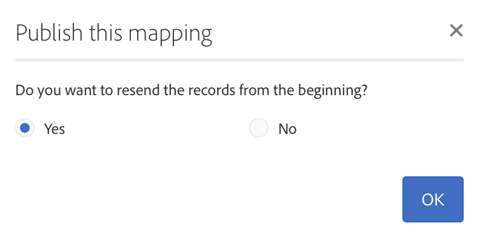

# 映射激活 {#mapping-activation}

>[!IMPORTANT]
>
>Campaign Standard Data服务目前处于测试阶段，可能会在不另行通知的情况下频繁进行更新。 客户必须托管在Azure上（目前仅针对北美）才能访问这些功能。 如果您希望访问，请联系Adobe客户关怀。

映射定义完成后，您可以发布映射。 部署步骤完成后，Campaign standard和Adobe Experience Platform之间的数据复制将自动启动。 您可以随时单击该按钮以停止复制 **[!UICONTROL Stop]**操作。

根据您的映射修改，您可以选择将您的所有记录重新发送到Adobe Experience Platform。

从部署拼贴中，您可以访问发布日志并导出日志。

在选项卡 **[!UICONTROL Export jobs]**中，您可以监视已发布映射的导出作业。

如果要监视所有数据导出作业，请转到 **[!UICONTROL Administration]**>**[!UICONTROL Development]** > **[!UICONTROL Platform]**>菜**[!UICONTROL Status of data export to platform]** 单。

数据摄取作业状态：

* **[!UICONTROL Created]**:创建数据摄取作业并进行数据摄取。
* **[!UICONTROL Failed]**:数据获取作业失败。 原因字段描述失败的原因。 故障可以是临时的或永久的。 如果出现临时故障，则在配置的间隔后创建新的摄取作业。 作为故障排除的第一步，用户可以检查故障的原因字段。 如果原因将用户重定向到Adobe Experience Platform UI，则用户可登录Adobe Experience Platform并检查数据集中的批状态以确定确切的失败原因。
* **[!UICONTROL Uploaded]**:首先在Adobe Experience platform中创建批，然后将数据摄取到该批。 批ID字段显示Adobe Experience platform中批的批ID。 Adobe Experience Platform还对批执行帖子验证。 该批首先标记为已上载，直到Adobe Experience Platform完成帖子验证步骤。 作业会在上传后持续轮询Adobe Experience Platform以查找批的状态。 在Adobe Experience Platform中，批可以进入“失败”状态或“成功”状态的帖子验证状态。
* **[!UICONTROL Success]**:在将批上传到Adobe Experience platform后，将在配置的间隔后检查作业的状态（平台中的后期验证）。 状态“成功”表明在Adobe Experience platform中成功摄取数据。
