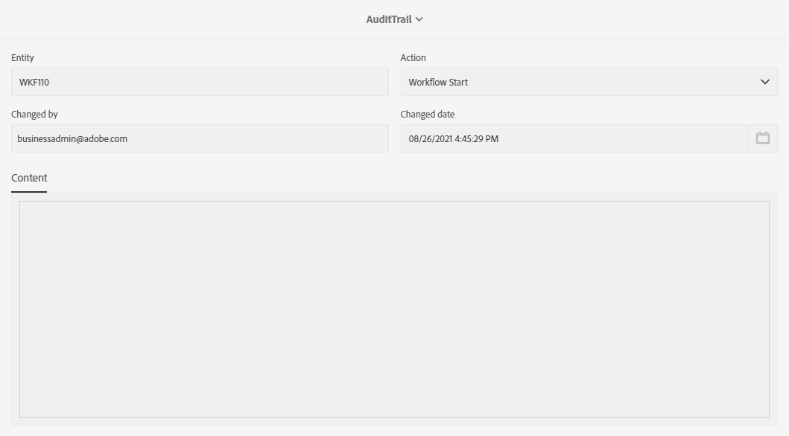

# 审核跟踪 {#audit}

此 **[!UICONTROL Audit trail]** 允许您访问在实例中所做更改的完整历史记录。

**[!UICONTROL Audit trail]** 可实时捕获您的Adobe Campaign Standard实例中发生的操作和事件的全面列表。 它提供了一种访问数据历史的自助方式，可帮助回答以下问题：您的工作流发生了什么情况、自定义资源和选项、上次更新这些资源的人员或者您的用户在实例中做了什么。

**[!UICONTROL Audit trail]** 包含三个组件：

* **自定义资源审核跟踪**：检查活动和上次对自定义资源进行的修改。

  有关的详细信息 **[!UICONTROL Custom resources]**，请参阅此 [页面](../../developing/using/key-steps-to-add-a-resource.md).

* **工作流审核跟踪**：检查活动和上次对工作流进行的修改，并检查工作流的状态，例如：

   * 创建时间
   * 修改时间
   * 已删除
   * 工作流开始
   * 工作流暂停
   * 工作流停止
   * 工作流重新启动
   * 工作流清理
   * 工作流模拟
   * 工作流唤醒
   * 工作流立即停止
   * 与同一用户一起重新启动工作流
   * 工作流重新启动未知命令

  有关的详细信息 **[!UICONTROL Workflows]**，请参阅此 [页面](../../automating/using/get-started-workflows.md).

* **选项审核记录**：检查活动和上次修改选项。

  有关的详细信息 **[!UICONTROL Options]**，请参阅此 [页面](../../administration/using/about-campaign-standard-settings.md).

请注意，默认情况下，保留期为30天。

## 访问审核记录 {#audit-access}

要访问实例的审核记录，请执行以下操作：

1. 在Adobe Campaign Standard中，从高级菜单中，选择 **[!UICONTROL Administration]** > **[!UICONTROL Audit trail]**.

   

1. 此 **[!UICONTROL Audit trail]** 此时将打开一个窗口，其中包含实体列表。 Adobe Campaign Standard将审核工作流、选项和自定义资源的创建、编辑和删除操作。

   从 **[!UICONTROL Search]** 菜单上，您可以按以下项筛选实体：

   * **[!UICONTROL Start date]**
   * **[!UICONTROL End date]**
   * **[!UICONTROL Type]**：实体类型，介于“全部”、“工作流”、“自定义资源”和“选项”之间。
   * **[!UICONTROL Entity name]**：工作流、选项或自定义资源的ID

   

1. 选择其中一个实体以了解有关上次修改的更多信息。

1. “审计实体”窗口提供有关所选实体的更多详细信息，例如：

   * **[!UICONTROL Entity]**：工作流、选项或自定义资源的ID。
   * **[!UICONTROL Action]**：对此实体执行的最后一个操作。
   * **[!UICONTROL Changed by]**：上次修改此实体的人的用户名。
   * **[!UICONTROL Changed date]**：对此实体执行上次操作的日期。
   * **[!UICONTROL Content]**：代码块，用于为您提供有关实体中确切发生了哪些更改的更多信息。

   在本例中，我们可以看到此实例的业务管理员已于8月26日启动工作流WKF110。

   

## 启用/禁用审核跟踪 {#enable-disable-audit}

>[!NOTE]
>
> 只有功能管理员可以启用或禁用审核跟踪。 有关详细信息，请参见此 [ 页面](../../administration/using/users-management.md#functional-administrators)。

可以轻松地为特定活动激活或停用审核跟踪。

为实现此操作，请执行以下步骤：

1. 在Adobe Campaign Standard中，从高级菜单中，选择 **[!UICONTROL Administration]** > **[!UICONTROL Application settings]** > **[!UICONTROL Options]**.

   

1. 根据要禁用的实体选择以下选项之一：

   * **[!UICONTROL XtkAudit_Workflows]** 用于管理工作流的审核跟踪的选项。
   * **[!UICONTROL XtkAudit_Option]** 选项以管理“选项”的“审核”跟踪。
   * **[!UICONTROL XtkAudit_CusResource]** 用于管理自定义资源的审核跟踪的选项。
   * **[!UICONTROL XtkAudit_Enable_All]** 选项，用于管理每个实体的审核跟踪。

     >[!NOTE]
     >
     >如果 **[!UICONTROL XtkAudit_Enable_All]** 选项设置为0， **[!UICONTROL Audit trail]** 该功能将完全禁用，而无论其他各个选项值如何。

   

1. 来自您的 **[!UICONTROL Options]** 页面，设置 **[!UICONTROL Value (integer)]** 为0(如果要禁用 **[!UICONTROL Audit trail]** 或设置为1以启用它。

   

1. 单击 **[!UICONTROL Save]**。
