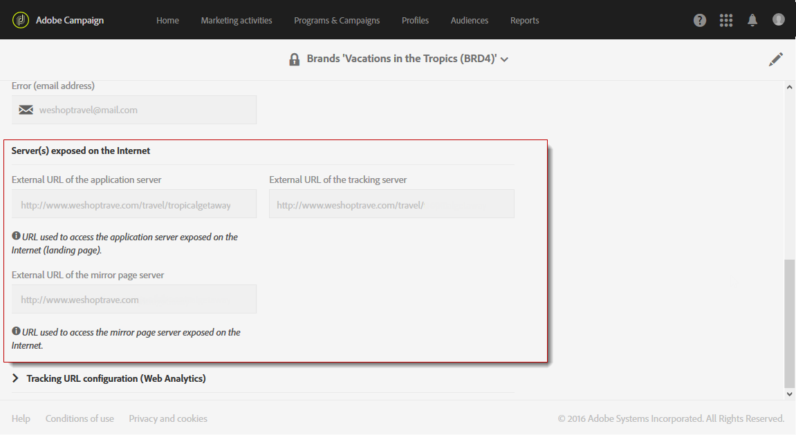

# 品牌策略{#branding}

## 关于品牌标识{#about-brand-identity}

每个公司都具有属于自己的品牌视觉和技术准则。通过 Adobe Campaign，您可以定义从徽标到技术方面的一系列规定（如电子邮件发送者、URL 或域名），从而为客户提供一致的品牌形象。

技术管理员可以定义一个或多个品牌，以集中输入影响品牌识别的参数。其中包括品牌徽标、登陆页面访问 URL 的域名或消息跟踪设置。通过 Adobe Campaign，您可以创建这些品牌并将它们链接到消息或登陆页面。此配置在模板中进行管理。

## 配置和使用品牌{#configuring-and-using-brands}

配置和使用品牌的主要原理如下：

1. 创建和配置品牌 - 此操作需要特定权限，并由 Adobe Campaign 技术管理员执行。在活动中获取新品牌的步骤在本节](#creating-a-brand)中有详细说明。[
1. 为此品牌创建一个或多个投放和登陆页面模板。请参阅[创建模板](../../start/using/marketing-activity-templates.md)一节。
1. 根据此模板创建消息和登陆页面。请参阅[创建电子邮件](../../channels/using/creating-an-email.md)和[创建登陆页面](../../channels/using/designing-a-landing-page.md)。

>[!IMPORTANT]
>
>最终用户不能创建或修改品牌：必须由 Adobe Campaign 技术管理员执行这些操作。如有任何需求，请与 Adobe 客户关怀部门联系。
>
>不能在事务型消息的上下文中使用多品牌。有关更多信息，请参阅[事务型消息和品牌策略](../../channels/using/transactional-messaging-limitations.md#permissions-and-branding)。

通过 **[!UICONTROL Administration > Instance settings > Brand configuration]** 菜单可访问品牌。

默认情况下，新创建的品牌仅对管理员分配了相应权限的用户可见。

**品牌**&#x200B;由以下特征定义：

* 用于定义和个性化品牌的&#x200B;**标识**。此部分包含以下字段：

   

   * 显示在界面中的 **Label**
   * **Brand name**
   * 品牌的 **Website URL** 和 **Website label**
   * **Brand logo**

* **[!UICONTROL Header parameters of sent emails]** 可将展示给营销策划收件人的标题个性化。此部分包含以下字段：

   

   * 使用品牌电子邮件地址的 **Sender (email address)**。
   * 使用品牌名称的 **Sender (name)**。
   * 带有客户回信用电子邮件地址的 **Reply to (email address)**。
   * 带有品牌名称的 **Reply to (name)**。
   * 带有出错回复用电子邮件地址的 **Error (email address)**。

   >[!IMPORTANT]
   >
   >更新了电子邮件的标题参数后，如果从模板创建的电子邮件中发件人的名称和电子邮件地址没有变化，请检查模板的高级设置。

* **Server(s) exposed on the internet** 用于定义用于跟踪和登陆页面访问的服务器。此部分包含以下字段：

   

   * **External URL of the application server** 用于托管和访问您创建的各种登陆页面。
   * **External URL of the tracking server** 用作投放期间的跟踪 URL。
   * **External URL of the mirror page server** 用作投放中的默认镜像页面。

   >[!NOTE]
   >
   >要在 Campaign 用户界面中显示登陆页面预览和镜像页面渲染，应用服务器和镜像页面服务器的 URL 必须是安全的。在这种情况下，在设置这些 URL 时，请使用 https://，而不是 http://。

* **[!UICONTROL Tracking URL configuration (Web Analytics)]** 用于定义品牌的 URL 跟踪配置。

   此处定义了用于在外部系统（如 Adobe Analytics 或 Google Analytics 之类的 Web 分析工具）上跟踪链接的其他参数。

   

## 创建新品牌{#creating-a-brand}

您可以在活动中添加新的组织实体，或创建需要在其他子域下发送的新电子邮件类型。 要执行此操作，请执行以下步骤：

1. **配置新子域**  — 对于Adobe要使用的任何新子域，第一步是配置它。您可以通过[活动控制面板](https://docs.adobe.com/content/help/zh-Hans/control-panel/using/subdomains-and-certificates/subdomains-branding.html)执行此操作，或联系您的Adobe技术联系人。 请阅读本文](https://helpx.adobe.com/cn/campaign/kb/domain-name-delegation.html)，进一步了解子域配置[。

   >[!NOTE]
   >
   >控制面板可供所有管理员用户访问。 授予用户管理员访问权限的步骤详见[此页](https://experienceleague.adobe.com/docs/control-panel/using/discover-control-panel/managing-permissions.html?lang=en#discover-control-panel)。

1. **创建票证**  — 配置子域后，Adobe需要在生产环境中设置它。要请求此请求，[请使用以下信息创建到Client Care](https://helpx.adobe.com/cn/enterprise/using/support-for-experience-cloud.html)的票证：

   * 主题：ACS新品牌设置

   * 内容：已配置新域，我们希望在我们的活动平台中设置它

   * 域：XXX

   * 生产URL:XXX.活动.adobe.com

1. **创建投放模板**  — 新品牌一经推出，最佳实践是至少创建一个引用此新品牌的新空白投放模板。[了解详情](#linking-a-brand-to-a-template)。

1. **检查可交付性** 准则 — 在开始使用新域之前，应与Adobe可交付性团队讨论该策略。它们有助于定义最佳实践，例如，如果应创建新关联以在域之间拆分IP，和/或是否应定义加速计划。 在本节](../../sending/using/about-deliverability.md)中了解有关可交付性最佳实践[的更多信息。

## 为品牌分配电子邮件{#assigning-a-brand-to-an-email}

### 将品牌链接到模板{#linking-a-brand-to-a-template}

要使用为品牌定义的参数，必须将其链接到投放模板或登陆页面模板。为此，您必须创建或编辑模板。

>[!NOTE]
>
>有关创建模板的更多信息，请参阅[创建模板](../../start/using/marketing-activity-templates.md)一节。

创建模板后，您可以将其链接到品牌。操作步骤：

1. 单击 **[!UICONTROL Edit properties]** 按钮以访问模板属性。

   

1. 使用下拉列表选择要链接到模板的品牌。

   >[!NOTE]
   >
   >默认情况下，选择 **[!UICONTROL Default brand (branding)]**。

   

   要查看所选品牌的配置方式，请单击 **[!UICONTROL Navigate to the detail of the element selected]** 图标。

   

1. 确认选择并保存模板。

您的模板现已链接到品牌。在电子邮件编辑器中，**Email address of default sender**、**Default sender name** 或 **Logo** 等元素将使用配置的品牌数据。

### 品牌策略使用案例 {#branding-use-case}

在本例中，我们将创建一个与旅行相关的新品牌，并将其用在电子邮件中。

#### 配置新品牌{#configure-a-new-brand}

>[!IMPORTANT]
>
>仅在需要特定权限和技术设置时，才由 Adobe 管理品牌配置。

1. Adobe Campaign 管理员在 **[!UICONTROL Administration > Instance settings > Brand configuration]** 中创建品牌。他从高级菜单中添加 **Vacations in the Tropics** 元素，并配置品牌的 **[!UICONTROL ID]** 和 **[!UICONTROL Header parameters of sent emails]**。

   

1. 随后，管理员会配置 **Server(s) exposed on the Internet**，以便使用登陆页面，然后配置跟踪 URL。

   在本例中，使用的 **Web 分析**&#x200B;工具为 **Google Analytics**。管理员按以下方式配置跟踪 URL：

   

品牌已正确创建和配置。现在，可提供给营销团队使用。

#### 实施新品牌{#implement-a-new-brand}

投放经理负责创建投放模板以使用新品牌。要实现此目的，请执行以下步骤：

1. 在高级菜单 **[!UICONTROL Resources > Templates > Delivery templates]** 中，复制内置模板以配置新投放模板。

   

1. 要将此模板链接到 **Vacations in the Tropics** 品牌，请编辑模板属性并从下拉列表中选择该品牌。

   

1. 配置此电子邮件模板以反映品牌标识。
1. 在模板完成后，保存模板。

   

   现在，即可将该投放模板用于创建将要发送给受众的电子邮件。

#### 在投放中使用新品牌{#use-the-new-brand-in-a-delivery}

要创建链接到品牌的电子邮件，请执行以下步骤：

1. 单击 **[!UICONTROL Marketing activities]** 菜单中的 **[!UICONTROL Create]** 按钮。

   

1. 选择 **[!UICONTROL Email]** 活动，然后选择链接到新品牌的模板。

   

1. 您的电子邮件现已配置完成。您可以先检查信息，再使用测试用户档案测试信息，然后将其发送给受众。

   

