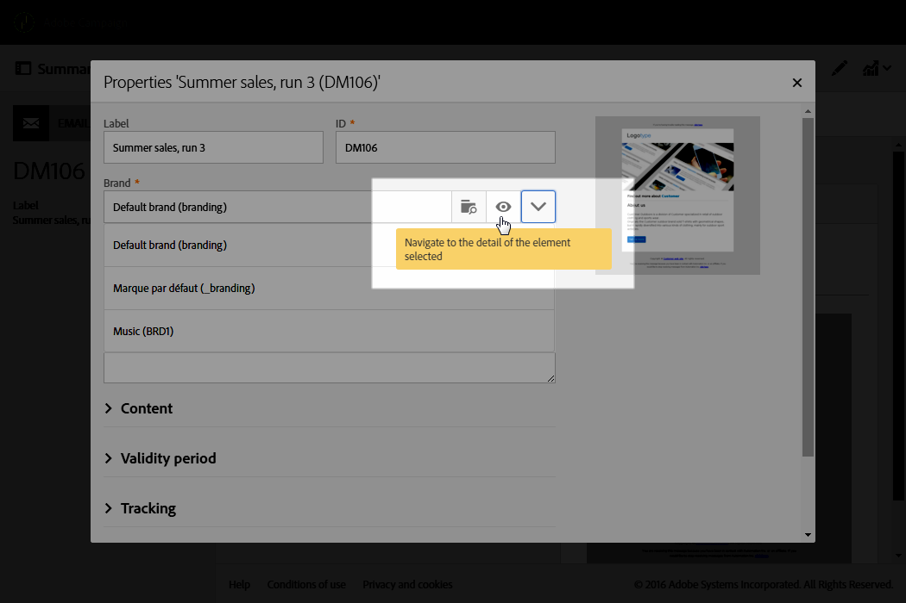

# Branding{#branding}

## About brand identity {#about-brand-identity}

每个公司都有品牌视觉和技术指导原则。通过Adobe Campaign，您可以定义一套规范，为客户提供一致的品牌，从徽标到技术方面，如电子邮件发送方、URL或域。

技术管理员可以定义一个或多个品牌以集中输入影响品牌身份的参数。这包括品牌徽标、登陆页面访问URL的域或消息跟踪设置。通过Adobe Campaign，您可以创建这些品牌并将它们链接到消息或登陆页面。此配置在模板中进行管理。

## Configuring and using brands {#configuring-and-using-brands}

配置和使用品牌的主要原则是：

1. 创建和配置品牌-此操作需要特定权限，由Adobe Campaign技术管理员执行。
1. 为此品牌创建一个或多个交付和登陆页面模板。Refer to the [Creating a template](../../start/using/about-templates.md) section.
1. 根据此模板创建消息和登录页面。Refer to the [Creating an email](../../channels/using/creating-an-email.md) and [Creating a landing page](../../channels/using/designing-a-landing-page.md) sections.

>[!CAUTION]
>
>最终用户无法创建或修改品牌：这些操作必须由Adobe Campaign技术管理员执行。有关任何请求，请联系Adobe客户关怀。多品牌营销无法在交易消息的上下文中使用。For more on this, see [Transactional messages and branding](../../channels/using/about-transactional-messaging.md#permissions-and-branding).

Brands can be found in the **[!UICONTROL Administration > Instance settings > Brand configuration]** menu.

默认情况下，新创建的品牌仅对分配有相应权限的用户可见。

**品牌** 由以下特性定义：

* **标识**，它定义和个性化您的品牌。本节包含以下字段：

   

   * **界面** 中可见的标签
   * **品牌名称**
   * **品牌的网站URL** 和 **网站标签**
   * **品牌徽标**

* **[!UICONTROL Header parameters of sent emails]** 它会个性化您的营销活动收件人会看到的内容。本节包含以下字段：

   

   * **发送方(电子邮件地址)** 与品牌的电子邮件地址。
   * **发送方(名称)** 与品牌名称。
   * **回复(电子邮件地址)** 与客户可回复的电子邮件地址。
   * **使用品牌名称回复(名称)** 。
   * **在出错时使用电子邮件地址的错误(电子邮件地址)** 。
   >[!CAUTION]
   >
   >更新电子邮件的标题参数后，如果发送方的姓名和电子邮件地址未在从模板创建的电子邮件中更改，请检查模板的高级设置。

* **Internet上暴露的服务器** 定义用于跟踪但也用于登录页面访问的服务器。本节包含以下字段：

   

   * **应用程序服务器** 的外部URL，用于托管和访问您创建的不同登录页面。
   * **在交付过程中** 用作跟踪URL的跟踪服务器的外部URL。
   * **用作交付中默认镜像页面的镜像页面服务器** 的外部URL。

* **[!UICONTROL Tracking URL configuration (Web Analytics)]**&#x200B;它定义了您的品牌的URL跟踪的配置。

   在此定义了允许在外部系统(如Adobe Analytics工具或Google Analytics等)上跟踪链接的其他参数。

   

## Assigning a brand to an email {#assigning-a-brand-to-an-email}

### Linking a brand to a template {#linking-a-brand-to-a-template}

要使用为品牌定义的参数，它必须链接到交付模板或登录页面模板。为此，您必须创建或编辑模板。

>[!NOTE]
>
>For more information about creating a template, refer to the [Creating a template](../../start/using/about-templates.md) section.

创建模板后，您可以将其链接到品牌。要执行此操作，请执行以下操作：

1. Click the **[!UICONTROL Edit properties]** button to access the template properties.

   

1. 使用下拉列表选择要链接到模板的品牌。

   >[!NOTE]
   >
   >By default, the **[!UICONTROL Default brand (branding)]** is selected.

   

   To view how the brand selected is configured, click the **[!UICONTROL Navigate to the detail of the element selected]** icon.

   

1. 确认您的选择并保存您的模板。

模板链接到品牌。In the email editor, the elements such as the **Email address of default sender**, the **Default sender name**, or the **Logo** will use the configured brand data.

### Branding use case {#branding-use-case}

在此示例中，我们将创建一个新的旅行相关品牌，并将其用于电子邮件。

#### Configure a new brand {#configure-a-new-brand}

>[!CAUTION]
>
>品牌配置仅由Adobe管理，因为它需要特定权限和技术设置。

1. The Adobe Campaign administrator creates the brand in **[!UICONTROL Administration > Instance settings > Brand configuration]**. He adds the **Vacations in the Tropics** element from the advanced menu and configures the **[!UICONTROL ID]** and the **[!UICONTROL Header parameters of sent emails]** of the brand.

   

1. The administrator then configures the URL of the **Server(s) exposed on the Internet** so that landing pages can be used, then the tracking URLs.

   In this example, the **Web Analytics** tool used is **Google Analytics**. 管理员将配置跟踪URL，如下所示：

   

正确创建和配置品牌。营销团队现在可以使用它。

#### Implement a new brand {#implement-a-new-brand}

作为交付经理，您负责创建交付模板以使用新品牌。要实现此目标，请按照以下步骤操作：

1. In the advanced menu **[!UICONTROL Resources > Templates > Delivery templates]**, duplicate a built-in template to configure a new delivery template.

   

1. To link this template to the **Vacations in the Tropics** brand, edit the template properties and select the brand from the drop-down list.

   

1. 配置此电子邮件模板以反映品牌标识。
1. 模板完成后，您可以保存它。

   

   交付模板现在可用于创建将发送给受众的电子邮件。

#### Use the new brand in a delivery {#use-the-new-brand-in-a-delivery}

要创建链接到品牌的电子邮件，请按照以下步骤操作：

1. Click the **[!UICONTROL Create]** button from the **[!UICONTROL Marketing activities]** menu.

   

1. Select the **[!UICONTROL Email]** activity, then choose the template linked to the new brand.

   

1. 您的电子邮件已配置。您可以在使用测试配置文件测试信息之前检查信息，然后将其发送给受众。

   

