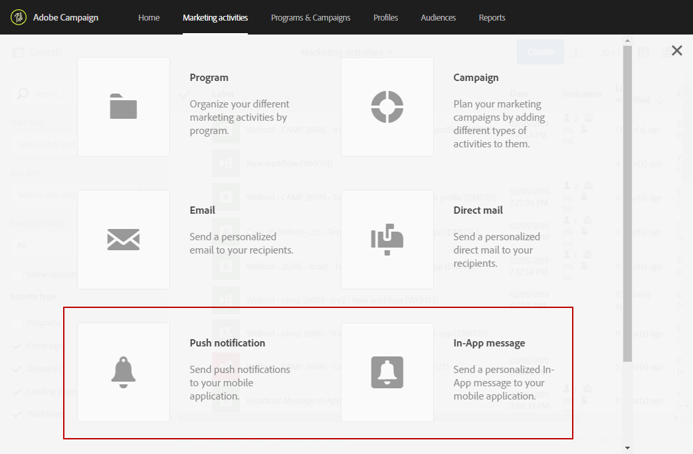

# 配置移动应用程序{#configuring-a-mobile-application}

推送通知或应用程序内消息会在移动应用程序上接收，这些应用程序首先需要在Adobe Campaign standard中配置，具体取决于您要使用的渠道。

* 要发送应用程序内消息和推送通知，您的移动应用程序需要通过利用Adobe Experience Platform SDK在Adobe Campaign中设置。 请参 [阅使用Adobe Experience Platform SDK](#using-adobe-experience-platform-sdk)。

* 要仅发送推送通知，您可以使用SDK V4配置Adobe Campaign与Adobe Mobile service之间的集成。 请参 [阅使用SDK V4](#using-sdk-v4)。

在Adobe Campaign中通过利用Experience Cloud Mobile SDK V4或Experience Platform SDK设置移动应用程序后，需要由管理员在 [!UICONTROL Administration] &gt; [!UICONTROL Channels] &gt;菜单下配置这些应 [!UICONTROL Mobile app] 用程序。

>[!CAUTION]
>
>推送通知和应用程序内实施必须由专家用户执行。 如果需要协助，请与您的Adobe客户主管或专业服务合作伙伴联系。

设置手机应用程序后，您可以检索其收集的PII数据，以便从数据库创建或更新配置文件。 有关此内容的详细信息，请参阅此部分：根 [据移动应用程序数据创建和更新配置文件信息](../../channels/using/updating-profile-with-mobile-app-data.md)。

## 使用Adobe Experience Platform SDK {#using-adobe-experience-platform-sdk}

>[!Note]
>
>要通过使用Adobe Experience Platform SDK进一步了解Adobe Campaign Standard中支持的不同移动使用案例，请参阅本 [页](https://helpx.adobe.com/campaign/kb/configure-launch-rules-acs-use-cases.html)。

要使用Experience Platform SDK应用程序发送推送通知和应用程序内消息，必须在Adobe Experience Platform Experience Platform Launch中设置移动应用程序，并在Adobe Campaign中进行配置。 有关使用Experience Platform SDK配置移动应用程序的详细步骤，请参阅本 [页](https://helpx.adobe.com/campaign/kb/configuring-app-sdkv4.html)。

请按照以下步骤启动配置：

1. 确保您可以访问渠 **[!UICONTROL Mobile]** 道：Adobe Campaign中的推送通知和应用程序内消息。 如果没有，请与您的客户团队联系。

   

1. 在Experience Platform Launch中通过创建移动类型的属性创建移动应用程序。 有关详细信息，请参阅 [Experience Platform Launch文档](https://aep-sdks.gitbook.io/docs/getting-started/create-a-mobile-property#create-a-new-mobile-property) 。
1. 在Experience Platform **[!UICONTROL Adobe Campaign Standard]** Launch中为移动应用程序安装扩展：

   有关扩展的详细信息，请参阅 [Experience Platform Launch文档](https://aep-sdks.gitbook.io/docs/using-mobile-extensions/adobe-campaign-standard) 。

1. 在Adobe Launch中配置应用程序规则，请参阅在 [Launch中配置应用程序](https://helpx.adobe.com/campaign/kb/config-app-in-launch.html#Step1Createdataelements)
1. 在Adobe Campaign standard中配置Adobe Launch应用程序，请参阅 [在Adobe Campaign中设置Adobe Launch应用程序](https://helpx.adobe.com/campaign/kb/configuring-app-sdk.html#SettingupyourAdobeLaunchapplicationinAdobeCampaign)。
1. 将特定于渠道的配置添加到您的移动应用程序设置中，请参 [阅Adobe Campaign中特定于渠道的应用程序配置](https://helpx.adobe.com/campaign/kb/configuring-app-sdk.html#ChannelspecificapplicationconfigurationinAdobeCampaign)。

   

## 使用SDK V4 {#using-sdk-v4}

与应用程序内SDK不同，SDK V4和Adobe Experience Platform SDK支持推送通知。 有关将推送通知与移动应用程序一起使用的详细步骤，请参阅此 [页](https://helpx.adobe.com/campaign/kb/configuring-app-sdkv4.html)。

接收推送通知的移动应用程序必须由管理员在Adobe Campaign界面中配置。 通过配置Adobe Campaign和Adobe Mobile Services，您将能够将移动应用程序的数据用于营销活动。

要能够发送推送通知，您需要：

1. 确保您可以在Adobe Campaign **[!UICONTROL Mobile app]** 中访问渠道。
1. 在以下位置配置移动应用程序：

   * [Adobe Campaign](https://helpx.adobe.com/campaign/kb/configuring-app-sdkv4.html#SettingupamobileapplicationinAdobeCampaign)。
   * [Adobe Mobile Services](https://helpx.adobe.com/campaign/kb/configuring-app-sdkv4.html#ConfiguringamobileapplicationinAdobeMobileServices)。

1. 执行手机应用程序的特定设置：

   * 将从Adobe Mobile services界面下载的配置文件与移动应用程序打包。
   * 将Experience Cloud Mobile SDK集成到您的移动应用程序中。

1. 定义要从应用程序订阅者处收集的数据。 根据您定义的标准，协调在Adobe Campaign数据库中具有配置文件的移动应用程序的订阅者。

   For more on this, refer to this [page](https://helpx.adobe.com/campaign/kb/configuring-app-sdkv4.html#Collectingsubscribersdatafromamobileapplication).

1. 通过在设备上启动移动应用程序并登录，确保安装已成功完成。 确保您选择接收通知。
1. 然后，在Adobe Campaign的高级菜单中，选择 **[!UICONTROL Administration]** &gt; **[!UICONTROL Channels]** &gt; **[!UICONTROL Mobile app]**。
1. 从列表中选择您的移动应用程序以显示其属性。 您的订阅信息将显示在订阅者列表下。

   

1. 要检查某个配置文件订阅的手机应用程序，请在菜 **[!UICONTROL Profiles & Audiences > Profiles]** 单中选择一个配置文件，然后单击右 **[!UICONTROL Edit profile properties]** 侧的按钮。 移动应用程序列在选项 **[!UICONTROL Mobile App Subscriptions]** 卡中。

   