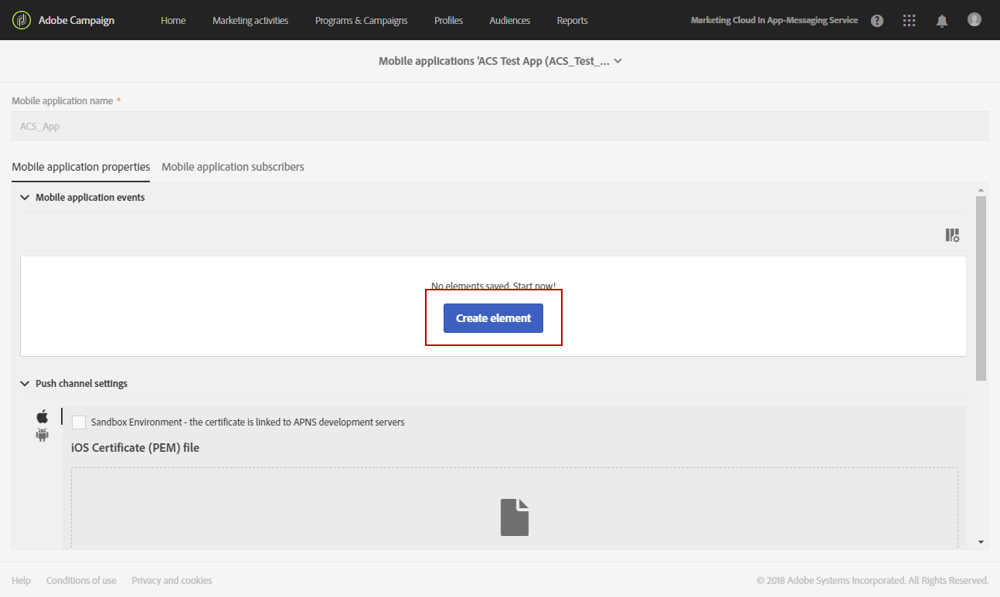

# 配置移动应用程序{#configuring-a-mobile-application}

## 使用Adobe Experience Platform SDK配置移动应用程序 {#using-adobe-experience-platform-sdk}

>[!IMPORTANT]
>
> Adobe Experience Platform Launch已更名为Adobe Experience Platform中的一套数据收集技术。 因此，产品文档中的术语有一些改动。 有关术语更改的综合参考，请参阅[以下文档](https://experienceleague.adobe.com/docs/experience-platform/tags/term-updates.html){target="_blank"}。

请注意，推送通知和应用程序内实施必须由专家用户执行。 要获取帮助，请联系您的Adobe客户经理或专业服务合作伙伴。

要使用Experience Platform SDK应用程序发送推送通知和应用程序内消息，必须在数据收集UI中设置移动应用程序，并在Adobe Campaign中进行配置。

设置移动应用程序后，您可以检索它收集的PII数据，以从数据库创建或更新用户档案。 有关详细信息，请参阅此部分：[基于移动应用程序数据创建和更新用户档案信息](../../channels/using/updating-profile-with-mobile-app-data.md)。

要了解有关使用Adobe Experience Platform SDK在Adobe Campaign Standard中支持的各种移动使用案例的更多信息，请参阅此[页面](../../administration/using/supported-mobile-use-cases.md)。

要完成配置，请完成以下步骤：

1. 在Adobe Campaign中，确保您可以访问以下内容：
   * **[!UICONTROL Push notification]**
   * **[!UICONTROL In-App message]**
   * **[!UICONTROL Adobe Places]**

   如果没有，请联系您的客户团队。

1. 检查您的用户是否拥有Adobe Campaign Standard和Adobe Experience Platform中的标记的必要权限。

   * 在Adobe Campaign Standard中，确保IMS用户属于标准用户和管理员产品配置文件。 此步骤允许用户登录Adobe Campaign Standard，导航到Experience Platform SDK移动应用程序页面，并查看您在数据收集UI中创建的移动应用程序属性。

   * 在数据收集UI中，确保您的IMS用户属于Experience Platform Launch产品配置文件。
此步骤允许用户登录数据收集UI以创建和查看属性。 有关数据收集UI中产品配置文件的详细信息，请参阅[创建产品配置文件](https://experienceleague.adobe.com/docs/experience-platform/tags/admin/manage-permissions.html#gain-admin-rights-for-a-tags-product-profile)。 在产品配置文件中，应该不会对公司或资产设置权限，但用户应该仍然能够登录。

   要完成其他任务，例如安装扩展、发布应用程序、配置环境等，您需要在产品配置文件中设置权限。

1. 在数据收集UI中，创建&#x200B;**[!UICONTROL Mobile property]**。 有关更多信息，请参阅[设置移动属性](https://developer.adobe.com/client-sdks/documentation/getting-started/create-a-mobile-property)。

1. 在数据收集UI中，单击&#x200B;**[!UICONTROL Extensions]**&#x200B;选项卡，转到&#x200B;**[!UICONTROL Catalog]**，然后搜索&#x200B;**[!UICONTROL Adobe Campaign Standard]**&#x200B;扩展。 有关详细信息，请参阅[Adobe Campaign Standard](https://developer.adobe.com/client-sdks/documentation/adobe-campaign-standard)。

1. 要在Campaign Standard中支持位置用例，请在数据收集UI中安装&#x200B;**[!UICONTROL Places]**&#x200B;扩展。 请参见[此页面](https://developer.adobe.com/client-sdks/solution/places)。

1. 在Adobe Campaign Standard中，配置您在数据收集UI中创建的移动资产。 请参阅[在Adobe Campaign中设置Adobe Experience Platform Launch应用程序](../../administration/using/configuring-a-mobile-application.md#set-up-campaign)。

1. 将特定于渠道的配置添加到您的移动应用程序设置中。
有关更多信息，请参阅 [Adobe Campaign 中特定于渠道的应用程序配置](../../administration/using/configuring-a-mobile-application.md#channel-specific-config)。

1. 如果需要，您可以删除标记属性。
有关详细信息，请参阅[删除应用程序](../../administration/using/configuring-a-mobile-application.md#delete-app)。

## 从Launch技术工作流同步移动应用程序AEPSDK {#aepsdk-workflow}

在数据收集UI中创建并配置您的移动资产后，**[!UICONTROL Sync Mobile app AEPSDK from Launch]**&#x200B;技术工作流现在将同步在Adobe Campaign Standard中导入的标记移动资产。

默认情况下，技术工作流每15分钟启动一次。 如果需要，可以手动重新启动：

1. 在Adobe Campaign Standard中，从高级菜单中选择&#x200B;**[!UICONTROL Administration]** > **[!UICONTROL Application Settings]** > **[!UICONTROL Workflows]**。
1. 打开&#x200B;**[!UICONTROL Sync Mobile app AEPSDK from Launch (syncWithLaunch)]**&#x200B;工作流。

   

1. 单击&#x200B;**[!UICONTROL Scheduler]**&#x200B;活动。

1. 选择 **[!UICONTROL Immediate execution]**。

   

现在，您的工作流将重新启动并同步在Adobe Campaign Standard中导入的标记移动资产。

## 在Adobe Campaign中设置应用程序 {#set-up-campaign}

要在Campaign中使用标记移动资产，您还必须在Adobe Campaign中配置此资产。 在Adobe Campaign中，确保IMS用户属于标准用户和管理员产品配置文件。

您必须等待技术工作流运行并将标记移动资产同步到Adobe Campaign。 然后，您可以在Adobe Campaign中配置它。

有关通过Launch技术工作流同步移动应用程序AEPSDK的更多信息，请参阅此[部分](../../administration/using/configuring-a-mobile-application.md#aepsdk-workflow)。

>[!NOTE]
>
>默认情况下，组织单位设置为“全部”的管理员可以编辑移动应用程序。

1. 从高级菜单中选择&#x200B;**[!UICONTROL Administration]** > **[!UICONTROL Channels]** > **[!UICONTROL Mobile app (AEP SDK)]**。

   

1. 选择您在数据收集UI中创建的移动应用程序。
其**[!UICONTROL Property Status]**&#x200B;应为&#x200B;**[!UICONTROL Ready to configure]**。

   >[!NOTE]
   >
   >默认情况下，为了检索在数据收集UI中创建的移动设备应用程序列表，Campaign Standard使用NmsServer_URL选项中定义的值来查找匹配属性。
   >
   >在某些情况下，移动应用程序的Campaign端点可能不同于NmsServer_URL中定义的端点。 在这种情况下，请在`Launch_URL_Campaign`选项中定义端点。 Campaign将使用此选项中的值在数据收集UI中查找匹配的属性。

   

1. 您可以在&#x200B;**[!UICONTROL Access Authorization]**&#x200B;部分下更改移动应用程序的组织单位，以将此移动应用程序的访问权限限制为特定的组织单位。 有关更多信息，请参见此页面。

   在此，管理员可以通过从下拉列表中选择子组织单位来分配子组织单位。

   

1. 要在Campaign与Adobe Experience Platform中的标记之间建立连接，请单击&#x200B;**[!UICONTROL Save]**。

1. 验证移动应用程序的状态是否已从&#x200B;**[!UICONTROL Ready to Configure]**&#x200B;更改为&#x200B;**[!UICONTROL Configured]**。

   当Campaign扩展显示已成功设置密钥时，您还可以验证是否已在Campaign中成功设置属性。

   

1. 要使此配置生效，更改需要在数据收集UI中发布。

   有关详细信息，请参阅[发布配置](https://developer.adobe.com/client-sdks/documentation/getting-started/create-a-mobile-property/#publish-the-configuration)

## Adobe Campaign中特定于渠道的应用程序配置 {#channel-specific-config}

您的移动应用程序现在可以在Campaign中使用以进行推送通知或应用程序内投放。 现在，您可以根据需要进一步配置推送消息，以创建将触发应用程序内消息和/或上传推送证书的事件。

1. 从高级菜单中选择&#x200B;**[!UICONTROL Administration]** > **[!UICONTROL Channels]** > **[!UICONTROL Mobile app (AEP SDK)]**。

1. 选择您在数据收集UI中创建和配置的移动应用程序。

1. 在&#x200B;**[!UICONTROL Mobile application properties]**&#x200B;选项卡上，您可以开始添加移动应用程序中可用于应用程序内消息的事件。

1. 要配置您的事件，请单击&#x200B;**[!UICONTROL Create Element]**。

   

1. 键入名称和说明。

   

1. 单击 **[!UICONTROL Add]**。

   现在，在创建应用程序内消息时，您的事件会显示在“触发器”选项卡中。 有关详细信息，请参阅[准备和发送应用程序内消息](../../channels/using/preparing-and-sending-an-in-app-message.md)。

1. 在移动应用程序仪表板的&#x200B;**[!UICONTROL Device-specific settings]**&#x200B;部分中，为每个设备提供应用程序详细信息。

   +++ 适用于iOS的

   输入以下应用程序详细信息：

   * **应用程序ID (iOS捆绑包ID)**：有关捆绑包ID的更多信息，请参阅[Apple文档](https://developer.apple.com/documentation/appstoreconnectapi/bundle_ids){target="_blank"}。
   * **iOS证书(P8)文件**：拖放您的.p8身份验证密钥。 有关如何生成.p8身份验证文件的说明，请参阅您的[Apple开发人员帐户](https://developer.apple.com/account/ios/authkey/create){target="_blank"}。
   * **密钥ID**：有关密钥ID的详细信息，请参阅[Apple文档](https://developer.apple.com/help/account/manage-keys/get-a-key-identifier/){target="_blank"}。
   * **iOS团队ID**：有关Apple团队ID的更多信息，请参阅[iOS文档](https://developer.apple.com/help/account/manage-your-team/locate-your-team-id/){target="_blank"}。

         ！
     +++

   +++ 适用于Android的

   输入以下应用程序详细信息：

   * **应用程序ID (Android包名称)**：有关包名称的详细信息，请参阅[Android文档](https://support.google.com/admob/answer/9972781?hl=en#:~:text=The%20package%20name%20of%20an,supported%20third%2Dparty%20Android%20stores){target="_blank"}。
   * **Android密钥(Json)文件**：拖放您的.json私钥文件。 有关如何生成.json私钥文件的说明，请参阅[Firebase开发人员文档](https://firebase.google.com/docs/admin/setup#initialize_the_sdk_in_non-google_environments){target="_blank"}。

     
   +++

1. 上传证书后，将显示一条消息，通知您上传成功并显示证书的到期日期。

1. 单击&#x200B;**[!UICONTROL Mobile application subscribers]**&#x200B;选项卡可查看订阅者列表以及有关这些订阅者的其他信息，例如，他们是否选择退出您的通知。

## 正在删除您的应用程序 {#delete-app}

>[!CAUTION]
>
>删除应用程序操作无法撤销。

要删除您的应用程序，请完成[删除移动属性](https://developer.adobe.com/client-sdks/documentation/adobe-campaign-standard/#deleting-mobile-properties-in-the-data-collection-ui)中的步骤。

删除应用程序后，在Adobe Campaign中，验证应用程序的属性状态是否已正确更新为“已在Launch中删除”。

通过单击Adobe Campaign中的应用程序，您可以通过单击“从Campaign中删除”，选择从Adobe Campaign中完全删除此应用程序。

