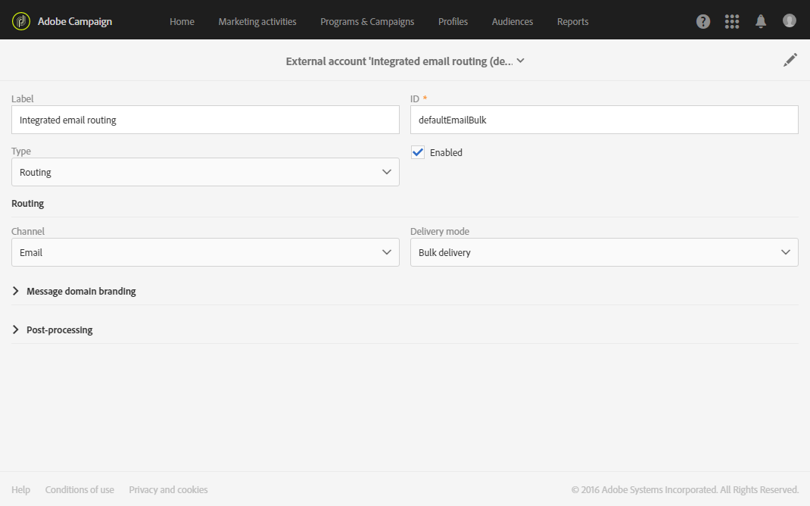

# Configuring email channel{#configuring-email-channel}

## Email channel parameters {#email-channel-parameters}

电子邮件配置屏幕允许您定义电子邮件渠道的参数。

* **发送电子邮件的标题参数**

   In this section, you can specify the **[!UICONTROL masks]** authorized for the sender address and the error address. 如有必要，可以使用逗号分隔这些蒙版。此配置为可选配置。输入这些字段后，在消息准备阶段，Adobe Campaign会检查输入的地址是否有效。此操作模式确保不使用任何可能触发交付性问题的地址。交付地址必须在交付服务器上进行配置。

* **可交付性**

   此ID由支持提供。可实现可交付性报告的正常工作。

* **交付参数**

   Adobe Campaign会发送开始日期开始的消息。**[!UICONTROL Message delivery duration]** 该字段允许您指定可在其中发送消息的持续时间。

   **[!UICONTROL Online resources validity duration]** 该字段用于上传的资源，主要用于镜像页面和图像。此页面上的资源在限定时间内有效(可节省磁盘空间)。

* **重试次数**

   暂时未交付的邮件会自动重试。This section indicates how many retries should be performed the day after the send is started (**Number of retries**) and the minimum delay between retries (**Retry period**).

   默认情况下，将在第一天预定五次，最低间隔为一小时，在24小时内展开。One retry per day is programmed after that and until the delivery deadline, which is defined in the **[!UICONTROL Delivery parameters]** section.

* **电子邮件隔离参数**

   **[!UICONTROL Time between two significant errors]** 在字段中输入一个值，以定义应用程序在出现失败时递增错误计数器之前等待的时间。Defaut value: **"1d"**, for 1 day.

   When the **[!UICONTROL Maximum number of errors before quarantine]** value is reached, the email address is then quarantined. Default value: **"5"**: the address will be quarantined on the sixth error. 这意味着联系人将自动排除在后续分发中。

**相关主题**：

[了解隔离管理](../../sending/using/understanding-quarantine-management.md)

## Email routing accounts {#email-routing-accounts}

The **[!UICONTROL Integrated email routing]** external account is provided by default. 它包含允许应用程序发送电子邮件的技术参数。

The account type must always be set to **[!UICONTROL Routing]**, the channel to **[!UICONTROL Email]** and the delivery mode set to **[!UICONTROL Bulk delivery]**.

**相关主题**：

[外部帐户](../../administration/using/external-accounts.md)

## Email processing rules {#email-processing-rules}

These rules contain the list of character strings which can be returned by remote servers and which let you qualify the error (**Hard**, **Soft** or **Ignored**).

默认规则如下所示：

**弹回邮件**

电子邮件失败时，远程消息服务器会向应用程序设置中指定的地址返回退回错误消息。Adobe Campaign将每个弹出邮件的内容与规则列表中的字符串进行比较，然后将它分配给三种错误类型之一。

用户可以创建自己的规则。

>[!CAUTION]
>
>When importing a package and when updating data via the **Update for deliverability** workflow, the user-created rules are overwritten.

**管理电子邮件域**

域管理规则用于调整特定域的传出电子邮件流。他们对退回消息进行采样，并在适当时阻止发送。Adobe Campaign消息服务器应用特定于域的规则，然后使用规则列表中星号表示的一般案例的规则。Adobe Campaign默认提供Hotmail和MSN域的规则。

要配置域管理规则，只需设置一个阈值并选择某些SMTP参数。**阈值** 是计算为一个错误百分比的限制，该错误百分比超出了向特定域发送的所有消息的限制。

例如，在一般情况下，对于至少300条消息，如果错误率达到90%，则发送电子邮件的时间将被阻止三个小时。

**SMTP参数** 充当为阻止规则应用的过滤器。

* You can choose whether or not to activate certain identification standards and encryption keys to check the domain name, such as **Sender ID**, **DomainKeys**, **DKIM**, and **S/MIME**.
* **SMTP传输**：允许您为特定域配置IP地址和端口服务器的端口。

**MX管理**

每个规则定义MX的地址掩码。任何名称与此蒙版匹配的MX因此有资格。遮罩可以包含“*”和“？”通用字符。

例如，以下地址：

* a.mx.yahoo.com
* b.mx.yahoo.com
* c.mx.yahoo.com

与以下蒙版兼容：

* *.yahoo.com
* ？mx.yahoo.com

这些规则按顺序应用：其MX遮罩与目标MX兼容的第一规则被应用。

每个规则都有以下参数：

* **[!UICONTROL Range of IDs]**：此选项可用于指示规则适用的标识符(PublicID)范围。您可以指定：

   * 数字：该规则仅适用于此PublicID。
   * 数量范围(数字1-号2)：该规则将适用于这两个数字之间的所有News。
   如果字段为空，则该规则适用于所有ID。

* **[!UICONTROL Shared]**：此选项表示每小时和连接的最大消息数均适用于链接到此规则的所有MXS。
* **[!UICONTROL Maximum number of connections]**：从给定地址并发连接MX的最大数量。
* **最大消息数量**：可由一个连接发送的最大消息数。此数量后，连接将关闭，新的连接将重新打开。
* **[!UICONTROL Messages per hour]**：可通过给定地址在一小时内发送的最大消息数。

>[!CAUTION]
>
>* 如果参数已更改，则必须重新启动交付服务器(MTA)。
>* 管理规则的修改或创建仅限专家用户。
>

## List of email properties {#list-of-email-properties}

This section details the list of parameters available in the properties screen of an email or [email template](../../start/using/about-templates.md).

>[!NOTE]
>
>某些参数仅在模板中可用。Parameters you can access [depend on your permissions](../../administration/using/users-management.md).

To edit the properties of an email or an email template, use the **[!UICONTROL Edit properties]** button.

### General parameters {#general-parameters}

On the top of the email parameter screen, identify the email using the **[!UICONTROL Label]** and **[!UICONTROL ID]** fields. 此信息显示在界面中，但消息收件人不可见。

>[!CAUTION]
>
>ID必须是唯一的。

**[!UICONTROL Brand]** 该字段允许您选择链接到分发的品牌。For more information on using and configuring brands, refer to the [Branding](../../administration/using/branding.md) section.

**[!UICONTROL Campaign]** 该字段允许您输入链接到电子邮件的营销活动。

You can also add a **[!UICONTROL Description]** in the corresponding field and edit the image displayed on the email thumbnail in the lists.

### Sending parameters {#sending-parameters}

**[!UICONTROL Send]** 此部分仅适用于电子邮件模板。它包含以下参数：

#### Retries parameters {#retries-parameters}

暂时未交付的邮件会自动重试。This section indicates how many retries should be performed the day after the send is started ( **[!UICONTROL Max. number of retries]** ) and the minimum delay between retries ( **[!UICONTROL Retry period]** ).

默认情况下，将在第一天预定五次，最低间隔为一小时，在24小时内展开。One retry per day is programmed after that and until the delivery deadline, which is defined in the [Validity period parameters](../../administration/using/configuring-email-channel.md#validity-period-parameters) section.

可以全局更改重试次数(与Adobe技术管理员联系)或针对每个交付或交付模板

The **[!UICONTROL Test SMTP delivery]** option allows you to test sending messages via SMTP. 将对消息进行处理，直到达到与SMTP服务器连接，但不会发送消息。For more information on configuring SMTP, refer to the [List of email SMTP parameters](../../administration/using/configuring-email-channel.md#list-of-email-smtp-parameters) section.

#### Email format parameters {#email-format-parameters}

您可以配置要发送的电子邮件格式。有三个可用选项：

* **使用收件人首选项** (默认模式)：消息格式是根据收件人配置文件中存储的数据定义的，默认情况下存储 **在电子邮件格式** 字段(@ emailFormat)中。如果收件人希望接收某种格式的消息，则这是发送的格式。如果字段未完成，则发送多部分替代消息(请参阅下面)。
* **让收件人邮件客户端选择最适当的格式(替代部分)**：此消息包含两种格式：文本和HTML。接收时显示的格式取决于收件人的邮件软件(多部分替代)的配置。

   >[!CAUTION]
   >
   >此选项包含两个版本的消息。因此，这会影响交付吞吐量，因为消息大小更大。

* **以文本格式发送所有消息**：消息以文本格式发送。HTML格式不会发送，但仅当收件人单击消息中的链接时才会用于镜像页面。

### Validity period parameters {#validity-period-parameters}

**[!UICONTROL Validity]** 该部分包含以下参数：

* **[!UICONTROL Explicitly set validity dates]**：取消选中此框后，您必须在和 **[!UICONTROL Delivery duration]****[!UICONTROL Resource validity limit]** 字段中输入持续时间。如果要定义特定时间和日期，请选中此框。
* **[!UICONTROL Delivery duration]**：Adobe Campaign会发送开始日期开始的消息。此字段允许您指定可在其中发送消息的持续时间。
* **[!UICONTROL Resource validity duration]**：此字段用于上传的资源，主要用于镜像页面和图像。此页面上的资源在限定时间内有效(可节省磁盘空间)。
* **[!UICONTROL Mirror page management]**：镜像页面是通过Web浏览器联机访问的HTML页面。其内容与电子邮件内容相同。默认情况下，如果链接被插入到邮件内容中，则会生成镜像页面。此字段允许您修改生成此页面的方式：

   >[!CAUTION]
   >
   >必须为要创建的镜像页面定义HTML内容。

   * **[!UICONTROL Generate the mirror page if a mirror link appears in the email content]** (默认模式)：如果链接被插入到邮件内容中，则生成镜像页面。
   * **强制生成镜像页面**：即使没有将指向镜像页面的链接插入到消息中，也将创建镜像页面。
   * **请勿生成镜像页面**：即使链接位于消息中，也不会生成镜像页面。
   * **生成仅使用消息ID访问的镜像页面**：通过此选项，您可以在交付日志窗口中访问镜像页面的内容，包括个性化信息。

>[!NOTE]
>
>The **[!UICONTROL Explicitly set validity dates]** and **[!UICONTROL Delivery duration]** parameters do not apply to transactional messages. For more on transactional messaging, see [this section](../../channels/using/about-transactional-messaging.md).

### Tracking parameters {#tracking-parameters}

**[!UICONTROL Tracking]** 该部分包含以下参数：

* **[!UICONTROL Activate tracking]**：允许您激活/取消激活消息URL跟踪。To manage tracking for each message URL, use the **[!UICONTROL Links]** icon in the Email Designer action bar. See [About tracked URLs](../../designing/using/about-tracked-urls.md).
* **[!UICONTROL Tracking validity limit]**：允许您定义将在URL上激活跟踪的持续时间。
* **[!UICONTROL Substitution URL for expired URLs]**：您可以输入指向网页的URL，跟踪已过期后将显示该URL。

### Advanced parameters {#advanced-parameters}

**[!UICONTROL Advanced parameters]** 该部分包含多个参数。

前两个字段允许您输入详细的电子邮件消息标题(回复地址和回复地址文本)信息。此信息可个性化。为此，单击要更改的字段右侧的按钮，然后添加个性化字段。Inserting and using the personalization fields is detailed in the [Inserting a personalization field](../../designing/using/inserting-a-personalization-field.md) section.

#### Target context {#target-context}

定位上下文允许您定义一组将用于电子邮件定位(在受众定义屏幕中)和个性化的表格(定义HTML内容编辑器中的个性化字段)。

#### Routing {#routing}

此字段指示使用的路由模式。它引用外部帐户。例如，如果您要使用包含特定品牌配置的外部帐户，可使用此功能。

>[!NOTE]
>
>External accounts are accessible via the **Administration** &gt; **Application settings** &gt; **External accounts** menu.

#### Preparation {#preparation}

Preparing messages is detailed in the [Approving messages](../../sending/using/preparing-the-send.md) section.

* **[!UICONTROL Typology]**：在发送之前，必须准备好消息才能验证内容和配置。The verification rules applied during the preparation phase are defined in a **typology**. 例如，对于电子邮件，准备过程涉及检查主题、URL和图像等。选择要在此字段中应用的字型。

   >[!NOTE]
   >
   >Typologies, which can be accessed via the **[!UICONTROL Administration]** &gt; **[!UICONTROL Channels]** &gt; **[!UICONTROL Typologies]** menu, are presented in the [Typologies](../../administration/using/about-typology-rules.md) section.

* **[!UICONTROL Compute the label during delivery preparation]**：允许您使用个性化字段、内容块和动态文本在消息准备阶段计算电子邮件的标签值。

   还可以使用已声明为工作流外部信号活动的活动变量来个性化交付标签。For more on this, refer to [this section](../../automating/using/calling-a-workflow-with-external-parameters.md).

* **[!UICONTROL Save SQL queries in the log]**：此选项允许您在准备阶段在日志中添加SQL查询日志。

### List of email SMTP parameters {#list-of-email-smtp-parameters}

**[!UICONTROL SMTP]** 该部分包含以下参数：

* **[!UICONTROL Character encoding]**：如果要强制消息编码，请选中 **[!UICONTROL Force encoding]** 此复选框，然后选择要使用的编码。
* **[!UICONTROL Bounce mails]**：默认情况下，会在平台的错误收件箱中收到退回邮件(在 **[!UICONTROL Administration]** &gt; **[!UICONTROL Channels]** &gt; **[!UICONTROL Email]** &gt; **[!UICONTROL Configuration]** 屏幕中定义)。To define a specific error address for an email, enter the address in the **[!UICONTROL Error address]** field.
* **[!UICONTROL Additional SMTP headers]**：此选项允许添加要添加到邮件中的其他SMTP标题。**[!UICONTROL Headers]** 在字段中输入的脚本必须引用每行的一个标题， **以名称为单位：value**.根据需要自动编码值。

   >[!CAUTION]
   >
   >为高级用户保留添加了插入其他SMTP标题的脚本。此脚本的语法必须符合此内容类型的要求：没有未使用的空间，没有空行，等等。

### List of access authorization parameters {#list-of-access-authorization-parameters}

**[!UICONTROL Access authorization]** 该部分包含以下参数：

* **[!UICONTROL Organizational unit]** 该字段允许您限制对某些用户的此电子邮件访问权限。与指定单位或父单位关联的用户将对此电子邮件具有读写访问权限。与子单位关联的用户只能读取此电子邮件。

   >[!NOTE]
   >
   >You can configure organizational units via the **Administration** &gt; **Users &amp; Security** menu.

* The **[!UICONTROL Created by]**, **[!UICONTROL Created]**, **[!UICONTROL Modified by]** and **[!UICONTROL Last modified]** fields are automatically completed.

## Archiving emails {#archiving-emails}

您可以配置Adobe Campaign以保留从平台发送的电子邮件副本。

但是，Adobe Campaign本身不管理存档的文件。它允许您将所选消息发送到专用地址，从中可以使用外部系统处理和存档这些消息。

在交付模板中激活时，此功能允许您向必须指定的密件抄送电子邮件地址(不可见收件人)发送精确的副本副本。

### Recommendations and limitations {#recommendations-and-limitations}

* 此功能为可选功能。请检查您的许可协议并联系您的帐户管理人员以激活它。
* 您只能使用一个密送电子邮件地址。
* 只能考虑成功发送的电子邮件。跳出次数不是。
* 由于隐私原因，BCC电子邮件必须由能够存储安全个人识别信息(PII)的存档系统处理。
* 创建新的分发模板时，默认情况下不启用电子邮件抄送，即使已购买该选项也是如此。您必须在每个交付模板中手动启用它，并将其使用。

### Activating email archiving {#activating-email-archiving}

Email BCC is activated in the [email template](../../start/using/about-templates.md), through a dedicated option:

1. Go to **Resources** &gt; **Templates** &gt; **Delivery templates**.
1. Duplicate the out-of-the-box **[!UICONTROL Send via email]** template.
1. 选择复制的模板。
1. Click the **[!UICONTROL Edit properties]** button to edit the template's properties.
1. Expand the **[!UICONTROL Send]** section.
1. Check the **[!UICONTROL Archive emails]** box to keep a copy of all sent messages for each delivery based on this template.

   

>[!NOTE]
>
>If the emails sent to the BCC address are opened and clicked through, this will be taken into account in the **[!UICONTROL Total opens]** and **[!UICONTROL Clicks]** from the send analysis, which could cause some miscalculations.

