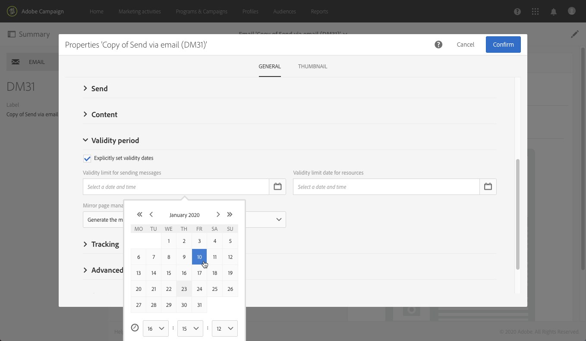

# 配置电子邮件渠道{#configuring-email-channel}

Campaign [管理员](../../administration/using/users-management.md#functional-administrators)可以配置电子邮件渠道设置。这些高级设置包括常规电子邮件渠道参数、电子邮件路由帐户、电子邮件处理规则和电子邮件属性。在本頁中，瞭解如何編輯一般電子郵件和傳送引數的預設值。

## 电子邮件渠道参数 {#email-channel-parameters}

利用电子邮件配置屏幕，可定义电子邮件渠道的参数。管理员通过 **[!UICONTROL Administration]> [!UICONTROL Channels] > [!UICONTROL Email] >[!UICONTROL Configuration]** 菜单访问这些配置。

* **授权的掩码字段**

   **[!UICONTROL Header parameters of sent emails]** 部分列出了授权电子邮件地址，您可以使用这些地址向收件人发送电子邮件（发件人地址），并允许他们发回自动回复，如异步退件、“不在办公室”回复等（错误地址）。Adobe Campaign 会检查在消息准备阶段期间输入的地址是否有效。此操作模式可确保不使用可能触发可投放性问题的地址。
   * 发件人地址和错误地址均由 Adobe 设置。这些字段不能为空。
   * 您无法编辑这些字段。要更新地址，请与 Adobe 客户关怀团队联系。
   * 若要新增其他地址，您可以使用 [Campaign控制面板](https://experienceleague.adobe.com/docs/control-panel/using/subdomains-and-certificates/setting-up-new-subdomain.html?lang=zh-Hans) 以設定新的子網域，或聯絡Adobe客戶服務團隊。 請注意，如果使用數個遮罩，則會以逗號分隔。
   * 最好使用星形符号设置地址（如*@yourdomain.com）：这样即可使用任何以该子域名结尾的地址。

* **可投放性**

   Adobe 客户关怀团队提供了 **[!UICONTROL Delivery reports ID]**。通过此功能，可使用技术可投放性报告中使用的可投放性 ID 来标识个个实例。
   <!--The Technical Deliverability report is not accessible through the UI in ACS. It will be replaced with 250ok in the future (project starting).-->

* **投放参数**

   Adobe Campaign 从开始日期起发送消息。

   當傳送中的訊息因暫時錯誤或軟退信而遭到拒絕時，Campaign會每天重試傳送此訊息。 使用 **[!UICONTROL Message delivery duration]** 指定重試期間時間範圍的欄位。

   >[!IMPORTANT]
   >
   >**现在，Campaign 中仅使用不超过 3.5 天的该参数设置。**&#x200B;如果定义的值超过 3.5 天，则不会将其考虑在内。

   **[!UICONTROL Online resources validity duration]** 字段用于已上传的资源，主要用于镜像页面和图像。本页上的资源仅在限制时间内有效（以节省磁盘空间）。

* **重试**

   临时未送达的消息将会自动重试。有关更多信息，请参阅[投放临时失败后重试](../../sending/using/understanding-delivery-failures.md#retries-after-a-delivery-temporary-failure)。

   >[!IMPORTANT]
   >
   >要執行的最大重試次數和重試之間的最小延遲現在取決於IP在給定網域名的歷史和目前執行狀況。 此 **[!UICONTROL Retry period]** 和 **[!UICONTROL Number of retries]** 將忽略Campaign中的設定。

   <!--This section indicates how many retries should be performed the day after the send is started (**Number of retries**) and the minimum delay between retries (**Retry period**). By default, five retries are scheduled for the first day with a minimum interval of one hour, spread out over the 24 hours of the day. One retry per day is programmed after that and until the delivery deadline, which is defined in the **[!UICONTROL Delivery parameters]** section.-->

* **电子邮件隔离参数**

   在 **[!UICONTROL Time between two significant errors]** 字段中，输入一个值，以定义应用程序在软退件失败时，需要等待多久才增加错误计数。默认值为“**1d**”，即 1 天。

   到达 **[!UICONTROL Maximum number of errors before quarantine]** 值后，将隔离该电子邮件地址。預設值為 **「5」**：第5個錯誤導致該地址被隔離。 这意味着后续投放中将自动排除改联系人。
   <!--Actually the way ACS works is that the address is already on the quarantine list on the first bounce, but with a different status meaning that the error count has started.-->

   有关隔离的更多信息，请参阅[了解隔离管理](../../sending/using/understanding-quarantine-management.md)。

## 电子邮件路由帐户 {#email-routing-accounts}

默认情况下，会提供 **[!UICONTROL Integrated email routing]** 外部帐户。其中包含允许应用程序发送电子邮件的技术参数。

帐户类型必须始终设置为 **[!UICONTROL Routing]**、渠道设置为 **[!UICONTROL Email]** 以及投放模式设置为 **[!UICONTROL Bulk delivery]**。

**相关主题**：

[外部帐户](../../administration/using/external-accounts.md)

## 电子邮件处理规则 {#email-processing-rules}

管理员可以通过 **[!UICONTROL Administration > Channels > Email]** 菜单访问 **[!UICONTROL Email processing rules]**。

>[!IMPORTANT]
>
>電子郵件網域和MX規則現在會自動管理<!--by the Adobe Campaign Enhanced MTA (Message Transfer Agent)--> 和無法變更。

* **DKIM （DomainKeys已識別的郵件）** 所有網域的所有郵件都會完成電子郵件驗證簽署。 它不會使用簽署 **寄件者ID**， **網域索引鍵**，或 **S/MIME**.
* MX規則會根據您過去的電子郵件信譽，以及您傳送電子郵件之網域所提供的即時回饋，自動依網域自訂您的輸送量。

<!--Note that the email domains and the MX rules are now managed by the Adobe Campaign Enhanced MTA:
* **DKIM (DomainKeys Identified Mail)** email authentication signing is done by the Enhanced MTA for all messages with all domains. It does not sign with **Sender ID**, **DomainKeys**, or **S/MIME** unless otherwise specified at the Enhanced MTA level.
* The Enhanced MTA uses its own MX rules that allow it to customize your throughput by domain based on your own historical email reputation, and on the real-time feedback coming from the domains where you are sending emails.-->

### 退回邮件 {#bounce-mails}

仍由 Campaign inMail 流程通过 **[!UICONTROL Bounce mails]** 规则对异步退件进行鉴别。

这些规则包含可由远程服务器返回的字符串列表，并可让您鉴别错误（**Hard**、**Soft** 或 **Ignored**）。

>[!IMPORTANT]
>
>Adobe Campaign Enhanced MTA現在會限定同步傳送失敗錯誤訊息，進而決定退信型別和限定，並將該資訊傳回至Campaign。

有关退回邮件鉴别的更多信息，请参阅[此章节](../../sending/using/understanding-delivery-failures.md#bounce-mail-qualification)。

<!--Because they are now managed by the Enhanced MTA, the bounce qualifications in the Campaign **[!UICONTROL Message qualification]** table are no longer used. For more on bounce mail qualification, see this [section](../../sending/using/understanding-delivery-failures.md#bounce-mail-qualification).

### Management of email domains {#managing-email-domains}

The email domains are now managed by the Adobe Campaign Enhanced MTA. The Adobe Campaign **[!UICONTROL Domain management]** rules are no longer used.

**DKIM (DomainKeys Identified Mail)** email authentication signing is done by the Enhanced MTA for all messages with all domains. It does not sign with **Sender ID**, **DomainKeys**, or **S/MIME** unless otherwise specified at the Enhanced MTA level.

### MX management {#mx-management}

The MX rules are now managed by the Adobe Campaign Enhanced MTA. The Adobe Campaign **[!UICONTROL MX management]** delivery throughput rules are no longer used.

The Enhanced MTA uses its own MX rules that allow it to customize your throughput by domain based on your own historical email reputation, and on the real-time feedback coming from the domains where you are sending emails.-->

## 电子邮件属性的列表 {#list-of-email-properties}

本节详细介绍了电子邮件或电子邮件模板之属性屏幕中提供的参数列表。

>[!NOTE]
>
>部分参数仅用在模板中。您可以访问的参数，[取决于您的权限](../../administration/using/users-management.md)。

要编辑电子邮件或电子邮件模板的属性，请使用 **[!UICONTROL Edit properties]** 按钮。

### 常规参数 {#general-parameters}

在电子邮件参数屏幕的顶部，使用 **[!UICONTROL Label]** 和 **[!UICONTROL ID]** 字段标识电子邮件。此信息显示在界面中，但消息收件人不可见。

>[!IMPORTANT]
>
>ID 必须具有唯一性。

使用 **[!UICONTROL Brand]** 欄位以選取連結至傳遞的品牌。 有关使用和配置品牌的更多信息，请参阅[品牌策略](../../administration/using/branding.md)一节。

在 **[!UICONTROL Campaign]** 欄位中，輸入與電子郵件相關聯的行銷活動。

您还可以在相应的字段中添加 **[!UICONTROL Description]**，并编辑列表中电子邮件缩览图所显示的图像

### 发送参数 {#sending-parameters}

**[!UICONTROL Send]** 部分仅适用于电子邮件模板。其中包含以下参数：

#### 重试参数 {#retries-parameters}

临时未送达的消息将会自动重试。有关更多信息，请参阅[投放临时失败后重试](../../sending/using/understanding-delivery-failures.md#retries-after-a-delivery-temporary-failure)。

>[!IMPORTANT]
>
>重試之間的最小延遲和執行重試的最大次數，現在取決於IP在指定網域中過去和現在的執行狀況。 此 **[!UICONTROL Retry period]** 和 **[!UICONTROL Max. number of retries]** 將忽略Campaign中的設定。

仍会遵从在 Campaign 中设置的&#x200B;**投放持续时间设置**（在[有效期参数](#validity-period-parameters)部分中定义），**但最长只有 3.5 天**。达到该时间后，重试队列中的所有消息都将从队列中删除，并作为退件发回。有关投放失败的更多信息，请参阅此[章节](../../sending/using/understanding-delivery-failures.md#about-delivery-failures)。

#### 电子邮件格式参数 {#email-format-parameters}

您可以配置待发送电子邮件的格式。提供了三个选项：

* **使用收件人首选项** （默认模式）：根据收件人用户档案中存储的数据（默认存储在 **Email format** 字段 (@emailFormat) 中）定义消息格式。如果收件人希望以特定格式接收消息，则会将该格式用于发送的邮件。如果未填写该字段，则会发送 multipart-alternative 消息（请参阅下文）。
* **让收件人邮件客户端选择最合适的格式 (multipart-alternative)**：该消息包含两种格式：文本和 HTML。接收时显示的格式取决于收件人邮件软件的配置 (multipart-alternative)。

   >[!IMPORTANT]
   >
   >此选项包含消息的两个版本。因为增加了消息大小，因此会影响投放吞吐量。

* **以文本格式发送所有消息**：消息以文本格式发送。不会发送 HTML 格式，仅当收件人单击消息中的链接时，才会将其用于镜像页面。

#### SMTP 测试模式 {#smtp-test-mode}

使用 **[!UICONTROL Enable SMTP test mode]** 用於測試透過SMTP連線傳送的電子郵件，而不實際傳送郵件的選項。 处理投放直至连接到 SMTP 服务器，但不发送：对于投放的每个收件人，Campaign 连接到 SMTP 提供商服务器，执行 SMTP RCPT TO 命令，并在执行 SMTP DATA 命令之前关闭连接。

电子邮件和电子邮件模板都可使用此选项。

如果为某个电子邮件模板启用 SMTP 测试模式选项，则从该模板创建的所有电子邮件都将启用此选项。

>[!IMPORTANT]
>
>如果为某一封电子邮件启用此选项，则不会发送任何邮件，直到将其取消选中为止。
>电子邮件或电子邮件模板的仪表板中将显示警告。

有关配置 SMTP 的更多信息，请参阅[电子邮件 SMTP 参数列表](#list-of-email-smtp-parameters)。

### 有效期参数 {#validity-period-parameters}

**[!UICONTROL Validity period]** 部分包含以下参数：

* **[!UICONTROL Explicitly set validity dates]**：如果未勾选此框，则必须在 **[!UICONTROL Delivery duration]** 和 **[!UICONTROL Resource validity limit]** 字段中输入持续时间。

   如果要定义特定的时间和日期，请勾选此框。

   

* **[!UICONTROL Delivery duration]** / **[!UICONTROL Validity limit for sending messages]**：Adobe Campaign 从开始日期起发送消息。使用此欄位可指定可傳送訊息的期間。

   >[!IMPORTANT]
   >
   >**您必须定义一个最大不超过 3.5 天的值。** 如果您設定的值超過3.5天，則不會考慮該值。
   >
   >**[!UICONTROL Delivery duration]** 参数不适用于事务型消息。有关事务型消息传递的更多信息，请参阅[此章节](../../channels/using/getting-started-with-transactional-msg.md)。

* **[!UICONTROL Resource validity duration]** / **[!UICONTROL Validity limit date for resources]**：此字段用于已上传的资源，主要用于镜像页面和图像。本页上的资源仅在限制时间内有效（以节省磁盘空间）。
* **[!UICONTROL Mirror page management]**：镜像页面是可通过 Web 浏览器在线访问的 HTML 页面。其内容与电子邮件内容相同。默认情况下，如果将链接插入到邮件内容中，则会生成镜像页面。使用此欄位來修改產生此頁面的方式：

   * **[!UICONTROL Generate the mirror page if a mirror link appears in the email content]**（默认模式）：如果将链接插入到邮件内容中，则会生成镜像页面。
   * **强制生成镜像页面**：即使消息中未插入指向镜像页面的链接，也会创建镜像页面。
   * **不生成镜像页面**：即使消息中存在链接，也不生成镜像页面。
   * **生成仅可使用消息 ID 访问的镜像页面**：利用此选项，您可以在投放日志窗口中访问带有个性化信息的镜像页面内容。

   >[!IMPORTANT]
   >
   >只有在已為電子郵件定義HTML內容時，才會產生映象頁面。

### 跟踪参数 {#tracking-parameters}

**[!UICONTROL Tracking]** 部分包含以下参数：

* **[!UICONTROL Activate tracking]**：使用此選項來啟用/停用訊息URL追蹤。 要管理每个消息 URL 的跟踪，请使用 Email Designer 操作栏中的 **[!UICONTROL Links]** 图标。请参阅[关于跟踪的 URL](../../designing/using/links.md#about-tracked-urls)。
* **[!UICONTROL Tracking validity limit]**：使用此選項可定義在URL上啟用追蹤的持續時間。
* **[!UICONTROL Substitution URL for expired URLs]**：使用此選項可輸入後援網頁的URL：追蹤過期後就會顯示。
* **[!UICONTROL Use tracking pixel at the top of email]**：使用此選項可將追蹤畫素移動至電子郵件頂端而非底部。 依預設，此畫素位於電子郵件底部。 如果您傳送大型訊息，請考慮將此畫素移動至電子郵件頂端而非底部，以改善開啟追蹤，否則有些電子郵件提供者可能會剪下追蹤畫素。

### 高级参数 {#advanced-parameters}

**[!UICONTROL Advanced parameters]** 部分包含多个参数。

利用第一个字段，您可以输入必要的信息以制作电子邮件标题。您可以在此处管理回复地址和文本以及发件人地址（用于填充“From:”字段）。此信息可以个性化。

单击要更改的字段右侧的按钮，然后添加个性化字段、内容块或动态文本。

有关插入和使用个性化内容的详细信息，请参阅](../../designing/using/personalization.md)个性化电子邮件内容[文档。

#### 目标上下文 {#target-context}

使用目標定位內容來定義一組表格，這些表格將用於電子郵件目標定位（在對象定義畫面中）和個人化(在HTML內容編輯器中定義個人化欄位)。

#### 路由 {#routing}

此字段指示所用的路由模式。路由需引用外部帐户。例如，如果您希望使用包含特定品牌策略配置的外部帐户，则可以使用此选项。

>[!NOTE]
>
>可通过 **Administration** > **Application settings** > **External accounts** 菜单访问外部帐户。

#### 准备 {#preparation}

有关准备消息的详情，请参阅[批准消息](../../sending/using/preparing-the-send.md)一节。

* **[!UICONTROL Typology]**：在发送之前，必须准备消息以证内容和配置。在&#x200B;**分类**&#x200B;中定义要在准备阶段期间应用的验证规则。例如，对于电子邮件，准备包括检查主题、URL 和图像等。选择要应用于此字段的分类。

   >[!NOTE]
   >
   >可通过 **[!UICONTROL Administration]** > **[!UICONTROL Channels]** > **[!UICONTROL Typologies]** 菜单访问“分类”，请参阅[此章节](../../sending/using/about-typology-rules.md)。

* **[!UICONTROL Compute the label during delivery preparation]**：此選項可在訊息準備階段期間，使用個人化欄位、內容區塊和動態文字來計算電子郵件的標籤值。

   还可以使用已声明到工作流外部信号活动中的事件变量，将投放标签个性化。有关更多信息，请参阅[此章节](../../automating/using/calling-a-workflow-with-external-parameters.md)。

* **[!UICONTROL Save SQL queries in the log]**：使用此選項可在準備階段期間，將SQL查詢記錄檔新增至日誌。

#### 校样设置 {#proof-settings}

在此區段中，您可以設定要用於校樣訊息主旨行的預設首碼。 進一步瞭解中的校訂 [本節](../../sending/using/sending-proofs.md).

### 电子邮件 SMTP 参数的列表 {#list-of-email-smtp-parameters}

**[!UICONTROL SMTP]** 部分包含以下参数：

* **[!UICONTROL Character encoding]**：如果要强制进行消息编码，请选中 **[!UICONTROL Force encoding]** 方框，然后选择要使用的编码。
* **[!UICONTROL Bounce mails]**：默认情况下，平台的错误收件箱中会收到退回的邮件（**[!UICONTROL Administration]** >中 **[!UICONTROL Channels]** > **[!UICONTROL Email]** > **[!UICONTROL Configuration]** 屏幕中定义）。要定义电子邮件的特定错误地址，请在 **[!UICONTROL Error address]** 字段中输入该地址。
* **[!UICONTROL Additional SMTP headers]**：此选项用于向邮件中添加其他 SMTP 标头。在 **[!UICONTROL Headers]** 字段中输入的脚本必须每行引用一个标头，其形式为 **name:value**。如有必要，将自动对值进行编码。

   >[!IMPORTANT]
   >
   >高级用户可随时添加脚本以插入其他 SMTP 标头。此脚本的语法必须符合此内容类型的要求：没有未使用的空格，没有空行等。

### 访问授权参数的列表 {#list-of-access-authorization-parameters}

**[!UICONTROL Access authorization]** 部分包含以下参数：

* 此 **[!UICONTROL Organizational unit]** 欄位可用來限制特定使用者存取此電子郵件。 与指定单位或父单位关联的用户，具有此电子邮件的读写权限。与子单位关联的用户，仅具有此电子邮件的读取权限。

   >[!NOTE]
   >
   >您可以通过 **Administration** > **Users &amp; Security** 菜单配置组织单位。

* **[!UICONTROL Created by]**、**[!UICONTROL Created]**、**[!UICONTROL Modified by]** 和 **[!UICONTROL Last modified]** 字段会自动填写。

## 舊版設定 {#legacy-settings}

如果您是 **NOT** 執行最新版Campaign時，下述引數和UI區段仍適用於您。

### 重试 {#legacy-retries}

此 **[!UICONTROL Retries]** 中的設定 [設定功能表](#email-channel-parameters) 和 [傳送引數](#retries-parameters) 電子郵件屬性的，指出在開始傳送後一天內應執行幾次重試(**[!UICONTROL Number of retries]** / **[!UICONTROL Max. number of retries]**)和兩次重試之間的最小延遲(**[!UICONTROL Retry period]**)。

重試次數可全域變更(請聯絡您的Adobe技術管理員)，或針對每個傳遞或傳遞範本進行變更。

依預設，第一天排程五次重試，最小間隔為一小時，分佈在一天中的24小時。 每天一次重試的設定在此之後並一直到傳送期限（在中全域定義）。 **[!UICONTROL Delivery parameters]** 部分 **[!UICONTROL Configuration]** 功能表，或在 **[!UICONTROL Validity period]** 區段在傳遞層級(請參閱 [傳遞期間](#legacy-delivery-duration) 區段)。

### 投放持续时间 {#legacy-delivery-duration}

使用 **[!UICONTROL Message delivery duration]** 中的引數 [設定功能表](#email-channel-parameters) 指定傳送中遇到暫時性錯誤或軟退信之任何訊息的重試時間範圍。

使用 **[!UICONTROL Delivery duration]** 或 **[!UICONTROL Validity limit for sending messages]** 中的引數 [有效期間引數](#validity-period-parameters) 區段來指定可以傳送訊息的持續時間。

### 电子邮件处理规则 {#legacy-email-processing-rules}

此 **[!UICONTROL MX management]**， **[!UICONTROL Bounce mails]** 和 **[!UICONTROL Domain management]** 管理員可透過以下方式存取及修改規則： **[!UICONTROL Administration > Channels > Email > Email processing rules]** 功能表。 [了解详情](#email-processing-rules)。

### 退回邮件鉴别 {#legacy-bounce-mail-qualification}

若要列出各種跳出及其關聯的錯誤型別和原因，請按一下 **Adobe** 標誌，在左上方，然後選取 **[!UICONTROL Administration > Channels > Quarantines > Message qualification]**.

彈回可以有下列資格狀態：

* **[!UICONTROL To qualify]**：需要限定退信件。 驗證必須由傳遞能力團隊完成，以確保平台傳遞能力正常運作。 只要不符合，跳出郵件就不會用來擴充電子郵件處理規則的清單。
* **[!UICONTROL Keep]**：退信已符合資格，且將由 **傳遞能力更新** 要與現有電子郵件處理規則進行比較並豐富清單的工作流程。
* **[!UICONTROL Ignore]**：退信已符合資格，但將不會由使用 **傳遞能力更新** 工作流程。 因此不會傳送給使用者端執行個體。

>[!NOTE]
>
>如果ISP發生中斷，透過Campaign傳送的電子郵件將錯誤標示為跳出。 若要修正此問題，您必須更新退回資格。 [了解详情](../../administration/using/update-bounce-qualification.md)。

<!--Bounces are qualified through the **[!UICONTROL Bounce mails]** processing rule. For more on accessing this rule, refer to this [section](#legacy-bounce-mail-qualification).-->

### 傳遞的指標報告 {#legacy-delivered-status-report}

在 **[!UICONTROL Summary]** 每則訊息的檢視， **[!UICONTROL Delivered]** 當軟跳出和硬跳出被回報時，百分比會在整個傳遞的有效期內逐步上升。

軟退信顯示為 **[!UICONTROL Failed]** 在傳遞後的第一天。 這些訊息每天都會重試，直到傳送的有效期間結束。
