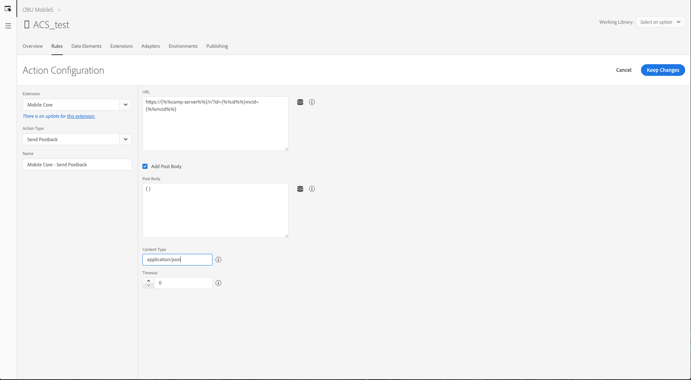

# 配置 Launch 规则以支持 Adobe Campaign Standard 用例 {#configuring-rules-launch}

在中 [!DNL Adobe Experience Platform Launch]，您需要创建数据元素和规则，以便将PII和其他数据从移动应用程序发送到 [!DNL Adobe Campaign Standard]。

要确保中的所有配置更 [!DNL Adobe Experience Platform Launch] 改均生效，您必须发布这些更改。 有关详细信息，请参阅 [发布](https://aep-sdks.gitbook.io/docs/getting-started/create-a-mobile-property#publish-the-configuration)。

要在中创建规 [!DNL Experience Platform Launch]则，请执行以下步骤：

1. [创建数据元素](../../administration/using/configuring-rules-launch.md#create-data-elements)
2. [为要支持](../../administration/using/configuring-rules-launch.md#create-data-elements) 的用例创建规则：
   * [PII回传](../../administration/using/configuring-rules-launch.md#pii-postback)
   * [应用程序内跟踪回传](../../administration/using/configuring-rules-launch.md#inapp-tracking-postback)
   * [推送通知跟踪回发](../../administration/using/configuring-rules-launch.md#push-tracking-postback)
   * [位置回传](../../administration/using/configuring-rules-launch.md#location-postback)

## 创建数据元素 {#create-data-elements}

以下是我们建议您在中创建的数据元素 [!DNL Experience Platform Launch]。
您可以根据需要创建其他数据元素。

* **[!UICONTROL Experience Cloud ID]**
* **[!UICONTROL Pkey]**
* **[!UICONTROL Campaign server]**

要创建这些数据元素，请执行以下操作：

1. 在移 [!DNL Experience Platform Launch]动应用程序仪表板中，单击选项 **[!UICONTROL Data Elements]** 卡。

1. 要创建数 **[!UICONTROL Experience Cloud ID]** 据元素，请单击 **[!UICONTROL Create New Data Element]**。

1. 例如 **[!UICONTROL Name]** ，在字段中键入 **mcid**。

1. From the **[!UICONTROL Extension]** drop-down, select **[!UICONTROL Mobile Core]**. 然 **[!UICONTROL Experience Cloud ID]** 后在 **[!UICONTROL Data element]** 类型下拉框中。

   

1. 要创建Pkey数据元素，请单击 **[!UICONTROL Add data element]**。

1. 在字 **[!UICONTROL Name]** 段中，例如键入 **pkey**。

1. From the **[!UICONTROL Extension]** drop-down, select **[!UICONTROL Adobe Campaign Standard]**. 然 **[!UICONTROL pkey]** 后在 **[!UICONTROL Data element]** 类型下拉框中。

1. 要创建活动服务器数据元素，请单击 **[!UICONTROL Add data element]**。

1. 在字 **[!UICONTROL Name]** 段中，键入名称，如 **camp-server**。

1. From the **[!UICONTROL Extension]** drop-down, select **[!UICONTROL Adobe Campaign Standard]**. 然后， **[!UICONTROL Campaign Server]** 在“ **[!UICONTROL Data element]** 类型”下拉框中。

## 创建规则 {#creating-rules}

您需要为以下各项创建规则：

* [PII回传](../../administration/using/configuring-rules-launch.md#pii-postback)
* [应用程序内跟踪回传](../../administration/using/configuring-rules-launch.md#inapp-tracking-postback)
* [推送通知跟踪回发](../../administration/using/configuring-rules-launch.md#push-tracking-postback)
* [位置回传](../../administration/using/configuring-rules-launch.md#location-postback)

### PII回传 {#pii-postback}

>[!NOTE]
>
>要将PII信息从移动应用程序发送到Adobe Campaign，您需要实施SDK API。 有关详细信息，请转 [到CollectPII](https://aep-sdks.gitbook.io/docs/using-mobile-extensions/mobile-core/mobile-core-api-reference#collect-pii)。

要将PII数据发送 [!DNL Adobe Campaign Standard]到，请在以下位置创建规 [!DNL Experience Platform Launch]则：

1. 在移 [!DNL Experience Platform Launch]动应用程序仪表板中，单击选项 **[!UICONTROL Rules]** 卡，然后 **[!UICONTROL Create New Rule]**。

1. 键入名称，例如， **Mobile Core - Collect PII**。

1. In the **[!UICONTROL Events]** section, click **[!UICONTROL Add]**.

1. From the **[!UICONTROL Extension]** drop-down, select **[!UICONTROL Mobile Core]**. 然后 **[!UICONTROL Collect PII]** ，在 **[!UICONTROL Event type]** 下拉菜单中。

1. 单击 **[!UICONTROL Keep changes]**.

1. In the **[!UICONTROL Actions]** section, click **[!UICONTROL Add]**.

1. From the **[!UICONTROL Extension]** drop-down, select **[!UICONTROL Mobile Core]**. 然后 **[!UICONTROL Send PII]** ，在 **[!UICONTROL Action type]** 下拉菜单中。

1. 在 **[!UICONTROL URL]**&#x200B;中，输入以下URL:

   ```
   https://{%%camp-server%%}/rest/head/mobileAppV5/{%%pkey%%}/subscriptions/{%%mcid%%}
   ```

1. 选中 **[!UICONTROL Add Post Body]** 复选框。

1. 在 **[!UICONTROL Post Body]**&#x200B;中，键入以下内容：

   ```
   {
   "marketingCloudId":
   "{%%mcid%%}",
   "cusEmail":
   "",
   "cusFirstName":
   "",
   "cusLastName":
   "" }
   ```

   marketingCloudId使您能够协调应用程序订阅者与收件人库中的，因此是必需的。 您可以根据业务需要指定其他键值对。 在上面的示例中，将从应用程序传递电子邮件、名字和姓氏。

   键（例如cusEmail、cusFirstName和cusLastName）应与在Adobe Campaign Standard实例的自定义资源中定义的字段ID匹配。 值变量（例如，email、firstName和LastName）应与从移动应用程序发送的JSON数据中的键匹配，同时从应用程序代码调用AMS collectPII API。

   您还可以根据事件触发器在Collect PII回传或其他回传中传递生命周期数据。 以下是生命周期数据JSON的示例：

   ```
   {
   "marketingCloudId":"{%%mcid%%}",
   "cusDayslastlaunch": "{%%DaysSinceLastUse%%}", 
   "cusDaysfirstlaunch": "{%%DaysSinceFirstUse%%}", 
   "cusLaunches": "{%%Launches%%}"
   }
   ```

   中定义的多次元素 [!DNL Experience Platform Launch] 应以百分比（例如%mcid%%）括起来，应用程序的上下文变量应以单个百分比（例如%contextdata.email%）括起来。

1. 在 **[!UICONTROL Content Type]**&#x200B;中，键 **入application/json**。

1. In **[!UICONTROL Timeout]**, select 0.

   

您的用户数据现已配置为发送至活动。

### 应用程序内跟踪回传 {#inapp-tracking-postback}

要向发送跟踪数 [!DNL Adobe Campaign Standard] 据以报告用户在移动应用程序中与应用程序内消息的交互方式，请在以下位置创建以下规则 [!DNL Experience Platform Launch]:

1. 在移 [!DNL Experience Platform Launch]动应用程序仪表板中，选择选项 **[!UICONTROL Rules]** 卡并单击 **[!UICONTROL Add Rule]**。

1. 键入名称，例如 **Adobe Campaign-应用程序内单击跟踪**。

1. In the **[!UICONTROL Events]** section, click **[!UICONTROL Add]**.

1. From the **[!UICONTROL Extension]** drop-down, select **[!UICONTROL Adobe Campaign Standard]**. 然后 **[!UICONTROL In-App click tracking]** ，在 **[!UICONTROL Event type]** 下拉菜单中。

1. 单击 **[!UICONTROL Keep changes]**.

1. In the **[!UICONTROL Actions]** section, click **[!UICONTROL Add]**.

1. From the **[!UICONTROL Extension]** drop-down, select **[!UICONTROL Mobile Core]**. 然后 **[!UICONTROL Send postback]** ，在 **[!UICONTROL Event type]** 下拉菜单中。

1. 在 **[!UICONTROL URL]**&#x200B;中，键入以下URL:

   ```
   https://{%%camp-server%%}/r/?id=&mcid={%%mcid%%}
   ```

1. 选中 **[!UICONTROL Add post body]** 复选框。

1. 输入 **[!UICONTROL Post Body]**，键入 **{}**。

1. 在 **[!UICONTROL Content Type]**&#x200B;中，键 **入application/json**。

1. In **[!UICONTROL Timeout]**, select 0.

   

### 推送通知跟踪回发 {#push-tracking-postback}

要向发送跟踪投放( [!DNL Adobe Campaign Standard]有助于跟踪推送通知和用户与移动应用程序的交互)，您需要在中创建一个规则 [!DNL Experience Platform Launch]。

有关推送跟踪的详细信息，请参阅 [推送跟踪](../../administration/using/push-tracking.md)。

要跟踪应用程序操作，请使用trackAction API。 有关详细信息，请参阅 [跟踪应用程序操作](https://app.gitbook.com/@aep-sdks/s/docs/using-mobile-extensions/mobile-core/mobile-core-api-reference#track-app-actions)。

1. 在移 [!DNL Experience Platform Launch]动应用程序仪表板中，单击选项 **[!UICONTROL Rules]** 卡并单击 **[!UICONTROL Add Rule]**。

1. 键入名称，例如， **Adobe Campaign-推送单击跟踪**。

1. In the **[!UICONTROL Events]** section, click **[!UICONTROL Add]**.

1. From the **[!UICONTROL Extension]** drop-down, select **[!UICONTROL Mobile Core]**. 然后 **[!UICONTROL Track Action]** ，在 **[!UICONTROL Event type]** 下拉菜单中。

1. 从下 **[!UICONTROL Action]** 拉框中，选择 **[!UICONTROL Action]**、选 **[!UICONTROL equals]**&#x200B;择和类型 **跟踪**。

1. 单击 **[!UICONTROL Keep changes]**。然后，在部分 **[!UICONTROL Actions]** 中单击 **[!UICONTROL Add]**。

1. From the **[!UICONTROL Extension]** drop-down, select **[!UICONTROL Mobile Core]**. 然后 **[!UICONTROL Send postback]** ，在 **[!UICONTROL Action type]** 下拉菜单中。

1. 在 **[!UICONTROL URL]**&#x200B;中，输入以下URL:

   ```
   https://{%%camp-server%%}/r/?id=,,&mcId={%%mcid%%}
   ```

1. 选中 **[!UICONTROL Add post body]** 复选框。

1. 添加您的帖子正文，例如，{ }。

1. 在 **[!UICONTROL Content Type]**&#x200B;中，键 **入application/json**。

1. In **[!UICONTROL Timeout]**, select 0.

### 位置回传 {#location-postback}

1. 在移 [!DNL Experience Platform Launch]动应用程序仪表板中，单击选项 **[!UICONTROL Rules]** 卡并单击 **[!UICONTROL Add Rule]**。

1. 键入名称，例如“位置 **回传”**。

1. In the **[!UICONTROL Events]** section, click **[!UICONTROL Add]**.

1. 创建事件，例如，输入POI或退出POI。 从下 **[!UICONTROL Extension]** 拉列表中，选 **择Places - Beta**。 然后， **在下拉****框中输入POI** 或 **[!UICONTROL Event type]** 退出POI。

1. 输入名称，例如， **Places - Beta - Enter POI** 或 **Exit POI**。

1. In the **[!UICONTROL Actions]** section, click **[!UICONTROL Add]**.

1. From the **[!UICONTROL Extension]** drop-down, select **[!UICONTROL Mobile Core]**. 然后 **[!UICONTROL Send postback]** 从下 **[!UICONTROL Action type]** 拉菜单。

1. 输入名称，例如， **Mobile Core - Send Location Postback**。

1. 在 **[!UICONTROL URL]**&#x200B;中，输入以下URL:

   ```
   https://{%%camp-server%%}/rest/head/mobileAppV5/{%%pkey%%}/locations/
   ```

1. 选中复 **[!UICONTROL Add post body]** 选框并添加您的帖子正文，例如：

   ```
   {
   "locationData": {
       "distances": "{%%Distance%%}",
       "poiLabel": "{%%POILabel%%}",
       "latitude": "{%%Latitude%%}",
       "longitude": "{%%Longitude%%}",
       "appId": "{%%AppId%%}",
       "marketingCloudId": "{%%ECID%%}"
   }
   }
   ```

   >[!NOTE]
   >
   >在上面的示例中，需要通过利用创建数据元素中的 [!DNL Experience Platform Launch] 步骤配置右侧 [的数据元素](../../administration/using/configuring-rules-launch.md#create-data-elements)。 支持左侧的数据元素， [!DNL Adobe Campaign Standard] 无需任何配置。 如果您需要其他数据，您需要在中执行自定义资源扩展 [!DNL Adobe Campaign Standard]。

1. 在 **[!UICONTROL Content Type]**&#x200B;中，键 **入application/json**。

1. In **[!UICONTROL Timeout]**, select 5.

   
