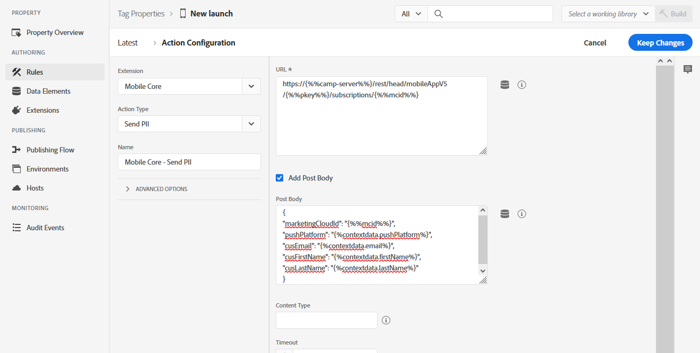

# 配置 Launch 规则以支持 Adobe Campaign Standard 用例 {#configuring-rules-launch}

在[!DNL Adobe Experience Platform Launch]中，您需要创建数据元素和规则，以将PII和其他数据从移动设备应用程序发送到[!DNL Adobe Campaign Standard]。

要确保[!DNL Adobe Experience Platform Launch]中的所有配置更改都生效，您必须发布这些更改。 有关更多信息，请参阅[Publishing](https://aep-sdks.gitbook.io/docs/getting-started/create-a-mobile-property#publish-the-configuration)。

要在[!DNL Experience Platform Launch]中创建规则，请执行以下步骤：

1. [创建数据元素](../../administration/using/configuring-rules-launch.md#create-data-elements)
2. [为要](../../administration/using/configuring-rules-launch.md#create-data-elements) 支持的用例创建规则：
   * [PII回发](../../administration/using/configuring-rules-launch.md#pii-postback)
   * [应用程序内跟踪回发](../../administration/using/configuring-rules-launch.md#inapp-tracking-postback)
   * [推送通知跟踪回发](../../administration/using/configuring-rules-launch.md#push-tracking-postback)
   * [位置回发](../../administration/using/configuring-rules-launch.md#location-postback)

## 创建数据元素 {#create-data-elements}

以下是建议您在[!DNL Experience Platform Launch]中创建的数据元素。
您可以根据需要创建其他数据元素。

* **[!UICONTROL Experience Cloud ID]**
* **[!UICONTROL Pkey]**
* **[!UICONTROL Campaign server]**

要创建这些数据元素，请执行以下操作：

1. 在[!DNL Experience Platform Launch]中，从移动应用程序仪表板中，单击&#x200B;**[!UICONTROL Data Elements]**&#x200B;选项卡。

1. 要创建&#x200B;**[!UICONTROL Experience Cloud ID]**&#x200B;数据元素，请单击&#x200B;**[!UICONTROL Create New Data Element]**。

1. 例如，在&#x200B;**[!UICONTROL Name]**&#x200B;字段中，键入&#x200B;**mcid**。

1. 从&#x200B;**[!UICONTROL Extension]**&#x200B;下拉列表中，选择&#x200B;**[!UICONTROL Mobile Core]**。 然后，在“**[!UICONTROL Data element]**&#x200B;类型”下拉列表中，选择“**[!UICONTROL Experience Cloud ID]**”。

   

1. 要创建Pkey数据元素，请单击&#x200B;**[!UICONTROL Add data element]**。

1. 例如，在&#x200B;**[!UICONTROL Name]**&#x200B;字段中，键入&#x200B;**pkey**。

1. 从&#x200B;**[!UICONTROL Extension]**&#x200B;下拉列表中，选择&#x200B;**[!UICONTROL Adobe Campaign Standard]**。 然后，在“**[!UICONTROL Data element]**&#x200B;类型”下拉列表中，选择“**[!UICONTROL pkey]**”。

1. 要创建Campaign服务器数据元素，请单击&#x200B;**[!UICONTROL Add data element]**。

1. 在&#x200B;**[!UICONTROL Name]**&#x200B;字段中，键入名称，例如&#x200B;**camp-server**。

1. 从&#x200B;**[!UICONTROL Extension]**&#x200B;下拉列表中，选择&#x200B;**[!UICONTROL Adobe Campaign Standard]**。 然后，在“**[!UICONTROL Data element]**&#x200B;类型”下拉列表中，选择“**[!UICONTROL Campaign Server]**”。

## 创建规则 {#creating-rules}

您需要为以下项创建规则：

* [PII回发](../../administration/using/configuring-rules-launch.md#pii-postback)
* [应用程序内跟踪回发](../../administration/using/configuring-rules-launch.md#inapp-tracking-postback)
* [推送通知跟踪回发](../../administration/using/configuring-rules-launch.md#push-tracking-postback)
* [位置回发](../../administration/using/configuring-rules-launch.md#location-postback)

### PII回发 {#pii-postback}

>[!NOTE]
>
>要将PII信息从移动设备应用程序发送到Adobe Campaign，您需要实施SDK API。 有关更多信息，请转到[CollectPII](https://aep-sdks.gitbook.io/docs/using-mobile-extensions/mobile-core/mobile-core-api-reference#collect-pii)。

要将PII数据发送到[!DNL Adobe Campaign Standard]，请在[!DNL Experience Platform Launch]中创建规则：

1. 在[!DNL Experience Platform Launch]中，从移动应用程序仪表板中，单击&#x200B;**[!UICONTROL Rules]**&#x200B;选项卡，然后单击&#x200B;**[!UICONTROL Create New Rule]**。

1. 键入名称，例如&#x200B;**Mobile Core - Collect PII**。

1. 在&#x200B;**[!UICONTROL Events]**&#x200B;部分中，单击&#x200B;**[!UICONTROL Add]**。

1. 从&#x200B;**[!UICONTROL Extension]**&#x200B;下拉列表中，选择&#x200B;**[!UICONTROL Mobile Core]**。 然后，在&#x200B;**[!UICONTROL Event type]**&#x200B;下拉列表中的&#x200B;**[!UICONTROL Collect PII]**。

1. 单击 **[!UICONTROL Keep changes]**。

1. 在&#x200B;**[!UICONTROL Actions]**&#x200B;部分中，单击&#x200B;**[!UICONTROL Add]**。

1. 从&#x200B;**[!UICONTROL Extension]**&#x200B;下拉列表中，选择&#x200B;**[!UICONTROL Mobile Core]**。 然后，在&#x200B;**[!UICONTROL Action type]**&#x200B;下拉列表中的&#x200B;**[!UICONTROL Send PII]**。

1. 在&#x200B;**[!UICONTROL URL]**&#x200B;中，输入以下URL:

   ```
   https://{%%camp-server%%}/rest/head/mobileAppV5/{%%pkey%%}/subscriptions/{%%mcid%%}
   ```

1. 选中&#x200B;**[!UICONTROL Add Post Body]**&#x200B;复选框。

1. 在&#x200B;**[!UICONTROL Post Body]**&#x200B;中，键入以下内容：

   ```
   {
   "marketingCloudId":
   "{%%mcid%%}",
   "cusEmail":
   "",
   "cusFirstName":
   "",
   "cusLastName":
   "" }
   ```

   MarketingCloudId允许您将应用程序订阅者与数据库中的收件人进行协调，因此需要使用。 您可以根据业务需要指定其他键值对。 在以上示例中，正在从应用程序传递电子邮件、名字和姓氏。

   键（例如cusEmail、cusFirstName和cusLastName）应与在Adobe Campaign Standard实例的自定义资源中定义的字段ID匹配。 值变量（例如email、firstName和LastName）应与移动设备应用程序在从应用程序代码调用AMS collectPII API时发送的JSON数据中的键值匹配。

   您还可以在Collect PII回发或其他回发中传递生命周期数据，具体取决于您的事件触发器。 以下是生命周期数据JSON的示例：

   ```
   {
   "marketingCloudId":"{%%mcid%%}",
   "cusDayslastlaunch": "{%%DaysSinceLastUse%%}", 
   "cusDaysfirstlaunch": "{%%DaysSinceFirstUse%%}", 
   "cusLaunches": "{%%Launches%%}"
   }
   ```

   在[!DNL Experience Platform Launch]中定义的数据元素应以双百分比括起来，例如%%mcid%%，应用程序的上下文变量应以单个百分比包括，例如%contextdata.email%。

1. 在&#x200B;**[!UICONTROL Content Type]**&#x200B;中，键入&#x200B;**application/json**。

1. 在&#x200B;**[!UICONTROL Timeout]**&#x200B;中，选择0。

   

您的用户数据现已配置为发送到Campaign。

### 应用程序内跟踪回发 {#inapp-tracking-postback}

>[!NOTE]
>
>如果您使用的是Android ACPCore v1.4.0或更高版本/ iOS ACPCore v2.3.0或更高版本，则无需配置跟踪回发。

要向[!DNL Adobe Campaign Standard]发送跟踪数据，以报告用户与移动应用程序中应用程序内消息的交互方式，请在[!DNL Experience Platform Launch]中创建以下规则：

1. 在[!DNL Experience Platform Launch]中，从移动应用程序仪表板中，选择&#x200B;**[!UICONTROL Rules]**&#x200B;选项卡，然后单击&#x200B;**[!UICONTROL Add Rule]**。

1. 键入一个名称，例如&#x200B;**Adobe Campaign — 应用程序内点击跟踪**。

1. 在&#x200B;**[!UICONTROL Events]**&#x200B;部分中，单击&#x200B;**[!UICONTROL Add]**。

1. 从&#x200B;**[!UICONTROL Extension]**&#x200B;下拉列表中，选择&#x200B;**[!UICONTROL Adobe Campaign Standard]**。 然后，在&#x200B;**[!UICONTROL Event type]**&#x200B;下拉列表中的&#x200B;**[!UICONTROL In-App click tracking]**。

1. 单击 **[!UICONTROL Keep changes]**。

1. 在&#x200B;**[!UICONTROL Actions]**&#x200B;部分中，单击&#x200B;**[!UICONTROL Add]**。

1. 从&#x200B;**[!UICONTROL Extension]**&#x200B;下拉列表中，选择&#x200B;**[!UICONTROL Mobile Core]**。 然后，在&#x200B;**[!UICONTROL Event type]**&#x200B;下拉列表中的&#x200B;**[!UICONTROL Send postback]**。

1. 在&#x200B;**[!UICONTROL URL]**&#x200B;中，键入以下URL:

   ```
   https://{%%camp-server%%}/r/?id=&mcid={%%mcid%%}
   ```

1. 选中&#x200B;**[!UICONTROL Add post body]**&#x200B;复选框。

1. 在&#x200B;**[!UICONTROL Post Body]**&#x200B;中，键入&#x200B;**{}**。

1. 在&#x200B;**[!UICONTROL Content Type]**&#x200B;中，键入&#x200B;**application/json**。

1. 在&#x200B;**[!UICONTROL Timeout]**&#x200B;中，选择0。

   

### 推送通知跟踪回发 {#push-tracking-postback}

>[!NOTE]
>
>如果您使用的是Android ACPCore v1.4.0或更高版本/ iOS ACPCore v2.3.0或更高版本，则无需配置跟踪回发。

要向[!DNL Adobe Campaign Standard]发送跟踪数据（有助于跟踪推送通知投放以及用户与移动应用程序的交互），您需要在[!DNL Experience Platform Launch]中创建规则。

有关推送跟踪的更多信息，请参阅[推送跟踪](../../administration/using/push-tracking.md)。

要跟踪应用程序操作，请使用trackAction API。 有关更多信息，请参阅[跟踪应用程序操作](https://app.gitbook.com/@aep-sdks/s/docs/using-mobile-extensions/mobile-core/mobile-core-api-reference#track-app-actions)。

1. 在[!DNL Experience Platform Launch]的移动应用程序功能板中，单击&#x200B;**[!UICONTROL Rules]**&#x200B;选项卡，然后单击&#x200B;**[!UICONTROL Add Rule]**。

1. 键入名称，例如&#x200B;**Adobe Campaign — 推送点击跟踪**。

1. 在&#x200B;**[!UICONTROL Events]**&#x200B;部分中，单击&#x200B;**[!UICONTROL Add]**。

1. 从&#x200B;**[!UICONTROL Extension]**&#x200B;下拉列表中，选择&#x200B;**[!UICONTROL Mobile Core]**。 然后，在&#x200B;**[!UICONTROL Event type]**&#x200B;下拉列表中的&#x200B;**[!UICONTROL Track Action]**。

1. 从&#x200B;**[!UICONTROL Action]**&#x200B;下拉列表中，选择&#x200B;**[!UICONTROL Action]**，选择&#x200B;**[!UICONTROL equals]**，然后键入&#x200B;**tracking**。

1. 单击 **[!UICONTROL Keep changes]**。然后，在&#x200B;**[!UICONTROL Actions]**&#x200B;部分中，单击&#x200B;**[!UICONTROL Add]**。

1. 从&#x200B;**[!UICONTROL Extension]**&#x200B;下拉列表中，选择&#x200B;**[!UICONTROL Mobile Core]**。 然后，在&#x200B;**[!UICONTROL Action type]**&#x200B;下拉列表中的&#x200B;**[!UICONTROL Send postback]**。

1. 在&#x200B;**[!UICONTROL URL]**&#x200B;中，输入以下URL:

   ```
   https://{%%camp-server%%}/r/?id=,,&mcId={%%mcid%%}
   ```

1. 选中&#x200B;**[!UICONTROL Add post body]**&#x200B;复选框。

1. 添加您的帖子正文，例如{ }。

1. 在&#x200B;**[!UICONTROL Content Type]**&#x200B;中，键入&#x200B;**application/json**。

1. 在&#x200B;**[!UICONTROL Timeout]**&#x200B;中，选择0。

### 位置回发 {#location-postback}

1. 在[!DNL Experience Platform Launch]的移动应用程序功能板中，单击&#x200B;**[!UICONTROL Rules]**&#x200B;选项卡，然后单击&#x200B;**[!UICONTROL Add Rule]**。

1. 键入名称，例如&#x200B;**Location postback**。

1. 在&#x200B;**[!UICONTROL Events]**&#x200B;部分中，单击&#x200B;**[!UICONTROL Add]**。

1. 创建一个事件，例如，进入POI或退出POI。 从&#x200B;**[!UICONTROL Extension]**&#x200B;下拉列表中，选择&#x200B;**Places - Beta**。 然后，在&#x200B;**[!UICONTROL Event type]**&#x200B;下拉菜单中， **进入POI**&#x200B;或&#x200B;**退出POI**。

1. 输入名称，例如，**Places - Beta - Enter POI**&#x200B;或&#x200B;**Exit POI**。

1. 在&#x200B;**[!UICONTROL Actions]**&#x200B;部分中，单击&#x200B;**[!UICONTROL Add]**。

1. 从&#x200B;**[!UICONTROL Extension]**&#x200B;下拉列表中，选择&#x200B;**[!UICONTROL Mobile Core]**。 然后，从&#x200B;**[!UICONTROL Action type]**&#x200B;下拉列表中选择&#x200B;**[!UICONTROL Send postback]**。

1. 输入名称，例如&#x200B;**Mobile Core - Send Location Postback**。

1. 在&#x200B;**[!UICONTROL URL]**&#x200B;中，输入以下URL:

   ```
   https://{%%camp-server%%}/rest/head/mobileAppV5/{%%pkey%%}/locations/
   ```

1. 选中&#x200B;**[!UICONTROL Add post body]**&#x200B;复选框并添加帖子正文，例如：

   ```
   {
   "locationData": {
       "distances": "{%%Distance%%}",
       "poiLabel": "{%%POILabel%%}",
       "latitude": "{%%Latitude%%}",
       "longitude": "{%%Longitude%%}",
       "appId": "{%%AppId%%}",
       "marketingCloudId": "{%%ECID%%}"
   }
   }
   ```

   >[!NOTE]
   >
   >在以上示例中，需要利用[创建数据元素](../../administration/using/configuring-rules-launch.md#create-data-elements)中的步骤，在[!DNL Experience Platform Launch]中配置右侧的数据元素。 [!DNL Adobe Campaign Standard]支持左侧的数据元素，不需要任何配置。 如果需要其他数据，则需要在[!DNL Adobe Campaign Standard]中执行自定义资源扩展。

1. 在&#x200B;**[!UICONTROL Content Type]**&#x200B;中，键入&#x200B;**application/json**。

1. 在&#x200B;**[!UICONTROL Timeout]**&#x200B;中，选择5。

   
