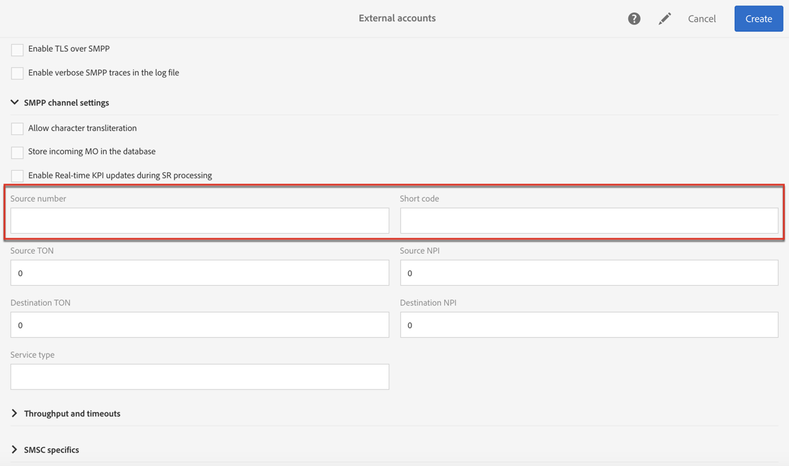

# 配置SMS通道{#configuring-sms-channel}

要发送SMS消息，管理员必须在&gt; **[!UICONTROL Administration]** &gt; **[!UICONTROL Channels]** &gt; **[!UICONTROL SMS]** &gt;菜单下配置一个或多个外部帐 **[!UICONTROL SMS accounts]** 户。

创建和修改外部帐户的步骤在“外部帐户”部分 [中有详细介绍](../../administration/using/external-accounts.md) 。 您将在发送SMS消息的外部帐户的特定参数下找到。

## 定义SMS路由 {#defining-an-sms-routing}

默认情况下 **[!UICONTROL SMS routing via SMPP]** 会提供外部帐户，但添加其他帐户可能会很有用。

如果要使用SMPP协议，还可以创建新的外部帐户。 有关SMS协议和设置的详细信息，请参阅此技 [术说明](https://helpx.adobe.com/campaign/kb/sms-connector-protocol-and-settings.html)。

1. 从创建新的外部帐户 **[!UICONTROL Administration > Application settings > External accounts]**。
1. 将帐户类型定 **[!UICONTROL Routing]**&#x200B;义为，渠道类 **[!UICONTROL Mobile (SMS)]** 型定义为，传送模式定义为 **[!UICONTROL Bulk delivery]**。

   定义这些路由参数后，将自动选择SMS连接 **[!UICONTROL Generic SMPP]** 器()。 此连接器允许Adobe Campaign通过SMPP协议连接到短消息服务中心(SMS-C)，将SMS消息直接发送到目标配置文件。

   

1. 定义连接设置。

   要输入特定于发送SMS消息的连接设置，请联系您的SMS服务提供商，该服务提供商将向您解释如何完成不同的外部帐户字段。

   

   通过 **[!UICONTROL Enable TLS over SMPP]** 此选项可加密SMPP流量。

   **[!UICONTROL Enable verbose SMPP traces in the log file]** 允许您将所有SMPP流量转储到日志文件中。 必须启用此选项才能对连接器进行故障诊断，并与提供者看到的流量进行比较。

1. 联系Adobe,Adobe将根据所选的提供商，为您提 **[!UICONTROL SMS-C implementation name]** 供输入字段的值。
1. 定义SMPP渠道设置。 您可以在 [SMS编码和格式部分了解更多信息](#sms-encoding-and-formats) 。

   如果 **[!UICONTROL Store incoming MO in the database]** 您希望将所有传入的SMS存储在inSMS表中，请启用。 有关如何检索传入SMS的详细信息，请参阅此 [部分](../../channels/using/managing-incoming-sms.md#storing-incoming-sms)。

   该 **[!UICONTROL Enable Real-time KPI updates during SR processing]** 选项允许在 **[!UICONTROL Delivered]** 发送交 **[!UICONTROL Bounces + Errors]** 付后实时更新KPI或KPI。 这些KPI可以在窗口中找 **[!UICONTROL Deployment]** 到，并直接从从提供商收到的SR（状态报告）重新计算。

   

1. 定义参 **[!UICONTROL Throughput and timeouts]** 数。

   您可以指定每秒MT的出站消息的最大吞吐量（“MT”，已终止移动设备）。 如果在相应字段中输入“0”，则吞吐量将无限制。

   需要以秒为单位完成与持续时间相对应的所有字段的值。

1. 定义SMS-C特定参数，以备您需要定义特定编码映射时需要。 有关详细信息，请参阅 [SMSC特定信息部](#smsc-specifics) 分。

   如果 **[!UICONTROL Send full phone number (send characters other than digits)]** 您不想遵守SMPP协议并将前缀传输到SMS提供商(SMS-C)的服 **[!UICONTROL +]** 务器，请启用此选项。

   但是，鉴于某些提供者需要使用前缀，建议您与提供者进行核对，并建议您在必要时启用此选项。 **[!UICONTROL +]**

1. 如果需要，根据回复的内容定义自动回复以触发操作。 如需详细信息，请参阅[此部分](../../channels/using/managing-incoming-sms.md#managing-stop-sms)。
1. 保存SMS路由外部帐户的配置。

您现在可以使用新的路由通过Adobe Campaign发送SMS消息。

## SMS编码和格式 {#sms-encoding-and-formats}

### SMS编码、长度和音译 {#sms-encoding--length-and-transliteration}

默认情况下，SMS中的字符数符合GSM（全球移动通信系统）标准。

使用GSM编码的SMS消息限制为160个字符，或对于以多个部分发送的消息，每个SMS限制为153个字符。

>[!NOTE]
>
>某些字符计为两个（大括号、方括号、欧元符号等）。 可用GSM字符列表列在“字符表- [GSM标准”部分](#table-of-characters---gsm-standard) 。

如果您愿意，可以通过选中相应的框来授权字符音译。

音译包括当GSM标准未考虑到SMS的一个字符时用另一个字符替换该字符。

* 如果音译 **被授权**，则在发送消息时，未考虑的每个字符被GSM字符替换。 例如，字母“ë”被替换为“e”。 因此，消息会稍微更改，但字符限制将保持不变。
* 当音译未获 **得授权时**，将以二进制格式(Unicode)发送包含未考虑的字符的每条消息：因此，所有字符都按原样发送。 但是，使用Unicode的SMS消息限制为70个字符（对于多部分发送的消息，每个SMS限制为67个字符）。 如果超出字符数上限，则会发送多条消息，这可能会造成额外费用。

>[!CAUTION]
>
>将个性化字段插入SMS消息的内容中可能会引入GSM编码未考虑的字符。 个性化SMS消息部分提供 [了内容示例](../../channels/using/personalizing-sms-messages.md) 。

默认情况下，字符音译功能被禁用。 如果您希望SMS消息中的所有字符都按原样保留，例如，不要更改正确的名称，我们建议您不要启用此选项。

但是，如果您的SMS消息包含许多生成Unicode消息的字符，则可以选择启用此选项来限制发送消息的成本。

### 字符表- GSM标准 {#table-of-characters---gsm-standard}

本节介绍GSM标准中考虑的字符。 除了下面提到的字符之外，插入到消息正文的所有字符都会将整个消息转换为二进制格式(Unicode)，因此将其限制为70个字符。 有关详细信息，请参阅 [SMS编码、长度和音译部分](#sms-encoding--length-and-transliteration) 。

**基本字符**

<table> 
 <tbody> 
  <tr> 
   <td> @  </td> 
   <td>    </td> 
   <td> SP  </td> 
   <td> 0  </td> 
   <td> ¡  </td> 
   <td> P  </td> 
   <td> ¿  </td> 
   <td> P  </td> 
  </tr> 
  <tr> 
   <td> £  </td> 
   <td> _  </td> 
   <td> !  </td> 
   <td> 1  </td> 
   <td> A  </td> 
   <td> Q  </td> 
   <td> a  </td> 
   <td> q  </td> 
  </tr> 
  <tr> 
   <td> $  </td> 
   <td>    </td> 
   <td> "  </td> 
   <td> 2  </td> 
   <td> B  </td> 
   <td> R  </td> 
   <td> b  </td> 
   <td> r  </td> 
  </tr> 
  <tr> 
   <td> ¥  </td> 
   <td>    </td> 
   <td> #  </td> 
   <td> 3  </td> 
   <td> C  </td> 
   <td> S  </td> 
   <td> c  </td> 
   <td> s  </td> 
  </tr> 
  <tr> 
   <td> è  </td> 
   <td>    </td> 
   <td> ¤  </td> 
   <td> 4  </td> 
   <td> D  </td> 
   <td> T  </td> 
   <td> d  </td> 
   <td> t  </td> 
  </tr> 
  <tr> 
   <td> 埃  </td> 
   <td>    </td> 
   <td> %  </td> 
   <td> 5  </td> 
   <td> E  </td> 
   <td> U  </td> 
   <td> e  </td> 
   <td> u  </td> 
  </tr> 
  <tr> 
   <td> 乌  </td> 
   <td>    </td> 
   <td> &amp;  </td> 
   <td> 6  </td> 
   <td> F  </td> 
   <td> V  </td> 
   <td> f  </td> 
   <td> v  </td> 
  </tr> 
  <tr> 
   <td> ì  </td> 
   <td>    </td> 
   <td> '  </td> 
   <td> 7  </td> 
   <td> G  </td> 
   <td> W  </td> 
   <td> g  </td> 
   <td> w  </td> 
  </tr> 
  <tr> 
   <td> “  </td> 
   <td>    </td> 
   <td> (  </td> 
   <td> 8  </td> 
   <td> H  </td> 
   <td> X  </td> 
   <td> h  </td> 
   <td> x  </td> 
  </tr> 
  <tr> 
   <td> Ç  </td> 
   <td>    </td> 
   <td> )  </td> 
   <td> 9 </td> 
   <td> 我  </td> 
   <td> Y  </td> 
   <td> i  </td> 
   <td> y  </td> 
  </tr> 
  <tr> 
   <td> LF  </td> 
   <td>    </td> 
   <td> *  </td> 
   <td> :  </td> 
   <td> J  </td> 
   <td> Z  </td> 
   <td> j  </td> 
   <td> z  </td> 
  </tr> 
  <tr> 
   <td> Ø  </td> 
   <td> ESC  </td> 
   <td> +  </td> 
   <td> ;  </td> 
   <td> K  </td> 
   <td> Ä  </td> 
   <td> k  </td> 
   <td> ä  </td> 
  </tr> 
  <tr> 
   <td> ø  </td> 
   <td> AE  </td> 
   <td> ,  </td> 
   <td> &lt;  </td> 
   <td> L  </td> 
   <td> 厄  </td> 
   <td> l  </td> 
   <td> ö  </td> 
  </tr> 
  <tr> 
   <td> CR  </td> 
   <td> æ  </td> 
   <td> -  </td> 
   <td> = </td> 
   <td> M  </td> 
   <td> Ñ  </td> 
   <td> m  </td> 
   <td> -  </td> 
  </tr> 
  <tr> 
   <td> 奥  </td> 
   <td> ß  </td> 
   <td> .  </td> 
   <td> &gt;  </td> 
   <td> N  </td> 
   <td> Ü  </td> 
   <td> n  </td> 
   <td> 女  </td> 
  </tr> 
  <tr> 
   <td> å  </td> 
   <td> 埃  </td> 
   <td> /  </td> 
   <td> ?  </td> 
   <td> O  </td> 
   <td> §  </td> 
   <td> o  </td> 
   <td> a  </td> 
  </tr> 
 </tbody> 
</table>

SP:空格

ESC:Escape

LF:换行

CR:回车

**高级字符（计数两次）**

^ { } [ ~ ] | €

### SMSC特定信息 {#smsc-specifics}

>[!NOTE]
>
>这些选项允许您调整连接器以使用非标准SMSC（即不完全遵循SMPP 3.4规范）或特定编码要求，并且只应由高级用户配置。

在发送SMS消息时，Adobe Campaign可以使用一个或多个文本编码。 每个编码都有其自己的特定字符集，并确定适合SMS消息的字符数。

该字 **[!UICONTROL DATA_CODING]** 段允许Adobe Campaign与使用编码的SMS-C通信。

>[!NOTE]
>
>data_coding值与实际 **使用的编码之间的映射是标准化的** 。 但是，某些SMS-C有自己的特定映射：在这种情况下，您的 **Adobe Campaign** 管理员需要声明此映射。 请咨询您的提供商以了解更多信息。

该功 **[!UICONTROL Define a specific mapping of encodings]** 能允许您声明 **data_codings** ，并在必要时强制进行编码：为此，请在表中指定单个编码。

**配置**

* 如果未 **[!UICONTROL Define a specific mapping of encodings]** 选中该功能，则连接器会采用一般行为：

   * 它将尝试使用GSM编码，它将值 **data_coding = 0赋给它**。
   * 如果GSM编码失败，它将使用 **UCS2** 编码，它将值 **data_coding = 8**。
   

* 选中 **[!UICONTROL Define a specific mapping of encodings]** 该功能后，您可以定义要使用的编码以及链接的字段 **[!UICONTROL data_coding]** 值。 Adobe Campaign将尝试使用列表中的第一个编码，如果第一个编码被证明不可能，则使用以下编码。

   声明顺序很重要：建议您按成本的升序排 **列列表** ，以便使用编码，在每条SMS消息中尽可能多地适合字符。

   仅声明要使用的编码。 如果SMS-C提供的某些编码与您的使用目的不对应，请不要在列表中声明这些编码。

   

### 自动回复已发送到MO {#automatic-reply-sent-to-the-mo}

当个人资料回复通过Campaign发送的SMS消息时，您可以配置自动发回给他的消息以及要执行的操作。

有关更多信息，请参见[此部分](../../channels/using/managing-incoming-sms.md)。

## 配置SMS属性 {#configuring-sms-properties}

本节在SMS交付或SMS模板的属性屏幕中详细列出了SMS特有的参数。

发送SMS消息的特定参数在部分和部分 **[!UICONTROL Send]** 中重新分组 **[!UICONTROL Advanced parameters]** 。

* 该 **[!UICONTROL From]** 选项允许您使用字符串个性化SMS消息发送者的名称。 这是将作为接收方移动电话上SMS消息的发送方名称显示的名称。

   如果此字段为空，则它将是将在外部帐户中提供的将使用的源编号。 如果未提供源代码，则将使用的是短代码。 特定于SMS交付的外部帐户显示在“外部 [SMS帐户”部分](#defining-an-sms-routing) 。

   

   >[!CAUTION]
   >
   >请查看您所在国家／地区有关修改发送者地址的法律。 您还应咨询您的SMS服务提供商，了解他们是否提供此功能。

* 该 **[!UICONTROL Maximum number of SMS per message]** 选项允许您定义用于发送消息的SMS消息数。 如果超出此数量，则不发送消息。

   >[!CAUTION]
   >
   >如果您已将个性化字段或条件文本插入到SMS消息的内容中，则消息的长度以及因此要发送的SMS消息的数量可能因收件人而异。 有关详细信息，请参阅个性化 [SMS消息部分](../../channels/using/personalizing-sms-messages.md) 。

* 该字 **[!UICONTROL Transmission mode]** 段允许您确定SMS消息的传送方法：

   * **[!UICONTROL Saved on SIM card]**:该消息被存储在接收者的电话SIM卡上。
   * **[!UICONTROL Saved on mobile]**:该消息被存储在电话的内部存储器上。
   * **[!UICONTROL Flash]**:消息将作为通知显示在接收方的移动电话上，然后消息将消失而不保存。

