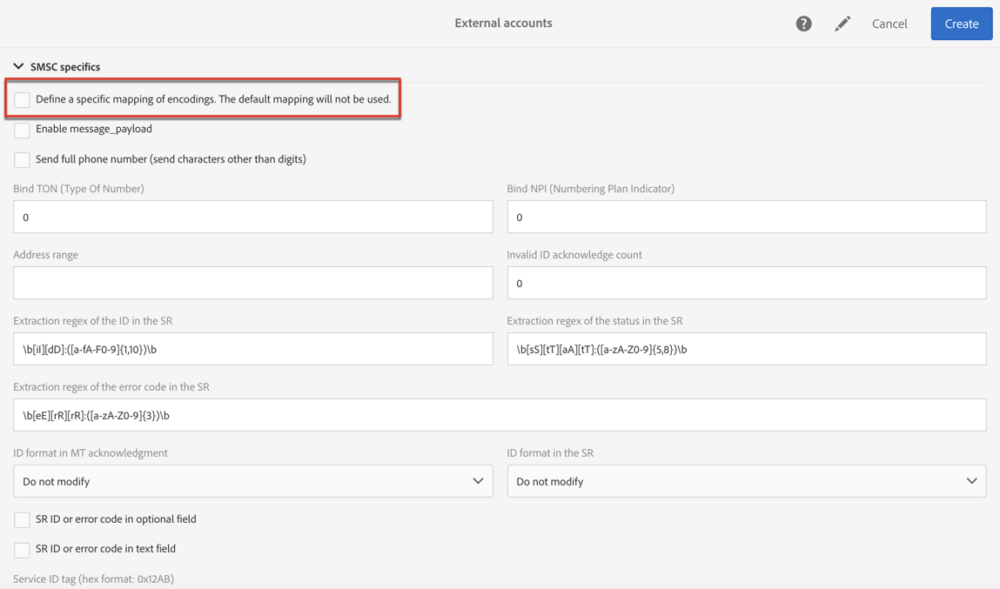

# 配置短信渠道{#configuring-sms-channel}

要发送SMS消息，管理员必须在> > >菜单下配置一个或多 **[!UICONTROL Administration]** 个 **[!UICONTROL Channels]** 外部帐户 **[!UICONTROL SMS]****[!UICONTROL SMS accounts]** 。

创建和修改外部帐户的步骤详见“ [外部帐户](../../administration/using/external-accounts.md) ”。 您将在下面找到特定于外部帐户发送SMS消息的参数。

## 定义SMS路由 {#defining-an-sms-routing}

默认 **[!UICONTROL SMS routing via SMPP]** 情况下提供外部帐户，但添加其他帐户可能会很有用。

如果要使用SMPP协议，还可以创建新外部帐户。 有关SMS协议和设置的详细信息，请参阅此技 [术说明](https://helpx.adobe.com/campaign/kb/sms-connector-protocol-and-settings.html)。

1. 从创建新外部帐户 **[!UICONTROL Administration > Application settings > External accounts]**。
1. 将帐户类型定 **[!UICONTROL Routing]**&#x200B;义为，渠道 **[!UICONTROL Mobile (SMS)]** 为，投放模式定义为 **[!UICONTROL Bulk delivery]**。

   

1. 定义连接设置。

   要输入特定于发送SMS消息的连接设置，请与SMS服务提供商联系，SMS将向您解释如何完成不同的外部帐户字段。

   

   该 **[!UICONTROL Enable TLS over SMPP]** 选项允许您加密SMPP通信。

   **[!UICONTROL Enable verbose SMPP traces in the log file]** 允许您将所有SMPP流量转储到日志文件中。 必须启用此选项才能对连接器进行故障诊断，并与提供者看到的流量进行比较。

1. 联系Adobe,Adobe将根据所选的提供商 **[!UICONTROL SMS-C implementation name]** 为您提供输入字段的值。
1. 定义SMPP渠道设置。 您可以在SMS编码和格 [式部分了解更多](#sms-encoding-and-formats) 。

   如果 **[!UICONTROL Store incoming MO in the database]** 希望将所有传入的SMS存储在inSMS表中，请启用。 有关如何检索传入SMS的详细信息，请参阅此 [部分](../../channels/using/managing-incoming-sms.md#storing-incoming-sms)。

   该 **[!UICONTROL Enable Real-time KPI updates during SR processing]** 选项允 **[!UICONTROL Delivered]** 许在发 **[!UICONTROL Bounces + Errors]** 送投放后实时更新KPI或KPI。 这些KPI可以在窗口中找 **[!UICONTROL Deployment]** 到，并直接从从提供商接收的SR（状态报告）重新计算。

   

1. 定义参 **[!UICONTROL Throughput and timeouts]** 数。

   可以指定每秒MT的出站消息的最大吞吐量（“MT”，已终止移动设备）。 如果在相应字段中输入“0”，吞吐量将无限制。

   需要以秒完成与持续时间对应的所有字段的值。

1. 定义SMS-C特定参数，以备您需要定义特定编码映射时使用。 有关详细信息，请参阅 [SMSC特定信息](#smsc-specifics) 部分。

   如果 **[!UICONTROL Send full phone number (send characters other than digits)]** 您不想遵守SMPP协议并将前缀传输到SMS提供 **[!UICONTROL +]** 商(SMS-C)的服务器，请启用此选项。

   但是，鉴于某些提供者需要使用前 **[!UICONTROL +]** 缀，建议您与提供者进行核对，并建议您在必要时启用此选项。

1. 如果需要，可定义自动回复以根据回复的内容触发操作。 如需详细信息，请参阅[此部分](../../channels/using/managing-incoming-sms.md#managing-stop-sms)。
1. 保存SMS路由外部帐户的配置。

您现在可以使用新路由发送带有Adobe Campaign的SMS消息。

## SMS编码和格式 {#sms-encoding-and-formats}

### SMS编码、长度和音译 {#sms-encoding--length-and-transliteration}

默认情况下，SMS中的字符数符合GSM（全球移动通信系统）标准。

使用GSM编码的SMS消息限于160个字符，或对于多个部分发送的消息，每个SMS限制153个字符。

>[!NOTE]
>
>某些字符计为两个（大括号、方括号、欧元符号等）。 可用GSM字符的列表在“字符 [表- GSM标准”部分介绍](#table-of-characters---gsm-standard) 。

如果您喜欢，可通过选中相应的框来授权字符音译。

音译包括当GSM标准未考虑SMS字符时，用另一个字符替换该字符。

* 如果音译 **被授权**，则在发送消息时，未考虑的每个字符将替换为GSM字符。 例如，字母“ë”被替换为“e”。 因此，消息会稍作更改，但字符限制将保持不变。
* 当音译未 **授权**，包含未考虑的字符的每条消息都以二进制格式(Unicode)发送： 因此，所有字符都按原样发送。 但是，使用Unicode的SMS消息最多限制为70个字符（对于多部分发送的消息，每个SMS限制为67个字符）。 如果超过最大字符数，则会发送多条消息，这可能会产生额外费用。

>[!IMPORTANT]
>
>将个性化字段插入SMS消息内容可能会引入GSM编码未考虑的字符。 个性化SMS消息部分 [提供了内容示例](../../channels/using/personalizing-sms-messages.md) 。

默认情况下，字符音译处于禁用状态。 如果您希望SMS消息中的所有字符都按原样保留，请不要更改正确的名称，例如，我们建议您不启用此选项。

但是，如果SMS消息包含大量生成Unicode消息的字符，则可以选择启用此选项来限制发送消息的成本。

### 字符表- GSM标准 {#table-of-characters---gsm-standard}

本节介绍GSM标准中考虑的字符。 除下面提到的字符外，插入消息正文的所有字符都会将整个消息转换为二进制格式(Unicode)，因此将其限制为70个字符。 有关详细信息，请参阅 [SMS编码、长度和音译](#sms-encoding--length-and-transliteration) 部分。

**基本字符**

<table> 
 <tbody> 
  <tr> 
   <td> @  </td> 
   <td>    </td> 
   <td> SP  </td> 
   <td> 0  </td> 
   <td> ¡  </td> 
   <td> P  </td> 
   <td> ¿  </td> 
   <td> P  </td> 
  </tr> 
  <tr> 
   <td> £  </td> 
   <td> _  </td> 
   <td> !  </td> 
   <td> 1  </td> 
   <td> A  </td> 
   <td> Q  </td> 
   <td> a  </td> 
   <td> q  </td> 
  </tr> 
  <tr> 
   <td> $  </td> 
   <td>    </td> 
   <td> "  </td> 
   <td> 2  </td> 
   <td> B  </td> 
   <td> R  </td> 
   <td> b  </td> 
   <td> r  </td> 
  </tr> 
  <tr> 
   <td> ¥  </td> 
   <td>    </td> 
   <td> #  </td> 
   <td> 3  </td> 
   <td> C  </td> 
   <td> S  </td> 
   <td> c  </td> 
   <td> s  </td> 
  </tr> 
  <tr> 
   <td> è  </td> 
   <td>    </td> 
   <td> ¤  </td> 
   <td> 4  </td> 
   <td> D  </td> 
   <td> T  </td> 
   <td> d  </td> 
   <td> t  </td> 
  </tr> 
  <tr> 
   <td> 埃  </td> 
   <td>    </td> 
   <td> %  </td> 
   <td> 5  </td> 
   <td> E  </td> 
   <td> U  </td> 
   <td> e  </td> 
   <td> u  </td> 
  </tr> 
  <tr> 
   <td> 耶  </td> 
   <td>    </td> 
   <td> &amp;  </td> 
   <td> 6  </td> 
   <td> F  </td> 
   <td> V  </td> 
   <td> f  </td> 
   <td> v  </td> 
  </tr> 
  <tr> 
   <td> 伊  </td> 
   <td>    </td> 
   <td> '  </td> 
   <td> 7  </td> 
   <td> G  </td> 
   <td> W  </td> 
   <td> g  </td> 
   <td> w  </td> 
  </tr> 
  <tr> 
   <td> 奥  </td> 
   <td>    </td> 
   <td> (  </td> 
   <td> 8  </td> 
   <td> H  </td> 
   <td> X  </td> 
   <td> h  </td> 
   <td> x  </td> 
  </tr> 
  <tr> 
   <td> Ç  </td> 
   <td>    </td> 
   <td> )  </td> 
   <td> 9 </td> 
   <td> 我  </td> 
   <td> Y  </td> 
   <td> 我  </td> 
   <td> y  </td> 
  </tr> 
  <tr> 
   <td> LF  </td> 
   <td>    </td> 
   <td> *  </td> 
   <td> :  </td> 
   <td> J  </td> 
   <td> Z  </td> 
   <td> j  </td> 
   <td> z  </td> 
  </tr> 
  <tr> 
   <td> 岛  </td> 
   <td> ESC  </td> 
   <td> +  </td> 
   <td> ;  </td> 
   <td> K  </td> 
   <td> Ä  </td> 
   <td> k  </td> 
   <td> ä  </td> 
  </tr> 
  <tr> 
   <td> 岛  </td> 
   <td> AE  </td> 
   <td> ,  </td> 
   <td> &lt;  </td> 
   <td> L  </td> 
   <td> 厄  </td> 
   <td> l  </td> 
   <td> ö  </td> 
  </tr> 
  <tr> 
   <td> CR  </td> 
   <td> æ  </td> 
   <td> -  </td> 
   <td> = </td> 
   <td> M  </td> 
   <td> Ñ  </td> 
   <td> m  </td> 
   <td> -  </td> 
  </tr> 
  <tr> 
   <td> 奥  </td> 
   <td> ß  </td> 
   <td> .  </td> 
   <td> &gt;  </td> 
   <td> N  </td> 
   <td> 乌  </td> 
   <td> n  </td> 
   <td> 女  </td> 
  </tr> 
  <tr> 
   <td> å  </td> 
   <td> 埃  </td> 
   <td> /  </td> 
   <td> ?  </td> 
   <td> O  </td> 
   <td> §  </td> 
   <td> o  </td> 
   <td> 如  </td> 
  </tr> 
 </tbody> 
</table>

SP: 空间

ESC: 逃生

LF: 线源

CR: 回车

**高级字符（计数两次）**

^ { } [ ~ ] | €

### SMSC特性 {#smsc-specifics}

>[!NOTE]
>
>这些选项允许您调整连接器以使用非标准SMSC（即不完全遵循SMPP 3.4规范）或特定编码要求，并且只应由高级用户配置。

发送SMS消息时，Adobe Campaign可以使用一个或多个文本编码。 每个编码都有其自己的特定字符集，并确定适合SMS消息的字符数。

该 **[!UICONTROL DATA_CODING]** 字段允许Adobe Campaign与使用编码的SMS-C通信。

>[!NOTE]
>
>data_coding值与实际 **使用的编码** 之间的映射是标准化的。 但是，某些SMS-C有自己的具体映射： 在这种情况下，您的 **Adobe Campaign** 管理员需要声明此映射。 请咨询您的提供商，了解更多信息。

该 **[!UICONTROL Define a specific mapping of encodings]** 功能允许您声明 **data_codings** ，并在必要时强制进行编码： 为此，请在表中指定单个编码。

**配置**

* 未检 **[!UICONTROL Define a specific mapping of encodings]** 查该功能时，连接器具有通用行为：

   * 它将尝试使用其分配值data_coding = **0的GSM编码**。
   * 如果GSM编码失败，它将 **使用** UCS2编码，它将值 **data_coding = 8**。

   

* 检查 **[!UICONTROL Define a specific mapping of encodings]** 该功能后，您可以定义要使用的编码以及链接的字 **[!UICONTROL data_coding]** 段值。 Adobe Campaign将尝试在列表中使用第一个编码，如果第一个编码被证明不可能，则使用下面的编码。

   申报顺序很重要： 建议您按成本的升序排 **列列表** ，以便使用编码，在每条SMS消息中尽可能多地显示字符。

   仅声明要使用的编码。 如果SMS-C提供的某些编码与您的使用目的不对应，请不要在列表中声明这些编码。

   

### 自动回复已发送到MO {#automatic-reply-sent-to-the-mo}

当用户档案回复通过活动发送的SMS消息时，您可以配置自动发回给他的消息以及要执行的操作。

有关更多信息，请参见[此部分](../../channels/using/managing-incoming-sms.md)。

## 配置SMS属性 {#configuring-sms-properties}

本节详细介绍SMS列表或SMS模板的属性屏幕中SMS特有的参数的投放。

发送SMS消息的特定参数在部分和 **[!UICONTROL Send]** 部分中重新 **[!UICONTROL Advanced parameters]** 分组。

从部 **[!UICONTROL Advanced parameters]** 分：

* 该 **[!UICONTROL From]** 选项允许您使用字符串个性化SMS消息发送者的名称。 这是将作为收件人移动电话上SMS消息的发送者姓名显示的名称。

   如果此字段为空，则它将是将使用的外部帐户中提供的源编号。 如果未提供源代码，则将使用短代码。 SMS外部帐户的特定投放在定义SMS [路由部分中显示](#defining-an-sms-routing) 。

   

   >[!IMPORTANT]
   >
   >请查看您所在国家／地区有关修改发件人地址的法律。 您还应查看您的SMS服务提供商，看他们是否优惠了此功能。

从SMS **[!UICONTROL Send]** 模板的一节中：

* 该 **[!UICONTROL Maximum number of SMS per message]** 选项允许您定义用于发送消息的SMS消息数。 如果超出此数量，则不会发送消息。

   >[!IMPORTANT]
   >
   >如果已将个性化字段或条件文本插入到SMS消息的内容中，则消息的长度以及因此要发送的SMS消息的数量可能因收件人而异。 有关详细信息，请参阅个性 [化SMS消息部分](../../channels/using/personalizing-sms-messages.md) 。

   

* 该 **[!UICONTROL Transmission mode]** 字段允许您确定SMS消息的投放方法：

   * **[!UICONTROL Saved on SIM card]**: 消息存储在收件人的电话SIM卡上。
   * **[!UICONTROL Saved on mobile]**: 该消息存储在电话的内部存储器中。
   * **[!UICONTROL Flash]**: 消息将作为通知显示在收件人的移动电话上，然后消息会消失而不进行保存。
