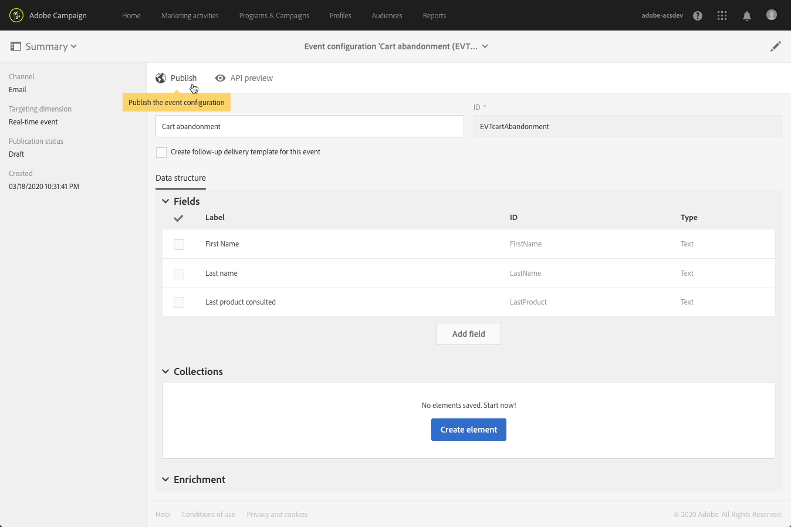

# 配置事务型消息传递{#configuring-transactional-messaging}

要发送带有Adobe Campaign的事务性消息，您首先需要描述事件数据的结构。

事件配置必须由管理 [员按](../../administration/using/users-management.md#functional-administrators) 照以下步骤执行。

>[!NOTE]
>
>配置可能因您要发送的事务性消息类型而异。 有关此功能的详细信息，请参 [阅事务事件特定配置](#transactional-event-specific-configurations)。

事件发布后：

* 将部署网站开发人员将使用的API，并且现在可以发送事务事件。 请 [参阅在网站中集成事件触发](#integrating-the-triggering-of-the-event-in-a-website)。

* 相应的事务性消息会自动创建。 See [Getting started with transactional messaging](../../channels/using/getting-started-with-transactional-msg.md).

## 创建事件 {#creating-an-event}

要开始，请创建与您的需求相对应的事件。

>[!IMPORTANT]
>
>只有具有该角 **[!UICONTROL Administration]** 色并且是组织单位 **[!UICONTROL All]** 的一 [部分的用](../../administration/using/organizational-units.md) 户，才具有创建事件配置的适当权限。

1. 单击左上角的 **[!UICONTROL Adobe Campaign]** 徽标，然后选择 **[!UICONTROL Marketing plans]** > **[!UICONTROL Transactional messages]** > **[!UICONTROL Event configuration]**。
1. 单击 **[!UICONTROL Create]** 按钮。
1. 给 **[!UICONTROL Label]** 事件 **[!UICONTROL ID]** 一个。 字 **[!UICONTROL ID]** 段是必填字段，应以前缀“EVT”开头。 如果您不使用此前缀，则单击后会自动添加该前缀 **[!UICONTROL Create]**。

   

   >[!IMPORTANT]
   >
   >ID不得超过64个字符，包括EVT前缀。

1. 选择将用于发送渠道的事务性消息 **[!UICONTROL Email]**&#x200B;或 **[!UICONTROL Mobile (SMS)]** ( **[!UICONTROL Mobile application]** 推送通知)。

   >[!NOTE]
   >
   >每个事件配置只能使用一个渠道。创建事件后，便无法更改渠道。

1. 选择与所需定位维度配置对应的事件，然后单击 **[!UICONTROL Create]**。

   基于事件的事务性消息目标数据包含在事件本身中，而基于用户档案的事务性消息目标数据包含在Adobe Campaign数据库中。 有关此功能的详细信息，请参 [阅事务事件特定配置](#transactional-event-specific-configurations)。

>[!NOTE]
>
>创建的实时事件数量可能会影响您的平台。 为确保最佳性能，请确保删除不再需要的实时事件。 See [Deleting an event](#deleting-an-event).

## 定义事件属性 {#defining-the-event-attributes}

在部 **[!UICONTROL Fields]** 分中，定义将集成到事件内容中的属性，然后使用这些属性个性化事务性消息。

添加和修改字段的步骤与自定义资源的步 [骤相同](../../developing/using/configuring-the-resource-s-data-structure.md#adding-fields-to-a-resource)。

>[!NOTE]
>
>如果要创建多语言事务性消息，请使用ID定义其他事件属 **[!UICONTROL AC_language]** 性。 这仅适用于事件事务性消息。 发布事件后，编辑多语言事务性消息内容的步骤与编辑多语言标准电子邮件的步骤相同。 See [Creating a multilingual email](../../channels/using/creating-a-multilingual-email.md).

## 定义数据集合 {#defining-data-collections}

您可以向事件内容添加元素集合，每个元素本身都包含多个属性。

此集合可用于交易电子邮件中 [向邮件内容](../../channels/using/event-transactional-messages.md#using-product-listings-in-a-transactional-message) (例如产品列表)添加产品列表，包括价格、参考编号、数量等。 列表的每个产品。

1. In the **[!UICONTROL Collections]** section, click the **[!UICONTROL Create element]** button.

   

1. 为您的集合添加标签和ID。
1. 为事务性消息的每个产品添加要在列表中显示的所有字段。

   在此示例中，我们添加了以下字段：

   

1. 该 **[!UICONTROL Enrichment]** 选项卡允许您丰富集合的每个项目。 这样，您就可以使用Adobe Campaign库或您创建的其他资源中的信息，个性化相应产品列表的元素。

>[!NOTE]
>
>丰富集合元素的步骤与丰富事件一节 [所述相同](#enriching-the-transactional-message-content) 。 请注意，丰富事件不会允许您丰富集合：您需要在部分中向集合本身添加扩充 **[!UICONTROL Collections]** 符。

发布事件和消息后，您将能够在事务性消息中使用此集合。

以下是此示例的API预览:

**相关主题：**

* [预览和发布事件](#previewing-and-publishing-the-event)
* [在事务型消息中使用产品清单](../../channels/using/event-transactional-messages.md#using-product-listings-in-a-transactional-message)

## 丰富事件 {#enriching-the-transactional-message-content}

您可以使用事务性消息库中的信息丰富Adobe Campaign内容，从而个性化您的信息。 例如，从每个收件人的姓氏或CRM ID中，您可以恢复用户档案表中添加的数据（如其地址、出生日期或任何其他自定义字段），以个性化发送给他们的信息。

可以利用来自扩展的信息来丰富事务性消息内容 **[!UICONTROL Profile and services Ext API]**。 有关详细信息，请参 [阅扩展API:发布扩展](../../developing/using/step-2--publish-the-extension.md)

此信息也可以存储在新资源中。 在这种情况下，必须直接或通过其他表 **[!UICONTROL Profile]** 将资 **[!UICONTROL Service]** 源链接到或资源。 例如，在以下配置中，如果资源已链接到资源，则可以使用资源(如 **[!UICONTROL Product]** 产品事务性消息或ID)中的信息来 **[!UICONTROL Product]** 丰富类别内 **[!UICONTROL Profile]** 容。

有关资源创建和发布的详细信息，请参 [阅本页](../../developing/using/key-steps-to-add-a-resource.md)。

1. In the **[!UICONTROL Enrichment]** section, click the **[!UICONTROL Create element]** button.

   

1. 选择要将消息链接到的资源。 在这种情况下，请选择 **[!UICONTROL Profile]** 资源。

   

1. 使用按 **[!UICONTROL Create element]** 钮将某个字段从选定资源链接到您之前添加到事件的某个字段(请参 [阅定义事件属性](#defining-the-event-attributes))。

   

1. 在此示例中，我们将字 **[!UICONTROL Last name]** 段和字 **[!UICONTROL First name]** 段与资源中的相应字段进行调 **[!UICONTROL Profile]** 节。

   

   您还可以使用资源丰富事务性消息 **[!UICONTROL Service]** 内容。 For more on services, see this [section](../../audiences/using/creating-a-service.md).

1. 如果创建或编辑基于用户档案的事件，请 **[!UICONTROL Targeting enrichment]** 在部分中选择将在投放执行过程中用作消息目标的扩充。

   

   >[!NOTE]
   >
   >对于基于扩充的用户档案，必 **[!UICONTROL Profile]** 须根据资源选择定位事件。

发布事件和消息后，此链接将允许您丰富事务性消息的内容。

**相关主题：**

* [预览和发布事件](#previewing-and-publishing-the-event)。
* [个性化事务性消息](../../channels/using/event-transactional-messages.md#personalizing-a-transactional-message)。

## Previewing and publishing the event {#previewing-and-publishing-the-event}

在能够使用事件之前，您必须预览并发布它。

1. 单击 **[!UICONTROL API preview]** 该按钮可查看网站开发人员在发布前将使用的REST API的模拟。 发布事件后，此按钮还允许您在生产中查看API的预览。 请 [参阅在网站中集成事件触发](#integrating-the-triggering-of-the-event-in-a-website)。

   

   >[!NOTE]
   >
   >REST API根据所选渠道和所选定位维度而有所不同。 有关各种配置的更多详细信息，请参 [阅事务事件特定配置](#transactional-event-specific-configurations)。

1. 单击 **[!UICONTROL Publish]** 以开始发布。

   

   将部署网站开发人员将使用的API，并且现在可以发送事务事件。

1. 您可以在相应的选项卡中视图发布日志。

   

   >[!IMPORTANT]
   >
   >每次修改事件时，您必须再次 **[!UICONTROL Publish]** 单击以生成将由网站开发人员使用的更新的REST API。

   事件发布后，将自动创建链接到新事件的事务性消息。

1. 您可以通过左侧区域的链接直接访问此事务性消息。

   

要使事件触发发送事务性消息，您必须修改并发布刚创建的消息。 请参阅[事件事务型消息](../../channels/using/event-transactional-messages.md)。

您还必须将此触发事件集成到您的网站中。 请 [参阅在网站中集成事件触发](#integrating-the-triggering-of-the-event-in-a-website)。

Adobe Campaign开始收到与此事件配置相关的事件后， **[!UICONTROL Latest transactional events]** 部分下的链 **[!UICONTROL History]** 接即可访问第三方服务发送并由Adobe Campaign处理的最新事件。

事件（JSON格式）从最新到最旧列出。 此列表允许您检查事件的内容或状态等数据，以便进行控制和调试。

### 取消发布事件 {#unpublishing-an-event}

通 **[!UICONTROL Unpublish]** 过该按钮可以取消事件的发布，该发布从REST API中删除与您先前创建的事件对应的资源。 现在，即使是通过您的网站触发了事件，也不再发送相应的消息，也不会将消息存储在数据库中。

>[!NOTE]
>
>如果您已发布相应的事务性消息，则事务性消息发布也会被取消。 See [Unpublishing a transactional message](../../channels/using/event-transactional-messages.md#unpublishing-a-transactional-message).

单击该 **[!UICONTROL Publish]** 按钮以生成新的REST API。

### 事务型消息传递发布流程 {#transactional-messaging-pub-process}

下图说明了事务型消息传递的发布流程。

有关发布、暂停和取消发布事务性消息的详细信息，请参 [阅此部分](../../channels/using/event-transactional-messages.md#publishing-a-transactional-message)。

### 删除事件 {#deleting-an-event}

事件取消发布后，或者事件尚未发布后，您可以从事件配置列表中删除该。 操作步骤：

1. 单击左上角的 **[!UICONTROL Adobe Campaign]** 徽标，然后选择 **[!UICONTROL Marketing plans]** > **[!UICONTROL Transactional messages]** > **[!UICONTROL Event configuration]**。
1. 将鼠标悬停在所选事件配置上，然后选择按 **[!UICONTROL Delete element]** 钮。

   

   >[!NOTE]
   >
   >Make sure the event configuration has the **[!UICONTROL Draft]** status, otherwise you will not be able to delete it. The **[!UICONTROL Draft]** status applies to an event that has not been published yet or that has been [unpublished](#unpublishing-an-event).

1. 单击 **[!UICONTROL Confirm]** 按钮。

   

>[!IMPORTANT]
>
>删除已发布且已使用的事件配置也会删除相应的事务性消息及其发送和跟踪日志。

## 搜索事务事件 {#searching-transactional-events}

要访问和搜索已创建的事务事件，请按照以下步骤操作。

1. 单击左上角的 **[!UICONTROL Adobe Campaign]** 徽标，然后选择 **[!UICONTROL Marketing plans]** > **[!UICONTROL Transactional messages]** > **[!UICONTROL Event configuration]**。
1. 单击 **[!UICONTROL Show search]** 按钮。

   

1. 您可以在上筛选 **[!UICONTROL Publication status]**。 这允许您仅显示已发布的事件（例如）。
1. 您还可以使用筛选事件 **[!UICONTROL Last event received]**。 例如，如果输入10，则只显示上次事件在10天前或更久之前收到的事件配置。 这样，您就可以显示在给定期间中哪些事件处于非活动状态。

   

   >[!NOTE]
   >
   >默认值为0。 随后将显示所有事件。

## 在网站中集成事件触发 {#integrating-the-triggering-of-the-event-in-a-website}

创建事件后，您必须将触发此事件的操作集成到您的网站中。

在Transactional messaging操作原则部分 [中描述的示例中](../../channels/using/getting-started-with-transactional-msg.md#transactional-messaging-operating-principle) ，您希望当您的客户之一在购买购物车中的产品之前离开您的网站时，触发“购物车废弃”事件。 为此，您的网站Web开发人员必须使用Adobe Campaign StandardREST API。

请参阅 [REST API文档](../../api/using/managing-transactional-messages.md)。

## 交易事件特定配置 {#transactional-event-specific-configurations}

事务事件配置可能因您要发送的事务性消息类型(事件或用户档案)以及将使用的渠道而异。

以下各节详细介绍了根据所需事务性消息应设置哪些特定配置。 有关配置事件的一般步骤的详细信息，请参 [阅创建事件](#creating-an-event)。

### Event-based transactional messages {#event-based-transactional-messages}

要发送基于事件的事务性消息，您首先需要创建和配置一个事件，以事件本身包含的数据为目标。
有关详细信息，请参 [阅使用交易消息](https://helpx.adobe.com/cn/campaign/kb/simplify-campaign-management.html#Managedatatofuelengagingexperiences)。

1. 创建事件配置时，选择 **[!UICONTROL Real-time event]** 定位维度(请 [参阅创建事件](#creating-an-event))。
1. 为事件添加字段，以便能够个性化事务性消息(请参 [阅定义事件属性](#defining-the-event-attributes))。
1. 如果要使用事务性消息数据库中的其他信息，可以丰富Adobe Campaign内容(请参 [阅丰富事务性消息内容](#enriching-the-transactional-message-content))。

   >[!NOTE]
   >
   >基于事件的事务型消息，应仅使用已发送事件中的数据来定义收件人和个性化消息内容。但是，您也可以使用 Adobe Campaign 数据库中的信息扩充事务型消息的内容。

1. 预览并发布事件(请 [参阅预览和发布事件](#previewing-and-publishing-the-event))。

   预览事件时，REST API包含一个属性，该属性根据所选渠道指定电子邮件地址或移动电话。

   事件发布后，将自动创建链接到新事件的事务性消息。 要使事件触发发送事务性消息，您必须修改并发布刚创建的消息，请参阅 [事件事务性消息](../../channels/using/event-transactional-messages.md)。

1. 将事件集成到您的网站(请 [参阅将事件的触发集成到网站](#integrating-the-triggering-of-the-event-in-a-website))。

### Profile-based transactional messages {#profile-based-transactional-messages}

要发送基于用户档案的事务性消息，您首先需要创建和配置Adobe Campaign数据库中包含的事件定位数据。

1. 创建事件配置时，选择 **[!UICONTROL Profile event]** 定位维度(请 [参阅创建事件](#creating-an-event))。
1. 为事件添加字段，以便能够个性化事务性消息(请参 [阅定义事件属性](#defining-the-event-attributes))。 必须至少添加一个字段才能创建扩充。 您无需创建其他字段 **(如名** 、 **姓** )，因为您将能够使用Adobe Campaign数据库中的个性化字段。
1. 创建扩充以将事件链接到资源(请 **[!UICONTROL Profile]** 参阅丰 [富事务性消息内容](#enriching-the-transactional-message-content))。 使用扩充时，必须创建定位维度 **[!UICONTROL Profile]** 。
1. 预览并发布事件(请 [参阅预览和发布事件](#previewing-and-publishing-the-event))。

   预览事件时，REST API不包含指定从资源检索电子邮件地址或移动电话的属 **[!UICONTROL Profile]** 性。

   事件发布后，将自动创建链接到新事件的事务性消息。 要使事件触发发送事务性消息，您必须修改并发布刚创建的消息，请参阅 [发送用户档案事务性消息](../../channels/using/profile-transactional-messages.md#sending-a-profile-transactional-message)。

1. 将事件集成到您的网站(请 [参阅将事件的触发集成到网站](#integrating-the-triggering-of-the-event-in-a-website))。

### 基于事件的交易推送通知 {#event-based-transactional-push-notifications}

要能够发送事务推送通知，您需要相应地配置Adobe Campaign。 请参阅 [推送配置](https://helpx.adobe.com/cn/campaign/kb/configuring-app-sdkv4.html)。

要向已选择接收移动应用程序通知的所有用户发送匿名交易推送通知，您首先需要创建并配置一个事件，以事件本身包含的数据为目标。 相应步骤如下。

事件必须包含以下三个元素：

* 注 **册令牌**，它是一个移动应用程序和一个设备的用户ID。 它可能不与来自用户档案库的任何Adobe Campaign对应。
* 移 **动应用程序名称** （所有设备均使用一个名称- Android和iOS）。 这是在Adobe Campaign中配置的用于在用户设备上接收推送通知的移动应用程序的ID。 For more on this, refer to this [page](https://helpx.adobe.com/cn/campaign/kb/configuring-app-sdkv4.html)
* 推 **送平台** （Android为“gcm”,iOS为“apns”）。

1. 创建事件配置时，选择 **[!UICONTROL Mobile application]** 渠道和定位维度 **[!UICONTROL Real-time event]** (请 [参阅创建事件](#creating-an-event))。
1. 为事件添加字段，以便能够个性化事务性消息(请参 [阅定义事件属性](#defining-the-event-attributes))。
1. 如果要使用事务性消息数据库中的其他信息，可以丰富Adobe Campaign内容(请参 [阅丰富事务性消息内容](#enriching-the-transactional-message-content))。

   >[!NOTE]
   >
   >基于事件的事务型消息，应仅使用已发送事件中的数据来定义收件人和个性化消息内容。但是，您也可以使用 Adobe Campaign 数据库中的信息扩充事务型消息的内容。

1. 预览并发布事件(请 [参阅预览和发布事件](#previewing-and-publishing-the-event))。

   预览事件时，REST API包含将用于目标投放的“registrationToken”、“application”和“pushPlatform”属性。

   

   事件发布后，将自动创建链接到新事件的事务推送通知。 要修改和发布刚刚创建的消息，请参 [阅发送面向事件的事务推送通知](../../channels/using/transactional-push-notifications.md#transactional-push-notifications-targeting-an-event)。

1. 将事件集成到您的网站(请 [参阅将事件的触发集成到网站](#integrating-the-triggering-of-the-event-in-a-website))。

### 基于用户档案的交易推送通知 {#profile-based-transactional-push-notifications}

要向订阅了您的移动应用程序的Adobe Campaign用户档案发送事务推送通知，您首先需要创建并配置一个针对Adobe Campaign数据库的事件。

1. 创建事件配置时，选择 **[!UICONTROL Mobile application]** 渠道和定位维度 **[!UICONTROL Profile]** (请 [参阅创建事件](#creating-an-event))。

   默认情况下，事务推送通知将发送给收件人订阅的所有移动应用程序。 要将推送通知发送到特定移动应用程序，请在列表中选择它。 消息将瞄准其他移动应用程序，但将从发送中排除。

   

1. 如果要个性化事件，请向事务性消息添加字段(请参 [阅定义事件属性](#defining-the-event-attributes))。

   >[!NOTE]
   >
   >必须至少添加一个字段才能创建扩充。 您无需创建其他字段 **(如名** 、 **姓** )，因为您将能够使用Adobe Campaign数据库中的个性化字段。

1. 创建扩充以将事件链接到资源(请 **[!UICONTROL Profile]** 参阅丰 [富事务性消息内容](#enriching-the-transactional-message-content))。 使用扩充时，必须创建定位维度 **[!UICONTROL Profile]** 。
1. 预览并发布事件(请 [参阅预览和发布事件](#previewing-and-publishing-the-event))。

   预览事件时，REST API不包含指定注册令牌、应用程序名称和推送平台的属性，就像从资源检索它们一样 **[!UICONTROL Profile]** 。

   事件发布后，将自动创建链接到新事件的事务推送通知。 要修改和发布刚刚创建的消息，请参 [阅发送面向用户档案的事务推送通知](../../channels/using/transactional-push-notifications.md#transactional-push-notifications-targeting-a-profile)。

1. 将事件集成到您的网站(请 [参阅将事件的触发集成到网站](#integrating-the-triggering-of-the-event-in-a-website))。

### 配置事件以发送跟进消息 {#configuring-an-event-to-send-a-follow-up-message}

后续消息是预定义的营销投放模板，可在工作流中用于向特定事务性消息的收件人发送消息。 For more on this, see [Follow-up messages](../../channels/using/follow-up-messages.md).

1. 使用您创建的事件配置发送事件事务性消息。 See [Event-based transactional messages](#event-based-transactional-messages).
1. 配置事件时，请在发 **[!UICONTROL Create follow-up delivery template for this event]** 布事件前选中复选框。

   

1. 预览并发布事件(请 [参阅预览和发布事件](#previewing-and-publishing-the-event))。

   发布事件后，将自动创建链接到新事件的事务性消息和后续投放模板。 有关使用跟进消息的详细信息， [请参阅发送跟进消息](../../channels/using/follow-up-messages.md#sending-a-follow-up-message)。

## 用例：配置事件以发送事务性消息 {#use-case--configuring-an-event-to-send-a-transactional-message}

在此示例中，我们要配置一个事件，以便在我们网站上的每次购买后，在满足以下先决条件的情况下发送确认消息：

当我们要通过其CRM ID识别我们的客户端时，首先确保已 **[!UICONTROL Profile]** 使用此新字段扩展了资源。

同样，必须已创建并发布与购买对应的自定义资源，并且必须将其链接到该 **[!UICONTROL Profile]** 资源。 这样，您将能够从此资源检索信息以丰富消息内容。

有关资源创建和发布的详细信息，请参 [阅本页](../../developing/using/key-steps-to-add-a-resource.md)。

1. 使用事件和渠道 **[!UICONTROL Email]** 创建新定位维度 **[!UICONTROL Profile]** (请参 [阅创建事件](#creating-an-event))。
1. 定义可用于个性化事务性消息的属性。 在本例中，添加“CRM ID”和“产品标识符”字段(请参 [阅定义事件属性](#defining-the-event-attributes))。

   

1. 要使用有关客户先前购买的信息丰富消息内容，请创建一个扩充以资 **[!UICONTROL Purchase]** 源为目标(请 [参阅丰富事务性消息内容](#enriching-the-transactional-message-content))。

   

1. 在以前添加到消息的“产品标识符”字段与资源中的相应字段之间创建连接条 **[!UICONTROL Purchase]** 件。

   

1. 预览并发布事件(请 [参阅预览和发布事件](#previewing-and-publishing-the-event))。
1. 在网站中集成事件(请 [参阅在网站中集成事件的触发](#integrating-the-triggering-of-the-event-in-a-website))。

