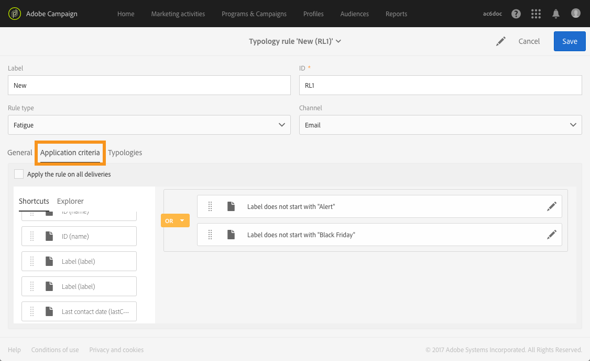
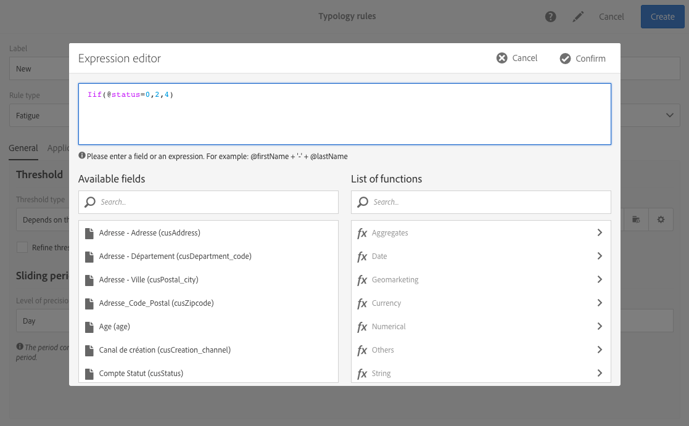

# 疲劳规则{#fatigue-rules}

## 关于疲劳规则 {#about-fatigue-rules}

疲劳规则允许营销人员制定全局跨渠道业务规则，这些规则会自动将主动提供的档案排除在营销活动中。

要实施疲劳规则，您可以为每个配置文件定义最大消息数，并选择规则适用的期限。在交付准备过程中，将根据发送给他们的消息数量，将配置文件排除在交付中(如果适用)。

>[!NOTE]
>
>要使疲劳规则生效，您需要定义传送的联系日期。如果您选择立即发送消息，则不会应用疲劳规则。

相关主题：

* [准备工作](../../administration/using/configuring-email-channel.md#preparation)
* [管理字节数](../../administration/using/about-typology-rules.md#managing-typologies)
* [Typology规则](../../administration/using/about-typology-rules.md#typology-rules)

## 创建疲劳规则 {#creating-a-fatigue-rule}

要创建和配置 **[!UICONTROL Fatigue]** 字型规则，请应用以下步骤：

1. 单击界面左上角的Adobe Campaign徽标，然后选择 **[!UICONTROL Administration]** &gt; **[!UICONTROL Channels]** &gt; **[!UICONTROL Typologies]** &gt; **[!UICONTROL Typology rules]**。

   

1. 从字型规则列表中，单击 **[!UICONTROL Create]**。

   

1. 在 **[!UICONTROL Rule type]** 字段中，选择 **[!UICONTROL Fatigue]**。

   

1. 在 **[!UICONTROL Channel]** 字段中，选择规则适用的渠道。您可以选择单个渠道(电子邮件、短信、直接邮件、移动应用程序) **[!UICONTROL All channels]**&#x200B;或选择。请参阅 [选择渠道](../../administration/using/fatigue-rules.md#choosing-the-channel)。

   

1. **[!UICONTROL General]** 在选项卡中，定义用于计算每个配置文件的最大消息数的方法。您可以选择恒定阈值或变量。您还可以调整配置文件和交付的阈值。有关此操作的详细信息，请参阅 [定义阈值](../../administration/using/fatigue-rules.md#defining-the-threshold)。

   

1. 选择将应用字型规则的一个 **[!UICONTROL Sliding period]** 。有关此操作的详细信息，请参阅 [设置滑动期](../../administration/using/fatigue-rules.md#setting-the-sliding-period)。

   

   在此示例中(请参阅上一个屏幕截图)，我们选择在15天的滑动期内发送最大数量的消息。

1. **[!UICONTROL Application criteria]** 在选项卡中，您可以选择将此规则应用于所有交付，或根据要发送的消息限制规则适用性。仅在满足应用程序条件时才执行该规则。例如，只能在消息上使用以给定单词开头的标记或包含特定字母的ID对消息应用规则。请参阅 [限制过滤规则的适用性](../../administration/using/filtering-rules.md#restricting-the-applicability-of-a-filtering-rule)。

   

1. 选择 **[!UICONTROL Typologies]** 选项卡，将您的字型规则链接到用于提交的字型。请参阅 [管理字节数](../../administration/using/about-typology-rules.md#managing-typologies) 和 [Typology规则](../../administration/using/about-typology-rules.md#typology-rules)。

   

   >[!NOTE]
   >
   >可在交付模板中定义字节数，以自动应用于使用此模板创建的所有递送。

在交付准备过程中，将根据已经发送给他们的交付数量，将配置文件排除在交付中(如果适用)。您可以在交付日志中查看疲劳规则执行结果。请参阅 [查看疲劳结果](../../administration/using/fatigue-rules.md#viewing-the-fatigue-results)。

>[!CAUTION]
>
>要使疲劳规则正常工作，您需要为传送定义联系日期。如果您选择立即发送消息，则不会应用疲劳规则。

## 选择渠道 {#choosing-the-channel}

疲劳规则适用于各种渠道。渠道是在字型规则设置 **[!UICONTROL Channel]** 的字段中定义的。您可以选择单个渠道或选择 **[!UICONTROL All channels]**&#x200B;单个渠道。

**可用渠道**

提供以下频道：

* 电子邮件
* 移动(SMS)
* 直邮
* 移动应用程序：此渠道允许您向配置文件或应用程序订阅者发送推送通知。如果选择向配置文件发送通知，它们将与多通道疲劳规则兼容。

   >[!CAUTION]
   >
   >疲劳规则与发送给应用程序订阅者的推送通知不兼容。如果要向应用程序用户发送消息，疲劳规则将不适用。

* 所有渠道：此选项允许您将规则应用于所有渠道。例如，您可以决定在任何渠道上每月发送最多个消息。如果您上周向某个配置文件发送了个电子邮件，并且您尝试立即发送推送通知，则将排除同一配置文件。

**交付类型**

疲劳规则与所有交付类型兼容：一键式交付、重复交付、工作流交付和交易消息。

**交易消息可** 用于发送面向事件(RTEvent)和营销消息(定位配置文件)的服务消息，例如再营销消息。疲劳规则仅与营销消息(定位档案)兼容。活动交易消息不包含配置文件信息，因此它们与疲劳规则不兼容(即使是使用配置文件进行丰富的情况)。借助交易消息中的营销消息支持，您可以 **对所有渠道(包括营销交易消息**)应用疲劳规则。

## 定义阈值 {#defining-the-threshold}

每个疲劳规则定义一个阈值，即可在给定时间段内将消息发送到一个配置文件的最大消息数。达到此阈值后，直到结束期限结束后，才会再进行分发。此过程允许您在消息超出设置阈值时自动将配置文件排除在发送中，从而避免过度征求请求。

阈值可为常数或变量。这意味着在特定时间段内，阈值可能因一个配置文件而异，甚至可能因同一个配置文件而异。

**使用修复阈值**

阈值表示在相关时间段内可向配置文件发送的最多消息数。

默认情况下，阈值是常数，您需要指示规则授权的最大消息数。

**使用变量阈值**

要定义变量阈值，请选择字段 **[!UICONTROL Depends on the recipient]** 中的 **[!UICONTROL Threshold type]** 值。

然后有两个选项：

* 选择配置文件字段：根据选定的字段，阈值将因每个配置文件而异。例如，如果您已将配置文件资源扩展为“通信频率”字段，请单击该 **[!UICONTROL Threshold computation formula]** 字段右侧的按钮并选择您的字段。对于每个配置文件，阈值将取“通信频率”字段的值。

   

* 定义公式：单击 **[!UICONTROL Threshold computation formula]** 字段右侧的第二个按钮以定义高级阈值计算公式。例如，您可以根据配置文件所属的区段对授权消息的数量进行索引。这意味着属于“Web”区段的配置文件可能会收到比其他配置文件更多的消息。**[!UICONTROL Iif (@origin='Web', 5, 3)]** 类型公式授权向Web区段的配置文件发送个消息，并为其他区段提供3条消息。

   

**改进配置文件和交付的阈值**

默认情况下，将考虑所有消息以进行阈值计算。选中 **[!UICONTROL Refine Threshold on profiles and deliveries]** 此框可过滤配置文件和提交内容以在准备分发时计数。

在以下示例中，只有男性配置文件被计数，并且只有从 **新闻稿** 开始的标签才会计数。

在传送过程中细化阈值与限制整个规则( **[!UICONTROL Application criteria]** 选项卡)的适用性不同：

* **[!UICONTROL Application criteria]**：您可以根据特定条件选择执行规则。例如，如果您的应用程序条件是“标签以新闻稿开头”，则该规则仅适用于尊重此条件的交付。如果交付的标签以“促销”开头，则该规则根本不会执行。
* **[!UICONTROL Refine threshold on profiles and deliveries > Deliveries to count]**：所有使用此字型规则的交付将执行规则，但您决定在过去和计划提交中要计算的内容。例如，如果您的限制是“标签以新闻稿开头”，则即使传送标签以“促销”开头，也会执行该规则。在选定的滑动期内，它将计算其标签以“新闻稿”开头的交付次数。

## 设置滑动时间 {#setting-the-sliding-period}

疲劳规则定义在n天的滚动期内。此期限在 **[!UICONTROL Sliding period]** 部分中进行配置，例如周、天或小时。

执行该规则后，将考虑过去交付和计划交付。这保证在给定的滑动期间，从不超出阈值。

例如，如果您定义了48小时的期限，系统将在联系日期 **** 前48小时和联系日期后48小时 **内查看系统**。因此，选定的期限增加了一倍，以支持未来交付及之前的分发。

要将考虑到的交付限制为周期，请在“滑动期限”部分输入 **天** 和 **周****或** 周。提交日期在交付日期之前天之前发送，并计划在计算出规则的交付日期后的天内计入计算中。

## 查看疲劳结果 {#viewing-the-fatigue-results}

在交付准备过程中，将根据已经发送给他们的交付数量，将配置文件排除在交付中(如果适用)。要查看疲劳规则执行结果，请单击 **[!UICONTROL Deployment]** 块右下角的按钮。

提供三个选项卡，其中显示疲劳执行结果的详细信息，包括应用的规则名称：

* 交付日志：

   

* 排除日志：

   

* 排除原因：

   

## 查看疲劳规则摘要报告 {#viewing-the-fatigue-rule-summary-report}

Adobe Campaign提供关于疲劳规则的专用报告，可帮助您了解如何应用于您的营销活动。这使您能够了解营销活动如何相互影响，并做出适当调整。

**[!UICONTROL Fatigue rules summary]** 可从按钮的 **[!UICONTROL Reports]** 右上角、每个程序、营销活动和消息的右上角访问报告。

在屏幕左侧，您可以过滤传送的联系日期报告数据。默认情况下，选定的期限在当前日期前15天开始，并在结束15天后结束。您还可以过滤特定疲劳规则。

饼图在选定的时间段内显示以下信息：

* **[!UICONTROL Total targeted]**：准备消息之前的总目标
* **[!UICONTROL Excluded]**：疲劳规则应用程序的排除总数
* **[!UICONTROL Other exclusions]**：其他类型规则的排除总数
* **[!UICONTROL To deliver]**：消息准备后发送的消息总数( **[!UICONTROL To deliver]** = **[!UICONTROL Total targeted]** - **[!UICONTROL Excluded]** - **[!UICONTROL Other exclusions]** )

您将在图表右侧找到排除，按疲劳规则划分。

底部表格显示选定时间段内的所有分发。对于每个交付，您可以看到适用的疲劳规则和相应的排除情况。没有联系日期的交付也会显示在表格中。

* **[!UICONTROL 0]** 表示疲劳规则已应用，但没有排除。
* **[!UICONTROL -N]** 表示已发生N排除。
* 空字段表示疲劳规则不适用。

>[!NOTE]
>
>显示的数据与您访问该报告的计划、消息或营销活动不相关。此报告显示所有组织单位的所有疲劳规则和交付。这使您能够获得所有分发的全局视图，以了解营销活动对其他人的影响。

## 示例 {#examples}

疲劳管理实施方面有许多可能。以下是您可以执行的一些操作示例：

* 使用适用于所有渠道的 **恒定阈值** 创建 **疲劳规则**：

   假设您创建多通道规则，在天的滑动期内持续阈值为3。

   上周，您的高级档案收到了促销电子邮件和交易再营销电子邮件。您还计划了下星期发送的SMS。现在，您决定发送针对所有配置文件的推送通知。高级配置文件将从今天的推送中排除，因为已经达到了两周的最大消息数。

   

* 使用基于配置文件字段 **的变量阈值** 创建 **疲劳规则**：

   您已经使用“通信限制”字段扩展了配置文件资源，为每个配置文件定义了不同的阈值。在疲劳规则中，根据此字段定义一个可变阈值，并选择天的滑动时间。让我们举两个档案示例：John的通信限制为1，David的阈值为2。两人昨天都已收到新闻稿电子邮件。您决定立即发送其他电子邮件。只有David才会收到它，因为John已经从目标中排除。

   

* 使用 **阈值计算公式创建疲劳规则**：

   您希望根据配置文件的年龄更改阈值。如果配置文件小于40，则您要定义限制4，对于旧配置文件则为限制2。您可以在疲劳规则中直接创建公式，以根据配置文件的年龄计算阈值，而不是为每个配置文件定义此阈值。在我们的示例中，该公式 **[!UICONTROL Iif (@age<40, 4, 2)]**&#x200B;将为。

   

   >[!NOTE]
   >
   >本节还包含使用阈值计算公式的疲劳规则分步示例。

* 创建一个疲劳规则 **，它细化配置文件和交付** 的阈值：

   您已将配置文件资源扩展为“分数”字段，并且您还将传送资源带到“类型”字段。您希望定义一个持续的阈值，但要从“警报”或“黑色星期五”类型的所有传送中排除所有的传送，并且所有档案的分数大于10。执行该规则时，将在过去和计划交付中计数，所有不属于“警报”或“黑色星期五”的交付均将发送至其得分小于10的档案。

   

以下是使用阈值计算公式的疲劳规则的分步示例。

在此用例中，我们希望创建一条规则规则，以防止每周向付费档案发送超过两条消息，每周向标准档案发送2条消息。

为了识别客户和潜在客户，我们使用字段扩展了档案资源， **[!UICONTROL Status]** 该字段包含对高级档案的0，对于标准档案则为1。

要创建规则，请应用以下步骤：

1. 创建 **新的疲劳** 类型类型规则。
1. **[!UICONTROL Threshold]** 在部分中，我们希望根据每个配置文件创建一个计算阈值的公式。选择字段 **[!UICONTROL Depends on the recipient]** 中的 **[!UICONTROL Threshold type]** 值，然后单击 **[!UICONTROL Threshold computation formula]** 字段右侧第二个按钮的图标。

   

1. **[!UICONTROL List of functions]** 在部分中，双击节点中的 **if** 函数 **[!UICONTROL Others]** 。

   

1. 然后，在章节中选择配置文件 **的状态****[!UICONTROL Available fields]** 。

   

1. 输入所需的值以创建以下公式： **if(@ status=0,2,4)**

   

   此公式允许您在状态等于0时为值赋值，并为所有其他状态赋予值4。

1. 单击 **[!UICONTROL Confirm]** 以批准公式。
1. 指示规则将应用的 **[!UICONTROL Sliding period]** 内容：天内，将考虑到的交付限制为周期。

   

1. 现在，将刚刚创建的规则链接到字体，以便将其应用于提交内容。为此，请选择 **[!UICONTROL Typologies]** 选项卡，单击 **[!UICONTROL Create element]** 并选择用于提交的字型。

   

1. 保存规则以批准创建。

该规则将应用于基于字型的所有交付。
