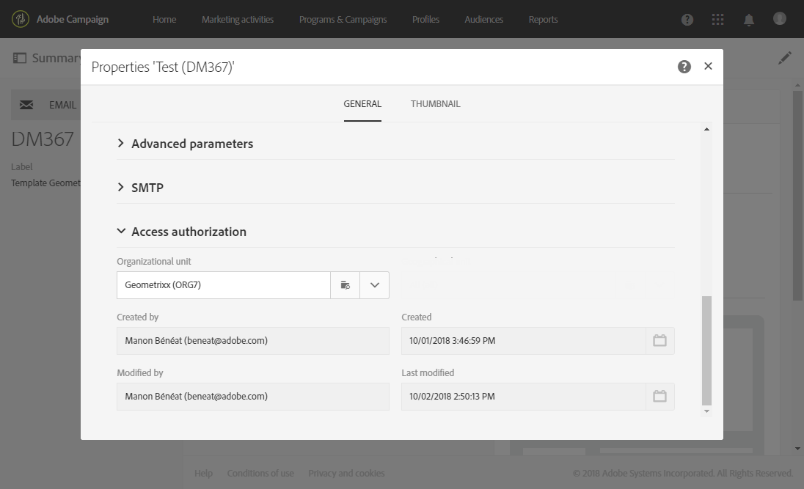

# 组织实体{#organizational-units}

## 关于件数 {#about-units}

平台的每个对象和用户都链接到组织单位。 该单元允许定义分层结构，以便给用户一个过滤的视图。 用户单元为不同的平台对象定义其访问级别。

>[!IMPORTANT]
>
>如果用户未链接到任何设备，则该用户将无法连接到Adobe Campaign。 如果要限制特定用户或用户组的访问，请勿将其链接到&#x200B;**[!UICONTROL All]**&#x200B;设备。 我们建议在导入任何用户档案之前，添加选项&#x200B;**访问授权管理字段**。 有关更多信息，请参阅此](../../administration/using/organizational-units.md#partitioning-profiles)章节[。
>
>默认情况下，**[!UICONTROL All (all)]** 组织单位被分配给 **[!UICONTROL Administrators]** 安全组。该项为只读项，无法修改。

用户对父单元中的所有对象具有只读访问权限。 他有权读取和写入其单位和儿童单位的所有物品。 用户无权访问并行分支中的对象。

默认情况下，只有&#x200B;**[!UICONTROL All]**&#x200B;单位可用。

为用户分配组织单位后，此单位将始终应用于用户创建的对象。

>[!NOTE]
>
>当用户位于链接到不同单位的多个组中时，将应用某些规则。 有关更多信息，请参阅[管理组和用户](../../administration/using/managing-groups-and-users.md)一节。

## 创建和管理单位 {#creating-and-managing-units}

组织单位允许您根据用户所链接的组织来筛选实例。 此单位可以表示实例中的地区、国家/地区，甚至是品牌。

在此，我们之前创建了对两个用户具有不同角色的安全组：为一个用户分配了安全组管理员和Geometrixx，而另一个用户属于安全组标准用户和Geometrixx服装。有关完整示例，请参阅[创建安全组和分配用户](../../administration/using/managing-groups-and-users.md#creating-a-security-group-and-assigning-users) 。

我们现在需要为Geometrixx服装和Geometrixx安全组创建组织单位：

1. 从Adobe营销活动高级菜单中，选择&#x200B;**[!UICONTROL Administration]** > **[!UICONTROL Users & security]** > **[!UICONTROL Organizational units]**。
1. 单击&#x200B;**[!UICONTROL Create]**&#x200B;开始配置组织单位。

   

1. 将默认的&#x200B;**[!UICONTROL Label]**&#x200B;和&#x200B;**[!UICONTROL ID]**&#x200B;更改为Geometrixx。
1. 然后，将此单元链接到父单元。 在本例中，我们选择了&#x200B;**[!UICONTROL All]**。

   

1. 最后，单击&#x200B;**[!UICONTROL Create]**&#x200B;开始将新组织单位分配给安全组。
1. 对“Geometrixx服装”单元遵循相同的步骤，但其父单元必须是先前创建的单元“Geometrixx”。

   

为了了解将不同设备分配给不同安全组的影响，分配给管理员和Geometrixx组的用户将创建两个电子邮件模板，以查看分配给标准用户和Geometrixx服装的其他用户可以访问或无法访问哪些内容。

1. 从高级菜单中，选择&#x200B;**[!UICONTROL Resources]** > **[!UICONTROL Templates]** > **[!UICONTROL Delivery Templates]**。
1. 复制现有模板并根据需要对其进行个性化。 有关更多信息，请参阅[关于模板](../../start/using/marketing-activity-templates.md)一节。
1. 创建模板后，选择&#x200B;**[!UICONTROL Edit properties]**&#x200B;图标以为模板分配设备。

   

1. 在&#x200B;**[!UICONTROL Access authorization]**&#x200B;下拉菜单中，选择组织单位。

   下面我们将使用之前创建的组织单位Geometrixx创建一个模板。

   

1. 按照相同的步骤创建分配给之前创建的Geometrixx服装组织单位的第二个模板。

分配给标准用户和Geometrixx服装组的用户将能够看到这两个模板。 由于组织单位的分层结构，他将具有对链接到Geometrixx服装单位的模板的读写权限，以及对链接到Geometrixx单位的模板的只读访问权限。

由于Geometrixx服装单元是Geometrixx的子单元，因此当用户尝试修改Geometrixx模板时，会显示以下消息：

组织单位可以限制对不同功能（如用户档案）的访问。 例如，如果我们的Geometrixx服装用户访问&#x200B;**[!UICONTROL Profiles]**&#x200B;选项卡，他将能够使用Geometrixx服装组织单位完全访问和修改用户档案。

虽然具有Geometrixx组织单位的用户档案将为只读，但如果用户尝试修改一个用户档案，则会显示以下错误：**[!UICONTROL You do not have the rights needed to modify the 'profile' resource of ID]**。

## 划分用户档案 {#partitioning-profiles}

>[!IMPORTANT]
>
>我们建议在导入任何用户档案之前添加此选项，因为用户无法访问没有组织单位的用户档案。
>
>如果已导入客户数据库，则需要进行更新，才能在已导入的用户档案中设置组织单位值。

如果贵组织需要隔离每个不同品牌联系的用户档案，则可以按其组织单位对用户档案进行分区。

默认情况下，您的用户档案上不提供组织单位字段，需要添加这些字段。

1. 从高级菜单中，通过Adobe Campaign徽标，选择&#x200B;**管理>开发>自定义资源**。
1. 选择&#x200B;**配置文件**&#x200B;或创建新的自定义资源以扩展配置文件。 有关如何扩展用户档案的更多信息，请参阅此[page](../../developing/using/extending-the-profile-resource-with-a-new-field.md#step-1--extend-the-profile-resource)。
1. 选中&#x200B;**Add access authorization management fields**&#x200B;框，以在&#x200B;**Profile**&#x200B;扩展中添加组织单位。

   

1. 单击 **[!UICONTROL Save]**。
1. 通过重新发布自定义资源来更新结构。 有关发布过程的更多信息，请参阅[更新结构](../../developing/using/updating-the-database-structure.md)一节。

组织单位字段将添加到&#x200B;**[!UICONTROL Access authorization]**&#x200B;部分的用户档案中。

**相关主题**：

* [关于件数](../../administration/using/organizational-units.md#about-units)
* [关于访问管理](../../administration/using/about-access-management.md)
