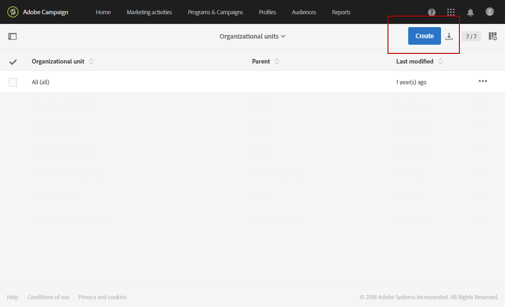
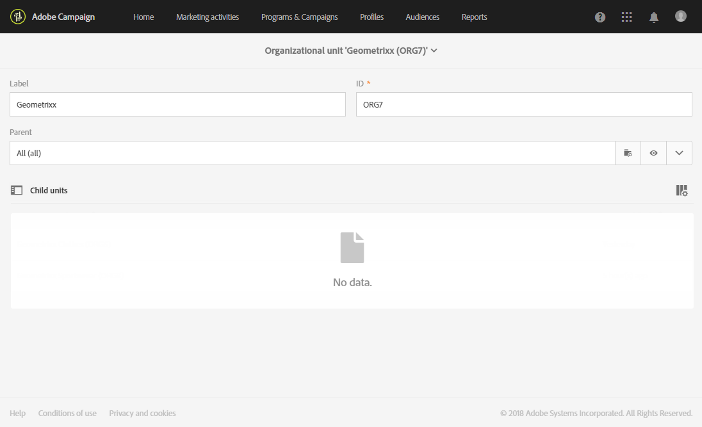
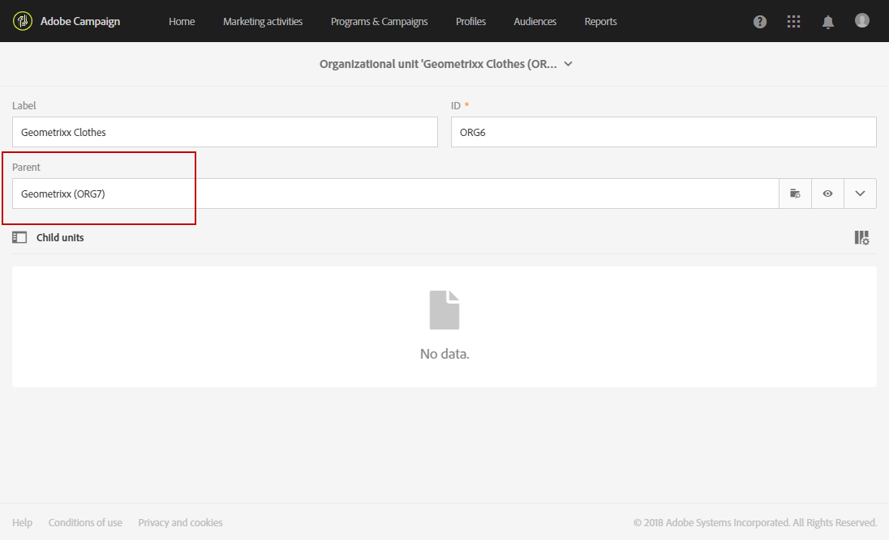
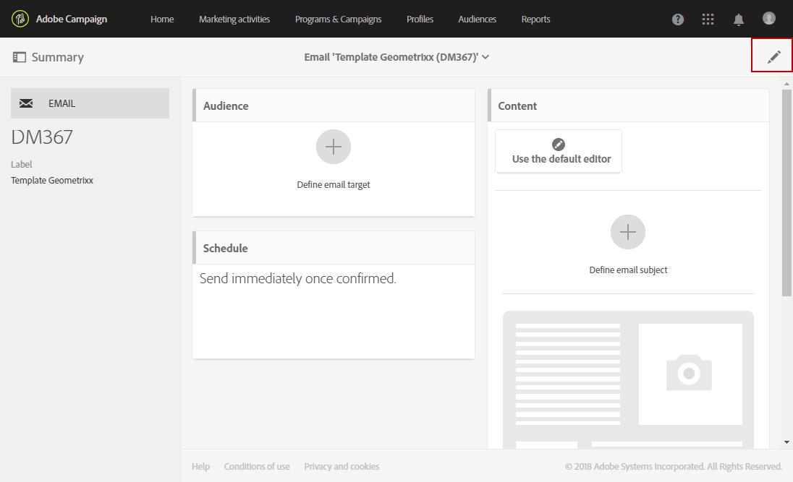
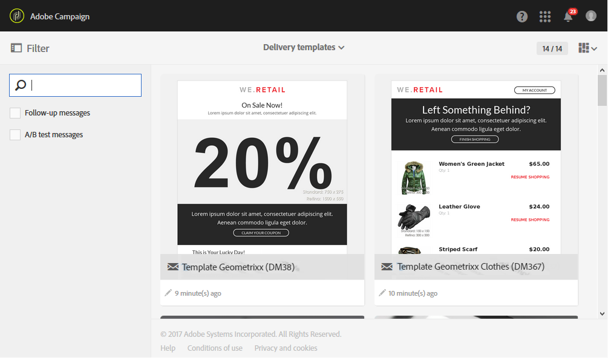
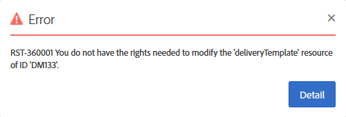
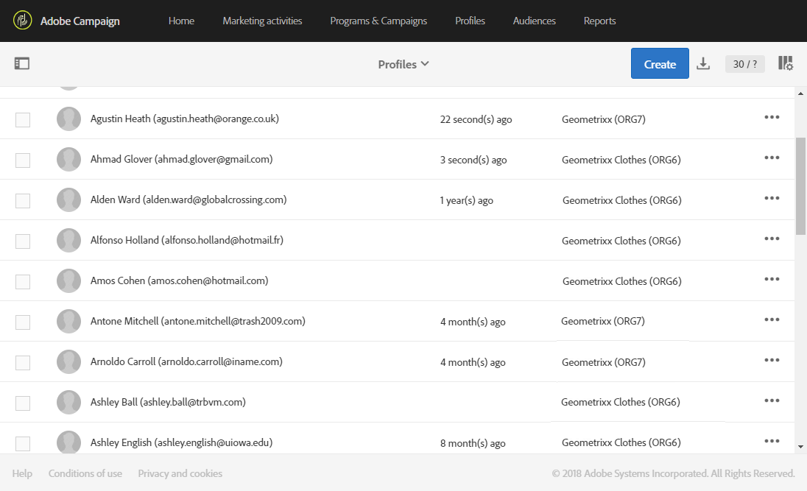
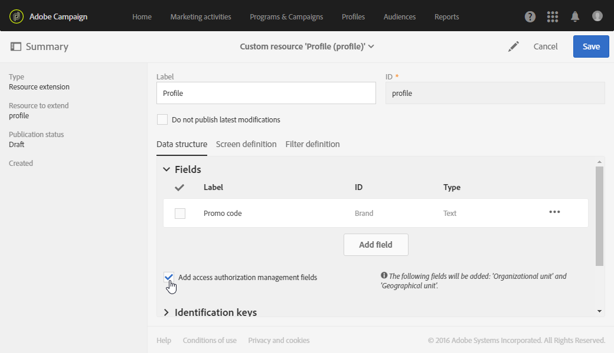
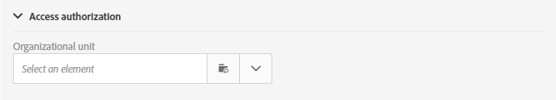

# 组织实体{#organizational-units}

## 关于单位 {#about-units}

平台的每个对象和用户都链接到组织单位。 此单元允许定义分层结构，以便为用户提供过滤视图。 用户单元为不同的平台对象定义其访问级别。

>[!IMPORTANT]
>
>如果用户未链接到任何设备，则该用户将无法连接到Adobe Campaign。 如果要限制特定用户或用户组的访问权限，请勿将其链接到&#x200B;**[!UICONTROL All]**&#x200B;设备。 建议在导入任何配置文件之前添加选项&#x200B;**访问授权管理字段**。 有关更多信息，请参阅此](../../administration/using/organizational-units.md#partitioning-profiles)章节[。
>
>默认情况下，**[!UICONTROL All (all)]** 组织单位被分配给 **[!UICONTROL Administrators]** 安全组。 该项为只读项，无法修改。

用户对父单位中的所有对象具有只读访问权限。 此类用户对其单位和子单位的所有对象具有读写访问权限。 用户无权访问并行分支中的对象。

默认情况下，只有&#x200B;**[!UICONTROL All]**&#x200B;个单位可用。

为用户分配组织单位后，此单位将始终应用于用户创建的对象。

>[!NOTE]
>
>当用户位于链接到不同单位的多个组中时，将会应用某些规则。 有关详细信息，请参阅[管理组和用户](../../administration/using/managing-groups-and-users.md)部分。

## 创建和管理单位 {#creating-and-managing-units}

组织单位允许您根据用户链接到的组织筛选实例。 此单位可以代表您实例中的地区、国家/地区甚至品牌。

在本例中，我们之前创建了安全组，并为两个用户分配了不同的角色：一个用户分配了安全组Administrators和Geometrixx，另一个用户属于安全组Standard user和Geometrixx Clothes。有关完整示例，请参阅[创建安全组并分配用户](../../administration/using/managing-groups-and-users.md#creating-a-security-group-and-assigning-users)。

现在，我们需要为Geometrixx Clothes和Geometrixx安全组创建组织单位：

1. 从Adobe促销活动高级菜单中，选择&#x200B;**[!UICONTROL Administration]** > **[!UICONTROL Users & security]** > **[!UICONTROL Organizational units]**。
1. 单击&#x200B;**[!UICONTROL Create]**&#x200B;开始配置组织单位。

   

1. 将默认&#x200B;**[!UICONTROL Label]**&#x200B;和&#x200B;**[!UICONTROL ID]**&#x200B;更改为Geometrixx。
1. 然后，将此设备链接到父设备。 在此，我们选择了&#x200B;**[!UICONTROL All]**。

   

1. 最后，单击&#x200B;**[!UICONTROL Create]**&#x200B;开始将新的组织单位分配给安全组。
1. 对Geometrixx Clothes单元执行相同的过程，只是其父单元必须是之前创建的单元Geometrixx。

   

要查看将不同单位分配给不同安全组的影响，分配给“管理员”组和Geometrixx组的用户将创建两个电子邮件模板，以查看分配给“标准用户”组和Geometrixx Clothes组的其他用户能够访问或不能访问的内容。

1. 从高级菜单中选择&#x200B;**[!UICONTROL Resources]** > **[!UICONTROL Templates]** > **[!UICONTROL Delivery Templates]**。
1. 复制现有模板并根据需要对其进行个性化。 有关详细信息，请参阅[关于模板](../../start/using/marketing-activity-templates.md)部分。
1. 创建模板后，选择&#x200B;**[!UICONTROL Edit properties]**&#x200B;图标以将设备分配给模板。

   

1. 在&#x200B;**[!UICONTROL Access authorization]**&#x200B;下拉菜单中，选择组织单位。

   在此，我们将使用之前创建的组织单位Geometrixx创建一个模板。

   

1. 按照相同的步骤创建分配给之前创建的Geometrixx Clothes组织单位的第二个模板。

分配给&#x200B;**标准用户**&#x200B;和&#x200B;**Geometrixx Clothes**&#x200B;组的用户将能够看到这两个模板。 由于组织单位的分层结构，他们将对链接到Geometrixx Clothes单位的模板具有读写访问权限，对链接到Geometrixx单位的模板具有只读访问权限。

由于Geometrixx Clothes单位是Geometrixx的子单位，因此当用户尝试修改Geometrixx模板时，会显示以下消息：

组织单位可以限制对不同功能（如用户档案）的访问。 例如，如果我们的Geometrixx Clothes用户访问&#x200B;**[!UICONTROL Profiles]**&#x200B;选项卡，他们将能够通过Geometrixx Clothes组织单位完全访问和修改配置文件。

虽然具有Geometrixx组织单位的用户档案将为只读，但如果用户尝试修改一个用户档案，则会出现以下错误： **[!UICONTROL You do not have the rights needed to modify the 'profile' resource of ID]**。

## 划分用户档案 {#partitioning-profiles}

>[!IMPORTANT]
>
>我们建议在导入任何用户档案之前添加此选项，因为用户无法访问没有组织单位的用户档案。
>
>如果您已经导入了客户数据库，则需要在已导入的用户档案中设置组织单位值。

如果您的组织需要隔离由每个不同品牌联系的用户档案，则可以按其组织单位对用户档案进行分区。

默认情况下，组织单位字段在用户档案中不可用，需要添加。

1. 从高级菜单中，通过Adobe Campaign徽标，选择&#x200B;**管理>开发>自定义资源**。
1. 选择&#x200B;**配置文件**&#x200B;或创建新的自定义资源以扩展配置文件。 有关如何扩展配置文件的更多信息，请参阅此[页面](../../developing/using/extending-the-profile-resource-with-a-new-field.md#step-1--extend-the-profile-resource)。
1. 选中&#x200B;**添加访问授权管理字段**&#x200B;框可在&#x200B;**配置文件**&#x200B;扩展中添加组织单位。

   

1. 单击 **[!UICONTROL Save]**。
1. 通过重新发布自定义资源来更新结构。 有关发布过程的详细信息，请参阅[更新结构](../../developing/using/updating-the-database-structure.md)部分。

组织单位字段已添加到您在&#x200B;**[!UICONTROL Access authorization]**&#x200B;分区中的用户档案。

**相关主题**：

* [关于单位](../../administration/using/organizational-units.md#about-units)
* [关于访问管理](../../administration/using/about-access-management.md)
