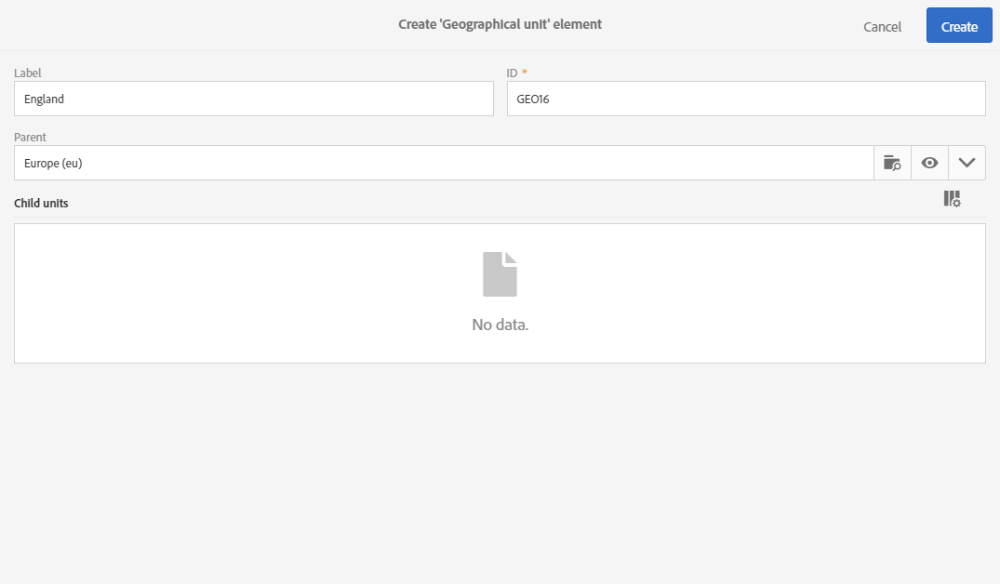

# 组织单位{#organizational-units}

## 关于单位 {#about-units}

平台的每个对象和用户都链接到组织单元。 该单元允许定义分层结构，以便向用户提供筛选的视图。 用户单元为不同的平台对象定义其访问级别。

>[!CAUTION]
>
>如果用户未链接到任何设备，该用户将无法连接到Adobe Campaign。 如果要限制特定用户或用户组的访问，请勿将其链接到设 **[!UICONTROL All]** 备。

用户对父单元中的所有对象具有只读访问权限。 他对单位和儿童单位的所有物品都有读写权限。 用户无权访问并行分支中的对象。

默认情况下，只有 **[!UICONTROL All]** 单位可用。

为用户分配了组织单元后，此单元将始终应用于用户创建的对象。

>[!NOTE]
>
>当用户位于多个链接到不同单元的组中时，会应用某些规则。 有关详细信息，请参阅管 [理组和用户部分](../../administration/using/managing-groups-and-users.md) 。

## 创建和管理单元 {#creating-and-managing-units}

组织单位允许您根据用户所链接到的组织来筛选实例。 此单元可以代表您实例中的区域、国家或甚至品牌。

在此，我们以前为两个用户创建了具有不同角色的安全组：一个用户被分配给安全组管理员和Geometrixx，另一个用户属于安全组标准用户和Geometrixx服装请参阅创建安全组和为完整示例分配用户  。

我们现在需要为Geometrixx Chastes和Geometrixx安全组创建组织单位：

1. 从Adobe Campaign高级菜单中，选择 **[!UICONTROL Administration]** &gt; **[!UICONTROL Users & security]** &gt; **[!UICONTROL Organizational units]**。
1. 单击 **[!UICONTROL Create]** 以开始配置您的组织单位。

   

1. 将默认值更 **[!UICONTROL Label]** 改为 **[!UICONTROL ID]** Geometrixx。
1. 然后，将此单元链接到父单元。 我们选择了 **[!UICONTROL All]**。

   

1. 最后，单击 **[!UICONTROL Create]** 开始将新的组织单元分配给安全组。
1. 对于Geometrixx Chastes单元，请按照相同的过程操作，但其父单元必须是先前创建的单元，Geometrixx。

   

要了解将不同设备分配给不同安全组的影响，分配给管理员和Geometrixx组的用户将创建两个电子邮件模板，以查看分配给标准用户和Geometrixx服装的其他用户可以访问或无法访问的内容。

1. 从高级菜单中，选择 **[!UICONTROL Resources]** &gt; **[!UICONTROL Templates]** &gt; **[!UICONTROL Delivery Templates]**。
1. 复制现有模板并根据需要对其进行个性化设置。 有关此信息的详细信息，请参阅“关于 [模板](../../start/using/about-templates.md) ”部分。
1. 创建模板后，选择图 **[!UICONTROL Edit properties]** 标以将单位分配给模板。

   

1. 在下拉 **[!UICONTROL Access authorization]** 菜单中，选择组织单位。

   在此，我们将使用先前创建的组织单元Geometrixx创建一个模板。

   

1. 按照相同的步骤创建分配给先前创建的Geometrixx Chastes组织单元的第二个模板。

分配给“标准用户”和“Geometrixx衣服”组的用户将能够查看这两个模板。 由于组织单元的分层结构，他将具有对链接到Geometrixx服装单元的模板的读写权限以及对链接到Geometrixx服装单元的模板的只读访问权限。

由于Geometrixx服装单元是Geometrixx的子单元，当用户尝试修改Geometrixx模板时，将显示以下消息：

组织单位可以限制对不同功能（如配置文件）的访问。 例如，如果我们的Geometrixx Chastes用户访问该选项卡， **[!UICONTROL Profiles]** 他将能够完全访问并修改Geometrixx Chastes组织单位的配置文件。

而具有Geometrixx组织单位的配置文件将为只读配置文件，但如果我们的用户尝试修改一个配置文件，则会出现以下错误： **[!UICONTROL You do not have the rights needed to modify the 'profile' resource of ID]**.

## 分区配置文件 {#partitioning-profiles}

如果您的组织需要隔离每个不同品牌联系的配置文件，您可以按其组织单位划分配置文件。

默认情况下，您的配置文件中不提供组织单位字段，需要添加这些字段。

用户无法访问没有组织单位的配置文件。

>[!CAUTION]
>
>我们建议在导入任何配置文件之前添加此选项。 如果您已经导入客户数据库，则必须进行更新，以便在已导入的配置文件中设置组织单位值。

1. 从高级菜单中，通过Adobe Campaign徽标，选择“管理”&gt;“ **开发”&gt;“自定义资源”**。
1. 选择 **配置文件** ，或创建新的自定义资源以扩展配置文件。
1. 选中“ **添加访问授权管理字段** ”框，以在“配置文件扩展”中添加组 **织单位** 。

   

1. Click **[!UICONTROL Save]**.
1. 通过重新发布自定义资源来更新结构。 有关发布过程的详细信息，请参阅 [更新结构部分](../../developing/using/data-model-concepts.md) 。

组织单位字段将添加到部分中的配置 **[!UICONTROL Access authorization]** 文件。

**相关主题**:

* [关于单位](../../administration/using/organizational-units.md#about-units)
* [关于访问管理](../../administration/using/about-access-management.md)

