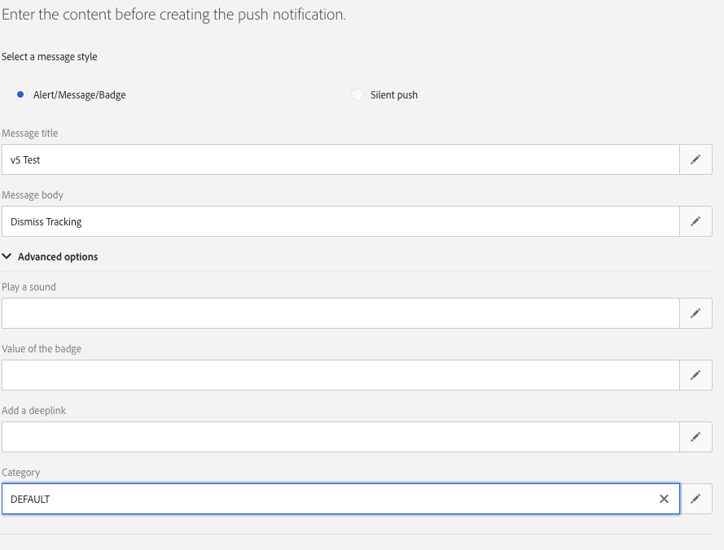

# 实施推送跟踪 {#push-tracking}

## 关于推送跟踪 {#about-push-tracking}

要确保推送通知已完全开发，您需要确保跟踪部分已正确实施，因为并非每个推送通知都启用了跟踪。 为了启用此功能，开发人员需要识别哪些投放启用了跟踪，Adobe Campaign Standard将发送名为`_acsDeliveryTracking`的标记，其中包含两个值&#x200B;**on**&#x200B;或&#x200B;**off**。 应用程序开发人员只应针对将变量设置为&#x200B;**on**&#x200B;的投放发送跟踪请求。

>[!IMPORTANT]
>
>此变量不可用于在21.1版本之前设置的投放或使用自定义模板的投放。

推送跟踪分为三种类型：

* **推送展示次数** — 推送通知已成功传送到设备时，位于通知中心且没有任何用户交互。

* **推送点击** — 推送通知已送达设备，且用户已点击该设备时。  用户希望查看通知（该通知随后将变为推送打开跟踪）或关闭通知。

* **推送打开** — 推送通知已送达设备，且用户单击了导致应用程序打开的通知。 这与推送点击类似，不同之处在于，如果取消通知，则不会触发推送打开。

要实施Campaign Standard跟踪，移动设备应用程序需要包含Adobe Experience Platform SDK。 这些SDK在[Adobe Experience Platform SDK文档](https://github.com/Adobe-Marketing-Cloud/acp-sdks)中提供。

要发送跟踪信息，需要发送三个变量。 两个是从Campaign Standard接收的数据的一部分，另一个是操作变量，该变量指示它是&#x200B;**展示**、**点击**&#x200B;还是&#x200B;**打开**。

| 变量 | 值 |
|:-:|:-:|
| broadlogId | 来自数据的_mId |
| deliveryId | 来自数据的_dId |
| 操作 | “1”表示打开，“2”表示单击，“7”表示展示 |

## Android实施 {#implementation-android}

### 如何实施推送展示跟踪 {#push-impression-tracking-android}

对于展示跟踪，调用`collectMessageInfo()`或`trackAction()`函数时必须发送值“7”才能执行操作。

对于21.1版本之前创建的投放或使用自定义模板的投放，请参阅此[部分](../../administration/using/push-tracking.md#about-push-tracking)。

```
@Override
public void onMessageReceived(RemoteMessage remoteMessage) {
....{Handle push messages}....
  if (data.size() > 0) {
    String deliveryId = data.get("_dId");
    String messageId = data.get("_mId");
    String acsDeliveryTracking = data.get("_acsDeliveryTracking");
 
    /*
    This is to handle deliveries created before 21.1 release or deliveries with custom template
    where acsDeliveryTracking is not available.
    */
    if( acsDeliveryTracking == null ) {
        acsDeliveryTracking = "on";
    }
 
    HashMap<String, String> contextData = new HashMap<>();
    if( deliveryId != null && messageId != null && acsDeliveryTracking.equals("on")) {
      contextData.put("deliveryId", deliveryId);
      contextData.put("broadlogId", messageId);
      contextData.put("action", "7");

    //If you are using ACPCore v1.4.0 or later, use the next line.
      
      MobileCore.collectMessageInfo(contextData);
      
    //Else comment out the above line and uncomment the line below
        
    //MobileCore.trackAction("tracking", contextData) ;
    }
  }
}
```

### 如何实施点击跟踪 {#push-click-tracking-android}

对于点击跟踪，调用`collectMessageInfo()`或`trackAction()`函数时必须发送值“2”才能执行操作。
要跟踪点击情况，需要处理以下两种情况：

* 用户看到通知但将其清除。
* 用户看到通知并单击它即将其转换为打开跟踪。

要解决此问题，您需要使用两个意图：一个用于单击通知，另一个用于关闭通知。

对于21.1版本之前创建的投放或使用自定义模板的投放，请参阅此[部分](../../administration/using/push-tracking.md#about-push-tracking)。

**[!UICONTROL MyFirebaseMessagingService.java]**

```
private void sendNotification(Map<String, String> data) {
    Intent openIntent = new Intent(this, CollectPIIActivity.class);
    Intent dismissIntent = new Intent(this, NotificationDismissedReceiver.class);
    openIntent.addFlags(Intent.FLAG_ACTIVITY_CLEAR_TOP);
  
    //put the data map into the intent to track clickthroughs
    Bundle pushData = new Bundle();
    Set<String> keySet = data.keySet();
    for (String key : keySet) {
        pushData.putString(key, data.get(key));
    }
    openIntent.putExtras(pushData);
    dissmissIntent.putExtras(pushData);
  
  
    PendingIntent pendingIntent = PendingIntent.getActivity(this, 0, openIntent,
        PendingIntent.FLAG_UPDATE_CURRENT);
    PendingIntent onDismissPendingIntent = PendingIntent.getBroadcast(this.getApplicationContext(), 0, dismissIntent, 0);
  
    //<BUILD NOTIFICATION using notification builder>
    //Add both Intents to the notification
    notificationBuilder.setContentIntent(pendingIntent);
    notificationBuilder.setDeleteIntent(onDismissPendingIntent);
}
```

为了使&#x200B;**[!UICONTROL BroadcastReceiver]**&#x200B;正常工作，您需要将其注册到&#x200B;**[!UICONTROL AndroidManifest.xml]**

```
<manifest>
    <application>
        <receiver android:name=".NotificationDismissedReceiver">
        </receiver>
    </application>
</manifest>
```

NotificationDismessedReceiver.java

```
public class NotificationDismissedReceiver extends BroadcastReceiver {
    private static final String TAG = NotificationDismissedReceiver.class.getSimpleName();
    @Override
    public void onReceive(Context context, Intent intent) {
        Bundle data = intent.getExtras();
        String deliveryId = data.getString("_dId");
        String messageId = data.getString("_mId");
        String acsDeliveryTracking = data.get("_acsDeliveryTracking");
         
        /*
        This is to handle deliveries created before 21.1 release or deliveries with custom template
        where acsDeliveryTracking is not available.
        */
        if( acsDeliveryTracking == null ) {
            acsDeliveryTracking = "on";
        }
 
        HashMap<String, Object> contextData = new HashMap<>();
 
        //We only send the click tracking since the user dismissed the notification
        if (deliveryId != null && messageId != null && acsDeliveryTracking.equals("on")) {
            contextData.put("deliveryId", deliveryId);
            contextData.put("broadlogId", messageId);
            contextData.put("action", "2");
            
        //If you are using ACPCore v1.4.0 or later, use the next line.
        
            MobileCore.collectMessageInfo(contextData);
            
        //Else comment out the above line and uncomment the line below
        
            //MobileCore.trackAction("tracking", contextData);
        }
    }
}
```

### 如何实施打开跟踪 {#push-open-tracking-android}

您需要发送“1”和“2”，因为用户必须单击“通知”才能打开应用程序。 如果未通过推送通知启动/打开应用程序，则不会发生跟踪事件。

要跟踪未结项，您需要创建意图。 目的对象允许Android OS在完成某些操作后调用您的方法。 在这种情况下，单击通知可打开应用程序。

此代码基于点击展示跟踪的实施。 设置&#x200B;**[!UICONTROL Intent]**&#x200B;后，您现在需要将跟踪信息发送回Adobe Campaign Standard。 在这种情况下，您需要将&#x200B;**[!UICONTROL Open Intent]**&#x200B;设置为对应用程序中的特定视图打开，这将调用onResume方法，并在&#x200B;**[!UICONTROL Intent Object]**&#x200B;中显示通知数据。

对于21.1版本之前创建的投放或使用自定义模板的投放，请参阅此[部分](../../administration/using/push-tracking.md#about-push-tracking)。

```
@Override
protected void onResume() {
    super.onResume();
    handleTracking();
}
 
 
private void handleTracking() {
    //Check to see if this view was opened based on a notification
    Intent intent = getIntent();
    Bundle data = intent.getExtras();
 
    if (data != null) {
        //This was opened based on the notification, you need to get the tracking that was passed on.
        String deliveryId = data.getString("_dId");
        String messageId = data.getString("_mId");
        String acsDeliveryTracking = data.get("_acsDeliveryTracking");
        /*
        This is to handle deliveries created before 21.1 release or deliveries with custom template
        where acsDeliveryTracking is not available.
        */
        if( acsDeliveryTracking == null) {
            acsDeliveryTracking = "on";
        }
 
        HashMap<String, String> contextData = new HashMap<>();
 
        if (deliveryId != null && messageId != null && acsDeliveryTracking.equals("on")) {
            contextData.put("deliveryId", deliveryId);
            contextData.put("broadlogId", messageId);
            contextData.put("action", "2");
            
            //Send Click Tracking since the user did click on the notification
              
                //If you are using ACPCore v1.4.0 or later, use the next line.

                MobileCore.collectMessageInfo(contextData);
                  
                //Else comment out the above line and uncomment the line below
        
                //MobileCore.trackAction("tracking", contextData);
 
                //Send Open Tracking since the user opened the app
            
                contextData.put("action", "1");
                
                //If you are using ACPCore v1.4.0 or later, use the next line.

                MobileCore.collectMessageInfo(contextData);
                //Else comment out the above line and uncomment the line below
        
                //MobileCore.trackAction("tracking", contextData);
        }
    }
}
```

## iOS实施 {#implementation-iOS}

### 如何实施推送展示跟踪 {#push-impression-tracking-iOS}

对于展示跟踪，调用`collectMessageInfo()`或`trackAction()`函数时必须发送值“7”才能执行操作。

要了解iOS通知的工作方式，需要详细描述应用程序的三种状态：

* **前台**：应用程序当前处于活动状态且当前处于屏幕（前台）时。
* **背景**：当is应用程序不在屏幕上，但进程未关闭时。 当您双击“主页”按钮时，它通常会显示位于后台的所有应用程序。
* **关闭/关闭**：进程已被终止的应用程序。

为了在应用程序处于后台时仍使&#x200B;**[!UICONTROL Impression]**&#x200B;跟踪正常工作，我们需要发送&#x200B;**[!UICONTROL Content-Available]**&#x200B;以使应用程序知道必须完成跟踪。

>[!CAUTION]
>
> 如果某个应用程序关闭，则在重新启动该应用程序之前，Apple不会调用该应用程序。 这意味着您将无法知道何时在iOS上收到通知。 </br>因此，iOS展示跟踪可能不准确，不应被视为可靠。

对于21.1版本之前创建的投放或使用自定义模板的投放，请参阅此[部分](../../administration/using/push-tracking.md#about-push-tracking)。

以下代码定位后台应用程序：

```
// In didReceiveRemoteNotification event handler in AppDelegate.m
 
//In order to handle push notification when only in background with content-available: 1
func application(_ application: UIApplication, didReceiveRemoteNotification userInfo: [AnyHashable : Any], fetchCompletionHandler completionHandler: @escaping (UIBackgroundFetchResult) -> Void) {
 
        //Check if the app is not in the foreground right now
        if(UIApplication.shared.applicationState != .active) {
            let deliveryId = userInfo["_dId"] as? String
            let broadlogId = userInfo["_mId"] as? String
            let acsDeliveryTracking = userInfo["_acsDeliveryTracking"] as? String
            /*
            This is to handle deliveries created before 21.1 release or deliveries with custom template where acsDeliveryTracking is not available.
            */
            if( acsDeliveryTracking == nil ) {
                acsDeliveryTracking = "on";
            }
            if (deliveryId != nil && broadlogId != nil && acsDeliveryTracking?.caseInsensitiveCompare("on") == ComparisonResult.orderedSame) {

            //If you are using ACPCore v2.3.0 or later, use the next line.

                ACPCore.collectMessageInfo(["deliveryId": deliveryId!, "broadlogId": broadlogId!, "action":"7"])
                
            //Else comment out the above line and uncomment the line below
        
                //ACPCore.trackAction("tracking", data: ["deliveryId": deliveryId!, "broadlogId": broadlogId!, "action":"7"])
            }
        }
        completionHandler(UIBackgroundFetchResult.noData)
    }
```

以下代码定位前台应用程序：

```
// This will get called when the app is in the foreground
 
func userNotificationCenter(_ center: UNUserNotificationCenter, willPresent notification: UNNotification, withCompletionHandler completionHandler: @escaping (UNNotificationPresentationOptions) -> Void) {
 
 
        let userInfo = notification.request.content.userInfo
        let deliveryId = userInfo["_dId"] as? String
        let broadlogId = userInfo["_mId"] as? String
        let acsDeliveryTracking = userInfo["_acsDeliveryTracking"] as? String
        /*
        This is to handle deliveries created before 21.1 release or deliveries with custom template where acsDeliveryTracking is not available.
        */
        if( acsDeliveryTracking == nil ) {
            acsDeliveryTracking = "on";
        }
        if (deliveryId != nil && broadlogId != nil && acsDeliveryTracking?.caseInsensitiveCompare("on") == ComparisonResult.orderedSame) {

            //If you are using ACPCore v2.3.0 or later, use the next line.

                ACPCore.collectMessageInfo(["deliveryId": deliveryId!, "broadlogId": broadlogId!, "action":"7"])
                
            //Else comment out the above line and uncomment the line below
        
                //ACPCore.trackAction("tracking", data: ["deliveryId": deliveryId!, "broadlogId": broadlogId!, "action":"7"])        
            }
        completionHandler([.alert,.sound])
    }
```

### 如何实施点击跟踪 {#push-click-tracking-iOS}

对于点击跟踪，调用`collectMessageInfo()`或`trackAction()`函数时必须发送值“2”才能执行操作。
对于21.1版本之前创建的投放或使用自定义模板的投放，请参阅此[部分](../../administration/using/push-tracking.md#about-push-tracking)。

```
// AppDelegate.swift
...
import os.log
import UserNotifications
...
  
func registerForPushNotifications() {
        let center = UNUserNotificationCenter.current()
        center.delegate = notificationDelegate
        //Here we are creating a new Category that allows us to handle Dismiss Actions
        let defaultCategory = UNNotificationCategory(identifier: "DEFAULT", actions: [], intentIdentifiers: [], options: .customDismissAction)
        //Add it to our array of Category, in this case we only have one
        center.setNotificationCategories([defaultCategory])
        center.requestAuthorization(options: [.alert, .sound, .badge]) {
            (granted, error) in
            os_log("Permission granted: %{public}@", type:. debug, granted.description)
            if error != nil {
                return
            }
            if granted {
                os_log("Notifications allowed", type: .debug)
            }
            else {
                os_log("Notifications denied", type: .debug)
            }
  
            // 2. Attempt registration for remote notifications on the main thread
            DispatchQueue.main.async {
                UIApplication.shared.registerForRemoteNotifications()
            }
        }
    }
```

现在，当您发送推送通知时，您需要添加类别。 在本例中，我们将其称为“默认”。



然后，要处理&#x200B;**[!UICONTROL Dismiss]**&#x200B;并发送跟踪信息，您需要添加以下内容：

```
func userNotificationCenter(_ center: UNUserNotificationCenter, didReceive response: UNNotificationResponse, withCompletionHandler completionHandler: @escaping () -> Void) {
        let userInfo = response.notification.request.content.userInfo
        switch response.actionIdentifier {
        case UNNotificationDismissActionIdentifier:
            print("Dismiss Action")
            let deliveryId = userInfo["_dId"] as? String
            let broadlogId = userInfo["_mId"] as? String
            let acsDeliveryTracking = userInfo["_acsDeliveryTracking"] as? String
            /*
            This is to handle deliveries created before 21.1 release or deliveries with custom template where acsDeliveryTracking is not available.
            */
            if( acsDeliveryTracking == nil ) {
                acsDeliveryTracking = "on";
            }
            if (deliveryId != nil && broadlogId != nil && acsDeliveryTracking?.caseInsensitiveCompare("on") == ComparisonResult.orderedSame) {

            //If you are using ACPCore v2.3.0 or later, use the next line.

                ACPCore.collectMessageInfo(["deliveryId": deliveryId!, "broadlogId": broadlogId!, "action":"2"])
                
            //Else comment out the above line and uncomment the line below
        
                //ACPCore.trackAction("tracking", data: ["deliveryId": deliveryId!, "broadlogId": broadlogId!, "action":"2"])   
            }
        default:
            ////MORE CODE
        }
        completionHandler()
    }
```

### 如何实施打开跟踪 {#push-open-tracking-iOS}

您需要发送“1”和“2”，因为用户必须单击“通知”才能打开应用程序。 如果未通过推送通知启动/打开应用程序，则不会发生跟踪事件。

对于21.1版本之前创建的投放或使用自定义模板的投放，请参阅此[部分](../../administration/using/push-tracking.md#about-push-tracking)。

```
import Foundation
import UserNotifications
import UserNotificationsUI
 
class NotificationDelegate: NSObject, UNUserNotificationCenterDelegate {
 
    // Called when user clicks the push notification or also called from willPresent()
    func userNotificationCenter(_ center: UNUserNotificationCenter, didReceive response: UNNotificationResponse, withCompletionHandler completionHandler: @escaping () -> Void) {
 
        let userInfo = response.notification.request.content.userInfo
        os_log("App push data %{public}@, in userNotificationCenter:didReceive()", type: .debug, userInfo)
        switch response.actionIdentifier {
        case UNNotificationDismissActionIdentifier:
            //This is to handle the Dismiss Action
            let deliveryId = userInfo["_dId"] as? String
            let broadlogId = userInfo["_mId"] as? String
            let acsDeliveryTracking = userInfo["_acsDeliveryTracking"] as? String
            /*
            This is to handle deliveries created before 21.1 release or deliveries with custom template where acsDeliveryTracking is not available.
            */
            if( acsDeliveryTracking == nil ) {
                acsDeliveryTracking = "on";
            }
            if (deliveryId != nil && broadlogId != nil && acsDeliveryTracking?.caseInsensitiveCompare("on") == ComparisonResult.orderedSame) {

            //If you are using ACPCore v2.3.0 or later, use the next line.

                ACPCore.collectMessageInfo(["deliveryId": deliveryId!, "broadlogId": broadlogId!, "action":"2"])
                
            //Else comment out the above line and uncomment the line below
        
                //ACPCore.trackAction("tracking", data: ["deliveryId": deliveryId!, "broadlogId": broadlogId!, "action":"2"])

            }
        default:
            //This is to handle the tracking when the app opens
            let deliveryId = userInfo["_dId"] as? String
            let broadlogId = userInfo["_mId"] as? String
            let acsDeliveryTracking = userInfo["_acsDeliveryTracking"] as? String
            /*
            This is to handle deliveries created before 21.1 release or deliveries with custom template where acsDeliveryTracking is not available.
            */
            if( acsDeliveryTracking == nil ) {
                acsDeliveryTracking = "on";
            }
            if (deliveryId != nil && broadlogId != nil && acsDeliveryTracking?.caseInsensitiveCompare("on") == ComparisonResult.orderedSame) {
            //If you are using ACPCore v2.3.0 or later, use the next line.

                ACPCore.collectMessageInfo(["deliveryId": deliveryId!, "broadlogId": broadlogId!, "action":"2"])
                
            //Else comment out the above line and uncomment the line below
        
                //ACPCore.trackAction("tracking", data: ["deliveryId": deliveryId!, "broadlogId": broadlogId!, "action":"2"])                
                
            //If you are using ACPCore v2.3.0 or later, use the next line.

                ACPCore.collectMessageInfo(["deliveryId": deliveryId!, "broadlogId": broadlogId!, "action":"1"])
                
            //Else comment out the above line and uncomment the line below
        
                //ACPCore.trackAction("tracking", data: ["deliveryId": deliveryId!, "broadlogId": broadlogId!, "action":"1"])
                
            }
        }
        completionHandler()
    }
}
```
