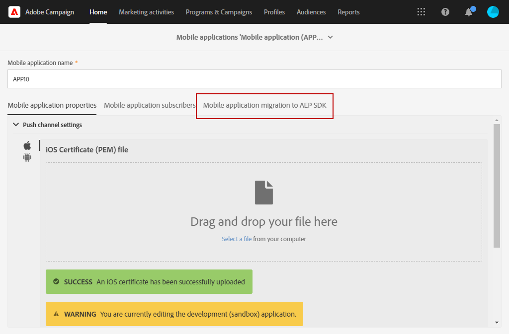

# 如何将移动应用程序从 SDK v4 迁移到 Adobe Experience Platform SDK {#sdkv4-migration}

>[!IMPORTANT]
>
> 迁移过程是不可逆转的。
>
> 请在开始将SDK V4移动应用程序迁移到Adobe Experience Platform SDK之前仔细阅读文档。

## 关于SDK V4迁移

Adobe Campaign Standard使用SDK V4处理移动应用程序，将它们作为与使用Adobe Experience Platform SDK的应用程序分开处理。
将Adobe SDK版本从v4升级到Adobe Experience Platform后，移动应用程序需要继续使用现有应用程序订阅者数据和活动:因此，需要移民。

>[!NOTE]
>
> 本页文档了SDK v4移动应用程序到新创建的Adobe Experience Platform SDK应用程序的迁移。 您的SDK v4移动应用程序将不会与具有&#x200B;**[!UICONTROL Configured]** **[!UICONTROL Property status]**&#x200B;的Adobe Experience Platform SDK移动应用程序合并。

| 迁移后不会更改的内容 |
|:-:|
| 对使用迁移的SDK V4应用程序的现有投放和活动没有影响。 |
| 移动应用程序的名称将保持不变。 |
| 将保留iOS和Android的平台凭据。 |
| 应用程序的所有用户及其数据都将被保留。 |
| 现有SDK v4移动应用程序将继续向Adobe Campaign Standard发送数据（PII数据、订阅者和令牌信息）。 |
| 移动应用程序的&#x200B;**[!UICONTROL Organizational unit]**&#x200B;将保持不变。 |

| 迁移后将发生什么变化 |
|:-:|
| 移动应用程序将在&#x200B;**[!UICONTROL Administration]** > **[!UICONTROL Channels]** > **[!UICONTROL Mobile app (Adobe Experience Platform SDK)]**&#x200B;中可用。 迁移前，它在&#x200B;**[!UICONTROL Administration]** > **[!UICONTROL Channels]** > **[!UICONTROL Mobile app (SDK V4)]**&#x200B;中可用。 |
| 应用程序的&#x200B;**[!UICONTROL Collect PII Endpoint]**&#x200B;将会更改。 旧版&#x200B;**[!UICONTROL Collect PII Endpoint]**&#x200B;将继续工作，发送的数据不会丢失。 |
| 应用程序将绑定到Adobe Experience Platform Launch **[!UICONTROL Mobile Property]**。 它将作为新创建的移动应用程序进行处理。 |
| 迁移中使用的原始Adobe Experience Platform SDK应用程序将不作为单独的应用程序存在。 只有迁移的SDK v4应用程序才可用。 |

## 将您的移动应用程序从SDK v4迁移到Adobe Experience Platform SDK {#how-to-migrate}

在迁移之前，您应考虑以下建议：

* 迁移过程是不可逆转的。
* 不应同时运行多个应用程序的迁移。 还应确保同一应用程序的迁移不是由多个窗口同时触发的。
* 在迁移之前，请确保为您分配了要迁移的移动应用程序的&#x200B;**[!UICONTROL Organizational unit]**&#x200B;以及要用于迁移的Adobe Experience Platform应用程序。
* 迁移后，该应用程序将成为Adobe Experience Platform SDK应用程序。 其更改将链接到其相应的启动项&#x200B;**[!UICONTROL Mobile Property]**。

1. 在Adobe Experience Platform Launch中新建&#x200B;**[!UICONTROL Mobile property]**。 有关此信息的详细信息，请参阅[Adobe Experience Platform Launch文档](https://aep-sdks.gitbook.io/docs/getting-started/create-a-mobile-property#create-a-mobile-property)。

1. 在Adobe Campaign Standard中，从高级菜单中，选择&#x200B;**[!UICONTROL Administration]** > **[!UICONTROL Application Settings]** > **[!UICONTROL Workflows]**&#x200B;并打开&#x200B;**[!UICONTROL syncWithLaunch]**&#x200B;工作流。 检查工作流是否已结束且无错误。

1. 工作流完成后，从&#x200B;**[!UICONTROL Administration]** > **[!UICONTROL Channels]** > **[!UICONTROL Mobile app (Adobe Experience Platform SDK)]**&#x200B;菜单检查移动应用程序是否在Adobe Campaign Standard中可用并处于&#x200B;**[!UICONTROL Ready to Configure]**&#x200B;状态。

   

1. 在&#x200B;**[!UICONTROL Administration]** > **[!UICONTROL Channels]** > **[!UICONTROL Mobile app (SDK V4)]**&#x200B;中，选择要迁移的SDK V4应用程序。

1. 选择 **[!UICONTROL Mobile application migration to AEP SDK]** 选项卡。

   

1. 从&#x200B;**[!UICONTROL Select AEP SDK mobile application to merge current application with]**&#x200B;下拉列表中，选择之前创建的Adobe Experience Platform SDK移动应用程序。

1. 单击 **[!UICONTROL Migrate]**.

   

1. 在&#x200B;**[!UICONTROL Migration application]**&#x200B;窗口中，单击&#x200B;**[!UICONTROL Ok]**。

   

1. 出现成功完成窗口，单击&#x200B;**[!UICONTROL Go to Adobe Experience Platform SDK Channel list]**。

1. 在Adobe Experience Platform SDK 渠道列表页中，检查您之前的V4移动应用程序是否设置为&#x200B;**[!UICONTROL Ready To Configure]**。

1. 选择您的移动应用程序，然后单击&#x200B;**[!UICONTROL Save]**&#x200B;以完成迁移。

迁移后，由V4版本的移动应用程序收集的用户和由AEP版本的移动应用程序收集的新用户将在迁移的应用程序中可用。

要区分两种不同类型的订阅者，可以在将自定义资源&#x200B;**[!UICONTROL Subscriptions to an application (appSubscriptionRcp)]**&#x200B;扩展为`sdkversion`或`appVersion`时添加一个&#x200B;**[!UICONTROL Text]**&#x200B;类型的新自定义字段。 有关如何扩展自定义资源的详细信息，请参阅此[页面](../../developing/using/creating-or-extending-the-resource.md)。
然后，您需要配置关联的启动项**[!UICONTROL Mobile property]**&#x200B;以在Collect PII调用中发送此自定义字段值，并相应更改您的移动应用程序配置。

## 常见问题解答 {#faq}

### 问：在SDK v4移动应用程序中，“移动”应用程序迁移到Adobe Experience Platform SDK选项卡不可见。{#tab-not-visible}

答：从高级菜单&#x200B;**[!UICONTROL Administration]** > **[!UICONTROL Application Settings]** > **[!UICONTROL Options]**&#x200B;中，检查&#x200B;**[!UICONTROL Enable migration of mobile app from SDK v4 to Adobe Experience Platform SDK option]**&#x200B;选项的值。 它应设置为1，并在默认情况下启用。 管理员可能已手动禁用它。

### 问：从Mobile应用程序迁移到Adobe Experience Platform SDK选项卡中，显示消息无数据。{#no-data}

答：该列表中仅显示符合条件的&#x200B;**[!UICONTROL Organizational unit]**&#x200B;应用程序。 请确保您有正确的Adobe Experience Platform应用程序进行迁移。 您的Adobe Experience Platform应用程序的&#x200B;**[!UICONTROL Property Status]**&#x200B;应设置为&#x200B;**[!UICONTROL Ready to Configure]**,**[!UICONTROL Mobile app migration status]**&#x200B;应设置为&#x200B;**[!UICONTROL Not Migrated]**。

### 问：为什么不能使用具有已配置属性状态的Adobe Experience Platform SDK应用程序进行迁移？{#property-status}

答：迁移过程保留SDK v4订阅者和属性。 它只保留Adobe Experience Platform SDK应用程序中的Launch相关信息。 来自Adobe Experience Platform SDK应用程序的订阅者和其他数据将丢失。 为避免任何数据丢失，只有&#x200B;**[!UICONTROL Ready to Configure]** **[!UICONTROL Property Status]**&#x200B;的Adobe Experience Platform SDK应用程序有资格进行迁移。

### 问：迁移后，我在哪里可以找到以前的SDK v4移动应用程序？{#v4-app-not-visible}

答：迁移后的移动应用程序将从高级菜单&#x200B;**[!UICONTROL Administration]** > **[!UICONTROL Channels]** > **[!UICONTROL Mobile app (Adobe Experience Platform SDK)]**&#x200B;中可见。

### 问：迁移后，在哪里可以找到新创建的Adobe Experience Platform SDK应用程序？{#aep-not-visible}

答：新创建的用于迁移的Adobe Experience Platform SDK应用程序将不作为单独的应用程序存在。 只有迁移的SDK v4应用程序才可用。

### 问：如果SDK v4移动应用程序组织单元设置为A（组织单元ALL的子项），而Adobe Experience Platform SDK设置为ALL。 如何迁移我的移动应用程序？{#v4-org-unit}

答：**[!UICONTROL Organizational unit]** ALL的管理员将有权管理移动应用程序并负责迁移。

### 问：如果SDK v4移动应用程序组织单元设置为A，而Adobe Experience Platform SDK应用程序设置为B（组织单元A的同级）。 如何迁移我的移动应用程序？{#aep-org-unit}

答：Adobe Experience Platform SDK应用程序是同级&#x200B;**[!UICONTROL Organizational unit]**&#x200B;的资产，**[!UICONTROL Organizational unit]** A的用户将看不到该移动应用程序。**[!UICONTROL Organizational unit]** ALL的管理员将可以使用该移动应用程序，但我们不建议这些管理员迁移该移动应用程序。
在这种情况下，您应将移动应用程序移到同一个**[!UICONTROL Organizational unit]**&#x200B;或具有父链接的&#x200B;**[!UICONTROL Organizational unit]**中。
有关**[!UICONTROL Organizational unit]**&#x200B;的详细信息，请参阅此[部分](../../administration/using/organizational-units.md)。

### 问：从Adobe Experience Platform SDK移动应用程序（从v4移动应用程序迁移）页面的“推送渠道设置”下拉列表中，不会显示Android密钥或iOS证书{#no-information-v5}的上传日期/名称等信息

答：创建SDK V4移动应用程序时，系统不存储此信息。 将SDK V4移动应用程序迁移到Adobe Experience Platform SDK移动应用程序时，您迁移的移动应用程序也不会有此类信息。 用户一旦上传新的iOS证书或Android密钥，密钥或证书的不同详细信息就会存储并正确显示在&#x200B;**[!UICONTROL Push channel settings]**&#x200B;下拉列表中。
