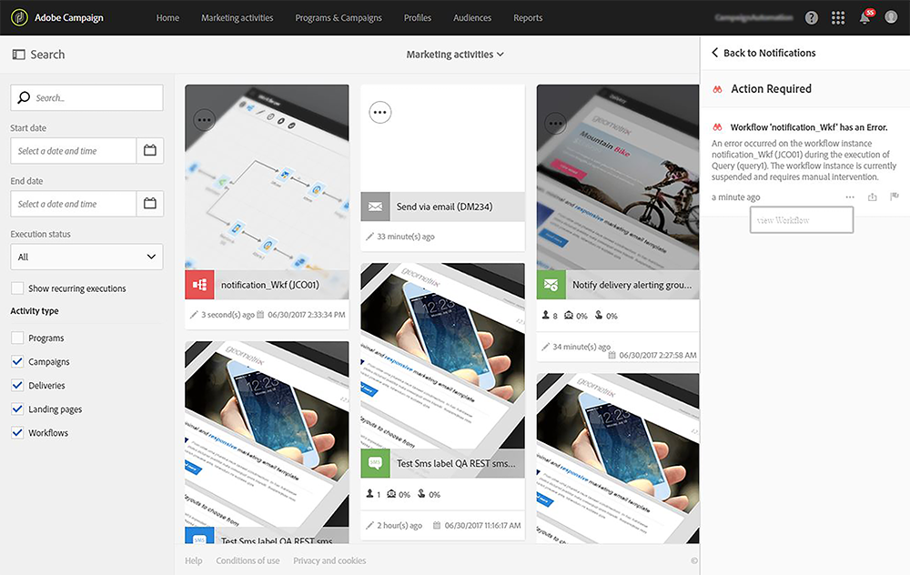

# 发送内部通知{#sending-internal-notifications}

Adobe Campaign允许您直接在应用程序中接收有关重要系统活动的通知。 实时通知可让相关利益相关方随时获得信息，并使用户能够从应用程序内立即直接对活动通知采取行动。 团队的成果是先进的敏捷性、效率和更顺畅的活动执行。

可以为以下对象配置通知：

* **[!UICONTROL A/B Test emails]**:电子邮件创建者和修改者会收到选择变体（自动模式）或需要选择变体（手动模式）的通知。单击通知可显示相应的电子邮件。 默认情况下，通知会在现成的A/B测试模板中激活。 如果要取消激活它们，请编辑电子邮件或电子邮件模板的属性，并取消选中位于&#x200B;**“常规”>“通知”**&#x200B;下的框。 有关A/B测试电子邮件的详细信息，请参阅[创建AB测试](../../channels/using/designing-an-a-b-test-email.md)。 有关电子邮件属性的详细信息，请参阅[电子邮件属性列表](../../administration/using/configuring-email-channel.md#list-of-email-properties)。

   

* **[!UICONTROL Workflows]**:每当工作流出错时，都会通知选定安全组的每个成员（电子邮件和应用程序内通知）。单击通知或电子邮件链接会显示相应的工作流。 默认情况下，现成工作流模板中会停用通知。 如果要激活它们，请编辑工作流或工作流模板的属性，并在&#x200B;**“常规”>“执行”>“错误管理”>“监管者”**&#x200B;下添加一个安全组。 有关安全组的详细信息，请参阅[管理组和用户](../../administration/using/managing-groups-and-users.md)。 有关工作流属性的详细信息，请参阅[工作流属性](../../automating/using/managing-execution-options.md)。

   
