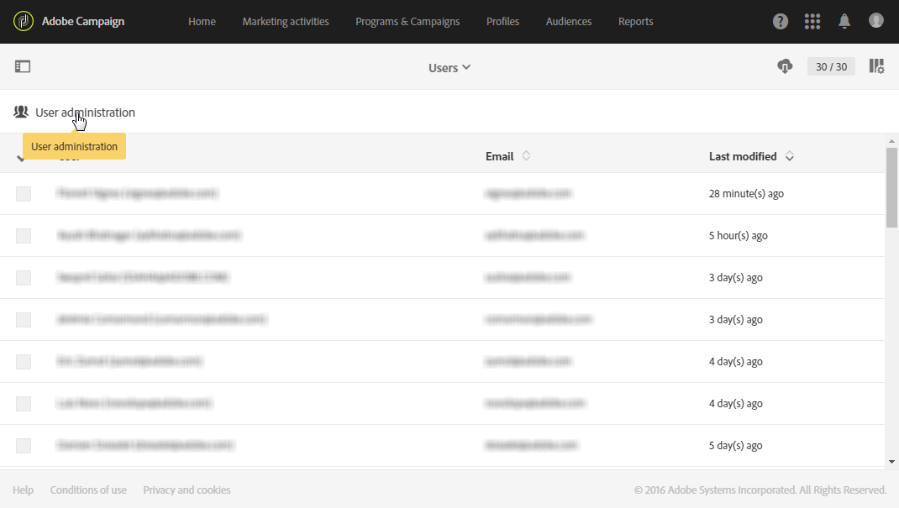
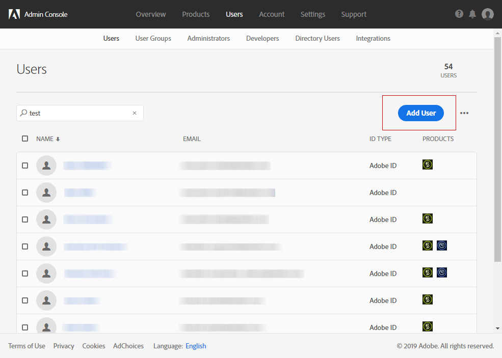
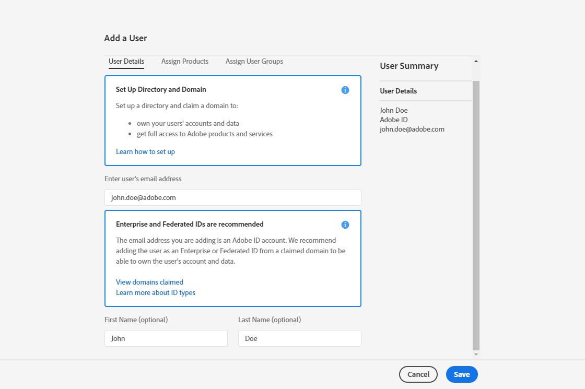

# 用户管理{#users-management}

## 关于用户 {#about-users}

Adobe Campaign 允许您为用户分配一系列角色，以定义他们可以访问界面的哪些部分。

以下各节详细介绍了各种特定的角色和相应的权限：[了解角色](../../administration/using/list-of-roles.md)和[权限](https://experienceleague.adobe.com/docs/campaign-standard/assets/acs_rights.pdf?lang=en)。

管理员可以从Admin Console管理用户。 然后，用户将自动与 Adobe Campaign 同步。有关更多信息，请参阅 [Admin Console](https://helpx.adobe.com/cn/enterprise/using/users.html) 文档。

 [在视频中发现此功能](#video)

要在Adobe Campaign中查看用户，请单击 **Adobe** 徽标，然后选择 **[!UICONTROL Administration > Users & Security > Users]**.

要从 Adobe Campaign 访问用户管理界面，请单击 **[!UICONTROL User administration]**。

**相关主题：**

* [管理用户权限](https://experienceleague.adobe.com/docs/campaign-standard-learn/tutorials/administrating/managing-user-access-rights.html)视频
* [角色列表](../../administration/using/list-of-roles.md)
* [权限列表](https://experienceleague.adobe.com/docs/campaign-standard/assets/acs_rights.pdf?lang=en)

## 用户类型 {#type-of-users}

这种用户划分并不具有强制性，本节只是展示 Adobe Campaign 的常见用法。

本节将帮助您了解主要类型的Adobe Campaign用户。 有关用户可担任的特定角色（开始投放、导出、准备投放等）的更多信息，请参阅 [角色列表](../../administration/using/list-of-roles.md) 和 [管理组和用户](../../administration/using/managing-groups-and-users.md) 页面。

我们着重关注 Adobe Campaign 中承担不同任务的三种主要用户类型：

* [功能管理员](#functional-administrators)：在组织内部的所有用户中，此类型的用户技术含量最高。
* [高级用户](#advanced-users):他们负责设置营销人员发送和监控投放所需的所有元素。
* [基本用户](#basic-users)：营销人员，负责个性化、投放和监控活动。

>[!NOTE]
>
>功能管理员与 Adobe 技术管理员不同。Adobe 技术管理员承担着 Adobe 内部角色，而客户无法承担这种角色。他们负责管理实例预配、托管、基础架构监控和监督、技术疑难解答。

### 功能管理员 {#functional-administrators}

功能管理员可访问界面中技术含量最高的部分。他们承担着 **[!UICONTROL Administration]** 的角色，负责确保平台的方方面面设置妥当，可让营销人员只需专注于投放活动。

>[!IMPORTANT]
>
>仅功能管理员，具有 **[!UICONTROL Administration]** 角色和访问权限 **全部** 单位可以访问发送日志、消息日志、跟踪日志、排除日志、建议日志和订阅日志。 非管理员用户可以定位这些日志，但可以从链接的表（用户档案、投放）开始定位。

功能管理员是唯一可访问 Adobe Campaign 界面 **[!UICONTROL Administration]** 菜单的用户。由于这些用户需要访问技术资源，因此应该为他们分配更高级的角色，例如 **[!UICONTROL Administration]** 和 **[!UICONTROL Datamodel]** 即装即用角色。这些角色将在 **[!UICONTROL Administrators]** 即装即用安全组中进行组合。有关更多信息，请参阅此](../../administration/using/list-of-roles.md)章节[。

下方提供了他们可以执行的主要任务：

* [管理用户和权限](../../administration/using/about-access-management.md)：管理对平台的访问（用户、角色、安全组、设备）。
* [配置不同的渠道](../../administration/using/about-channel-configuration.md)：设置不同的平台渠道、类型和隔离管理。
* [配置常规应用程序设置](../../administration/using/external-accounts.md)：配置不同的应用程序元素（外部帐户、选项、技术工作流）。
* [开发新功能以增强即装即用功能](../../developing/using/data-model-concepts.md)：管理您的自定义资源并访问诊断工具。
* [设置实例参数](../../administration/using/branding.md)：定义不同品牌并配置其设置（徽标、管理跟踪、用于访问登陆页面的 URL 域等）。
* [导出和导入资源包](../../automating/using/managing-packages.md)：通过结构化 XML 文件在不同的 Adobe Campaign 实例之间交换资源。
* [导出日志](../../automating/using/exporting-logs.md)和[定义导入模板](../../automating/using/importing-data-with-import-templates.md#setting-up-import-templates)。

### 高级用户 {#advanced-users}

高级用户是在 Adobe Campaign 中执行技术性使用案例的营销用户。他们负责预配置营销人员发送和监控投放所需的所有元素。

与功能管理员相比，此类用户需要进行较多的常规操作，但仍应能够执行一些技术操作。为此，应该为他们分配诸如 **[!UICONTROL Export]**、**[!UICONTROL Generic import]** 或 **[!UICONTROL Workflow]** 即装即用角色。有关更多信息，请参阅此](../../administration/using/list-of-roles.md)章节[。

下方提供了他们可以执行的主要任务：

* [创建和执行复杂的数据管理工作流](../../automating/using/about-data-management-activities.md)：导入、扩充和转换数据以供给数据库，或将所需的数据导出到外部文件中，以使用其他工具对其进行处理。
* [管理模板](../../start/using/marketing-activity-templates.md)：管理模板，以根据需要预配置营销活动的特定参数。
* [创建查询](../../automating/using/editing-queries.md#about-query-editor)和[管理受众](../../audiences/using/about-audiences.md)：使用查询手动创建受众，或使用专用工作流自动创建受众。
* [执行高级表达式编辑](../../automating/using/editing-queries.md#about-query-editor)：使用高级函数处理用于执行特定查询（如日期、字符串、数字字段、排序等）的值。
* [导出列表](../../automating/using/exporting-lists.md)和[使用现有导入模板导入数据](../../automating/using/importing-data-with-import-templates.md)。

### 基本用户 {#basic-users}

借助功能管理员和高级用户的帮助，营销人员可以集中精力进行个性化、投放和监控活动，而无需考虑技术配置。为此，应该为他们分配诸如 **[!UICONTROL Prepare deliveries]**、**[!UICONTROL Workflow]** 和 **[!UICONTROL Start deliveries]** 即装即用角色。这些角色将在 **[!UICONTROL Standard Users]** 即装即用安全组中进行组合。有关更多信息，请参阅此](../../administration/using/list-of-roles.md)章节[。

下方提供了他们可以执行的主要任务：

* [管理项目和营销活动](../../start/using/programs-and-campaigns.md)：创建包括不同类型活动（电子邮件、短信、推送通知、工作流、登陆页面）的营销活动。
* 管理[用户档案](../../audiences/using/about-profiles.md)和[测试用户档案](../../audiences/using/managing-test-profiles.md)：管理通过投放定向的已识别测试收件人。添加名字、姓氏、联系方式、订阅、电子邮件等信息。
* [创建和发送消息](../../sending/using/confirming-the-send.md)：创建消息、选择受众、定义消息内容及其个性化元素、发送校样并将消息成品发送给受众。
* [创建和发布登陆页面](../../channels/using/getting-started-with-landing-pages.md)：创建和管理一系列您希望提供给客户的服务，例如订阅或退订表单。
* [创建和执行营销活动工作流](../../automating/using/building-a-workflow.md)：使用工作流实现营销活动流程自动化。
* 通过[可用报告](../../reporting/using/defining-the-report-period.md)监控您的营销活动。

## 创建用户 {#creating-a-user}

要向实例添加用户，必须先在Admin Console中创建该用户，然后才能在Adobe Campaign Standard中管理该用户。

1. 在高级菜单中，选择 **[!UICONTROL Administration > Users & Security > Users]** 并单击 **[!UICONTROL User administration]** 以访问管理控制台。

   

1. 在 **[!UICONTROL Admin Console]** 中，单击 **[!UICONTROL Users]** 选项卡。

1. 单击 **[!UICONTROL Add User]**。

   

1. 在 **[!UICONTROL User details]** 选项卡中，填写用户的详细信息，如电子邮件地址、姓名和姓氏。

   

1. 从 **[!UICONTROL Assign products]** 选项卡，为用户分配一个或多个安全组。 有关安全组的详细信息，请参阅[此页面](../../administration/using/managing-groups-and-users.md)。

   配置完成后单击 **[!UICONTROL Save]**。

   

现在用户已创建完成，且应该会收到一封包含重定向链接的电子邮件，用户可通过该链接重定向到以下窗口，且必须在该窗口中设置密码，然后接受使用条款协议。随后，此用户即可连接到您的 Adobe Campaign Standard 实例。

登录到您的实例时，此用户将同步到Adobe Campaign Standard。

然后，您可以检查用户是否已正确同步到 Adobe Campaign：

1. 从高级菜单 **[!UICONTROL Administration > Users & Security > Users]** 中，选择您之前创建的用户。

1. 根据需要，更新 **[!UICONTROL Mobile]**, **[!UICONTROL Time zone]** 或 **[!UICONTROL Regional settings]**。

1. 检查用户的安全组。在此，您可以看到已为用户分配了 **[!UICONTROL Administrators]** 安全组。

   >[!NOTE]
   >
   >只能在管理控制台中为用户删除或添加安全组。

   

1. 如果要取消激活此用户，请勾选 **[!UICONTROL Account disabled]**。

1. 在 **[!UICONTROL Authorized connection zone]** 字段中，选择用户连接到此实例的方式，如内部网络或 VPN。

1. 单击 **[!UICONTROL Save]**。

现在，您的用户即可以使用 Adobe Campaign Standard。

## 教程视频 {#video}

此视频演示了如何管理用户访问权限。

>[!VIDEO](https://video.tv.adobe.com/v/24671?quality=12)

提供了其他Campaign Standard操作方法视频 [此处](https://experienceleague.adobe.com/docs/campaign-standard-learn/tutorials/overview.html?lang=zh-Hans).
