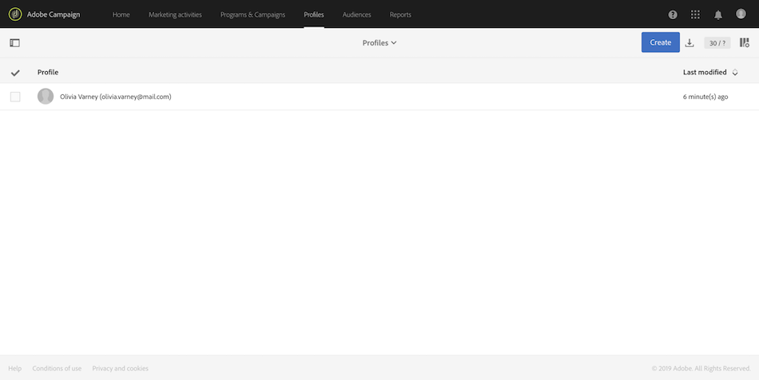

# 为何使用 Campaign Standard API {#why-using-campaign-standard-apis}

Adobe Campaign Standard提供的API允许现有系统与活动平台集成，以实时解决现实世界的问题。

诸如注册或退出页面之类的公共网站需要连接到后端系统以存储用户档案信息。 后端系统(如Adobe Campaign)具有灵活性和功能，可将用户档案数据引入其中并对其执行自定义操作。

以下是一些示例：

* 潜在客户在线注册。
* 现有客户用户档案和营销沟通偏好管理。
* 基于事件的交易通信触发——订单确认、预订行程、密码重置等。
* 甚至购物车废弃电子邮件通信。

注册登陆页为客户或潜在客户提供注册其姓名和电子邮件地址的方式。 Campaign Standard获取用户档案信息和偏好后，即可根据客户的兴趣发送个性化信息。

它们使用以下元素构建：

1. 具有活动API监听器的注册表单。

   

1. 要根据复选框执行的自定义操作。 与正常注册过程相比，选择“通过电子邮件发送特殊优惠”的客户将收到另一封包含礼品券的自定义邮件。

   

1. 用户档案在单击电子邮件中的“更新详细信息”链接后，可以更改其详细信息。 这将用户档案转到“更新用户档案和首选项详细信息”页面。 为了执行该操作，用户档案详细信息(Pkey)被传递到活动服务器，并且用户档案被检索并表示。 用户档案单击“更新”按钮后，信息将更新到系统中(通过PATCH命令)。

   

您可以使用一组请求来帮助您熟悉Campaign StandardAPI请求。 此JSON格式的集合提供预先设计的API请求，这些请求代表常见用例。

以下步骤描述了一个分步用例，用于导入和使用集合在Campaign Standard库中创建用户档案。

>[!NOTE]
>
>我们的例子是邮递员。 但是，您可以随意使用您最喜爱的REST客户端。

1. 单击[此处](https://helpx.adobe.com/content/dam/help/en/campaign/kb/working-with-acs-api/_jcr_content/main-pars/download_section/download-1/KB_postman_collection.json.zip)下载JSON集合。

1. 打开邮递员，然后选择&#x200B;**文件** / **导入**&#x200B;菜单。

1. 将下载的文件拖放到窗口中。 预先设计的API请求显示，随时可用。

   

1. 选择&#x200B;**创建用户档案**&#x200B;请求，然后使用您自己的信息(&lt;ORGANIZATION>、&lt;API_KEY>、&lt;ACCESS_TOKEN>)更新POST请求和&#x200B;**标题**&#x200B;选项卡。 如需详细信息，请参阅[此部分](../../api/using/setting-up-api-access.md)。

   

1. 使用要添加到新用户档案的信息填写&#x200B;**Body**&#x200B;选项卡，然后单击&#x200B;**发送**&#x200B;按钮以执行请求。

   

1. 创建对象后，主密钥(PKey)即与其关联。 该属性可见于调查响应以及其他属性。

   

1. 打开Campaign Standard实例，然后检查是否已创建用户档案，并包含有效负荷中的所有信息。

   
