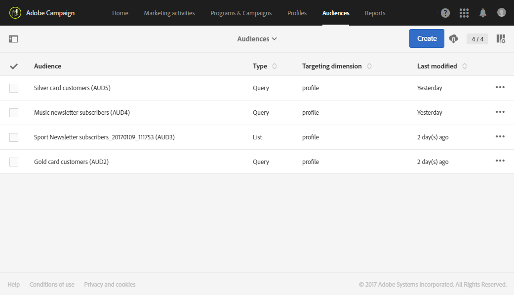

# 关于受众{#about-audiences}

受众是一种基于规则和属性的用户档案列表。

Adobe Campaign 允许您使用查询手动创建受众，或使用专用工作流自动创建受众。您也可以使用 Adobe Experience Cloud 中的共享受众。所有受众会重组为一个列表，该列表可通过 Adobe Campaign 主页上的 **[!UICONTROL Audiences]** 卡或 **[!UICONTROL Audiences]** 链接访问。

您可以在 Adobe Campaign 中处理不同的受众类型。受众的类型对应于其创建方式：

* **[!UICONTROL Query]**:指示受众是使用Adobe Campaign库中  的查询数据通过受众列表创建的。每次复用时都会重新计算由查询定义的受众。。
* **[!UICONTROL List]**：表示受众是固定的用户档案列表。这些列表在[工作流](../../automating/using/get-started-workflows.md)中创建，在工作流中保存受众时，数据维度是已知的。例如，定向活动（尤其是 **[!UICONTROL Query]**）后或对从文件导入的数据进行协调后。
* **[!UICONTROL File]**：表示受众是直接从[文件导入](../../automating/using/load-file.md)工作流创建的，且保存受众时数据维度未知。
* **[!UICONTROL Experience Cloud]**：表示受众是从 Adobe Experience Cloud 导入的。仅当配置了受众共享功能时，此选项才可用。有关更多信息，请参阅[从 Adobe Experience Cloud 导入受众](../../integrating/using/sharing-audiences-with-audience-manager-or-people-core-service.md#importing-an-audience)。

