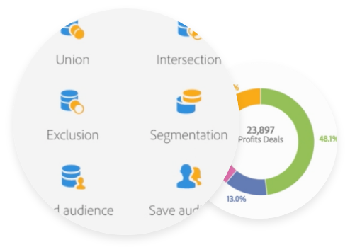

# 关于用户档案和受众{#about-profiles-and-audiences}

## 细分和定位

在创建活动或消息时，可以指定投放的目标，方法是从活动数据库中的联系人中进行选择，使用简单或高级条件，或选择受众。

使用集成的客户用户档案和自定义细分，在所有渠道中更有效地识别客户。 了解客户、兴趣、人口统计和渠道偏好后，创建引人注目的个性化体验会更轻松。

Adobe Campaign实时构建丰富的客户用户档案，使您能够随着客户偏好的变化提供更相关、更个性化的优惠。 此外，Adobe Campaign集成了高级分析、数据管理和定位功能以构建受众。

* 用户档案是存储在数据库中的各个联系人。

   每个用户档案对应于数据库中的一个条目，该条目包含该用户档案被定向、限定和单独跟踪的必要信息：Adobe Campaign可以跟踪线上和线下渠道的每次交互，并将其合并到一个用户档案中。

* 受众是根据特定标准或标准集构建的列表。

   使用工作流和查询编辑器，您可以根据您对营销活动、其活动和营销历史的信息，构建将由其定位的受众。 这允许您按不限数量的条件筛选订阅用户档案、样本或创建目标受众。

## 许可和同意

在开始向联系人发送消息之前，您需要确保获得其许可。 否则，您的电子邮件可能会标记为垃圾邮件，这将影响您的平台交付能力。 要确保构建健康的用户档案数据库，请首先保护此权限。 借助活动，我们建议您通过服务使用简单的加入和退出机制 ，并通过  登陆页更新联系信息并扩展数据库。

在消息中提供退订链接可使用户档案在必要时保持已列入黑名单，从而提高平台交付能力。 有关黑名单的详细信息， [请参阅关于选择加入和选择退出活动](../../audiences/using/about-opt-in-and-opt-out-in-campaign.md)。

>[!CAUTION]
>
>您必须遵守Adobe Campaign可接受 [的使用策略](https://www.adobe.com/legal/terms/aup.html)。

## 隐私合规性

Adobe Campaign优惠一套工具，帮助您遵守GDPR、CCPA和其他隐私法规的隐私合规性。 阅读本文，进一 [步了解隐私管理](https://helpx.adobe.com/campaign/kb/campaign-privacy.html) ，以及我们为管理访问权、被遗忘权、同意权、数据保留和用户角色提供的功能。 您还会找到最佳实践，以帮助您在使用我们的服务时遵守隐私权。

## 相关主题

| 有用页面 | 其他资源 |
|---|---|
| [创建受众](../../audiences/using/creating-audiences.md) | [使用受众目标服务](../../audiences/using/aep-about-audience-destinations-service.md) |
| [创建用户档案](../../audiences/using/creating-profiles.md) | [使用Microsoft Dynamics 365](../../integrating/using/working-with-campaign-standard-and-microsoft-dynamics-365.md) |
| [整合的客户档案](../../audiences/using/integrated-customer-profile.md) | [Adobe共享受众](../../integrating/using/sharing-audiences-with-audience-manager-or-people-core-service.md) |
| [关于 Campaign 中的选择启用和选择禁用](../../audiences/using/about-opt-in-and-opt-out-in-campaign.md) | [使用工作流导入用户档案](../../automating/using/importing-data.md) |
| [隐私管理(GDPR、CCPA)](https://helpx.adobe.com/campaign/kb/campaign-privacy.html) | [创建用户档案和受众（视频）](https://docs.adobe.com/content/help/en/campaign-standard-learn/tutorials/profiles-and-audiences/creating-profiles-and-audiences.html) |
