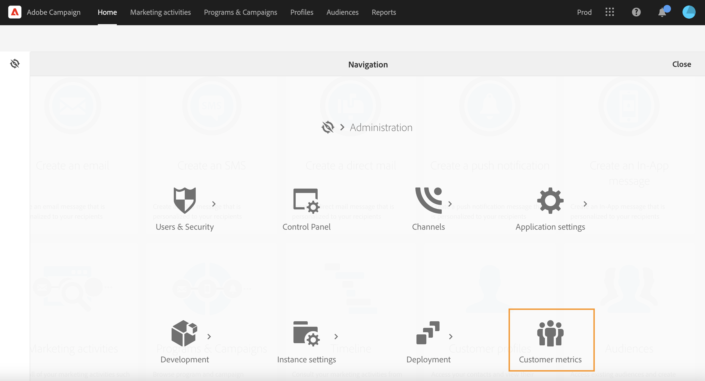
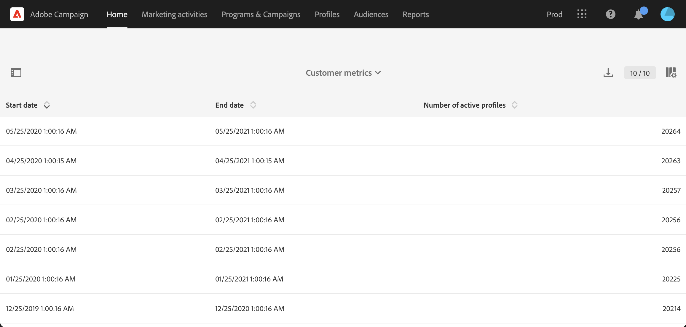

# 使用中的用户档案{#active-profiles}

您可以从 **[!UICONTROL Customer metrics]** 报表。 此报表仅供Campaign功能管理员使用。 要访问此报表，请单击 [用户界面](../../start/using/interface-description.md#advanced-menu)，然后浏览 **[!UICONTROL Administration > Customer metrics]**.

此报表由 **[!UICONTROL Billing]** 技术工作流，并显示 **活动用户档案**. 了解有关技术工作流的更多信息，请参阅 [本页](../../administration/using/technical-workflows.md).

“用户档案”是代表最终客户、潜在客户或潜在客户的信息记录。 考虑用户档案 **活动** 过去12个月内通过任何渠道被Campaign投放定向的。

根据您的合同，您的每个Campaign实例都配置了特定数量的活动用户档案。 有关已购买的活动用户档案的数量，请参阅您的许可协议。

* 在投放准备期间被排除的用户档案（例如，按分类规则或隔离机制）将不被考虑在内。

* 事务型消息的收件人会被计入活动用户档案。

* 被多个投放项目定位的用户档案只被计算一次。

* 此报表仅提供信息，对账单没有直接影响。

在页面底部，会列出定向维度，以及每个维度的用户档案数。 事务型消息的收件人与 **匿名** 维度。

>[!NOTE]
>
>作为管理员用户，您还可以直接从控制面板监控实例上使用的活动配置文件数量。 有关更多信息，请参阅 [控制面板文档](https://experienceleague.adobe.com/docs/control-panel/using/performance-monitoring/active-profiles-monitoring.html).
