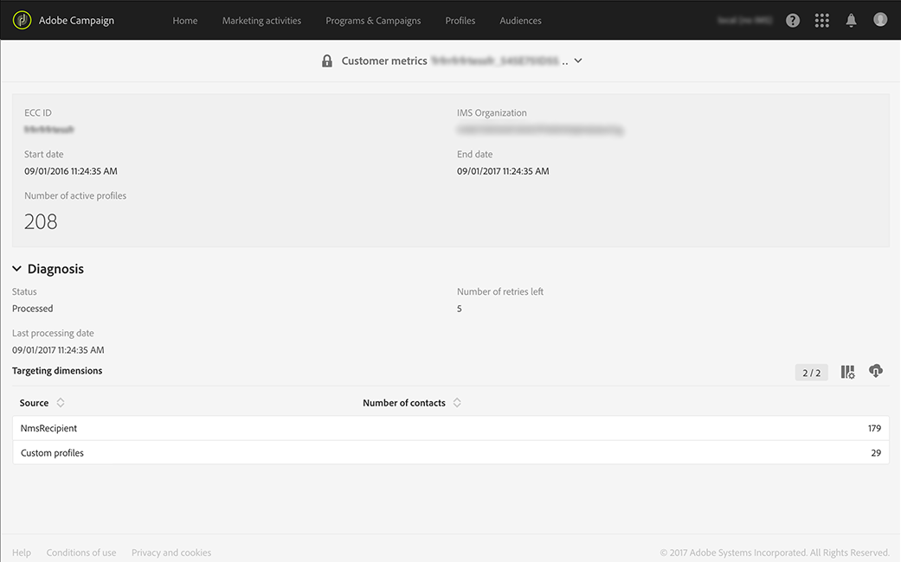

# 使用中的用户档案{#active-profiles}

Adobe Campaign提供一个报告，其中显示活动用户档案的数量。 此报告只提供信息，对账单没有直接影响。 只有管理员才能访问此报告，位于&#x200B;**[!UICONTROL Administration > Customer metrics]**&#x200B;下。

>[!NOTE]
>
>如果您使用的是内部版本10368中的Campaign Standard，则还可以直接从控制面板监视实例上使用的活动用户档案的数量。 有关详细信息，请参阅[控制面板文档](https://docs.adobe.com/content/help/en/control-panel/using/performance-monitoring/active-profiles-monitoring.html)。
>
>请注意，活动用户档案量度仅适用于&#x200B;**营销实例**。 它既不适用，也不适用于执行实例，即MID（中间采购）和RT（消息中心/实时消息）实例。

在准备投放时排除的用户档案(类型规则、隔离、对照组)不会被考虑在内。 被多个投放项目定位的用户档案只被计算一次。在报表底部，您将找到每个定位维度的活动用户档案列表。

此报表每月由&#x200B;**[!UICONTROL Billing]**&#x200B;技术工作流生成。 它包含在过去12个月滚动期间内目标的活动用户档案数。

请注意，在准备投放时排除的用户档案(类型规则、隔离)不会被考虑在内。 此外，一个被几个投放瞄准的用户档案只计一次。

在报表底部，您将找到由开单工作流处理的活动用户档案的列表:

* **[!UICONTROL NmsRecipient]**&#x200B;源包含使用其Campaign Standard用户档案中的信息联系的所有客户。

* 另一方面，仅使用特定信息（电子邮件地址、电话号码）而与活动用户档案无关的客户将归入&#x200B;**[!UICONTROL anonymous]**&#x200B;源。
