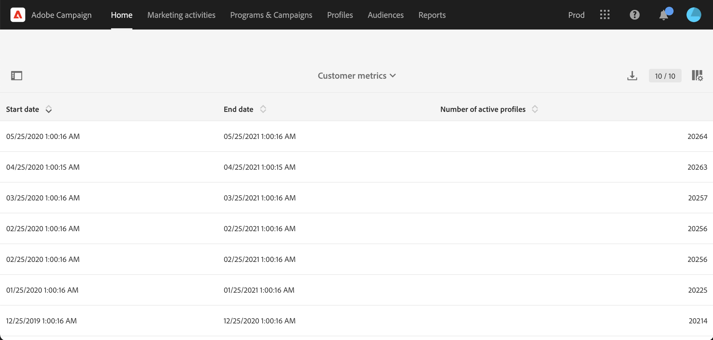

# 使用中的轮廓{#active-profiles}

您可以从&#x200B;**[!UICONTROL Customer metrics]**&#x200B;报表访问活动用户档案详细信息。 此报表仅供Campaign功能管理员使用。 要访问此报告，请单击[用户界面](../../start/using/interface-description.md#advanced-menu)左上角的Adobe Campaign图标，然后浏览至&#x200B;**[!UICONTROL Administration > Customer metrics]**。

该报告由&#x200B;**[!UICONTROL Billing]**&#x200B;技术工作流每月生成，并显示&#x200B;**活动用户档案**&#x200B;的数量。 在[此页面](../../administration/using/technical-workflows.md)中了解有关技术工作流的更多信息。

“用户档案”是代表最终客户、潜在客户或潜在客户的信息记录。 如果用户档案在过去12个月内通过任何渠道被Campaign投放定向，则将其视为&#x200B;**活动**。

根据您的合同，您的每个Campaign实例都会配置特定数量的活动用户档案。 请参阅您的许可协议，了解已购买的活动用户档案数量。

* 在投放准备期间（例如通过类型规则或隔离机制）排除的用户档案不会考虑在内。

* 事务性消息收件人计入活动用户档案。

* 被多个投放项目定位的用户档案只被计算一次。

* 此报告只提供信息，对账单没有直接影响。

在页面底部，列出定向维度以及每个维度的用户档案数。 事务性消息的收件人与&#x200B;**匿名**&#x200B;维度相关联。

>[!NOTE]
>
>作为管理员用户，您还可以直接从控制面板监控实例中使用的活动用户档案数。 有关详细信息，请参阅[控制面板文档](https://experienceleague.adobe.com/docs/control-panel/using/performance-monitoring/active-profiles-monitoring.html?lang=zh-Hans)。
>
