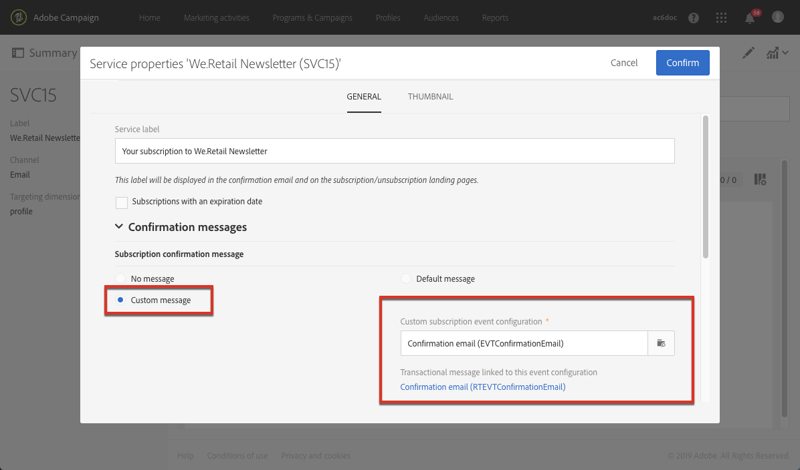
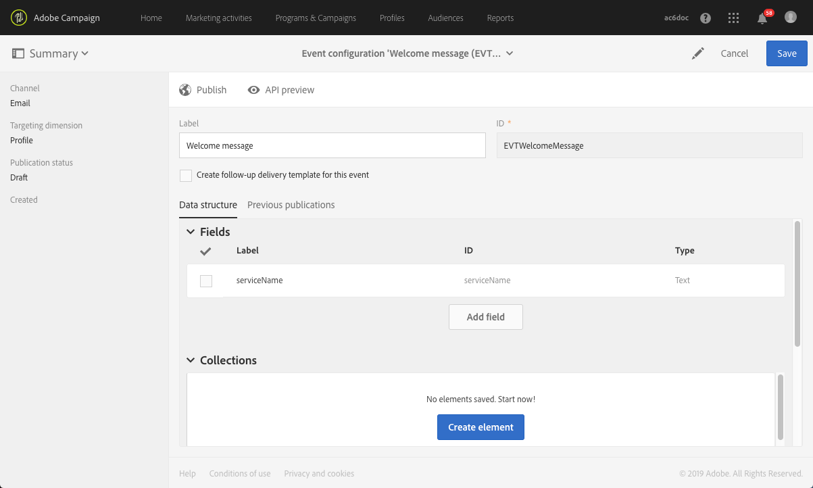

# 确认订阅服务{#confirming-subscription-to-a-service}

## 关于发送订阅确认函 {#sending-subscription-confirmation}

本节介绍如何向订阅特定服务的用户档案自动发送自定义确认电子邮件。

当您想要针对订阅（或退订）服务发送确认消息时，可以使用默认消息或自定义消息。有关选择确认消息的步骤，请参见[创建服务](../../audiences/using/creating-a-service.md)一节。

如果选择使用默认消息，则可编辑其内容，但具有以下限制：
* 您只能对来自事件上下文的有限字段提供个性化消息内容。
* 对于使用默认模式的所有服务，此消息都将是相同的。

要为指定服务发送特定的确认电子邮件，您可以创建自定义消息，在其中还可以利用来自其他资源的个性化字段。要实现此目的，必须创建并配置事务型消息。此消息可引用自：
* 服务本身。有关更多信息，请参阅[配置服务的确认消息](#configuring-confirmation-message-from-service)。
* 订阅登陆页面。有关更多信息，请参阅[配置登陆页面的确认消息](#configuring-confirmation-message-from-landing-page)。

## 配置来自服务的确认消息 {#configuring-confirmation-message-from-service}

例如，您希望向订阅您品牌新闻通讯的网站访客自动发送确认消息。

您需要配置事务型电子邮件，并从所需的服务（在本例中，为订阅您的品牌新闻通讯）引用该消息。为了使用服务信息扩充事务型消息，您可以在创建事件时定义协调。

配置来自服务的确认消息，使其仅在每个访客首次订阅该服务时发送确认事务型消息。如果某个用户档案已订阅，则不会再向该用户档案发送确认消息。

### 第 1 步：创建确认电子邮件 {#step-1--create-the-confirmation-email-1}

确认电子邮件将自动发送给（通过登陆页面或其他方式）订阅新闻通讯的每个用户档案。订阅被视为事件，而电子邮件作为[事务型消息](../../channels/using/getting-started-with-transactional-msg.md)，其目标是订阅了服务的每个用户档案。

创建确认电子邮件的步骤如下所示。由于服务中将要引用事务型消息，因此您需要先创建事务型消息。

#### 创建事件 {#create-the-event-1}

确认电子邮件是一种事务型消息，它会对“订阅服务”事件产生反应。随后将会发送此消息，以确认订阅您的新闻通讯。

1. 从 Adobe Campaign 徽标访问 **[!UICONTROL Marketing plans]** > **[!UICONTROL Transactional messages]** > **[!UICONTROL Event configuration]** 菜单，以创建事件。
1. 输入标签，选择定向维度并单击 **[!UICONTROL Create]**。

   有关配置步骤，请参见 [配置事务性事件](../../channels/using/configuring-transactional-event.md) 部分。

1. 在 **[!UICONTROL Fields]** 部分中，单击 **[!UICONTROL Create element]** 并将 **[!UICONTROL publicLabel]** 添加到数据结构，以启用协调。

   

   >[!NOTE]
   >
   >**[!UICONTROL publicLabel]** 字段属于必填字段。如果不将其添加到事件数据结构，Adobe Campaign 将无法与服务进行协调。订阅服务时，将使用对应服务的 **[!UICONTROL Service label]** 填充此字段。

1. 在 **[!UICONTROL Enrichment]** 部分中，单击 **[!UICONTROL Create element]** 并选择 **[!UICONTROL Service]** 目标资源。

   

1. 在 **[!UICONTROL Join definition]** 部分中，将 **[!UICONTROL Service]** 资源的 **[!UICONTROL publicLabel]** 字段映射到事件配置的 **[!UICONTROL publicLabel]** 字段。

   

   >[!NOTE]
   >
   >这样，您即可在事务型消息中使用来自 **[!UICONTROL Service]** 资源的个性化字段。

1. 保存事件配置并单击 **[!UICONTROL Publish]** 以发布事件。

事件准备就绪。现在，您可以设计事务型电子邮件消息。

#### 设计确认消息 {#design-the-confirmation-message-1}

确认电子邮件是一种基于上文中所发布事件的事务型消息。

1. 通过 Adobe Campaign 徽标，选择 **[!UICONTROL Marketing plans]** > **[!UICONTROL Transactional messages]** 并单击 **[!UICONTROL Transactional messages]**。
1. 选择与上文中所发布事件对应的事务型电子邮件。

1. 单击 **[!UICONTROL Content]** 部分，然后选择电子邮件模板。有关编辑事务型消息内容的更多信息，请参阅 [编辑事务型消息](../../channels/using/editing-transactional-message.md).
1. 由于您可以直接访问 **[!UICONTROL Service]** 资源的所有字段，因此您可以通过 **[!UICONTROL Context]** > **[!UICONTROL Real-time event (rtEvent)]** > **[!UICONTROL Event context (ctx)]** > **[!UICONTROL Service]** 节点选择任何字段，以将内容个性化。

   

   有关个性化事务型消息的更多信息，请参阅[此章节](../../channels/using/editing-transactional-message.md#personalizing-a-transactional-message)。

1. 使用测试用户档案预览消息。有关此内容的更多信息，请参阅 [定义特定测试用户档案](../../channels/using/testing-transactional-message.md#defining-specific-test-profile).

1. 单击 **[!UICONTROL Save & close]** 以保存您的内容。
1. 发布事务型消息。请参阅[发布事务型消息](../../channels/using/publishing-transactional-message.md#publishing-a-transactional-message)。

### 第 2 步：创建和配置服务 {#step-2--create-and-configure-the-service-1}

1. 从 Adobe Campaign 徽标访问高级菜单 **Profiles &amp; audiences** > **Services**，以创建服务。
1. 通过服务仪表板的  按钮，访问 **[!UICONTROL Service properties]** 部分。
1. 填写 **[!UICONTROL Service label]** 字段。

   

   >[!NOTE]
   >
   >您必须填写此字段才能启用与事务型消息的协调。

1. 在 **[!UICONTROL Confirmation messages]** 部分中，选择 **[!UICONTROL Custom message]**：利用此模式，可以为订阅服务的用户档案引用特定的确认消息。
1. 选择与所创建事务型消息关联的 **[!UICONTROL Custom subscription event configuration]**。

   

1. 单击 **[!UICONTROL Confirm]** 并保存服务。

现在，当用户档案订阅此服务时，他们将收到您定义的事务型消息，其中个性化字段映射到所选服务。

>[!NOTE]
>
>仅在用户首次订阅时发送消息。

## 配置来自登录页的确认消息 {#configuring-confirmation-message-from-landing-page}

您还可以使用登录页 **[!UICONTROL Job]** 部分的 **[!UICONTROL Start sending messages]** 选项，引用来自订阅登陆页面的确认消息。

引用登陆页面的确认消息时，每次提交登陆页面时都会发送消息（即使用户档案已订阅）。

### 第 1 步：创建确认电子邮件 {#step-1--create-the-confirmation-email-2}

确认电子邮件将自动发送给通过登陆页面订阅新闻通讯的每个用户档案。订阅被视为事件，而电子邮件作为[事务型消息](../../channels/using/getting-started-with-transactional-msg.md)，其目标是订阅了服务的每个用户档案。

创建这些元素的步骤如下所示。由于登录页中将要引用事务型消息，因此您需要先创建事务型消息。

#### 创建事件 {#create-the-event-2}

确认电子邮件是一种[事务型消息](../../channels/using/getting-started-with-transactional-msg.md)，它会对“订阅服务”事件产生反应。随后将会发送此消息，以确认订阅您的新闻通讯。

1. 从 Adobe Campaign 徽标访问 **[!UICONTROL Marketing plans]** > **[!UICONTROL Transactional messages]** > **[!UICONTROL Event configuration]** 菜单，以创建事件。
1. 输入标签，选择定向维度并单击 **[!UICONTROL Create]**。

   有关配置步骤，请参见 [配置事务性事件](../../channels/using/configuring-transactional-event.md) 部分。

1. 在 **[!UICONTROL Fields]** 部分中，单击 **[!UICONTROL Create element]** 并将 **[!UICONTROL serviceName]** 添加到数据结构，以启用协调。

   

   >[!NOTE]
   >
   >**[!UICONTROL serviceName]** 字段属于必填字段。如果不将其添加到事件数据结构，Adobe Campaign 将无法与订阅的服务进行协调。

1. 在 **[!UICONTROL Enrichment]** 部分中，单击 **[!UICONTROL Create element]** 并选择 **[!UICONTROL Service]** 目标资源。
1. 在 **[!UICONTROL Join definition]** 部分中，将 **[!UICONTROL Service]** 资源的 **[!UICONTROL serviceName]** 字段映射到事件配置的 **[!UICONTROL name]** 字段。

   

   >[!NOTE]
   >
   >这样，您即可在事务型消息中使用来自 [!UICONTROL Service] 资源的个性化字段。

#### 设计确认消息 {#design-the-confirmation-message-2}

有关设计事务型消息的步骤，请参阅本[章节](#design-the-confirmation-message-1)。

### 第 2 步：创建和配置服务 {#step-2--create-and-configure-the-service-2}

1. 从 Adobe Campaign 徽标访问高级菜单 **[!UICONTROL Profiles & audiences]** > **[!UICONTROL Services]**，以创建服务。
1. 通过服务仪表板的  按钮，访问 **[!UICONTROL Service properties]** 部分。
1. 填写 **[!UICONTROL Service label]** 字段。此标签将显示在确认消息和订阅登陆页面中。
1. 单击 **[!UICONTROL Confirm]** 并保存服务。

### 第 3 步：创建和配置登陆页面 {#step-3--create-and-configure-the-landing-page}

创建将发布在您网站上的订阅登陆页面。

要创建并配置此登陆页面，请执行以下步骤：

1. 根据 **[!UICONTROL Subscription]** 模板设计[新登陆页面](../../channels/using/getting-started-with-landing-pages.md)。
1. 编辑登陆页面的属性。在 **[!UICONTROL Job]** > **[!UICONTROL Specific actions]** 部分，选择 **[!UICONTROL Specific service]** 选项，然后从下拉列表中选择之前创建的服务。

   

1. 选择 **[!UICONTROL Start sending message]** 选项，然后从下拉列表中选择之前创建的事务型消息。

   

1. 自定义登陆页面的内容。

1. [测试和发布](../../channels/using/testing-publishing-landing-page.md)登陆页面。

现在，当用户档案通过提交登陆页面订阅您的新闻通讯时，将会收到您使用映射到服务的个性化字段定义的确认消息。

>[!NOTE]
>
>每次提交登陆页面时都会发送消息，即使用户档案已订阅。
