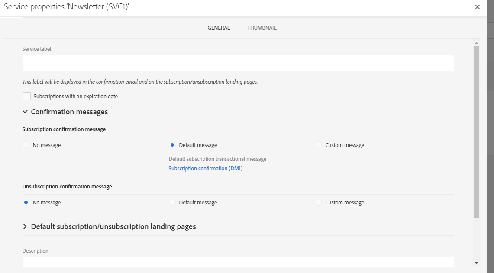

# 创建服务{#creating-a-service}

为了能够管理订阅，您首先需要创建并配置服务。通过配置新服务，可指定用户档案在订阅或取消订阅服务时将会收到的电子邮件确认函。您还可定义链接到服务的订阅和退订登陆页面。例如，插入到电子邮件中的服务订阅链接，可自动将用户档案定向到服务中指定的订阅登陆页面。

 [在视频中发现此功能](#video)

要配置服务，请执行以下操作：

1. 通过 Adobe Campaign 徽标访问高级菜单 **[!UICONTROL Profiles & audiences]** > **[!UICONTROL Services]**，添加新服务或选择现有服务。如果是创建新服务，只需按照屏幕上显示的步骤进行操作即可。

   提供了默认的服务模板。该模板预配置了默认登陆页面和确认电子邮件。您也可以创建其他模板以定义特定配置。有关更多信息，请参阅[管理模板](../../start/using/marketing-activity-templates.md)一节。

1. 通过服务仪表板 **[!UICONTROL Service properties]** 按钮访问  部分，为订阅和退订配置确认消息。

   

1. 选择 **[!UICONTROL Subscriptions with an expiration date]** 选项可设置订阅的有效期。

   

   您可以使用分段活动中的到期日期，定向订阅了未过期服务的用户档案。

1. 填写 **[!UICONTROL Service label]** 字段。使用自定义确认消息时，必须填写服务标签。

1. 选择用于订阅和退订的确认消息模板。提供了三种模式：

   * **[!UICONTROL No message]**：利用此模式可创建无确认消息的服务。
   * **[!UICONTROL Default message]**：利用此模式可使用默认订阅或退订确认事务型消息。使用默认模式的所有服务，都使用相同的通用默认确认消息。

      >[!NOTE]
      >
      >要修改默认消息，可单击 **[!UICONTROL Service properties]** 部分中的默认消息标签，或从 Adobe Campaign 事务型消息列表中选择默认消息（勾选 **[!UICONTROL Show internal transactional messages]** 方框后）。

   * **[!UICONTROL Custom message]**：利用此模式可处理特定于各项服务的自定义确认消息。然后，选择与特定[事务型消息模板](../../channels/using/getting-started-with-transactional-msg.md)关联的 **[!UICONTROL Custom subscription event configuration]**。有关更多信息，请参阅[确认订阅服务](../../audiences/using/confirming-subscription-to-a-service.md)。

1. 保存服务。服务现已准备就绪，可供使用。

创建服务后，即可对其进行推广。

**相关主题：**

* [推广服务](../../audiences/using/promoting-a-service.md)
* [创建由订阅者构成的受众](../../audiences/using/creating-audiences.md#creating-list-audiences)
* [将登陆页面链接到服务](../../channels/using/configuring-landing-page.md#linking-a-landing-page-to-a-service)

## 教程视频 {#video}

本视频说明如何创建服务和管理其订阅。

>[!VIDEO](https://video.tv.adobe.com/v/24673?quality=12)

提供了其他Campaign Standard操作方法视频 [此处](https://experienceleague.adobe.com/docs/campaign-standard-learn/tutorials/overview.html?lang=zh-Hans).
