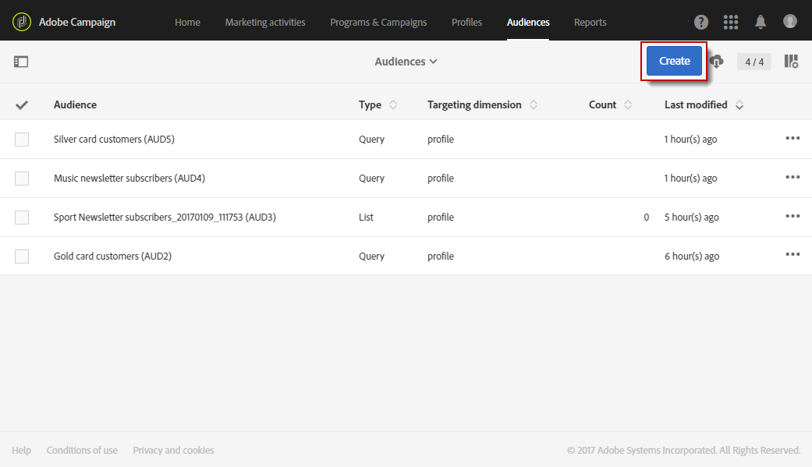

# 创建受众{#creating-audiences}

## 创建查询受众 {#creating-query-audiences}

本节介绍如何创建 **查询** 受众。 您还可以通过在工作流中导入文件或定位来创建 [受众](../../automating/using/get-started-workflows.md)。

在受众列表中，您可以通过对Adobe Campaign用户档案执行查询或导入Adobe Experience Cloud受众来创建受众。

1. 通过选项卡或卡转 **[!UICONTROL Audiences]** 到受众列表。

   

1. 选 **[!UICONTROL Create]** 择以访问屏幕以创建新受众。

   

1. 命名受众。 受众标签用于受众的列表和查询工具的调色板中。
1. 选择 **[!UICONTROL Query]** 受众类型： 由受众定义的查询在每次进一步使用时重新计算。

   

1. 然后，选 **[!UICONTROL Targeting dimension]** 择您要用于筛选客户的选项。 每个受众由单个定位维度组成。 例如，不能创建由受众、测试用户档案和订阅者组成的用户档案。 For more on targeting dimensions, refer to [this page](../../automating/using/query.md#targeting-dimensions-and-resources).
1. 创建查询以定义受众群。 请参阅编辑查询 [部分](../../automating/using/editing-queries.md)。
1. 单击按 **[!UICONTROL Create]** 钮以保存受众。

>[!NOTE]
>
>您可以向此受众添加说明，并通过图标定义访问 **[!UICONTROL Edit properties]** 授权。

## 创建列表受众 {#creating-list-audiences}

本节介绍如何在工作流中定 **位** 后创建列表受众。 您还可以通过将文件导入工作流或 [通过](../../automating/using/get-started-workflows.md) 菜单中的受众创建 **[!UICONTROL Audiences]** 查询。

要创建 **列表** 受众，步骤如下：

1. 在“营销 **活动** ”选项卡中， **单击创建** ，然 **后选择工作流**。

   

1. 拖放，然后配置定位活动，以便您选择具有已知维度的 **群体** 。 可用活动的列表及其配置详见定位 [活动部分](../../automating/using/about-targeting-activities.md) 。

   您可以使用 **[!UICONTROL Query]** 活动，或使用活动导入数 **[!UICONTROL Load file]** 据，然后 **[!UICONTROL Reconciliation]** 使用活动来标识导入数据的维度。 在此，我们希望目标订阅体育新闻快讯的收件人，并提供 **[!UICONTROL Query]** 活动。

   

1. 定位后，将活动拖放到 **[!UICONTROL Save audience]** 您的工作流中。 例如，您可以选择创建 **[!UICONTROL Create or update an audience]**&#x200B;此受众，然后使用新数据自动更新您的数据。 在这种情况下，请在工 **[!UICONTROL Scheduler]** 作流程的开头添加活动。

   有关配置此活动的详细信息，请参阅保 [存受众](../../automating/using/save-audience.md) 部分。

   

1. 保存并开始工作流。

   由于放 **[!UICONTROL Save audience]** 置在具有已知维度的定位之后，通过此活动创建的受众是 **列表** 受众。

   保存的受众的内容随后可在受众的详细视图中访问，该受众可通过列表访问。 此视图中可用的列与工作流保存过渡的入站活动的列相对应。 例如： 导入的文件的列，从查询添加的其他数据。

   

## 创建文件受众 {#creating-file-audiences}

本节详细介绍如何通过将文 **件导入** 到工作流中来创建文件受众。 您还可以在工作流中通过定位受众或 [通过](../../automating/using/get-started-workflows.md) 菜单中的查询创建 **[!UICONTROL Audiences]** 活动。

要创建文 **件受众** ，请执行以下步骤：

1. 在“营销 **活动** ”选项卡中， **单击创建** ，然 **后选择工作流**。
1. 拖放，然后配置一个 **[!UICONTROL Load file]** 活动，该允许您在执行工作流时导入 **维度未知** 的填充。 有关配置此活动的详细信息，请参阅“ [加载文件](../../automating/using/load-file.md) ”部分。

   

1. 在活动后拖 **[!UICONTROL Save audience]** 放一个 **[!UICONTROL Load file]** 活动。 有关配置此活动的详细信息，请参阅保 [存受众](../../automating/using/save-audience.md) 部分。
1. 保存并开始工作流。

   

   由于 **[!UICONTROL Save audience]** 在导入后放置，数据维未知，通过此活动创建的受众是文 **件受众** 。

   保存的受众的内容随后可在受众的详细视图中访问，该受众可通过列表访问。 此视图中可用的列与工作流保存过渡的入站活动的列相对应。 例如： 导入文件的列、从查询添加的其他数据。

   

## 创建Experience Cloud受众 {#creating-experience-cloud-audiences}

Adobe Campaign允许您使用Adobe Experience Cloud共享和交换受众。 Experience Cloud **类型受众** ，直接从People核心服务导入到具有技术工作流程 **[!UICONTROL Import shared audience]** 的Adobe Campaign。

与 **查询** 类型的受众(将从Adobe Campaign中查询用户档案)不 **同，Experience Cloud** 受众由列表访客ID组成。

要使此集成正常工作，您首先需要配置它。 有关配置以及如何通过People核心服务导入或导出受众的详细信息，请参阅以下 [部分](../../integrating/using/sharing-audiences-with-audience-manager-or-people-core-service.md)。

## 编辑受众 {#editing-audiences}

根据受众类型，有不同的编辑方式：

* 要编辑 **查询** ，请通过菜单转到受众的 **[!UICONTROL Audiences]** 列表，或 **[!UICONTROL Audiences]** 从Adobe Campaign主页中转到卡。

   打开相关受众。 可以编辑以前创建的受众的所有元素。

   >[!CAUTION]
   >
   >如果更改 **[!UICONTROL Filtering dimension]** 查询中的规则，则之前已定义的规则将丢失。

* 要编辑 **列表** 或文 **件受众，请编** 辑从中创建该的工作流，并修改 **[!UICONTROL Save audience]** 活动。 开始工作流，以便修改受众。
* 要编辑Experience Cloud **受众** ，请参阅带 [有People核心服务的导入／导](../../integrating/using/sharing-audiences-with-audience-manager-or-people-core-service.md) 出受众部分。

## 删除受众 {#deleting-audiences}

有两种方法可删除一个或多个受众。 首先，您可以向受众添加到期日

为此，请执行以下操作：

1. 访问您的受众。
1. 单击按  钮以访问受众的配置。

   

1. 在字段 **[!UICONTROL Expires on]** 中，为受众添加过期日期。

   

1. 然后 **[!UICONTROL Confirm]** 单击 **[!UICONTROL Save]**。

您的过期日期现已配置。 一旦到达此日期，您的受众将自动删除。

或者，如果需要删除受众，您只需选择一个或多个受众，然后单击该 **[!UICONTROL Delete element]** 按钮。

