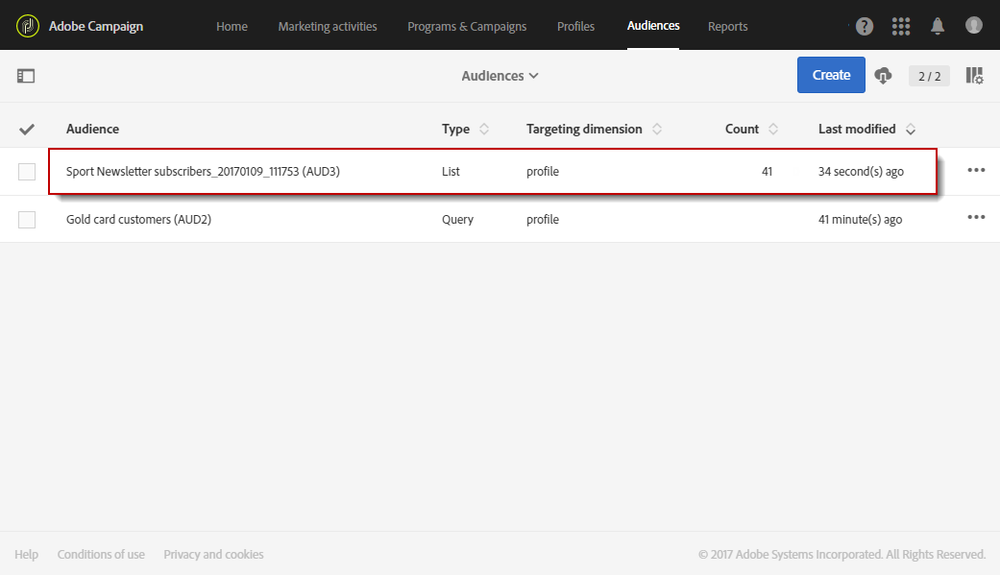
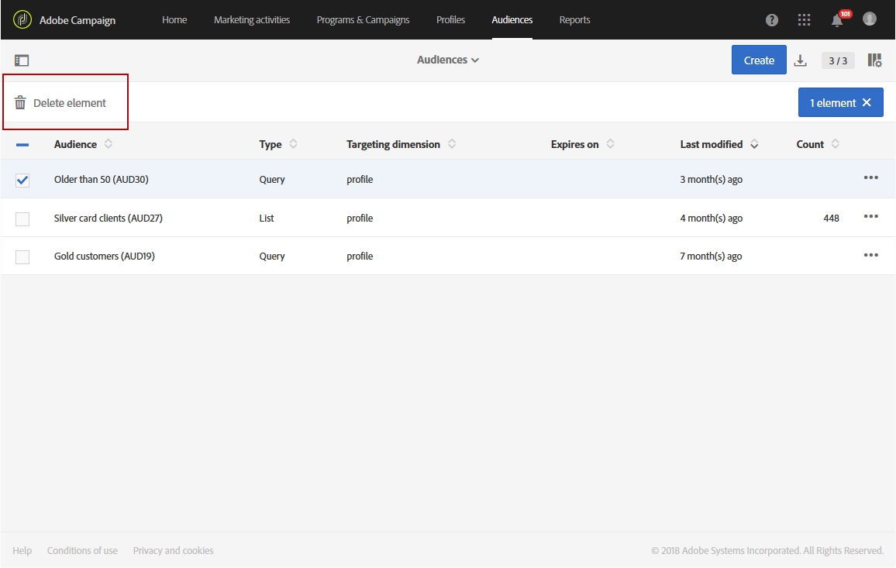

# Creating audiences{#creating-audiences}

## Creating query audiences {#creating-query-audiences}

This section describes how to create a **Query** audience. You can also create audiences from importing a file or targeting in a [workflow](../../automating/using/discovering-workflows.md).

从受众列表中，您可以通过执行有关Adobe Campaign配置文件的查询或导入Adobe Experience Cloud受众来创建受众。

1. Go to the audience list via the **[!UICONTROL Audiences]** tab or card.

   

1. Select **[!UICONTROL Create]** to access the screen to create a new audience.

   

1. 命名受众。受众标签用于受众列表和查询工具的调色板中。
1. Choose a **[!UICONTROL Query]** audience type: the audiences defined by a query are recomputed at each further use.

   

1. Then select the **[!UICONTROL Targeting dimension]** that you would like to use to filter your customers. 每个受众由单个定位维度组成。例如，您无法创建由档案、测试档案和订阅者构成的受众。For more on targeting dimensions, refer to [this page](../../automating/using/query.md#targeting-dimensions-and-resources).
1. 创建用于定义受众群体的查询。Refer to the section on [editing queries](../../automating/using/editing-queries.md).
1. Click the **[!UICONTROL Create]** button to save your audience.

>[!NOTE]
>
>You can add a description to this audience and define the access authorizations via the **[!UICONTROL Edit properties]** icon.

## Creating list audiences {#creating-list-audiences}

This section describes how to create a **List** audience after targeting in a workflow. You can also create audiences by importing a file into a [workflow](../../automating/using/discovering-workflows.md) or via a query from the **[!UICONTROL Audiences]** menu.

To create a **List** audience, the steps are as follows:

1. In the **Marketing activities** tab, click **Create** then select **Workflow**.

   

1. Drag and drop, and then configure the targeting activities which will allow you to select a population that has a **known** dimension. [“定位活动](../../automating/using/about-targeting-activities.md) ”部分详细介绍了可用活动及其配置的列表。

   You can use a **[!UICONTROL Query]** activity, or import data using a **[!UICONTROL Load file]** activity before using a **[!UICONTROL Reconciliation]** activity to identify the dimension of the data imported. Here, we want to target recipients who subscribed to the Sport Newsletter with a **[!UICONTROL Query]** activity .

   

1. After your targeting, drag and drop a **[!UICONTROL Save audience]** activity into your workflow. For example, you can chose to **[!UICONTROL Create or update an audience]**, this allows you to create then automatically update your audience with new data. In this case, add a **[!UICONTROL Scheduler]** activity at the beginning of your workflow.

   For more information on configuring this activity, refer to the [Save audience](../../automating/using/save-audience.md) section.

   

1. 保存并启动工作流。

   As the **[!UICONTROL Save audience]** is placed after a targeting with a known dimension, the audiences created via this activity are **List** audiences.

   随后，已保存受众的内容可在受众详细视图中获取，可通过受众列表访问。此视图中提供的列与工作流的保存活动的入站过渡的列相对应。例如：导入的文件的列，以及从查询中添加的其他数据。

   

## Creating file audiences {#creating-file-audiences}

This section details how to create a **File** audience by importing a file into a workflow. You can also create audiences from a targeting activity in a [workflow](../../automating/using/discovering-workflows.md) or via a query from the **[!UICONTROL Audiences]** menu.

To create a **File** audience, the steps are as follows:

1. In the **Marketing activities** tab, click **Create** then select **Workflow**.
1. Drag and drop, and then configure a **[!UICONTROL Load file]** activity which will allow you to import a population that has an **unknown** dimension when the workflow is executed. For more information on configuring this activity, refer to the [Load file](../../automating/using/load-file.md) section.

   

1. Drag and drop a **[!UICONTROL Save audience]** activity after the **[!UICONTROL Load file]** activity. For more information on configuring this activity, refer to the [Save audience](../../automating/using/save-audience.md) section.
1. 保存并启动工作流。

   

   As the **[!UICONTROL Save audience]** is placed after an import, the data dimension is unknown and the audiences created via this activity are **File** audiences.

   随后，已保存受众的内容可在受众详细视图中获取，可通过受众列表访问。此视图中提供的列与工作流的保存活动的入站过渡的列相对应。例如：导入的文件的列，以及从查询中添加的其他数据。

   

## Creating Experience Cloud audiences {#creating-experience-cloud-audiences}

Adobe Campaign允许您使用Adobe Experience Cloud共享和交换受众。**Experience Cloud** 类型受众通过 **[!UICONTROL Import shared audience]** 技术工作流程直接从People核心服务导入Adobe Campaign。

Unlike **Query** type audience which will query profiles from Adobe Campaign, the **Experience Cloud** audience is composed of a list of Visitor IDs.

要使此集成正常工作，您首先需要对其进行配置。For more information on configuration and how to import or export audiences with People core service, refer to the following [section](../../integrating/using/sharing-audiences-with-audience-manager-or-people-core-service.md).

## Editing audiences {#editing-audiences}

根据受众类型编辑受众有多种不同的方法：

* To edit a **Query** audience, go to the list of audiences via the **[!UICONTROL Audiences]** menu, or the **[!UICONTROL Audiences]** card from the Adobe Campaign home page.

   打开相关受众。可以编辑以前创建的受众的所有元素。

   >[!CAUTION]
   >
   >If you change the **[!UICONTROL Filtering dimension]** in the query, the rules that have previously been defined will be lost.

* To edit a **List** or **File** audience, edit the workflow from which it was created and modify the **[!UICONTROL Save audience]** activity. 启动工作流，以便修改受众。
* To edit an **Experience Cloud** audience, refer to the [Importing/Exporting audiences with People core service](../../integrating/using/sharing-audiences-with-audience-manager-or-people-core-service.md) section.

## Deleting audiences {#deleting-audiences}

有两种方法可删除一个或多个受众。首先，您可以向受众添加过期日期

要执行此操作，请执行以下操作：

1. 访问受众之一。
1. Click the  button to access your audience's configuration.

   

1. **[!UICONTROL Expires on]** 在字段中，向受众添加过期日期。

   

1. Click **[!UICONTROL Confirm]** then **[!UICONTROL Save]**.

此时将配置过期日期。到达此日期后，受众将自动删除。

Or if you need to delete an audience, you can simply select one or several audiences then click the **[!UICONTROL Delete element]** button.

