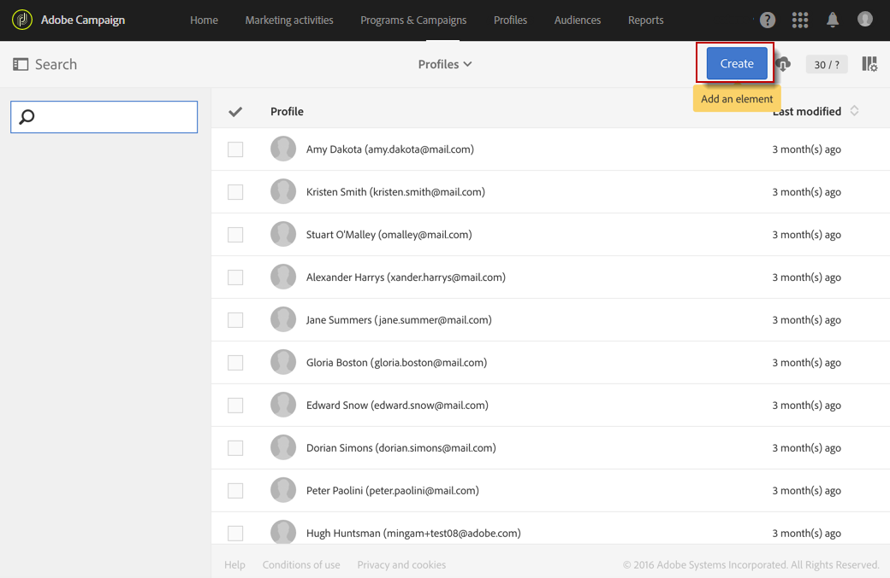

# 创建用户档案{#creating-profiles}

在Adobe Campaign中，配置文件默认用于定义消息的主要目标。

要在Campaign中创建或更新配置文件，您可以：

* 通过工作流从文件导入配置文件列 [表](https://helpx.adobe.com/campaign/kt/acs/using/acs-importing-profiles-feature-video-using.html)
* 通过登陆页面在线收 [集数据](../../channels/using/about-landing-pages.md)
* 通过 [REST API批量创建](http://docs.campaign.adobe.com/doc/standard/en/api/ACS_API.html)
* 从 [Microsoft Dynamics同步配置文件](https://helpx.adobe.com/campaign/kb/acs-ms-dynamics.html)
* 使用图形界面屏幕输入数据，如下所述

例如，要直接在用户界面中创建新配置文件，请执行以下步骤：

1. 在Adobe Campaign主页中，单击“客户配置 **文件** ”卡或“配置 **文件** ”选项卡以访问配置文件列表。

   

1. 然后单击 **[!UICONTROL Create]**。

   

1. 输入配置文件数据。

   

   * 联系信息，如名字、姓氏、性别、出生日期、照片、首选语言(针对多语种电子邮 [件](../../channels/using/creating-a-multilingual-email.md))，有助于更好地个性化交付。
   * 配置文件的 **[!UICONTROL Time zone]** 用于在配置文件的时区发送交付。 For more on this, refer to this [section](../../sending/using/sending-messages-at-the-recipient-s-time-zone.md).
   * 该类 **[!UICONTROL Channels]** 别包含电子邮件地址、手机号码和退出信息，可让您了解访问配置文件的渠道。
   * 一 **[!UICONTROL No longer contact]** 旦配置文件取消订阅渠道，该类别即会更新。
   * 该 **[!UICONTROL Address]** 类别包含需要填写的邮政地址以及向此配置 **[!UICONTROL Address specified]** 文件发送 [直邮的选项](../../channels/using/about-direct-mail.md) 。 如果未选 **[!UICONTROL Address specified]** 中此选项，则此配置文件将从每封直邮中排除。
   * 该类 **[!UICONTROL Access authorization]** 别指示配置文件的组织单位(以管 [理权限](../../administration/using/about-access-management.md))。 另请参阅分 [区配置文件](../../administration/using/organizational-units.md#partitioning-profiles)。
   * 该类 **[!UICONTROL Traceability]** 别会自动更新，其中包含有关创建或修改配置文件的用户的信息。

1. Click **[!UICONTROL Create]** to save the profile.

配置文件现在将显示在列表中。

>[!NOTE]
>
>也可以使用Adobe Campaign Standard API创建配置文件。 有关详细信息，请参阅专 [用文档](https://final-docs.campaign.adobe.com/doc/standard/en/api/ACS_API.html#creating-profiles) 。

配置文件也可以根据组织单位进行分区。 要将组织字段添加到配置文件，请参阅分区配 [置文件部分](../../administration/using/organizational-units.md#partitioning-profiles) 。

>[!NOTE]
>
>首选语言字段用于在发送多语言消息时选择语言。 有关多语言消息的详细 [信息，请参阅本页](../../channels/using/creating-a-multilingual-email.md)。

**相关主题：**

* [关于登陆页面](../../channels/using/about-landing-pages.md) ，分步指南
* [导入配置文件](https://helpx.adobe.com/campaign/kt/acs/using/acs-importing-profiles-feature-video-using.html)

