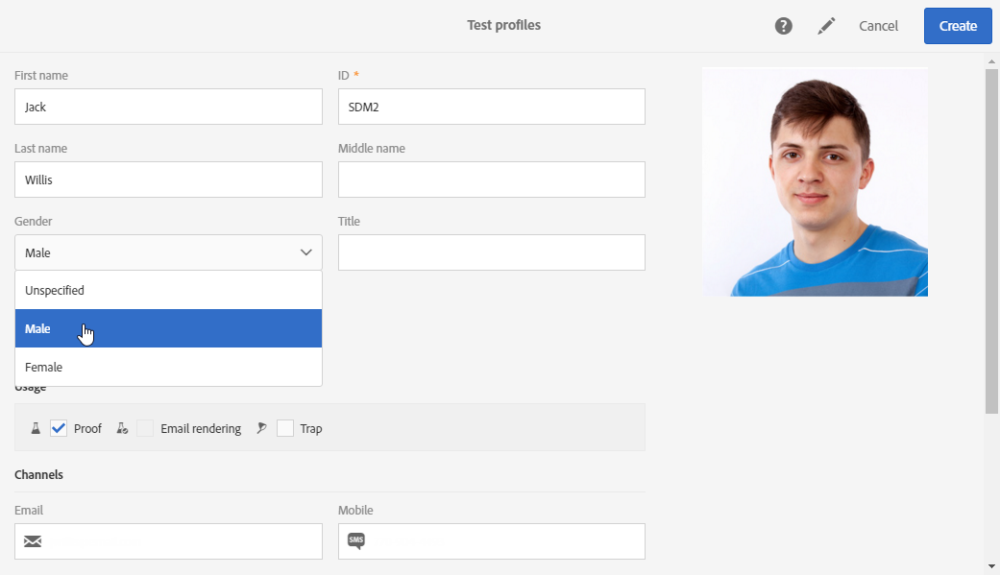

# 管理测试轮廓 {#managing-test-profiles}

## 关于测试用户档案 {#about-test-profiles}

利用测试轮廓可定向不符合所规定定向标准的其他收件人。 可以将测试用户档案添加到消息的受众，以检测收件人数据库是否用于任何欺诈行为，或确保电子邮件送达收件箱中。

 [通过观看视频了解此功能](#video)

您可以通过高级菜单 **[!UICONTROL Profiles & audiences > Test profiles]** 管理测试轮廓。

测试轮廓包含虚构的联系信息或由发送者控制的联系信息，这些信息随后将被用在以下上下文的消息中：

* 用于发送&#x200B;**校样**：校样是一种特定的消息，用于在将最终消息投放到收件人之前对消息进行测试。 校样测试轮廓负责检查投放的内容和格式。 请参阅[发送校样](../../sending/using/sending-proofs.md)。
* 用于&#x200B;**电子邮件渲染**：电子邮件渲染测试轮廓用于检查在收件人的收件箱中显示消息的方式。 例如，Web邮件、消息服务、移动设备等。查看[电子邮件渲染](../../sending/using/email-rendering.md)。

  **电子邮件渲染**&#x200B;仅以只读状态提供使用。 用于此用途的测试轮廓，仅可用在 Adobe Campaign 中。

* 作为&#x200B;**陷阱**：消息看起来像是发送给主目标，其实是发送到测试轮廓。 请参阅[使用陷阱](../../sending/using/using-traps.md)。
* 用于&#x200B;**预览**&#x200B;消息：在预览消息以测试个性化元素时，可以选择测试轮廓。 请参阅[预览消息](/help/sending/using/previewing-messages.md)。

## 创建测试用户档案 {#creating-test-profiles}

1. 从高级菜单中，通过 Adobe Campaign 徽标，选择 **Profiles &amp; audiences > Test profiles**，以访问测试用户档案的列表。

   

1. 在 **[!UICONTROL Test profiles]** 仪表板中，单击 **Create**。

   

1. 输入此轮廓的数据。

   

1. 选择测试轮廓的预期用途。

   

1. 根据需要输入联系渠道 **[!UICONTROL Email, Telephone, Mobile, Mobile app]** 以及测试轮廓地址。

   >[!NOTE]
   >
   >您可以定义偏好的电子邮件格式：**[!UICONTROL Text]** 或 **[!UICONTROL HTML]**。

1. 如果要使用此测试轮廓测试事务型消息的个性化情况，请指定此事件的事件类型和数据。
1. 单击 **[!UICONTROL Create]** 以保存测试轮廓。

该测试轮廓随后将添加到轮廓的列表。

## 编辑测试用户档案 {#editing-test-profiles}

要编辑测试轮廓并查阅与其链接的数据，或对其进行修改，请执行以下步骤：

1. 单击想要编辑之测试轮廓的图像，以选择该测试轮廓。
1. 查阅或修改其字段。

   

1. 单击 **[!UICONTROL Save]**（如果已输入更改），或选择测试轮廓的名称，然后在屏幕顶部选择 **[!UICONTROL Test profiles]** 以返回测试轮廓仪表板。

## 教程视频 {#video}

本视频说明如何创建测试用户档案。

>[!VIDEO](https://video.tv.adobe.com/v/328367?captions=chi_hans&quality=12)

[此处](https://experienceleague.adobe.com/docs/campaign-standard-learn/tutorials/overview.html?lang=zh-Hans)提供了其他Campaign Standard操作方法视频。
