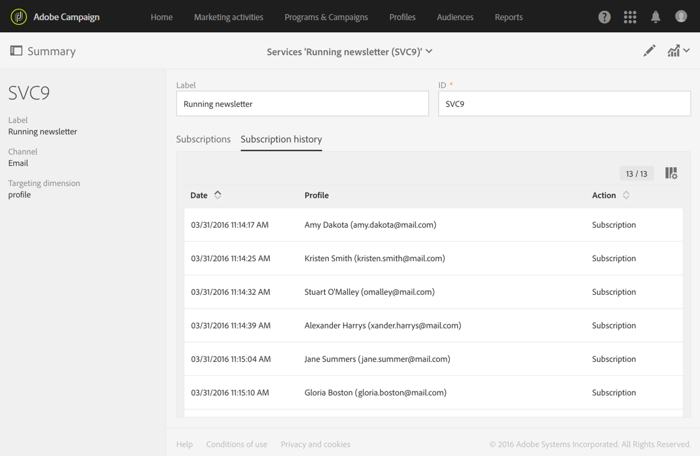

# 监视订阅{#monitoring-subscriptions}

使用Adobe Campaign界面跟踪订阅者并衡量服务的成功程度。

您有多种选项可用于监视订阅与退订:

* 视图服务仪表板中当前订阅您服务的人员的列表。 请参 [阅服务仪表板](#service-dashboard)。
* 从服务订阅的订阅历史记录选项卡 **中查** 阅仪表板和退订的历史记录。 查看 [订阅历史](#subscription-history)。
* 显示详细说明服务报告中订阅和退订演变的 **报告**。 请参阅 [服务报告](#service-reports)。
* 查找用户从其列表订阅的服务 **用户档案**。 请参 [阅链接到事件的历史记录](#history-of-events-linked-to-a-profile)。

## 服务仪表板 {#service-dashboard}

视图订阅服务的人员的列表:

1. 通过高级菜单列表和用户档案>服 **务转到服务** , ****&#x200B;可从Adobe Campaign徽标访问该受众。
1. 选择您选择的服务以显示相应的仪表板。
1. 订阅服务的人员的列表位于“订阅”选 **项卡** 。

## 订阅历史 {#subscription-history}

要查阅订阅和退订历史记录，请执行以下操作：

1. 通过高级菜单列表和用户档案>服 **务转到服务** , ****&#x200B;可从Adobe Campaign徽标访问该受众。
1. 选择您选择的服务以显示相应的仪表板。
1. 选择订阅 **历史记录** 选项卡，以显示每个人订阅和取消订阅的日期。

## 服务报告 {#service-reports}

要显示详细说明订阅和退订演变的报告，请执行以下操作：

1. 通过高级菜单列表和用户档案>服 **务转到服务** , ****&#x200B;可从Adobe Campaign徽标访问该受众。
1. 选择您选择的服务以显示相应的仪表板。
1. 单击操 **作栏** 中的“报告”按钮，然后 **在选择屏** 幕中进行订阅监视。

   

1. 服务 **摘要报** 告显示订阅的数量、订阅的总体演化，以及显示一段时间内的进度的曲线。

## 链接到事件的用户档案历史 {#history-of-events-linked-to-a-profile}

要咨询联系人订阅的服务列表，可咨询其营销历史。 有关此方面的详细信息，请参阅集 [成式客户档案](../../audiences/using/integrated-customer-profile.md) 部分。

