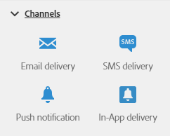

# 关于渠道活动{#about-channel-activities}

从屏幕左侧的面板，展开 **[!UICONTROL Channels]** 部分。

这些活动代表各种的可用通信渠道。您可以将它们组合在一起，创建跨渠道工作流。

**[!UICONTROL Channels]** 部分提供了以下活动：

* [电子邮件投放](../../automating/using/email-delivery.md)
* [短信投放](../../automating/using/sms-delivery.md)
* [推送通知投放](../../automating/using/push-notification-delivery.md)
* [直邮投放](../../automating/using/direct-mail-delivery.md)
* [应用程序内投放](../../automating/using/in-app-delivery.md)
