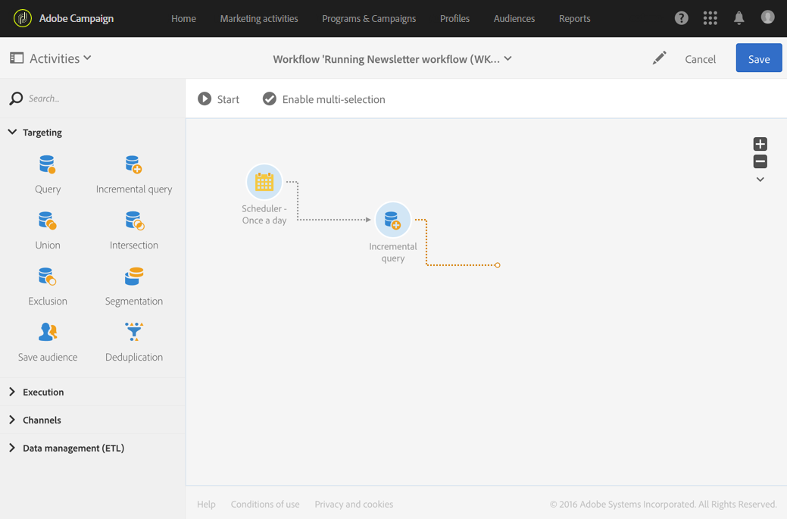

# 关于工作流执行 {#about-workflow-execution}

工作流始终手动启动。 但是，一旦启动，它就会保持不活动状态，具体取决于在调度程序活动中指 [定的](../../automating/using/scheduler.md) 信息。

>[!CAUTION]
>
> Adobe建议客户排定工作流执行的优先级，并运行多达二十个并发工作流执行，以始终在您的实例中实现最佳性能。 可计划并执行超过20个并发工作流，默认情况下将按顺序执行。 您可以通过向客户关怀部门提交票证来调整并发工作流执行的最大次数的默认设置。

执行相关操作(开始、停止、暂停等) 是异 **步进** 程：该命令将被保存，并在服务器可用来应用该命令后生效。

在工作流中，每个活动的结果通常通过过渡（用箭头表示）发送到以下活动。

如果过渡未链接到目标活动，则该将不终止。

>[!NOTE]
>
>仍可以执行包含未结束过渡的工作流：将生成警告消息，工作流在到达过渡后将暂停，但不会生成错误。 您还可以在未完成设计的情况下开始工作流，并可以随时完成设计。

执行活动后，过渡中发送的记录数将显示在其上方。

您可以打开过渡，检查在执行工作流期间或执行工作流之后发送的数据是否正确。您可以视图数据和数据结构。

默认情况下，只能访问工作流上一过渡的详细信息。 要能够访问前面活动的结果，您需要在启动工作流 **[!UICONTROL Keep interim results]** 之前检查 **[!UICONTROL Execution]** 工作流属性部分中的选项。

>[!NOTE]
>
>此选项占用大量内存，旨在帮助构建工作流并确保其正确配置和行为。 在制作实例中，请不要勾选该选项。

打开过渡时，您可以编辑其或 **[!UICONTROL Label]** 将其链 **[!UICONTROL Segment code]** 接到它。 为此，请编辑相应的字段并确认修改。

使用Campaign StandardREST API，您可 **以开始**、暂 **停**、恢 **复和停** 止 **工作** 流程。 您可以在API文档中找到更多详细信息和REST [调用示例。](../../api/using/controlling-a-workflow.md)
