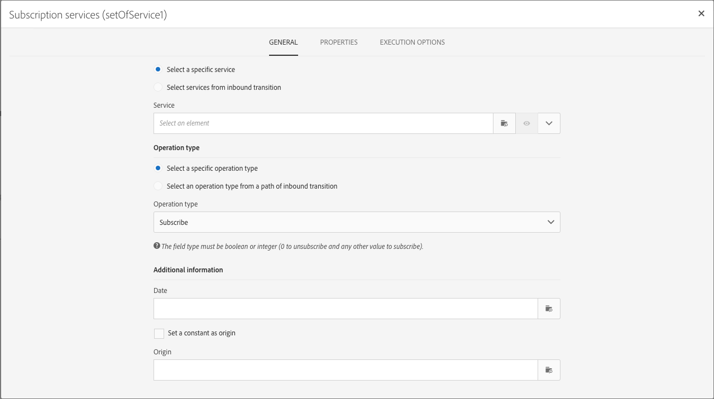

# 管理活动属性 {#activity-properties}

## 活动的全局属性 {#global-properties-of-an-activity}

每个活动都有一个 **[!UICONTROL General]** 选项卡，用于修改特定于活动的常规参数。

此 **[!UICONTROL Properties]** 选项卡允许您修改活动的全局参数，尤其是标签和ID。 配置此选项卡是可选的。

## 管理活动的叫客过渡 {#managing-an-activity-s-outbound-transitions}

默认情况下，某些活动没有叫客过渡。 您可以从以下位置添加 **[!UICONTROL Transitions]** 选项卡或从活动的 **[!UICONTROL Properties]** 选项卡，将其他进程应用到同一工作流中的群体。

根据活动，您可以添加多种类型的叫客过渡：

* **标准过渡**：由活动计算的群体
* **无填充过渡**：可添加此类型的叫客过渡以继续工作流，它不包含任何群体以不占用系统上任何不必要的空间。
* **拒绝**：群体被拒绝。 例如，如果活动的集客数据因不正确或不完整而无法处理。
* **补充**：执行活动后剩余的群体。 例如，如果分段活动配置为仅保存集客群体的某个百分比。

如果适用，请指定 **[!UICONTROL Segment code]** （活动的叫客过渡）。 利用此段代码，可识别目标群体的子集来自何处，并且以后可用于消息个性化目的。

## 活动执行选项 {#activity-execution-options}

在活动的属性屏幕中，有一个 **[!UICONTROL Advanced options]** 选项卡，用于定义活动在出现错误时的执行模式和行为。

要访问这些选项，请在工作流中选择活动，然后使用  按钮。

此 **[!UICONTROL Execution]** 字段允许您定义启动任务时要执行的操作。 这有三个选项：

* **普通**：活动正常执行。
* **启用但不执行**：活动已暂停，随后执行的任何未来流程也会暂停。 如果您希望在任务启动时出席，这可能会很有用。
* **不启用**：不执行活动，因此后续的所有活动也不都会执行（在同一分支中）。

此 **[!UICONTROL In case of error]** 字段，用于指定活动遇到错误时要执行的操作。 有两个选项可用于此目的：

* **暂停进程**：工作流自动暂停。 然后，工作流状态为 **错误** 颜色会变红。 问题解决后，请重新启动工作流。
* **忽略**：不执行活动，因此也不执行之后任何活动（在同一分支中）。 事实可能会证明，这对于周期性任务非常有用。 如果分支具有置于上游的调度程序，这应在下一个执行日期触发。

此 **[!UICONTROL Behavior]** 字段允许您定义在使用异步任务时要遵循的过程。 有两个选项可用于此目的：

* **已授权多个任务**：即使第一个任务未完成，可以同时执行多个任务。
* **当前任务具有优先级**：在任务进行中时，此优先顺序为。 只要一项任务仍在进行中，就不会执行其他任务。

此 **[!UICONTROL Max. execution duration]** 字段可让您指定持续时间，如“30s”或“1h”。 如果活动在指定的持续时间过后未完成，则会触发警报。 这对工作流的运行方式没有影响。

此 **[!UICONTROL Affinity]** 字段允许您强制在特定计算机上执行工作流或工作流活动。 要实现此目的，必须为相关工作流或活动指定一个或多个任务相关性。

此 **[!UICONTROL Time zone]** 字段允许您选择活动的时区。 Adobe Campaign允许您在同一实例上管理多个国家/地区之间的时差。 应用的设置将在创建实例时配置。

>[!NOTE]
>
>默认情况下，如果未选择时区，活动将使用工作流属性中定义的时区。

此 **注释** 字段是一个自由字段，可用于添加注释。
