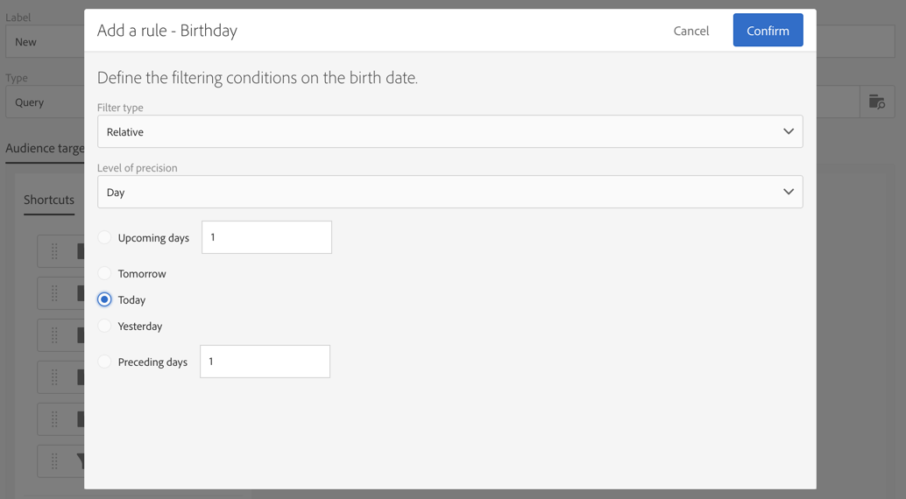

# 生日投放 {#birthday-delivery}

本示例是生日工作流。每天向当天生日的用户档案发送一封电子邮件。

要构建工作流，请执行以下步骤：

* [调度程序](../../automating/using/scheduler.md)允许您每天上午8点开始工作流。

   

* [查询](../../automating/using/query.md)活动允许您计算每次执行工作流时，已提供电子邮件且其生日在当天的用户档案。 使用查询编辑工具面板中提供的预定义过滤器，执行生日计算。

   

* [电子邮件投放](../../automating/using/email-delivery.md)重复。 按月聚合发送情况。因此，一个月内发送的所有电子邮件，都会被聚合到单独的一个视图中。因此，一年内要执行 365 次投放，但在 Adobe Campaign 界面中，已将它们重组为 12 个视图（也称&#x200B;**定期执行**）。历史记录和报告将按月提供而不是按每次发送提供。

   
