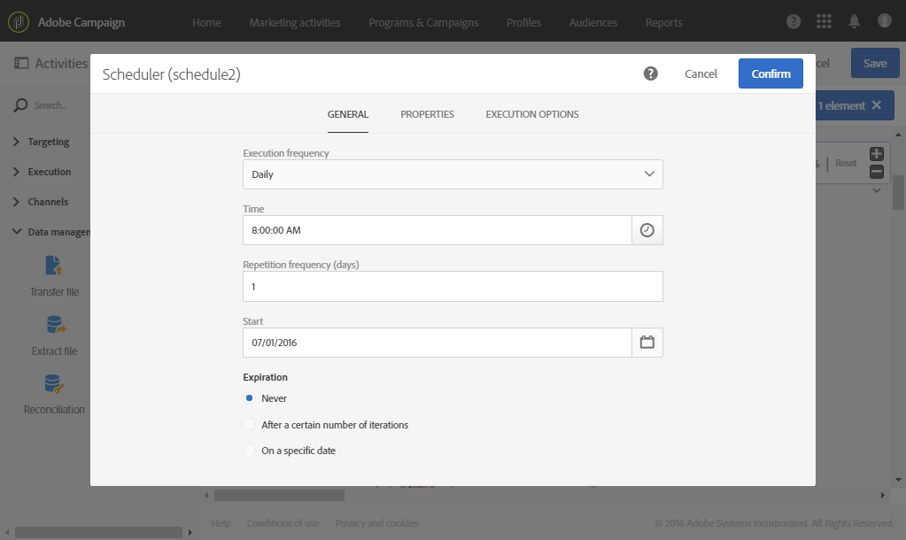

# 生日投放 {#birthday-delivery}

本示例是生日工作流。每天向当天生日的用户档案发送一封电子邮件。

要构建工作流，请按照以下步骤操作：

* The [Scheduler](../../automating/using/scheduler.md) allows you to start the workflow every day at 8am.

   

* The [Query](../../automating/using/query.md) activity allows you to calculate the profiles who have provided an email and whose birthday it is on the current day, every time the workflow is executed. 使用查询编辑工具面板中提供的预定义过滤器，执行生日计算。

   

* 电子 [邮件投放](../../automating/using/email-delivery.md) ，将重复出现。 按月聚合发送情况。因此，一个月内发送的所有电子邮件，都会被聚合到单独的一个视图中。因此，一年内要执行 365 次投放，但在 Adobe Campaign 界面中，已将它们重组为 12 个视图（也称&#x200B;**定期执行**）。历史记录和报告将按月提供而不是按每次发送提供。

   
