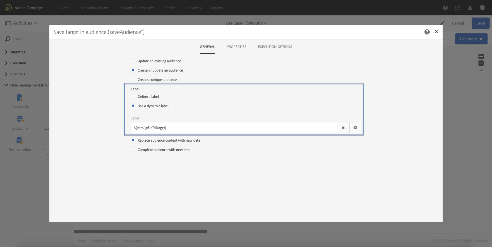

# Calling a workflow with external parameters{#calling-a-workflow-with-external-parameters}

Campaign Standard允许您调用包含参数的工作流(受众名称到目标、要导入的文件名、消息内容的一部分等等)。这样，您就可以轻松地将营销活动自动化与外部系统集成在一起。

我们来看下一个示例，我们希望从CMS直接发送电子邮件。在这种情况下，您可以配置系统以选择受众并将电子邮件内容发送到CMS。单击“发送”后，将使用这些参数调用营销活动工作流，使您能够使用这些参数定义要在分发中使用的受众和URL内容。

调用具有参数的工作流的过程如下：

1. Declare the parameters in the **[!UICONTROL External signal]** activity. See [Declaring the parameters in the External signal activity](../../automating/using/calling-a-workflow-with-external-parameters.md#declaring-the-parameters-in-the-external-signal-activity).
1. Configure the **[!UICONTROL End]** activity or the API call to define the parameters and trigger the workflow **[!UICONTROL External signal]** activity.

触发工作流后，参数将被收录到工作流的事件变量中，并可在工作流中使用。See [Customizing a workflow with external parameters](../../automating/using/calling-a-workflow-with-external-parameters.md#customizing-a-workflow-with-external-parameters).


## Declaring the parameters in the External signal activity {#declaring-the-parameters-in-the-external-signal-activity}

The first step to call a workflow with parameters is to declare them in an **[!UICONTROL External signal]** activity.

1. Open the **[!UICONTROL External signal]** activity, then select the **[!UICONTROL Parameters]** tab.
1. Click the **[!UICONTROL Create element]** button, then specify the name and type of each parameter.

   >[!CAUTION]
   >
   >Make sure that the name and number of parameters are identical to what is defined when calling the workflow (see [Defining the parameters when calling the workflow](../../automating/using/calling-a-workflow-with-external-parameters.md#defining-the-parameters-when-calling-the-workflow)). 此外，参数的类型必须符合所需的值。

   

1. 声明参数后，完成工作流配置，然后运行它。

## Defining the parameters when calling the workflow {#defining-the-parameters-when-calling-the-workflow}

本节详细介绍了如何在调用工作流时定义参数。For more on how to perform this operation from an API call, refer to the [REST APIs documentation](https://docs.campaign.adobe.com/doc/standard/en/api/ACS_API.html).

在定义参数之前，请确保：

* The parameters have been declared in the **[!UICONTROL External Signal]** activity. See [Declaring the parameters in the External signal activity](../../automating/using/calling-a-workflow-with-external-parameters.md#declaring-the-parameters-in-the-external-signal-activity).
* 包含信号活动的工作流正在运行。

To configure the **[!UICONTROL End]** activity, follow the steps below:

1. Open the **[!UICONTROL End]** activity, then select the **[!UICONTROL External signal]** tab.
1. 选择要调用的工作流和外部信号活动。
1. Click the **[!UICONTROL Create element]** button to add a parameter, then fill in its name and value.

   * **[!UICONTROL Name]**： **[!UICONTROL External signal]** 活动中已声明的名称(请参阅 [在外部信号活动中声明参数](../../automating/using/calling-a-workflow-with-external-parameters.md#declaring-the-parameters-in-the-external-signal-activity))。
   * **[!UICONTROL Value]**：要分配给参数的值。The value should follow the **Standard syntax**, described in [this section](../../automating/using/advanced-expression-editing.md#standard-syntax).
   

   >[!CAUTION]
   >
   >Make sure that all the parameters have been declared in the **[!UICONTROL External signal]** activity. 否则，运行活动时将发生错误。

1. 定义参数后，确认活动，然后保存工作流。

## Monitoring the events variables {#monitoring-the-events-variables}

可以监视工作流中可用的事件变量，包括声明的外部参数。要执行此操作，请执行以下步骤：

1. Select the activity that follows the **[!UICONTROL External signal]** activity, then click the **[!UICONTROL Log and tasks]** button.
1. **[!UICONTROL Tasks]** 在选项卡中，单击  按钮。

   

1. 任务的执行上下文(ID、状态、持续时间等)包括所有可在工作流中使用的活动变量。

   

## Customizing a workflow with external parameters {#customizing-a-workflow-with-external-parameters}

触发工作流后，参数将被收录到事件变量中，并可用于自定义工作流的活动。

They can, for example, be used to define which audience to read in the **[!UICONTROL Read audience]** activity, the name of the file to transfer in the **[!UICONTROL Transfer file]** activity, etc.

[本节详细介绍了可使用活动变量自定义的活动](../../automating/using/calling-a-workflow-with-external-parameters.md#customizing-activities-with-events-variables)。

### Using events variables {#using-events-variables}

Events variables are used within an expression that must respect the **[Standard syntax](../../automating/using/advanced-expression-editing.md#standard-syntax)**.

The syntax to use events variables must follow the format below, and use the parameter's name that has been defined in the **[!UICONTROL External signal]** activity (see [Declaring the parameters in the External signal activity](../../automating/using/calling-a-workflow-with-external-parameters.md#declaring-the-parameters-in-the-external-signal-activity)):

```
$(vars/@parameterName)
```

In this syntax, the **$** function returns **string** data type. 如果要指定其他类型的数据，请使用以下函数：

* **$ long**：整数。
* **$ float**：小数。
* **$ boolean**：true/false。
* **$ datetime**：时间戳。

使用活动中的变量时，界面提供了调用的帮助。


* ：在工作流中的所有可用变量之间选择events变量(请参阅)。

   

* ：编辑变量和函数的表达式。For more on the Expression editor, refer to [this section](../../automating/using/advanced-expression-editing.md).

   

**相关主题：**

* [编辑表达式](../../automating/using/advanced-expression-editing.md#edit-an-expression)
* [标准语法](../../automating/using/advanced-expression-editing.md#standard-syntax)
* [函数列表](../../automating/using/list-of-functions.md)

### Customizing activities with events variables {#customizing-activities-with-events-variables}

事件变量可用于自定义多个活动，如下一节所示。For more on how to call a variable from an activity, refer to [this section](../../automating/using/calling-a-workflow-with-external-parameters.md#using-events-variables).

**[!UICONTROL Read audience]** 活动：根据事件变量定义受众定位。

For more on how to use the activity, refer to the [dedicated section](../../automating/using/read-audience.md).


**[!UICONTROL Test]** 活动：构建条件。

For more on how to use the activity, refer to the [dedicated section](../../automating/using/test.md).


**[!UICONTROL Transfer file]** 活动：根据事件变量自定义要传输的文件。

For more on how to use the activity, refer to the [dedicated section](../../automating/using/transfer-file.md).


**[!UICONTROL Query]** 活动：参数可在查询中引用，方法是使用表达式组合事件变量和函数。To do this, add a rule then click the **[!UICONTROL Advanced mode]** link to access the expression editing window (see [Advanced expression editing](../../automating/using/advanced-expression-editing.md)).

For more on how to use the activity, refer to the [dedicated section](../../automating/using/query.md).


**[!UICONTROL Channels]** 活动：基于事件变量进行个性化交付。

>[!NOTE]
>
>每次准备分发时，都会检索传送参数的值。
>
>Recurring deliveries preparation is based on the delivery **aggregation period**. 例如，如果汇总期为“按天”，则分发将每天仅重新准备一次。如果在一天内修改了分发参数的值，则不会在分发过程中更新它，就像它已经准备好一次一样。
>
>If you plan on calling the workflow multiple times a day, use the [!UICONTROL No aggregation] option, so that the delivery parameters are updated each time. For more on recurring deliveries configuration, refer to [this section](/help/automating/using/email-delivery.md#configuration).

要根据事件变量个性化交付，您必须首先将变量声明为要使用的变量：

1. Select the activity, then click the  button to access the settings.
1. Select the **[!UICONTROL General]** tab, then add the events variables that will be available as personalization fields in the delivery.

   

1. Click the **[!UICONTROL Confirm]** button.

现在，已在个性化字段列表中提供已声明的事件变量。您可以在分发中使用它们执行以下操作：

* 定义要用于交付的模板的名称。

   >[!NOTE]
   >
   >This action is available for **recurring** deliveries only.

   

* Personalize the delivery: when selecting a personalization field to configure a delivery, events variables are available in the **[!UICONTROL Workflow parameters]** element. 您可以将其用作任何个性化字段，例如，定义交付主题、发送方等。

   Delivery personalization is detailed in [this section](../../designing/using/about-personalization.md).

   

**区段代码**：根据事件变量定义区段代码。

>[!NOTE]
>
>This action can be performed from any activity that lets you define a segment code like, for example, **[!UICONTROL Query]** or **[!UICONTROL Segmentation]** activities.


## Use case {#use-case}

以下用例显示了如何使用工作流中的参数调用工作流。

目标是使用外部参数从API调用触发工作流。此工作流将从文件加载数据并创建关联的受众。创建受众后，将触发第二个工作流以发送使用API调用中定义的外部参数个性化的消息。

要执行此用例，您需要执行以下操作：

1. **发出API调用** 以触发带外部参数的Workflow1。See [Step 1: Configuring the API call](../../automating/using/calling-a-workflow-with-external-parameters.md#step-1--configuring-the-api-call).
1. **构建工作流1**：该工作流将传输一个文件并将其加载到数据库中。然后，它将测试数据是否为空，最后将配置文件保存到受众中。最后，它将触发Workflow2。See [Step 2: Configuring Workflow 1](../../automating/using/calling-a-workflow-with-external-parameters.md#step-2--configuring-workflow-1).
1. **构建工作流2**：该工作流将读取在Workflow中创建的受众，然后向配置文件发送个性化消息，其中包含使用参数自定义的区段代码。See [Step 3: Configuring Workflow 2](../../automating/using/calling-a-workflow-with-external-parameters.md#step-3--configuring-workflow-2).


### Prerequisites {#prerequisites}

Before configuring the workflows, you need to create Workflow 1 and 2 with an **[!UICONTROL External signal]** activity in each of them. 这样，在调用工作流时，您将能够定位这些信号活动。

### Step 1: Configuring the API call {#step-1--configuring-the-api-call}

发出API调用以触发带参数的Workflow1。For more on the API call syntax, refer to the [Campaign Standard REST APIs documentation](https://docs.campaign.adobe.com/doc/standard/en/api/ACS_API.html).

在我们的情况下，我们希望使用以下参数调用工作流：

* **FileTarget**：要导入数据库的文件的名称。
* **DiscountDesc**：我们希望显示到折扣的说明。

```
-X POST https://mc.adobe.io/<ORGANIZATION>/campaign/<TRIGGER_URL>
-H 'Authorization: Bearer <ACCESS_TOKEN>' 
-H 'Cache-Control: no-cache' 
-H 'X-Api-Key: <API_KEY>' 
-H 'Content-Type: application/json;charset=utf-8' 
-H 'Content-Length:79' 
-i
-d {
-d "source:":"API",
-d "parameters":{
-d "fileToTarget":"profile.txt",
-d "discountDesc":"Running shoes"
-d } 
```

### Step 2: Configuring Workflow 1 {#step-2--configuring-workflow-1}

Workflow将构建如下：

* **[!UICONTROL External signal]** 活动：其中必须声明外部参数才能在工作流中使用。
* **[!UICONTROL Transfer file]** 活动：以参数中定义的名称导入文件。
* **[!UICONTROL Load file]** 活动：将导入的文件中的数据加载到数据库中。
* **[!UICONTROL Update data]** 活动：使用导入的文件中的数据插入或更新数据库。
* **[!UICONTROL Test]** 活动：检查是否已导入数据。
* **[!UICONTROL Save audience]** 活动：如果文件包含数据，则将配置文件保存到受众中。
* **[!UICONTROL End activity]** 活动：向Workflow调用您要在其中使用的参数。


请按照以下步骤配置工作流：

1. 声明在API调用中定义的参数。To do this, open the **[!UICONTROL External signal]** activity, then add the parameters' names and types.

   

1. Add a **[!UICONTROL Transfer file]** activity to import data into the database.To do this, drag and drop the activity, open it, then select the **[!UICONTROL Protocol]** tab.
1. Select the **[!UICONTROL Use a dynamic file path]** option, then use the **fileToTarget** parameter as the file to transfer:

   ```
   $(vars/@fileToTarget)
   ```

   

1. 将文件中的数据加载到数据库中。

   To do this, drag and drop a **[!UICONTROL Load file]** activity into the workflow, then configure it according to your needs.

1. 使用导入的文件中的数据插入和更新数据库。

   To do this, drag and drop an **[!UICONTROL Update data]** activity, then select the **[!UICONTROL Identification]** tab to add a reconciliation criteria (in our case the **email** field).

   

1. Select the **[!UICONTROL Fields to update]** tab, then specify the fields to update in the database (in our case the **firstname** and **email** fields).

   

1. 检查是否从文件检索数据。To do this, drag and drop a **[!UICONTROL Test]** activity into the workflow, then click the **[!UICONTROL Add an element]** button to add a condition.
1. 命名并定义条件。在我们的情况下，我们希望测试出站过渡包含的数据是否包含以下语法：

   ```
   $long(vars/@recCount)>0
   ```

   

1. 如果检索数据，则将其保存到受众中。To do this, add a **[!UICONTROL Save audience]** activity to the **Target not empty** transition, then open it.
1. Select the **[!UICONTROL Use a dynamic label]** option, then use the **fileToTarget** parameter as the label of the audience:

   ```
   $(vars/@fileToTarget)
   ```

   

1. Drag and drop an **[!UICONTROL End]** activity that will call Workflow 2 with parameters, then open it.
1. Select the **[!UICONTROL External signal]** tab, then specify the workflow to trigger and its associated signal activity.
1. 定义要在Workflow及其关联值中使用的参数。

   In our case, we want to pass the parameters originally defined in the API call (**fileToTarget** and **discountDesc**), and an additional **segmentCode** parameter with a constant value ("20% discount").

   

配置工作流1，您现在可以构建Workflow2。For more on this, refer to [this section](../../automating/using/calling-a-workflow-with-external-parameters.md#step-3--configuring-workflow-2).

### Step 3: Configuring Workflow 2 {#step-3--configuring-workflow-2}

Workflow将构建如下：

* **[!UICONTROL External signal]** 活动：要在工作流中使用参数必须声明参数。
* **[!UICONTROL Read audience]** 活动：读取在Workflow中保存的受众。
* **[!UICONTROL Email delivery]** 活动：将重复的消息发送给目标受众，并使用参数进行个性化。


请按照以下步骤配置工作流：

1. 声明在Workflow中定义的参数。

   To do this, open the **[!UICONTROL External signal]** activity, then add the name and type of each parameter defined in the **[!UICONTROL End]** activity of Workflow 1.

   

1. 使用在Workflow中保存的受众。To do this, drag and drop a **[!UICONTROL Read audience]** activity into the workflow, then open it.
1. Select the **[!UICONTROL Use a dynamic audience]** option, then use the **fileToTarget** parameter as the name of the audience to read:

   ```
   $(vars/@fileToTarget)
   ```

   

1. Name the outbound transition according to the **segmentCode** parameter.

   To do this, select the **[!UICONTROL Transition]** tab, then the **[!UICONTROL Use a dynamic segment code]** option.

1. Use the **segmentCode** parameter as the name of the outbound transition:

   ```
   $(vars/@segmentCode)
   ```

   

1. Drag and drop an **[!UICONTROL Email delivery]** activity to send a message to the audience.
1. Identify the parameters to use in the message to personalize it with the **discountDesc** parameter. 为此，请打开活动的高级选项，然后添加参数名称和值。

   

1. 您现在可以配置消息。Open the activity, then select **[!UICONTROL Recurring email]**.

   

1. 选择要使用的模板，然后根据需要定义电子邮件属性。
1. Use the **discountDesc** parameter as a personalization field. 为此，请从个性化字段列表中选择它。

   

1. 您现在可以完成配置消息的配置，然后照常发送它。

   

### Executing the workflows {#executing-the-workflows}

构建工作流后，您可以执行这些工作流。确保在执行API调用之前启动两个工作流。
