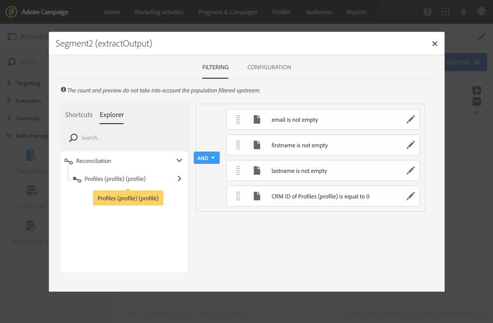

# 创建用于导入数据的工作流模板 {#import-workflow-template}

如果需要定期导入结构相同的文件，使用导入模板是最佳做法。

此示例说明如何预先设置一个工作流，该工作流可用于导入来自用户档案库中CRM的Adobe Campaign。

1. 从创建新的工作流模板 **[!UICONTROL Resources > Templates > Workflow templates]**。
1. 添加以下活动:

   * **[!UICONTROL Load file]**:定义包含要导入的数据的文件的预期结构。

      >[!NOTE]
      >
      >只能从单个文件导入数据。 如果工作流有多个 **[!UICONTROL Load file]** 活动，则每次都使用同一文件。

   * **[!UICONTROL Reconciliation]**:协调导入的数据与数据库数据。
   * **[!UICONTROL Segmentation]**:创建过滤器，根据记录是否可以对帐，以不同方式处理记录。
   * **[!UICONTROL Deduplication]**:在将数据插入数据库之前，从传入文件中消除重复数据。
   * **[!UICONTROL Update data]**:使用导入的用户档案更新数据库。

   

1. 配置 **[!UICONTROL Load file]** 活动:

   * 通过上传示例文件来定义预期结构。 示例文件应仅包含几行，但包含导入所需的所有列。 检查并编辑文件格式，确保正确设置每列的类型：文本、日期、整数等。 例如：

      ```
      lastname;firstname;birthdate;email;crmID
      Smith;Hayden;23/05/1989;hayden.smith@mailtest.com;123456
      ```

   * 在部分 **[!UICONTROL File to load]** 中，选 **[!UICONTROL Upload a new file from the local machine]** 择该字段并将其留空。 每次从此模板创建新工作流时，您都可以在此处指定所需的文件，只要该文件与定义的结构相对应。

      您可以使用任何选项，但必须相应地修改模板。 例如，如果您选择 **[!UICONTROL Use the file specified in the inbound transition]**&#x200B;了此选项，则 **[!UICONTROL Transfer file]** 可以在之前添加活动，以检索要从FTP/SFTP服务器导入的文件。

      如果希望用户能够下载包含导入过程中发生的错误的文件，请选中该 **[!UICONTROL Keep the rejects in a file]** 选项并指定 **[!UICONTROL File name]**。

      

1. 配置 **[!UICONTROL Reconciliation]** 活动。 此活动的目的是识别传入数据。

   * 在选项 **[!UICONTROL Relations]** 卡中，选 **[!UICONTROL Create element]** 择并定义导入数据与收件人定位维度之间的链接(请参 [阅定位维度和资源](../../automating/using/query.md#targeting-dimensions-and-resources))。 在此示例中， **CRM ID自定** 义字段用于创建连接条件。 只要字段允许识别唯一记录，就可以使用所需字段或字段组合。
   * 在选项卡 **[!UICONTROL Identification]** 中，将选项保留 **[!UICONTROL Identify the document from the working data]** 为未选中状态。

   

1. 配置活动 **[!UICONTROL Segmentation]** 以在一个过渡和收件人中检索已协调的收件人，这些无法协调，但在第二个过渡中具有足够的数据。

   然后，具有已协调过渡的收件人可以用于更新数据库。 如果文件中有最少一组信息可用，则具有未知过渡的收件人随后可用于在数据库中创建新收件人条目。

   在补充出站收件人中，将选择无法协调且没有足够数据的过渡，并可以在单独的文件中导出，或只是忽略。

   * 在活动 **[!UICONTROL General]** 的选项卡中，将设置 **[!UICONTROL Resource type]** 为 **[!UICONTROL Temporary resource]** 并选择作 **[!UICONTROL Reconciliation]** 为目标集。
   * 在选 **[!UICONTROL Advanced options]** 项卡中，选 **[!UICONTROL Generate complement]** 中该选项可查看是否无法在数据库中插入任何记录。 如果需要，您随后可以对补充数据应用进一步处理：文件导出、列表更新等。
   * 在选项卡的第一个 **[!UICONTROL Segments]** 区段中，在入站人口中添加过滤条件，以仅选择用户档案的CRM ID不等于0的记录。 这样，在该子集中选择与来自用户档案库的数据协调的文件数据。

      

   * 添加第二个段，该段选择具有足够数据要插入数据库的未协调记录。 例如：电子邮件地址、名字和姓氏。 未对帐的记录的用户档案CRM ID值等于0。

      

   * 在前两个子集中未选择的所有记录都在中选择 **[!UICONTROL Complement]**。

1. 配置位 **[!UICONTROL Update data]** 于之前配置的活动的第一个出站过渡 **[!UICONTROL Segmentation]** 之后的活动。

   * 选 **[!UICONTROL Update]** 择为 **[!UICONTROL Operation type]** ，因为入站过渡只包含数据库中已存在的收件人。
   * 在选 **[!UICONTROL Identification]** 项卡中， **[!UICONTROL Using reconciliation criteria]** 选择并定义在-用户档案和在 **[!UICONTROL Dimension to update]** 活动中创建的链接之间的键 **[!UICONTROL Reconciliation]** 。 在此示例中， **使用CRM** ID自定义字段。

      

   * 在选 **[!UICONTROL Fields to update]** 项卡中，指示用户档案维中的字段，以使用文件中的相应列的值进行更新。 如果文件列的名称与收件人维字段的名称相同或几乎相同，则可以使用魔棒按钮自动匹配不同的字段。

      

      >[!NOTE]
      >
      >如果您计划向这些用户档案发送直邮，请确保包含邮政地址，因为此信息对于直邮提供者至关重要。 同时确保选中 **[!UICONTROL Address specified]** 用户档案信息中的框。 要从工作流更新此选项，只需向要更新的字段中添加元素，然后 **指定** 1 **[!UICONTROL Source]** 作为，然 `postalAddress/@addrDefined` 后选择字段 **[!UICONTROL Destination]**。 有关直邮和使用此选项的详细 **[!UICONTROL Address specified]** 信息，请参 [阅此文档](../../channels/using/about-direct-mail.md#recommendations)。

1. 配置位 **[!UICONTROL Deduplication]** 于包含未对帐活动的过渡之后的用户档案:

   * 在选 **[!UICONTROL Properties]** 项卡中，将 **[!UICONTROL Resource type]** 其设置为从工作流的活动 **[!UICONTROL Reconciliation]** 生成的临时资源。

      

   * 在此示例中，电子邮件字段用于查找唯一用户档案。 您可以使用您确定已填写的任何字段，并且它是唯一组合的一部分。
   * 选择 **[!UICONTROL Deduplication method]**。 在这种情况下，应用程序自动决定在出现重复时保留哪些记录。

   

1. 配置先 **[!UICONTROL Update data]** 前配置活动之 **[!UICONTROL Deduplication]** 后的活动。

   * 选 **[!UICONTROL Insert only]** 择为 **[!UICONTROL Operation type]** ，因为入站过渡只包含数据库中不存在的用户档案。
   * 在选 **[!UICONTROL Identification]** 项卡中， **[!UICONTROL Using reconciliation criteria]** 选择并定义在-用户档案和在 **[!UICONTROL Dimension to update]** 活动中创建的链接之间的键 **[!UICONTROL Reconciliation]** 。 在此示例中， **使用CRM** ID自定义字段。

      

   * 在选 **[!UICONTROL Fields to update]** 项卡中，指示用户档案维中的字段，以使用文件中的相应列的值进行更新。 如果文件列的名称与收件人维字段的名称相同或几乎相同，则可以使用魔棒按钮自动匹配不同的字段。

      

      >[!NOTE]
      >
      >如果您计划向这些用户档案发送直邮，请确保包含邮政地址，因为此信息对于直邮提供者至关重要。 同时确保选中 **[!UICONTROL Address specified]** 用户档案信息中的框。 要从工作流更新此选项，只需向要更新的字段添加元素， **将** 1 **[!UICONTROL Source]** 指定为， **[然后将postalAddress/@addrDefined]** 字段选为 **[!UICONTROL Destination]**。 有关直邮和使用此选项的详细 **[!UICONTROL Address specified]** 信息，请参 [阅此文档](../../channels/using/about-direct-mail.md#recommendations)。

1. 在活动的第三个 **[!UICONTROL Segmentation]** 过渡之后，如 **[!UICONTROL Extract file]** 果要跟踪未插入 **[!UICONTROL Transfer file]** 的数据，请添加活动和活动。 配置这些活动以导出所需列，并在FTP或SFTP服务器上传输文件，从中可以检索文件。
1. 添加 **[!UICONTROL End]** 活动并保存工作流模板。

该模板现在可以使用，并且可用于每个新工作流。 然后，需要全部指定包含要在活动中导入的数据的文 **[!UICONTROL Load file]** 件。


