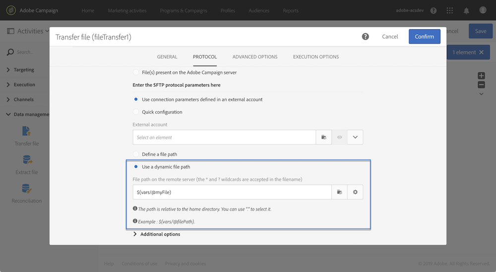

# Customizing a workflow with external parameters {#customizing-a-workflow-with-external-parameters}

触发工作流后，参数将引入事件变量中，并可用于自定义工作流的活动。

例如，它们可以用于定义在受众中读取的活动 **[!UICONTROL Read audience]** ，在活动中传输的文件 **[!UICONTROL Transfer file]** 的名称等。 (see [this page](../../automating/using/customizing-workflow-external-parameters.md)).

## 使用事件变量 {#using-events-variables}

事件变量在必须遵守标准语法的表达式 [中使用](../../automating/using/advanced-expression-editing.md#standard-syntax)。

使用事件变量的语法必须采用以下格式，并使用在活动中定义的参数名 **[!UICONTROL External signal]** 称(请 [参阅在外部信号活动中声明参数](../../automating/using/declaring-parameters-external-signal.md)):

```
$(vars/@parameterName)
```

在此语法中，$ **函数** 返回 **字符串** 数据类型。 如果要指定其他类型的数据，请使用以下函数：

* **$long**:整数。
* **$float**:小数。
* **$boolean**:true/false。
* **$datetime**:时间戳。

在活动中使用变量时，界面会提供调用该变量的帮助。


* :从工作流中可用的所有变量中选择事件变量。

   

* :编辑组合变量和函数的表达式(请 [参阅本页](../../automating/using/advanced-expression-editing.md))。

   

   此列表提供允许您执行复杂过滤的函数。 本节详细介绍了 [这些功能](../../automating/using/list-of-functions.md)。

   此外，您还可以使用以下函数，这些函数在所有活动中都可用，允许您在调用具有外部参数的工作流后使用事件变量(请参 [阅本节](../../automating/using/customizing-workflow-external-parameters.md#customizing-activities-with-events-variables)):

   | 名称 | 说明 | 语法 |
   ---------|----------|---------
   | 结束于 | 指示字符串（第1个参数）是否以特定字符串（第2个参数）结尾。 | EndWith(&lt;String>,&lt;String>) |
   | startWith | 指示字符串（第1个参数）是否开始特定字符串（第2个参数）。 | startWith(&lt;String>,&lt;String>) |
   | 提取 | 使用分隔符返回字符串的第一个字符。 | Extract(&lt;String>,&lt;Separator>) |
   | ExtractRight | 使用分隔符返回字符串的最后一个字符。 | ExtractRight(&lt;String>,&lt;Separator>) |
   | 日期格式 | 使用第2个参数中指定的格式设置日期格式(示例： “%4Y%2M%2D”) | DateFormat(&lt;Date>,&lt;Format>) |
   | 文件名 | 返回文件路径的名称。 | FileName(&lt;String>) |
   | 文件文本 | 返回文件路径的扩展名。 | FileExt(&lt;String>) |
   | IsNull | 指示字符串或日期是否为null。 | IsNull(&lt;String/date>) |
   | UrlUtf8Encode | 以UTF8对URL进行编码。 | UrlUtf8Encode(&lt;String>) |

## 使用活动变量自定义事件 {#customizing-activities-with-events-variables}

事件变量可用于自定义多个活动，如下面的部分所列。 有关如何从活动调用变量的详细信息，请参 [阅本节](../../automating/using/customizing-workflow-external-parameters.md#using-events-variables)。

**[!UICONTROL Read audience]** 活动:根据受众变量定义目标。 有关如何使用活动的详细信息，请参 [阅本节](../../automating/using/read-audience.md)。


**[!UICONTROL Test]** 活动:根据事件变量构建条件。 有关如何使用活动的详细信息，请参 [阅本节](../../automating/using/test.md)。


**[!UICONTROL Transfer file]** 活动:根据事件变量自定义要传输的文件。 有关如何使用活动的详细信息，请参 [阅本节](../../automating/using/transfer-file.md)。



**[!UICONTROL Query]** 活动:参数可在查询中引用，方法是使用组合事件变量和函数的表达式。 为此，请添加一个规则，然后单 **[!UICONTROL Advanced mode]** 击链接以访问表达式编辑窗口(请参 [阅高级表达式编辑](../../automating/using/advanced-expression-editing.md))。

有关如何使用活动的详细信息，请参 [阅本节](../../automating/using/query.md)。


**[!UICONTROL Channels]** 活动:根据投放变量对事件进行个性化。

>[!NOTE]
>
>每次准备投放时，都检索投放参数的值。
>
>重复投放准备基于投放聚 **合期**。 例如，如果聚合期为“按天”，则每天只重新准备一次投放。 如果投放参数的值在一天内被修改，则投放中不会更新它，因为它已经准备了一次。
>
>如果您计划每天多次调用工作流，请使 [!UICONTROL No aggregation] 用选项，以便每次更新投放参数。 有关重复投放配置的详细信息，请参 [阅本节](/help/automating/using/email-delivery.md#configuration)。

要根据投放变量对事件进行个性化设置，必须首先在投放活动中声明要使用的变量：

1. 选择活动，然后单击  按钮以访问设置。
1. 选择选 **[!UICONTROL General]** 项卡，然后添加事件变量，这些变量将作为个性化字段在投放中可用。

   

1. 单击 **[!UICONTROL Confirm]** 按钮。

声明的事件变量现在可从个性化字段的列表中使用。 您可以在投放中使用它们执行以下操作：

* 定义要用于投放的模板的名称。

   >[!NOTE]
   >
   >此操作仅适用于 **重复** 投放。

   

* 个性化投放:选择个性化字段以配置投放时，元素中提供了事件变 **[!UICONTROL Workflow parameters]** 量。 您可以将其用作任何个性化字段，例如定义投放主体、发送者等。

   投放个性化详细 [介绍本节](../../designing/using/personalization.md)。

   

**段代码**:根据段代码变量定义事件。

>[!NOTE]
>
>此操作可以从允许您定义段代码(例如，活动)的任何活动 **[!UICONTROL Query]** 执行 **[!UICONTROL Segmentation]** 。


**投放标签**:根据投放变量定义事件标签。


