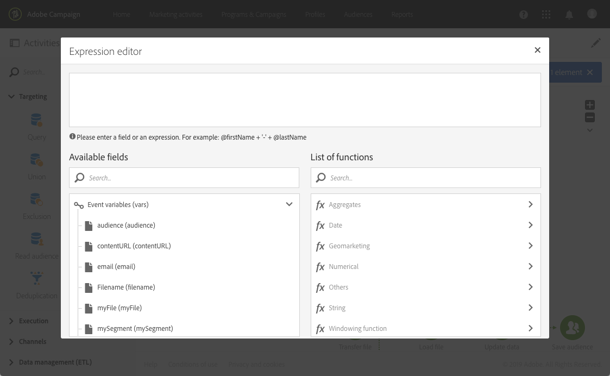

# 使用外部参数自定义工作流 {#customizing-a-workflow-with-external-parameters}

触发工作流后，会将参数摄取到事件变量中，并可用于自定义工作流的活动。

例如，它们可用于定义在中读取的受众 **[!UICONTROL Read audience]** 活动，在中传输的文件的名称 **[!UICONTROL Transfer file]** 活动等。 (请参阅 [本页](../../automating/using/customizing-workflow-external-parameters.md))。

## 使用事件变量 {#using-events-variables}

事件变量用在必须遵循 [标准语法](../../automating/using/advanced-expression-editing.md#standard-syntax).

使用事件变量的语法必须遵循以下格式，并使用 **[!UICONTROL External signal]** 活动(请参阅 [声明外部信号活动中的参数](../../automating/using/declaring-parameters-external-signal.md)):

```
$(vars/@parameterName)
```

在此语法中， **$** 函数返回 **字符串** 数据类型。 如果要指定其他类型的数据，请使用以下函数：

* **$long**:整数。
* **$浮动**:小数。
* **$布尔值**:true/false。
* **$datetime**:时间戳。

在活动中使用变量时，界面会提供调用该变量的帮助。


* :从工作流可用的所有变量中选择事件变量。

   

* :编辑组合变量和函数的表达式(请参阅 [本页](../../automating/using/advanced-expression-editing.md))。

   

   此列表提供了一些函数，允许您执行复杂的过滤。 这些函数在 [此部分](../../automating/using/list-of-functions.md).

   此外，您还可以使用以下函数，这些函数可在所有活动中使用，这些活动允许您在使用外部参数调用工作流后使用事件变量(请参阅 [此部分](../../automating/using/customizing-workflow-external-parameters.md#customizing-activities-with-events-variables)):

   | 名称 | 说明 | 语法 |
   | ---------|----------|---------|
   | EndWith | 指示字符串（第1个参数）是否以特定字符串（第2个参数）结尾。 | EndWith(&lt;string>,&lt;string>) |
   | startWith | 指示字符串（第1个参数）是否以特定字符串（第2个参数）开头。 | startWith(&lt;string>,&lt;string>) |
   | Extract | 使用分隔符返回字符串的第一个字符。 | Extract(&lt;string>,&lt;separator>) |
   | ExtractRight | 使用分隔符返回字符串的最后一个字符。 | ExtractRight(&lt;string>,&lt;separator>) |
   | DateFormat | 使用第2个参数中指定的格式设置日期的格式(示例：“%4Y%2M%2D”) | DateFormat(&lt;date>,&lt;format>) |
   | 文件名 | 返回文件路径的名称。 | FileName(&lt;string>) |
   | FileExt | 返回文件路径的扩展名。 | FileExt(&lt;string>) |
   | GetOption | 返回指定函数的值。 | GetOption(&lt;optionname>) |
   | IsNull | 指示字符串或日期是否为空。 | IsNull(&lt;string date=&quot;&quot;>) |
   | UrlUtf8编码 | 以UTF8对URL进行编码。 | UrlUtf8Encode(&lt;string>) |

## 使用事件变量自定义活动 {#customizing-activities-with-events-variables}

事件变量可用于自定义多个活动，如下面部分中所列。 有关如何从活动中调用变量的更多信息，请参阅 [此部分](../../automating/using/customizing-workflow-external-parameters.md#using-events-variables).

**[!UICONTROL Read audience]** 活动：根据事件变量定义要定位的受众。 有关如何使用活动的更多信息，请参阅 [此部分](../../automating/using/read-audience.md).


**[!UICONTROL Test]** 活动：基于事件变量构建条件。 有关如何使用活动的更多信息，请参阅 [此部分](../../automating/using/test.md).


**[!UICONTROL Transfer file]** 活动：根据事件变量自定义要传输的文件。 有关如何使用活动的更多信息，请参阅 [此部分](../../automating/using/transfer-file.md).


**[!UICONTROL Query]** 活动：通过使用组合事件变量和函数的表达式，可以在查询中引用参数。 为此，请添加规则，然后单击 **[!UICONTROL Advanced mode]** 用于访问表达式编辑窗口的链接(请参阅 [高级表达式编辑](../../automating/using/advanced-expression-editing.md))。

有关如何使用活动的更多信息，请参阅 [此部分](../../automating/using/query.md).


**[!UICONTROL Channels]** 活动：根据事件变量对投放进行个性化。

>[!NOTE]
>
>每次准备投放时，都会检索投放参数的值。
>
>定期投放准备基于投放 **聚合期**. 例如，如果聚合期为“按天”，则每天只重新准备一次投放。 如果在当天修改了投放参数的值，则不会在投放中更新该值，因为投放已准备过一次。
>
>如果您计划每天多次调用工作流，请使用 [!UICONTROL No aggregation] 选项，以便每次都更新投放参数。 有关定期投放配置的更多信息，请参阅 [此部分](/help/automating/using/email-delivery.md#configuration).

要根据事件变量对投放进行个性化，您必须首先在投放活动中声明要使用的变量：

1. 选择活动，然后单击  按钮以访问设置。
1. 选择 **[!UICONTROL General]** ，然后添加事件变量，这些变量将在投放中用作个性化字段。

   

1. 单击 **[!UICONTROL Confirm]** 按钮。

现在，个性化字段列表中提供了声明的事件变量。 您可以在投放中使用它们来执行以下操作：

* 定义要用于投放的模板的名称。

   >[!NOTE]
   >
   >此操作适用于 **循环** 仅投放。

   

* 个性化投放：选择个性化字段以配置投放时，事件变量在 **[!UICONTROL Workflow parameters]** 元素。 您可以将它们用作任何个性化字段，例如定义投放主题、发件人等。

   有关投放个性化的详细信息，请参阅 [此部分](../../designing/using/personalization.md).

   

**区段代码**:根据事件变量定义段码。

>[!NOTE]
>
>此操作可从允许您定义段码(例如， **[!UICONTROL Query]** 或 **[!UICONTROL Segmentation]** 活动。


**投放标签**:根据事件变量定义投放标签。


