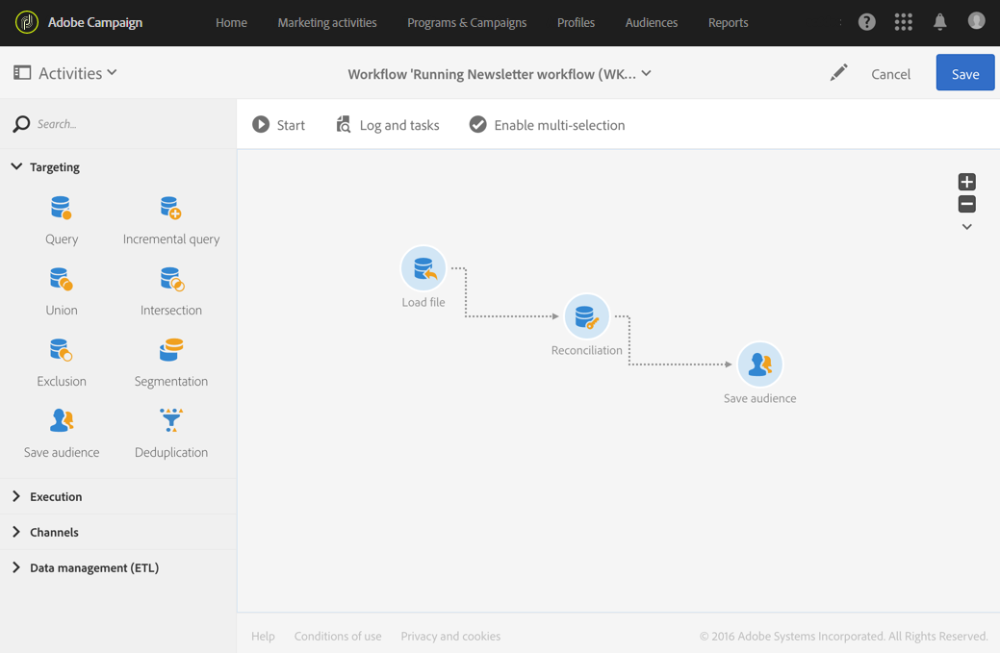

# 使用协调进行数据更新 {#data-update-reconciliation}

下方的示例演示了直接从包含新客户的导入文件创建受众用户档案的工作流。该工作流由以下活动组成：



* A [加载文件](../../automating/using/load-file.md) 活动，用于加载并检测导入文件的数据。 导入的文件包含以下数据：

  ```
  lastname;firstname;email;dateofbirth
  jackman;megan;megan.jackman@testmail.com;07/08/1975
  phillips;edward;phillips@testmail.com;09/03/1986
  weaver;justin;justin_w@testmail.com;11/15/1990
  martin;babeth;babeth_martin@testmail.net;11/25/1964
  reese;richard;rreese@testmail.com;02/08/1987
  cage;nathalie;cage.nathalie227@testmail.com;07/03/1989
  xiuxiu;andrea;andrea.xiuxiu@testmail.com;09/12/1992
  grimes;daryl;daryl_890@testmail.com;12/06/1979
  tycoon;tyreese;tyreese_t@testmail.net;10/08/1971
  ```

* A [调解](../../automating/using/reconciliation.md) 活动，用于将加载文件的每个列链接到用户档案维度列。 无法识别的文件记录（缺少数据、数据类型不兼容等）将被忽略，以保持最终受众数据的完整性。

  

* A [保存受众](../../automating/using/save-audience.md) 活动，用于保存用户档案的受众。

  
