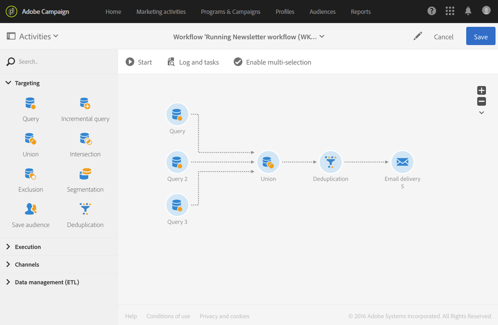
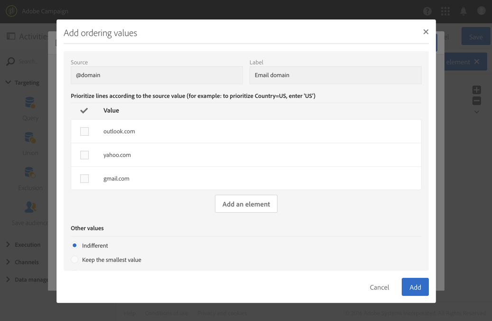

# 重复数据删除{#deduplication}

## 说明 {#description}

利用 **[!UICONTROL Deduplication]** 活动，可删除集客活动结果中的重复项。

## 使用环境 {#context-of-use}

**[!UICONTROL Deduplication]** 活动通常用在定向活动或导入文件之后、以及允许使用定向数据的活动之前。

在重复数据删除期间，将分开处理集客过渡。例如，如果用户档案“A”出现在查询 1 的结果中，也出现在查询 2 的结果中，则不会删除重复项。

因此，建议重复数据删除仅包含一个集客过渡。为此，您可以使用对应于定向需求的活动（如并集活动、交集活动等）来组合不同的查询。例如：

**相关主题**

* [用例：在投放之前标识重复项](../../automating/using/identifying-duplicated-before-delivery.md)
* [用例：从导入的文件中删除数据重复项](../../automating/using/deduplicating-data-imported-file.md)

## 配置 {#configuration}

要配置重复数据删除活动，必须输入标签、方法和重复数据删除条件，以及与结果相关的选项。

1. 将 **[!UICONTROL Deduplication]** 活动拖放到工作流中。
1. 选择活动，然后使用所显示快捷操作中的  按钮将其打开。

   

1. 选择要执行重复数据删除的 **[!UICONTROL Resource type]**：

   * 如果对数据库中已存在的数据执行重复数据删除，则是 **[!UICONTROL Database resource]**。根据要删除重复项的数据选择 **[!UICONTROL Filtering dimension]** 和 **[!UICONTROL Targeting dimension]**。默认情况下，会对&#x200B;**用户档案**&#x200B;执行重复数据删除。
   * 如果对工作流的临时数据执行分段，则是 **[!UICONTROL Temporary resource]**：选择包含要删除重复项数据的 **[!UICONTROL Targeted set]**。在导入文件后或（例如，使用区段代码）扩充数据库中的数据后，可能会遇到使用此使用案例的情况。

1. 选择 **[!UICONTROL Number of unique records to keep]**。此字段的默认值为 1。使用 0 值，可保留所有重复项。

   例如，如果记录 A 和 B 被视为记录 Y 的重复项，而记录 C 被视为记录 Z 的重复项：

   * 如果字段的值为 1：只保留 Y 和 Z 记录。
   * 如果字段的值为 0：保留所有记录。
   * 如果字段的值为 2：保留 C 和 Z 记录，并保留 A、B 和 Y 中的两个记录，具体情况取决于此后选择的重复数据删除方法。

1. 通过在提供的列表中添加条件来定义 **[!UICONTROL Duplicate identification]** 标准。制定要查询相同值的字段和/或表达式以标识重复项：电子邮件地址、名字、姓氏等。利用条件的顺序，可指定要先处理的条件。
1. 在下拉列表中，选择要使用的 **[!UICONTROL Deduplication method]**：

   * **[!UICONTROL Choose for me]**：随机选择要保留的重复项记录。
   * **[!UICONTROL Following a list of values]**：用于为一个或多个字段定义值优先级。要定义该值，请选择一个字段或创建表达式，然后将值添加到相应的表格中。要定义新字段，请单击位于值列表上方的 **[!UICONTROL Add]** 按钮。

      

   * **[!UICONTROL Non-empty value]**：利用此选项可优先保留选定表达式的值不为空的记录。

      

   * **[!UICONTROL Using an expression]**：利用此选项可保留输入表达式的值最小或最大的记录。

      

1. 如果需要，可以管理活动的[过渡](../../automating/using/activity-properties.md)，以访问叫客群体的高级选项。
1. 确认活动的配置并保存工作流。
