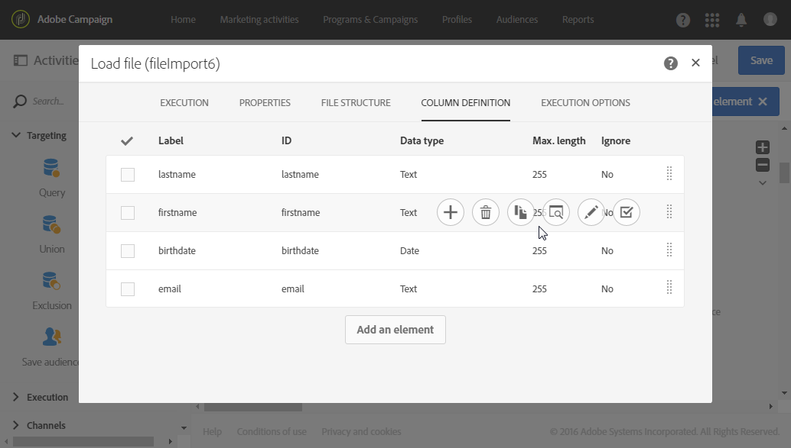
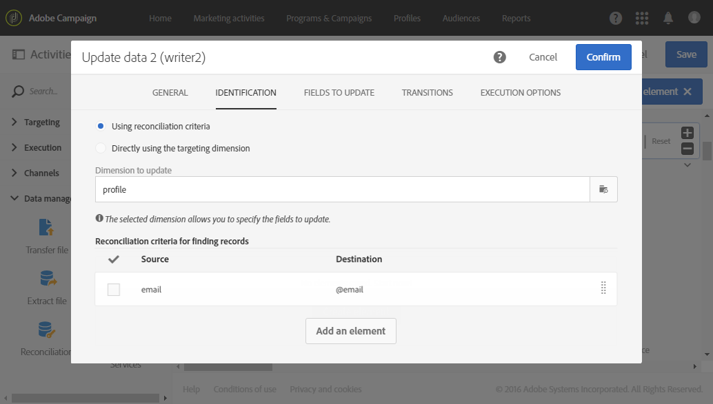

# 重复数据删除{#deduplication}

## 说明 {#description}


活 **[!UICONTROL Deduplication]** 动允许您删除入站活动结果中的重复项。

## 使用环境 {#context-of-use}

活动 **[!UICONTROL Deduplication]** 通常在定位活动之后或导入文件之后以及允许使用目标数据的活动之前使用。

在重复数据消除期间，将单独处理入站过渡。 例如，如果查询1的结果中以及查询2的结果中都存在配置文件“A”，则不会删除重复项。

因此，建议重复数据消除只有一个入站过渡。 为此，您可以使用与您的定位需求（如联合活动、交叉点活动等）相对应的活动来组合不同的查询。 例如：


## 配置 {#configuration}

要配置重复数据消除活动，您必须输入标签、方法和重复数据消除标准，以及与结果相关的选项。

1. 将活动拖放 **[!UICONTROL Deduplication]** 到工作流中。
1. 选择活动，然后使用显示的快  速操作中的按钮将其打开。

   

1. 选择必 **[!UICONTROL Resource type]** 须执行重复数据消除的位置：

   * **[!UICONTROL Database resource]** 如果对数据库中已存在的数据执行重复数据消除。 根据 **[!UICONTROL Filtering dimension]** 要删除 **[!UICONTROL Targeting dimension]**&#x200B;的数据，选择和。 默认情况下，对配置文件执行重复数 **据消除**。
   * **[!UICONTROL Temporary resource]** 如果对工作流的临时数据执行重复数据消除：选择包 **[!UICONTROL Targeted set]** 含要删除重复项的数据。 在导入文件后或者（例如，使用段代码）丰富数据库中的数据时，可能会遇到此用例。

1. 选择 **[!UICONTROL Number of unique records to keep]**。 此字段的默认值为1。 值0允许您保留所有重复项。

   例如，如果记录A和B被视为记录Y的副本，而记录C被视为记录Z的副本：

   * 如果字段的值为1:只保留Y和Z记录。
   * 如果字段的值为0:所有记录都保存着。
   * 如果字段的值为2:保留记录C和Z，并保留来自A、B和Y的两个记录，这是偶然的，也取决于此后选择的重复数据消除方法。

1. 通过在提 **[!UICONTROL Duplicate identification]** 供的列表中添加条件来定义条件。 指定允许标识重复项的字段和／或表达式：电子邮件地址、名字、姓氏等。 条件的顺序允许您指定要首先处理的条件。
1. 在下拉列表中，选择要 **[!UICONTROL Deduplication method]** 使用的：

   * **[!UICONTROL Choose for me]**:随机选择要从副本中保留的记录。
   * **[!UICONTROL Following a list of values]**:允许您为一个或多个字段定义值优先级。 要定义值，请选择字段或创建表达式，然后将值添加到相应的表中。 要定义新字段，请单击 **[!UICONTROL Add]** 值列表上方的按钮。

      

   * **[!UICONTROL Non-empty value]**:这样，您就可以保留选定表达式的值不作为优先级的记录。

      

   * **[!UICONTROL Using an expression]**:这样，您就可以保留输入的表达式值最小或最大的记录。

      

1. 如果需要，可以管理活动的“过 [渡](../../automating/using/executing-a-workflow.md#managing-an-activity-s-outbound-transitions) ”以访问出站人群的高级选项。
1. 确认活动的配置并保存工作流。

## 示例1:在交付前识别重复项 {#example-1--identifying-duplicates-before-a-delivery}

以下示例说明了一个重复数据删除，它允许您在发送电子邮件之前排除目标副本。 这意味着您不必多次向同一配置文件发送通信。

该工作流由以下几部分组成：


* 用 **[!UICONTROL Query]** 于定义电子邮件的目标。 此处，该工作流针对客户端数据库中已存在超过一年的18到25岁的所有配置文件。

   

* 一 **[!UICONTROL Deduplication]** 个活动，允许您识别来自前一查询的重复项。 在此示例中，每个副本只保存一条记录。 副本使用电子邮件地址进行标识。 这意味着，对于要在定位中显示的每个电子邮件地址，电子邮件发送只能发送一次。

   选择了重复数据消除方法 **[!UICONTROL Non-empty value]**。 这样，您就可以确保在重复记录的情况下，优先于提供 **名称** 。 如果在电子邮件内容的个性化字段中使用名字，这将使其更加连贯。

   此外，还会添加额外的过渡以保留副本并列出它们。

   

* 位 **[!UICONTROL Email delivery]** 于重复数据消除主出站转换之后。 电子邮件发送的配置在电子邮件发送部分 [中有详细说明](../../automating/using/email-delivery.md) 。
* 在重复 **[!UICONTROL Save audience]** 项消除的额外过渡之后进行的活动，以在重复受众中保存 **副本** 。 此受众可重复使用，以直接从每封电子邮件中排除其成员。

## 示例2:从导入的文件中消除重复数据 {#example-2--deduplicating-the-data-from-an-imported-file}

此示例说明如何在将数据加载到数据库中之前从导入的文件中删除重复数据。 此过程提高了数据库中加载的数据的质量。

该工作流由以下几部分组成：


* 包含配置文件列表的文件是使用活动导入 **[!UICONTROL Load file]** 的。 在此示例中，导入的文件采用。csv格式，并包含10个配置文件：

   ```
   lastname;firstname;dateofbirth;email
   Smith;Hayden;23/05/1989;hayden.smith@example.com
   Mars;Daniel;17/11/1987;dannymars@example.com
   Smith;Clara;08/02/1989;hayden.smith@example.com
   Durance;Allison;15/12/1978;allison.durance@example.com
   Lucassen;Jody;28/03/1988;jody.lucassen@example.com
   Binder;Tom;19/01/1982;tombinder@example.com
   Binder;Tommy;19/01/1915;tombinder@example.com
   Connor;Jade;10/10/1979;connor.jade@example.com
   Mack;Clarke;02/03/1985;clarke.mack@example.com
   Ross;Timothy;04/07/1986;timross@example.com
   ```

   此文件还可用作检测和定义列格式的示例文件。 在选项卡 **[!UICONTROL Column definition]** 中，确保正确配置导入文件的每列。

   

* 活 **[!UICONTROL Deduplication]** 动。 在导入文件之后以及将数据插入数据库之前，直接执行重复数据消除。 因此，它应以活动 **[!UICONTROL Temporary resource]** 为基础 **[!UICONTROL Load file]** 。

   在此示例中，我们希望在文件中包含的每个唯一电子邮件地址保留一个条目。 因此，在临时资源的电子邮件 **列上** ，执行重复标识。 但是，两个电子邮件地址在文件中显示两次。 因此，两行将被视为重复项。

   

* 活动 **[!UICONTROL Update data]** 允许您将重复数据消除过程中保留的数据插入数据库。 只有在更新数据时，导入的数据才被标识为属于配置文件维。

   此处，我们希望 **[!UICONTROL Insert only]** 获得数据库中尚不存在的配置文件。 我们将使用文件的电子邮件列和Profile维中的电子邮件字段作为对帐密钥 **** ，来完成此操作。

   

   从选项卡中指定要从中插入数据的文件列与数据库字段之间的映 **[!UICONTROL Fields to update]** 射。

   

然后启动工作流。 然后，从重复数据消除过程中保存的记录会添加到数据库中的配置文件中。
