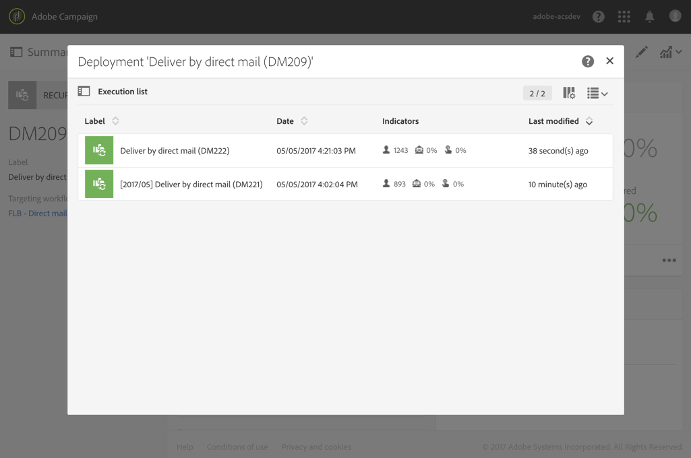

# 直邮投放{#direct-mail-delivery}

## 说明 {#description}

利用 **[!UICONTROL Direct mail delivery]** 活动，可配置和准备包含要用于直邮营销策划之用户档案数据的文件。这可以是只发送一次的直邮，也可以是定期直邮。

* **标准直邮仅发送一次。**
* **而利用定期邮件，则可在定义的时间段内多次向不同目标发送同一直邮。**&#x200B;您可以按时段聚合投放，以获得对应于您需求的报告。

## 使用环境 {#context-of-use}

**[!UICONTROL Direct mail delivery]** 活动通常用于自动准备包含用户档案数据的文件。然后，可以将此文件发送给负责邮寄的合作伙伴/提供商。

链接到调度程序时，您可以定义定期直邮。

同一工作流中的上游活动，通过查询、交集之类的定向活动，定义了直邮的收件人。准备直邮时，未指定邮寄地址的用户档案将被自动排除。

根据工作流执行参数，触发消息准备。在消息仪表板中，您可以选择是否请求手动确认以发送消息（默认要求）。您可以手动启动工作流，或在工作流中放置调度程序活动以自动执行。

**相关主题：**

* [用例：耦合电子邮件和直邮投放](../../automating/using/coupling-email-direct-mail.md)
* [关于直邮](../../channels/using/about-direct-mail.md)

## 配置 {#configuration}

1. 将 **[!UICONTROL Direct mail delivery]** 活动拖放到工作流中。
1. 选择活动，然后使用所显示快捷操作中的  按钮将其打开。

   >[!NOTE]
   >
   >您可以通过活动快捷操作中的  按钮，访问活动的常规属性和高级选项（而非投放本身）。此按钮专定于渠道活动。可以通过直邮仪表板中的操作栏，访问直邮的属性。

1. 选择直邮发送模式：

   * **[!UICONTROL Direct mail]**：只发送一次直邮。您可以在此处指定是否向活动添加叫客过渡。此程序的第 7 步详细介绍了各种过渡类型。
   * **[!UICONTROL Recurring direct mail]**：根据 **[!UICONTROL Scheduler]** 活动中定义的频度，多次发送直邮。选择发送的聚合期。这样，您可以将规定时间段内发生的所有发送重组到一封单独的直邮中（也称为&#x200B;**定期执行**），并可从应用程序的营销活动列表访问该直邮。

      例如，对于每天发送的定期生日邮件，您可以选择聚合每月的发送。这样，尽管每天都会发送生日邮件，但您可以按月接收投放报告。

      >[!NOTE]
      >
      >对于定期直邮，每次执行工作流时都会生成一个新文件。所选的聚合期间对此行为没有任何影响。

1. 选择直邮的类型。直邮类型来自 **[!UICONTROL Resources]** > **[!UICONTROL Templates]** > **[!UICONTROL Delivery templates]** 菜单中定义的模板。
1. 输入直邮的常规属性。您还可以将其连接到现有营销策划。工作流投放活动的标签将更新为直邮的标签。
1. 定义直邮内容。请参阅关于[内容编辑](../../designing/using/personalization.md)的章节。
1. 默认情况下，**[!UICONTROL Direct mail delivery]** 活动不包含任何叫客过渡。如果要向 **[!UICONTROL Direct mail delivery]** 互动添加叫客过渡，请转到高级活动选项的 **[!UICONTROL General]** 选项卡（活动快捷操作中的  按钮），然后选中以下选项之一：

   * **[!UICONTROL Add outbound transition without the population]**：通过此选项可生成叫客过渡，其中包含的群体与集客过渡完全相同。此过渡包含直邮活动生成的文件，以及直邮活动中接收直邮的原始群体。
   * **[!UICONTROL Add outbound transition with the population]**：通过此选项可生成叫客过渡，其中包含接收直邮的群体。在直邮准备期间被排除的目标成员（隔离、地址无效等）将从此过渡中排除。该过渡还包含由直邮生成的文件。

1. 确认活动的配置并保存工作流。

重新打开活动时，您将直接转到直邮仪表板。只能编辑其内容。

默认情况下，启动投放工作流只会触发消息准备。在工作流启动后，发送从工作流创建的消息，仍需要确认。但是在消息仪表板中，仅当通过工作流创建消息时，才能禁用 **[!UICONTROL Request confirmation before sending messages]** 选项。取消选中此选项后，消息在准备完成后即发送，不会进一步通知。

## 备注 {#remarks}

可以在应用程序的营销活动列表中，访问在工作流中创建的投放。您可以使用仪表板查看工作流的执行状态。利用直邮摘要窗格中的链接，可直接访问链接的元素（工作流、活动，如果是定期直邮，还包括父投放）。

默认情况下，定期投放的执行会被掩盖。要查看其详情，请勾选营销活动搜索面板中的 **[!UICONTROL Show recurring executions]** 选项。

在（可从营销活动列表访问，或直接通过关联的定期执行访问）父投放中，您可以查看已处理的邮件总数（基于配置 **[!UICONTROL Direct mail delivery]** 活动时指定的聚合期）。要执行此操作，请选择  按钮以打开父投放 **[!UICONTROL Deployment]** 块的详细视图。

