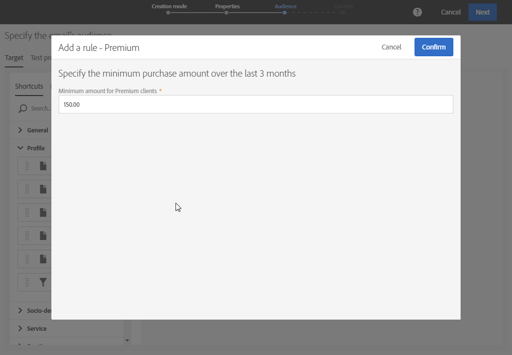

# 编辑查询{#editing-queries}

## 关于查询编辑器 {#about-query-editor}

查询编辑器是一个向导程序，可用于筛选 Adobe Campaign 数据库中包含的数据。

利用此功能，可依靠预定义过滤器和规则来构建群体，从而更好定向收件人。

部分应用程序功能可使用此功能以：

* 创建&#x200B;**“查询”**&#x200B;类型的&#x200B;**“受众”**
* 定义&#x200B;**电子邮件**&#x200B;的目标
* 定义&#x200B;**工作流**&#x200B;活动中的群体

## 查询编辑器界面 {#query-editor-interface}

查询编辑器由&#x200B;**面板**&#x200B;和&#x200B;**工作区**&#x200B;组成。

### 面板 {#palette}

位于编辑器左侧的面板包含两个选项卡，其中包含了分为各种主题块的元素。这些选项卡包括：

* 默认提供或由实例管理员创建的&#x200B;**快捷方式**。此处包含字段、节点、分组、1-1 链接、1-N 链接和其他预定义过滤器。
* **资源管理器**，用于访问目标资源中所有可用的字段：节点、分组元素、链接（1-1 和 1-N）。

必须将选项卡中包含的元素移到工作区中，才能进行配置并用于查询。根据所选定向维度（请参阅[定向维度和资源](../../automating/using/query.md#targeting-dimensions-and-resources)），您可以：

* 逐一选择受众或用户档案
* 使用预定义过滤器
* 为所选字段定义简单规则
* 定义高级规则，以便为特定字段应用函数

### 工作区 {#workspace}

工作区是位于中央的区域，您可以在其中配置和组合从面板添加的规则、受众和预定义过滤器。

将元素从面板移入工作区时，将打开一个新窗口，以便您开始[创建查询](#creating-queries)。

## 创建查询 {#creating-queries}

查询编辑器可用于定义消息中的受众或测试用户档案、工作流中的群体，还可用于创建查询类型受众。

可于创建投放时在 **[!UICONTROL Audience]** 窗口中定义查询，也可于创建工作流时在&#x200B;**“查询”**&#x200B;活动中定义查询。

1. 将元素从面板移入工作区。随即会打开用于编辑规则的窗口。

   * 对于字符串或“数字”**字段**，指定比较运算符和值。

      

   * 对于“日期”或“日期与时间”**字段**，您可以选择定义特定日期、日期范围或相对于查询执行日期的时段。

      

   * 对于“布尔”**字段**，请勾选链接该字段可能值的复选框。
   * 对于&#x200B;**分组**&#x200B;字段，请选择要为其创建规则的分组字段，然后以与其他字段相同的方式定义条件。

      

   * 对于链接其他数据库资源的 **1-1**，请直接从目标表中选择一个值。

      

   * 对于链接其他数据库资源的 **1-N**，可在其第二个资源的字段上定义子查询。

      您无需指定子条件。

      例如，对于用户档案跟踪日志，您只能选择 **[!UICONTROL Exists]** 运算符并批准该规则。该规则将返回所有存在跟踪日志的用户档案。

      

   * 对于&#x200B;**预定义过滤器**，请根据提供的条件，输入或选择您喜欢的元素。

      管理员可以创建过滤器以辅助完成复杂和重复的查询。这些规则将以预配置规则的形式显示在查询编辑器中，它们可限制用户需要执行的步骤数。

      

1. 您可以为规则指定一个名称。然后，该名称将作为规则名称显示在工作区中。如果未给规则指定名称，则会自动显示条件的描述。
1. 要组合工作区元素，请将它们互相联锁，以创建不同的分组和/或分组级别。然后，您可以选择逻辑运算符来组合同一级别上的元素：

   * **[!UICONTROL AND]**：两个条件的交集。只考虑符合所有条件的元素。
   * **[!UICONTROL OR]**：两个条件的并集。考虑至少符合一个条件的元素。
   * **[!UICONTROL EXCEPT]**：排除条件。考虑符合第一条件的元素，并从中排除符合第二条件的元素。

1. 您现在可以使用操作栏中的  和  按钮，计算并预览查询的目标元素数量。

   

如果要修改查询的元素，请单击编辑图标。随即会打开之前配置过的规则，以便您进行任何必要的调整。

现在，您即可通过之前创建并定义的查询来构建群体，以更好地将投放个性化。

**相关主题：**

* [高级功能](../../automating/using/advanced-expression-editing.md)
* [定义过滤器](../../developing/using/configuring-filter-definition.md)
* [使用案例：创建每周一次的电子邮件投放](../../automating/using/workflow-weekly-offer.md)
* [使用案例：创建基于地域划分的投放](../../automating/using/workflow-segmentation-location.md)
* [使用案例：创建带补码的投放](../../automating/using/workflow-created-query-with-complement.md)
* [使用案例：重定向工作流 - 向未打开者发送新投放](../../automating/using/workflow-cross-channel-retargeting.md)
