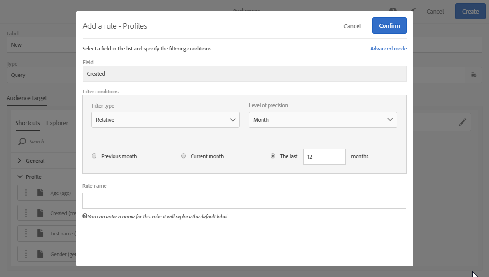

# 编辑查询{#editing-queries}

## 关于查询编辑器 {#about-query-editor}

查询编辑器是一个向导，通过该向导可过滤Adobe Campaign数据库中包含的数据。

借助此功能，您可以借助预定义的过滤器和规则构建人群，以更好地定位收件人。

几个应用程序功能使用它来：

* 创建 **查询** 类型受 **众**
* 定义电 **子邮件** 目标
* 在工作流活动中定 **义人群**

## 查询编辑器界面 {#query-editor-interface}

查询编辑器由调板和工 **作区** 组 **成**。

### 调色板 {#palette}

位于编辑器左侧的调色板被分为两个选项卡，其中包含分为主题块的元素。 这些选项卡包括：

* 默认 **情况下**，快捷键可用，或由实例管理员创建。 在此，您将找到字段、节点、分组、1-1链接、1-N链接和其他预定义的过滤器。
* 通过 **资源管理器** ，您可以访问目标资源中的所有可用字段：节点、分组元素、链接（1-1和1-N）。

选项卡中包含的元素必须移到工作区中才能进行配置并考虑查询。 根据所选定的定位维(请参 [阅定位维和资源](../../automating/using/query.md#targeting-dimensions-and-resources))，您可以：

* 逐个选择受众或档案
* 使用预定义的过滤器
* 为您选择的字段定义简单规则
* 定义允许您将函数应用于某些字段的高级规则

### 工作区 {#workspace}

工作区是中心区域，您可以在其中配置和合并从调色板中添加的规则、受众和预定义的过滤器。

将元素从调色板移入工作区时，将打开一个新窗口，您可以启动“创建 [查询”](#creating-queries)。

## 创建查询 {#creating-queries}

查询编辑器可用于定义消息中的受众或测试配置文件、工作流中的人群以及创建查询类型的受众。

可以在创建分发时在窗 **[!UICONTROL Audience]** 口中定义查询，也可以在创建工作流时在 **Query** 活动中定义查询。

1. 将元素从调色板移入工作区。 此时将打开用于编辑规则的窗口。

   * 对于字符串或数字字 **段**，指定比较运算符和值。

      

   * 对于日期或日期和时间字 **段**，您可以选择定义特定日期、两个日期之间的范围或相对于查询执行日期的期间。

      

   * 对于布尔 **字段**，选中链接到字段可能值的框。
   * 对于分 **组字段** ，选择要在其上创建规则的分组字段，然后以与其他字段相同的方式定义条件。

      

   * 对于与另 **一数据库资源的1-1** 链接，请直接从目标表中选择一个值。

      

   * 对于与 **另一个数据库资源的1-N** 链接，您可以在第二个资源的字段上定义子查询。

      您无需指定子条件。

      例如，您只能在配置文件跟踪日 **[!UICONTROL Exists]** 志上选择运算符并批准规则。 该规则将返回所有存在跟踪日志的配置文件。

      

   * 对于预 **定义的筛选器**，请根据提供的条件输入或选择所需的元素。

      管理员可以创建过滤器以便于进行复杂和重复的查询。 这些规则将以预配置规则的形式显示在查询编辑器中，并且它们限制用户需要执行的步骤数。

      

1. 您可以为规则指定名称。 然后，该名称将作为规则名称显示在工作区中。 如果未给规则指定名称，则会显示条件的自动描述。
1. 要合并工作区元素，请将它们互锁在一起以创建不同的组和／或组级别。 然后，您可以选择逻辑运算符来组合同一级别上的元素：

   * **[!UICONTROL AND]**:两个标准的交集。 只考虑与每个标准匹配的元素。
   * **[!UICONTROL OR]**:两个标准的结合。 考虑与两个标准中的至少一个匹配的元素。
   * **[!UICONTROL EXCEPT]**:排除条件。 除非也匹配第二准则，否则将考虑与第一准则匹配的元素。

1. 您现在可以使用操作栏中的和按钮计算并预览查询所  定位  的元素数量。

   

如果要修改查询的元素，请单击编辑图标。 规则会按先前配置的方式打开，然后您可以进行任何必要的调整。

现在可以创建和定义您的查询，这样您就可以构建一个群体，从而更好地个性化您的交付。

**相关主题：**

* [高级功能](../../automating/using/advanced-expression-editing.md)
* [定义过滤器](../../developing/using/configuring-filter-definition.md)
* [用例：创建每周一次的电子邮件发送](../../automating/using/workflow-weekly-offer.md)
* [用例：创建按位置分段的交付](../../automating/using/workflow-segmentation-location.md)
* [用例：使用补充创建交付](../../automating/using/workflow-created-query-with-complement.md)
* [用例：重定向工作流向非打开者发送新分发](../../automating/using/workflow-cross-channel-retargeting.md)
